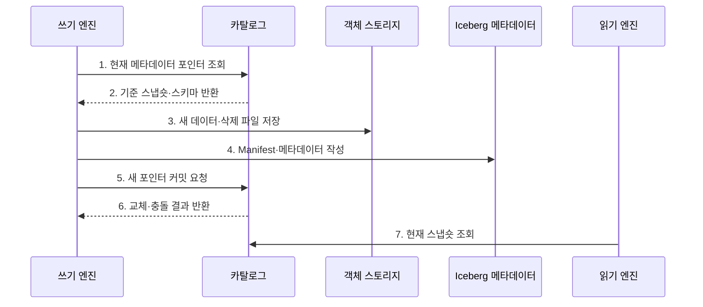

---
sidebar:
  order: 128
  label: "128. Apache Iceberg"
  badge:
    text: "기출 · 30%"
    variant: note
title: "Apache Iceberg"
date: "2026-07-27T23:59:59+09:00"
tags:
  - "notes-software"
weight: 128
extra:
  question_no: "128"
  source_status: "기출"
  source_history: "137회"
  priority: 30
  priority_note: "137회 기출, Iceberg 메타데이터 구조 사례"
---

## 미리 알고가기

- **아파치 아이스버그(Apache Iceberg)**: 데이터 파일을 디렉터리 대신 스냅숏 메타데이터로 추적하는 오픈 테이블 포맷임
- **오픈 테이블 포맷(Open Table Format)**: 데이터 파일과 스냅숏·스키마·파티션 메타데이터의 관리 규칙을 공개 명세로 정의한 형식임
- **스냅숏(Snapshot)**: 한 시점의 테이블을 구성하는 데이터·삭제 파일과 스키마를 가리키는 버전 상태임
- **매니페스트(Manifest)**: 스냅숏이 읽을 데이터 또는 삭제 파일의 경로·파티션 값·열 통계를 기록한 불변 파일임
- **매니페스트 목록(Manifest List)**: 한 스냅숏이 참조하는 Manifest와 각 Manifest의 파티션 요약 통계를 기록한 파일임
- **필드 식별자(Field Identifier, Field ID)**: ID를 '아이디'로 읽고 영문 첫 글자로 식별자를 줄여 쓰며 열 이름이 바뀌어도 같은 논리 열을 추적하는 번호임
- **숨은 파티셔닝(Hidden Partitioning)**: 열 조건을 파티션 변환에 자동 투영해 사용자가 물리 경로 규칙을 직접 쓰지 않게 하는 방식임
- **파티션 명세(Partition Specification)**: 원천 열과 변환 함수로 데이터 파일의 파티션 값을 만드는 규칙임
- **삭제 파일(Delete File)**: 기존 데이터 파일을 즉시 재작성하지 않고 삭제할 행의 위치나 키를 기록한 파일임
- **파일 가지치기(File Pruning)**: 파티션 값과 열 통계로 조건에 맞지 않는 파일을 읽기 전에 제외하는 처리임
- **Hive식 파일 테이블(Hive-style File Table)**: `열=값`을 '열 이퀄 값'으로 읽고 등호로 파티션 열과 값을 연결해 디렉터리에서 파일 집합을 찾는 구조임
- **메타데이터 포인터(Metadata Pointer)**: 카탈로그가 현재 유효한 Iceberg 메타데이터 파일을 가리키는 참조임

## Ⅰ. 개요

- **정의/개념**: 스냅숏과 Manifest로 **데이터 파일을 추적**하는 오픈 테이블 포맷이다.
- **배경/필요성**: 파일 탐색·동시 커밋과 **스키마·파티션 진화** 문제를 해결한다.

### 쉽게 이해하기 (학습용)

- 폴더를 모두 뒤지지 않고 단계별 목록표로 현재 표에 속한 파일을 찾는다.

## Ⅱ. 특징

- **스냅숏 격리**: 커밋별 불변 파일 집합을 제공한다.
- **Manifest 탐색**: 통계로 읽지 않을 파일을 제외한다.
- **구조 진화**: 필드 ID와 숨은 파티셔닝을 적용한다.

### 쉽게 이해하기 (학습용)

- 열 이름이나 저장 칸이 바뀌어도 번호표와 목록표가 같은 데이터를 찾아 주지만 낡은 목록과 파일은 정리해야 한다.

## Ⅲ. 구조 및 구성요소

| 구성요소 | 책임 |
|:---|:---|
| 카탈로그 | 테이블 이름과 현재 메타데이터 위치 관리 |
| 메타데이터 파일 | 스키마·파티션 명세·스냅숏 이력 저장 |
| 스냅숏·Manifest List | 커밋별 Manifest 집합과 파티션 요약 정의 |
| Manifest | 데이터·삭제 파일 경로와 통계 기록 |
| 데이터·삭제 파일 | 실제 행과 위치·키 기반 삭제 저장 |

### 쉽게 이해하기 (학습용)

- 단계별 목록표가 현재 테이블에 속한 파일을 찾아 준다.

## Ⅳ. 흐름도

**동작 원리**

- **1. 현재 메타데이터 포인터 조회**: 작업 기준 위치를 확인한다.
- **2. 기준 스냅숏·스키마 반환**: 파일·구조 정보를 전달한다.
- **3. 새 데이터·삭제 파일 저장**: 변경 결과를 불변 파일로 기록한다.
- **4. Manifest·메타데이터 작성**: 파일 통계와 새 스냅숏을 생성한다.
- **5. 새 포인터 커밋 요청**: 기준 위치와 새 위치를 제출한다.
- **6. 교체·충돌 결과 반환**: 포인터를 원자 교체하거나 재시도를 알린다.
- **7. 현재 스냅숏 조회**: 확정된 파일 집합을 읽는다.

### 쉽게 이해하기 (학습용)

- 새 자료와 목록표를 모두 만든 뒤 카탈로그의 현재 위치표 한 칸만 원자적으로 바꾼다.

## Ⅴ. 종류 및 비교

| 비교 항목 | Apache Iceberg | Hive식 파일 테이블 |
|:---|:---|:---|
| 적용 기준 | **다중 엔진·구조 진화** 테이블 | 단순 경로 기반 파일 테이블 |
| 핵심 특징 | **스냅숏·Manifest·필드 ID** | 디렉터리·파티션 경로 |
| 한계 | Manifest·삭제 파일·스냅숏 관리 | 동시성·구조 변경을 직접 관리 |

### 쉽게 이해하기 (학습용)

- Hive식 표는 서랍 이름으로 자료를 찾고 Iceberg는 버전 있는 목록표로 자료를 찾는다.

## Ⅵ. 실무 고려사항 및 대책

| 고려사항 | 대책 | 효과 |
|:---|:---|:---|
| Manifest 수 | 목표 크기와 병합 주기 설정 | 계획 단계 읽기 감소 |
| 작은 파일 | 쓰기 크기 조정·데이터 파일 재작성 | 파일 스캔 횟수 감소 |
| 삭제 파일 | 개수 관찰·주기적 데이터 재작성 | 읽기 병합 비용 억제 |
| 스냅숏 만료 | 작업 시간·복구 요구에 맞춘 보존 | 과거 조회 파일 보호 |
| 엔진 호환 | 공통 기능 기준·호환성 시험 | 명세 차이 오류 예방 |

### 쉽게 이해하기 (학습용)

- 사용자는 시각만 검색해도 Iceberg가 맞는 날짜 서랍과 값 범위의 파일만 골라낸다.

## Ⅶ. 결론

- **Manifest 규모·삭제 파일·스냅숏 보존·엔진 호환**으로 Apache Iceberg를 운영한다.

### 쉽게 이해하기 (학습용)

- 목록표 덕분에 구조를 안전하게 바꿀 수 있지만 오래된 목록과 쓰지 않는 파일은 계속 정리해야 한다.
