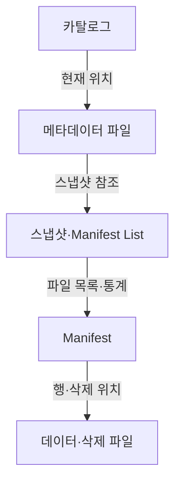
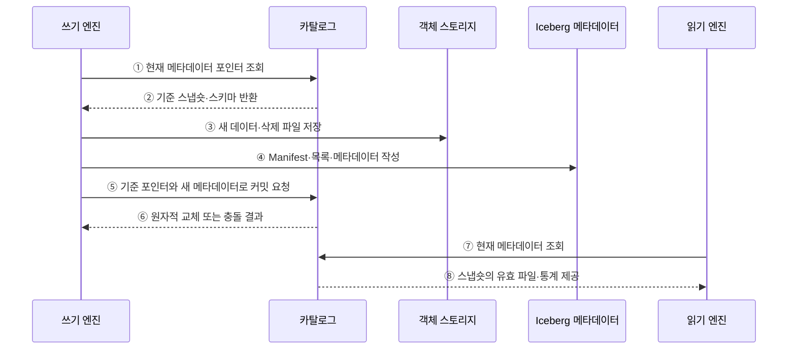

---
sidebar:
  order: 128
  label: "128. Apache Iceberg"
  badge:
    text: "기출 · 30%"
    variant: note
title: "Apache Iceberg"
date: "2026-07-27T23:59:59+09:00"
tags:
  - "notes-software"
weight: 128
extra:
  question_no: "128"
  source_status: "기출"
  source_history: "137회"
  priority: 30
  priority_note: "137회 기출, Iceberg 메타데이터 구조 사례"
---

## 미리 알고가기

- **아파치 아이스버그(Apache Iceberg)**: 데이터 파일을 디렉터리 대신 스냅숏 메타데이터로 추적하는 오픈 테이블 포맷임
- **오픈 테이블 포맷(Open Table Format)**: 데이터 파일과 스냅숏·스키마·파티션 메타데이터의 관리 규칙을 공개 명세로 정의한 형식임
- **스냅숏(Snapshot)**: 한 시점의 테이블을 구성하는 데이터·삭제 파일과 스키마를 가리키는 버전 상태임
- **매니페스트(Manifest)**: 스냅숏이 읽을 데이터 또는 삭제 파일의 경로·파티션 값·열 통계를 기록한 불변 파일임
- **매니페스트 목록(Manifest List)**: 한 스냅숏이 참조하는 Manifest와 각 Manifest의 파티션 요약 통계를 기록한 파일임
- **필드 식별자(Field Identifier, Field ID)**: ID를 '아이디'로 읽고 영문 첫 글자로 식별자를 줄여 쓰며 열 이름이 바뀌어도 같은 논리 열을 추적하는 번호임
- **숨은 파티셔닝(Hidden Partitioning)**: 열 조건을 파티션 변환에 자동 투영해 사용자가 물리 경로 규칙을 직접 쓰지 않게 하는 방식임
- **파티션 명세(Partition Specification)**: 원천 열과 변환 함수로 데이터 파일의 파티션 값을 만드는 규칙임
- **삭제 파일(Delete File)**: 기존 데이터 파일을 즉시 재작성하지 않고 삭제할 행의 위치나 키를 기록한 파일임
- **파일 가지치기(File Pruning)**: 파티션 값과 열 통계로 조건에 맞지 않는 파일을 읽기 전에 제외하는 처리임
- **Hive식 파일 테이블(Hive-style File Table)**: `열=값`을 '열 이퀄 값'으로 읽고 등호로 파티션 열과 값을 연결해 디렉터리에서 파일 집합을 찾는 구조임
- **메타데이터 포인터(Metadata Pointer)**: 카탈로그가 현재 유효한 Iceberg 메타데이터 파일을 가리키는 참조임

## Ⅰ. 개요

- Apache Iceberg는 스냅숏과 Manifest 계층으로 데이터·삭제 파일, 스키마, 파티션을 추적하는 오픈 테이블 포맷이다.
- 디렉터리 목록과 파티션 경로에 의존하던 파일 테이블의 느린 파일 탐색·동시 커밋·스키마와 파티션 진화 문제를 메타데이터 계층으로 해결한다.

### 쉽게 이해하기 (학습용)

- 폴더를 모두 뒤지지 않고 단계별 목록표로 현재 표에 속한 파일을 찾는다.

## Ⅱ. 특징

- **스냅숏 격리**: 커밋별 불변 파일 집합을 가리켜 독자가 일관된 테이블 버전을 읽게 한다.
- **Manifest 가지치기**: 파티션 요약과 열 통계로 불필요한 Manifest와 데이터 파일을 읽기 전에 제외한다.
- **필드 ID**: 열 이름과 별도인 식별자로 이름 변경·순서 변경 때 다른 열로 오인하는 일을 막는다.
- **숨은 파티셔닝**: 질의 조건을 파티션 변환에 자동 투영해 사용자가 물리 경로를 다루지 않게 한다.
- **삭제 파일**: 기존 데이터 파일을 즉시 다시 쓰지 않고 삭제 위치나 키를 별도 기록한다.

### 쉽게 이해하기 (학습용)

- 열 이름이나 저장 칸이 바뀌어도 번호표와 목록표가 같은 데이터를 찾아 주지만 낡은 목록과 파일은 정리해야 한다.

## Ⅲ. 아키텍처 및 구성요소

**도표안 A — 구조도**

**도표안 B — sequenceDiagram**

| 설계 요소 | 설명 |
|:---|:---|
| 카탈로그 | 테이블 이름과 현재 메타데이터 위치 관리 |
| 메타데이터 파일 | 스키마·파티션 명세·스냅숏 이력 저장 |
| 스냅숏·Manifest List | 커밋별 Manifest 집합·파티션 요약 정의 |
| Manifest | 데이터·삭제 파일 경로·통계 기록 |
| 데이터·삭제 파일 | 실제 행과 위치·키 기반 삭제 저장 |

**동작 원리**

- ① 쓰기 엔진이 카탈로그에서 현재 메타데이터 포인터를 조회한다.
- ② 카탈로그가 작업 기준인 스냅숏·스키마·파티션 명세를 반환한다.
- ③ 쓰기 엔진이 변경 결과를 새 데이터 파일과 삭제 파일로 저장한다.
- ④ 쓰기 엔진이 파일 통계를 담은 Manifest, Manifest List, 새 테이블 메타데이터를 작성한다.
- ⑤ 쓰기 엔진이 읽었던 기준 포인터와 새 메타데이터 위치로 원자적 교체를 요청한다.
- ⑥ 카탈로그가 포인터가 그대로면 교체하고, 바뀌었으면 충돌을 반환해 재시도하게 한다.
- ⑦ 읽기 엔진이 카탈로그에서 현재 메타데이터 위치를 조회한다.
- ⑧ 카탈로그와 메타데이터 계층이 현재 스냅숏의 유효 파일·파티션·열 통계를 제공한다.

### 쉽게 이해하기 (학습용)

- 새 자료와 목록표를 모두 만든 뒤 카탈로그의 현재 위치표 한 칸만 원자적으로 바꾼다.

## Ⅳ. 종류 및 비교

| 비교 항목 | Apache Iceberg | Hive식 파일 테이블 |
|:---|:---|:---|
| 파일 탐색 | 스냅숏·Manifest·통계 추적 | 디렉터리·파티션 경로 탐색 |
| 스키마 식별 | 영속적인 필드 ID | 주로 열 이름·순서 의존 |
| 파티션 | 숨은 파티셔닝·명세 진화 | 경로가 질의와 적재 규칙에 노출 |
| 동시 변경 | 메타데이터 포인터의 원자적 교체 | 별도 조정 체계 필요 |
| 운영 부담 | Manifest 병합·스냅숏·고아 파일 관리 | 경로·파티션·파일 목록 직접 관리 |

> Iceberg는 저장 경로를 테이블 정의로 삼지 않고 메타데이터가 가리키는 파일 집합을 테이블 상태로 삼는다.

### 쉽게 이해하기 (학습용)

- Hive식 표는 서랍 이름으로 자료를 찾고 Iceberg는 버전 있는 목록표로 자료를 찾는다.

## Ⅴ. 실무 고려사항 및 대책

| 고려사항 | 위험 | 대책 |
|:---|:---|:---|
| Manifest 수 | 계획 단계의 메타데이터 읽기 증가 | 목표 크기·병합 주기·통계 관찰 |
| 작은 파일 | 파일 열기·스캔 작업 증가 | 적정 쓰기 크기·데이터 파일 재작성 |
| 삭제 파일 | 읽기 병합 비용 누적 | 삭제 파일 수 관찰·주기적 데이터 재작성 |
| 스냅숏 만료 | 과거 조회·진행 중 작업의 파일 손실 | 최대 작업 시간·복구 요구 기반 보존 |
| 고아 파일 | 실패한 커밋 후보가 저장 비용 소비 | 안전 기간 후 참조 여부 확인·정리 |
| 엔진 호환 | 명세 버전·기능 지원 차이 | 공통 기능 기준·호환성 시험·업그레이드 통제 |

> **적용 사례**: 로그 시각 조건을 숨은 날짜 파티션 조건으로 자동 변환하고 Manifest 통계로 해당 날짜와 값 범위의 파일만 읽는다.

### 쉽게 이해하기 (학습용)

- 사용자는 시각만 검색해도 Iceberg가 맞는 날짜 서랍과 값 범위의 파일만 골라낸다.

## Ⅵ. 결론

- Iceberg의 핵심은 경로가 아니라 스냅숏과 Manifest가 정의하는 파일 집합이며, 필드 ID와 파티션 명세가 구조 변화를 데이터 위치에서 분리한다.
- 다중 엔진 호환성·커밋 충돌·Manifest와 삭제 파일 누적·스냅숏 보존을 함께 관리해야 개방형 테이블의 안정성을 유지할 수 있다.

### 쉽게 이해하기 (학습용)

- 목록표 덕분에 구조를 안전하게 바꿀 수 있지만 오래된 목록과 쓰지 않는 파일은 계속 정리해야 한다.
