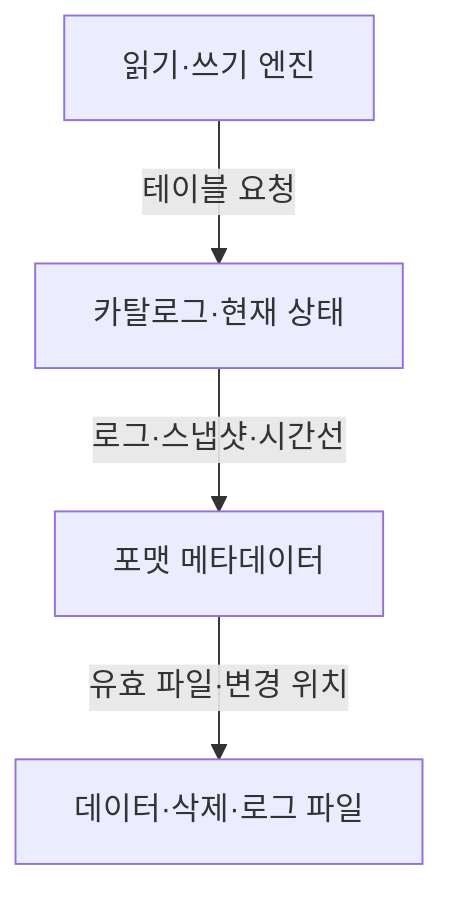
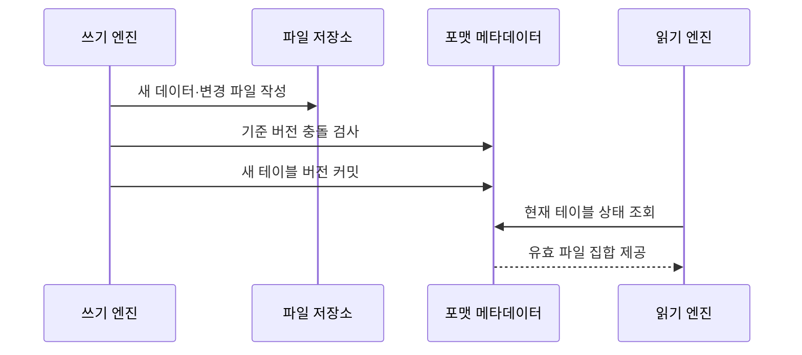

---
sidebar:
  order: 129
  label: "129. 오픈 테이블 포맷 비교 (Open Table Format)"
  badge:
    text: "기출 · 50%"
    variant: note
title: "오픈 테이블 포맷 비교 (Open Table Format)"
date: "2026-07-27T23:59:59+09:00"
tags:
  - "notes-software"
weight: 129
extra:
  question_no: "129"
  source_status: "기출"
  source_history: "137회"
  priority: 50
  priority_note: "137회 기출, 세 오픈 포맷 선택 기준"
---

## 미리 알고가기

- **오픈 테이블 포맷(Open Table Format)**: 객체 스토리지의 데이터 파일과 버전·스키마·파티션 메타데이터 관리 규칙을 공개 명세로 정의한 형식임
- **델타 레이크(Delta Lake)**: Add·Remove 동작을 순차 트랜잭션 로그에 기록해 버전별 유효 파일을 재구성하는 포맷임
- **아파치 아이스버그(Apache Iceberg)**: Snapshot·Manifest 계층이 데이터 파일과 별도 삭제 파일을 추적하는 포맷임
- **아파치 후디(Apache Hudi)**: Timeline이 완료된 작업을, File Group과 Index가 레코드 키의 저장 위치를 관리하는 포맷임
- **스냅숏(Snapshot)**: 특정 테이블 버전에서 유효한 데이터·삭제 파일과 스키마의 상태임
- **타임라인(Timeline)**: Hudi 테이블의 쓰기·정리·압축 등 작업과 요청·진행·완료 상태를 시간순으로 기록한 로그임
- **파일 그룹(File Group)**: Hudi에서 한 기본 파일과 이어지는 로그 파일들의 버전을 묶어 관리하는 논리 단위임
- **인덱스(Index)**: Hudi에서 레코드 키를 해당 파일 그룹 위치와 연결해 갱신 대상을 찾는 구조임
- **행 수준 변경(Row-level Change)**: 특정 행을 수정·삭제하려고 데이터 파일을 재작성하거나 별도 변경 파일을 추가하는 처리임
- **위치 삭제(Position Delete)**: Iceberg가 삭제할 데이터 파일 경로와 행 위치를 별도 파일에 기록하는 방식임
- **동등 삭제(Equality Delete)**: Iceberg가 지정 열의 값과 일치하는 행을 삭제 대상으로 기록하는 방식임
- **파일 병합(Compaction)**: 작은 파일이나 로그 파일을 더 큰 기본 데이터 파일로 합쳐 읽기 비용을 줄이는 작업임
- **스냅숏 만료(Snapshot Expiration)**: 보존 기준이 지난 테이블 버전과 참조 파일을 정리할 수 있게 하는 작업임
- **변경 데이터 피드(Change Data Feed, CDF)**: 영문 첫 글자를 딴 CDF를 '시디에프'로 읽으며 버전 사이의 삽입·수정·삭제 행을 증분 처리에 제공함

## Ⅰ. 개요

- 정의/개념: 객체 저장소 파일에 **스냅숏·스키마·트랜잭션 메타데이터**를 부여하는 규격
- 기존 한계: 파일 직접 관리는 **부분 커밋·동시 쓰기 충돌·버전 추적**에 한계

### 쉽게 이해하기 (학습용)
- 파일 위에 장부를 두어 엔진들이 동일한 테이블을 안전하게 읽고 쓰게 함

## Ⅱ. 특징

- 원자 메타데이터 커밋은 부분 버전 읽기를 막는다
- 파일·상태 분리는 다중 엔진의 같은 결과를 보장한다
- 메타데이터 진화는 파일 재작성 비용을 줄인다
- 파일 추적 구조가 변경·조회·유지 비용을 결정한다

### 쉽게 이해하기 (학습용)
- 세 포맷 모두 파일 테이블의 트랜잭션을 지원하지만 파일을 찾고 변경하고 정리하는 메타데이터 구조와 비용이 다름

## Ⅲ. 아키텍처 및 구성요소

| 설계 요소 | 설명 |
|:---|:---|
| 읽기·쓰기 엔진 | 포맷 규격으로 테이블 요청 |
| 카탈로그·현재 상태 | 현재 메타데이터 위치 제공 |
| 포맷 메타데이터 | 버전·스키마·파일 참조 관리 |
| 데이터·삭제·로그 파일 | 행과 변경 내역을 파일로 저장 |

> 요약: 파일은 공통이나 상태 참조와 변경 식별 구조가 다름

### 쉽게 이해하기 (학습용)
- 파케이 파일을 쓰더라도 상태와 변경 위치를 찾는 장부 구조가 다름

## Ⅳ. 원리 및 절차 흐름도

| 절차 | 설명 |
|:---|:---|
| 새 데이터·변경 파일 작성 | 기존 파일을 유지하고 변경 결과 기록 |
| 기준 버전 충돌 검사 | 동시 쓰기가 현재 상태를 바꿨는지 확인 |
| 새 테이블 버전 커밋 | 포맷 메타데이터에 파일 집합 확정 |
| 현재 테이블 상태 조회 | 독자가 최신 로그·스냅샷·시간선 선택 |
| 유효 파일 집합 제공 | 선택 버전에 포함된 파일만 읽기 계획 |

> 요약: 갱신과 호환 및 유지관리 요구를 구조와 비용에 매핑해 선택함

### 쉽게 이해하기 (학습용)
- 사용할 엔진과 변경 패턴을 정한 뒤 각 포맷의 커밋 충돌·파일 병합·메타데이터 정리 비용을 검증함

## Ⅴ. 종류 및 비교

| 오픈 테이블 포맷 | Delta Lake | Apache Iceberg | Apache Hudi |
|:---|:---|:---|:---|
| 적용 기준 | 스파크 통합 트랜잭션 로그 | 다중 엔진 호환성 | 잦은 부분 갱신·변경 피드 |
| 핵심 특징 | 로그·체크포인트 **상태 관리** | 스냅숏·Manifest **파일 관리** | Timeline·Index **변경 관리** |
| 한계 | 로그·체크포인트 **누적** | 메타데이터 트리 **누적** | 인덱스·파일 **병합 비용** |

> 요약: 델타는 로그, 아이스버그는 스냅샷, 후디는 시간선으로 관리함

### 쉽게 이해하기 (학습용)
- 델타는 로그, 아이스버그는 스냅샷, 후디는 시간선을 중심으로 함

## Ⅵ. 실무 사례

1. 주문 변경은 **Delta MERGE**로 단일 버전에 반영

### 쉽게 이해하기 (학습용)
- 주문 변경은 Delta 로그의 한 버전에 수정·삽입 파일을 함께 커밋해 독자가 부분 변경을 보지 않게 함

## Ⅶ. 결론

- 여러 분석 엔진이 동일 테이블을 안전하게 공유하기 위해 **엔진 호환성·행 변경 빈도·스키마 진화·메타데이터 유지 비용**을 검토하고, 워크로드에 맞는 오픈 테이블 포맷을 선택한다

### 쉽게 이해하기 (학습용)
- 오픈 테이블 포맷은 이름보다 실제 엔진 호환성·행 변경 빈도·메타데이터 누적·유지관리 자동화 수준으로 선택해야 함
