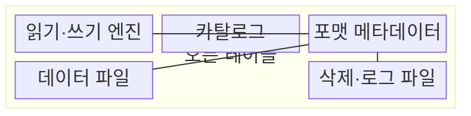
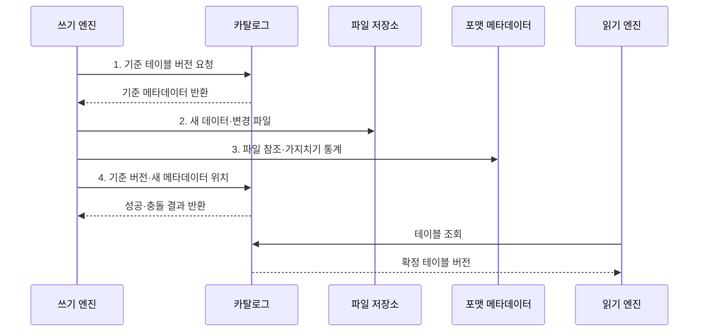

---
sidebar:
  order: 129
  label: "129. 오픈 테이블 포맷 비교 (Open Table Format)"
  badge:
    text: "기출 · 50%"
    variant: note
title: "오픈 테이블 포맷 비교 (Open Table Format)"
date: "2026-07-31T10:42:44+09:00"
tags:
  - "notes-software"
weight: 129
extra:
  question_no: "129"
  source_status: "기출"
  source_history: "137회"
  priority: 50
  priority_note: "137회 기출, 세 오픈 포맷 선택 기준"
---

## 미리 알고가기

- **오픈 테이블 포맷(Open Table Format)**: 객체 스토리지의 데이터 파일과 버전·스키마·파티션 메타데이터 관리 규칙을 공개 명세로 정의한 형식이다.
- **델타 레이크(Delta Lake)**: Add·Remove 동작을 순차 트랜잭션 로그에 기록해 버전별 유효 파일을 재구성하는 포맷이다.
- **아파치 아이스버그(Apache Iceberg)**: Snapshot·Manifest 계층이 데이터 파일과 별도 삭제 파일을 추적하는 포맷이다.
- **아파치 후디(Apache Hudi)**: Timeline이 완료된 작업을, File Group과 Index가 레코드 키의 저장 위치를 관리하는 포맷이다.
- **스냅숏(Snapshot)**: 특정 테이블 버전에서 유효한 데이터·삭제 파일과 스키마의 상태이다.
- **타임라인(Timeline)**: Hudi 테이블의 쓰기·정리·압축 등 작업과 요청·진행·완료 상태를 시간순으로 기록한 로그이다.
- **파일 그룹(File Group)**: Hudi에서 한 기본 파일과 이어지는 로그 파일들의 버전을 묶어 관리하는 논리 단위이다.
- **인덱스(Index)**: Hudi에서 레코드 키를 해당 파일 그룹 위치와 연결해 갱신 대상을 찾는 구조이다.
- **행 수준 변경(Row-level Change)**: 특정 행을 수정·삭제하려고 데이터 파일을 재작성하거나 별도 변경 파일을 추가하는 처리이다.
- **위치 삭제(Position Delete)**: Iceberg가 삭제할 데이터 파일 경로와 행 위치를 별도 파일에 기록하는 방식이다.
- **동등 삭제(Equality Delete)**: Iceberg가 지정 열의 값과 일치하는 행을 삭제 대상으로 기록하는 방식이다.
- **파일 병합(Compaction)**: 작은 파일이나 로그 파일을 더 큰 기본 데이터 파일로 합쳐 읽기 비용을 줄이는 작업이다.
- **스냅숏 만료(Snapshot Expiration)**: 보존 기준이 지난 테이블 버전과 참조 파일을 정리할 수 있게 하는 작업이다.
- **필드 식별자(Field Identifier, Field ID)**: 열 이름이나 순서가 바뀌어도 같은 논리 열을 추적하는 고유 번호이다.
- **체크포인트(Checkpoint)**: 누적 트랜잭션 로그를 집약해 스냅숏 복원 시 읽을 로그 범위를 줄이는 요약 파일이다.

> **키워드:** 오픈 테이블 포맷 비교 (Open Table Format)

## Ⅰ. 개요

- 정의/개념: 객체 스토리지 파일을 테이블로 관리하는 **공개 메타데이터 명세**
- 배경/필요성: 디렉터리 기반 파일 표는 **부분 커밋·동시 쓰기·구조 진화** 관리 제약

### 쉽게 이해하기 (학습용)

- 같은 창고 파일을 여러 도구가 동일한 표로 보도록 공개된 장부 규칙을 둔다.

## Ⅱ. 특징

- 완성된 파일 집합만 새 버전으로 공개하는 **원자 커밋**
- 공개 명세로 같은 스냅숏을 해석하는 **다중 엔진 호환성**
- 스키마·파티션 정보를 경로에서 분리한 **구조 진화**

### 쉽게 이해하기 (학습용)

- 세 포맷 모두 안전한 장부를 제공하지만 현재 파일과 바뀐 행을 찾고 정리하는 방법이 다르다.

## Ⅲ. 구조 및 구성요소

| 구성요소 | 책임 |
|:---|:---|
| 읽기·쓰기 엔진 | 공개 명세에 따라 **조회·변경·커밋** 수행 |
| 카탈로그 | 테이블 이름과 현재 **메타데이터 위치** 제공 |
| 포맷 메타데이터 | **스냅숏·스키마·파티션·파일 참조** 관리 |
| 데이터 파일 | 실제 행을 **열 지향 파일**로 저장 |
| 삭제·로그 파일 | 데이터 파일 재작성 전 **행 수준 변경** 저장 |

### 쉽게 이해하기 (학습용)

- 엔진과 파일 사이의 공개 장부가 현재 테이블 상태를 정한다.

## Ⅳ. 흐름도

**동작 원리**

1. **기준 테이블 버전 요청**: 쓰기 기준 스냅숏과 스키마·파티션 정보 확보
2. **새 데이터·변경 파일**: 기존 객체를 보존한 채 새 행·삭제 표현 기록
3. **파일 참조·가지치기 통계**: 포맷 명세에 따라 유효 파일과 검색 통계 구성
4. **기준 버전·새 메타데이터 위치**: 동시 변경을 검사해 현재 참조를 원자적으로 전환

### 쉽게 이해하기 (학습용)

- 새 파일과 목록을 준비하고 현재 장부 위치를 한 번에 바꾼 뒤 독자는 확정된 파일만 읽는다.

## Ⅴ. 종류 및 비교

| 오픈 테이블 포맷 | Delta Lake | Apache Iceberg | Apache Hudi |
|:---|:---|:---|:---|
| 적용 기준 | **로그·스트림 연계** | **대규모 계획·구조 진화** | **레코드 변경·증분 적재** |
| 핵심 특징 | **순차 로그·체크포인트** | **스냅숏·매니페스트·필드 ID** | **타임라인·파일 그룹·인덱스** |
| 한계 | 로그·작은 파일·**스냅숏 만료** 관리 | **매니페스트·삭제 파일·스냅숏** 관리 | **인덱스·파일 병합·이전 파일 정리** 관리 |

### 쉽게 이해하기 (학습용)

- 델타는 거래 로그, 아이스버그는 단계별 파일 목록, 후디는 작업 시간선과 레코드 위치표가 중심이다.

## Ⅵ. 실무 고려사항 및 대책

| 고려사항 | 대책 | 효과 |
|:---|:---|:---|
| 엔진·카탈로그 조합별 기능 차이로 **읽기·쓰기 오류** 발생 | 조합별 **호환성·커밋 시험** 수행 | 미지원 기능의 **운영 투입** 방지 |
| 변경률과 키 분포가 맞지 않으면 **파일 재작성·병합량** 증가 | 키·파티션·변경률 기반 **쓰기 방식** 선택 | 행 수준 변경의 **쓰기 증폭** 감소 |
| 작은 파일·메타데이터 누적으로 **계획·읽기 비용** 증가 | 목표 크기 기반 **파일·메타데이터 병합** | 쿼리의 **계획·스캔 비용** 감소 |
| 보존 기간이 작업 시간보다 짧으면 **과거 파일** 조기 삭제 | 복구 목표·작업 시간 기반 **수명주기** 설정 | 과거 조회와 **저장 비용** 균형 |

### 쉽게 이해하기 (학습용)

- 이름표만 비교하지 말고 실제 주문 변경을 넣어 쓰기·읽기·정리 비용까지 재 본다.

## Ⅶ. 결론

- 로그 연계는 **Delta**, 구조 진화는 **Iceberg**, 레코드 갱신은 Hudi 선택

### 쉽게 이해하기 (학습용)

- 같은 안전 장부라도 도구와 변경 방식에 따라 유지비가 달라 실제 작업으로 골라야 한다.
