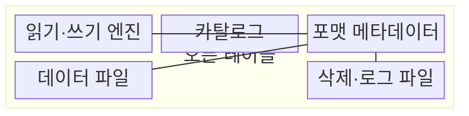
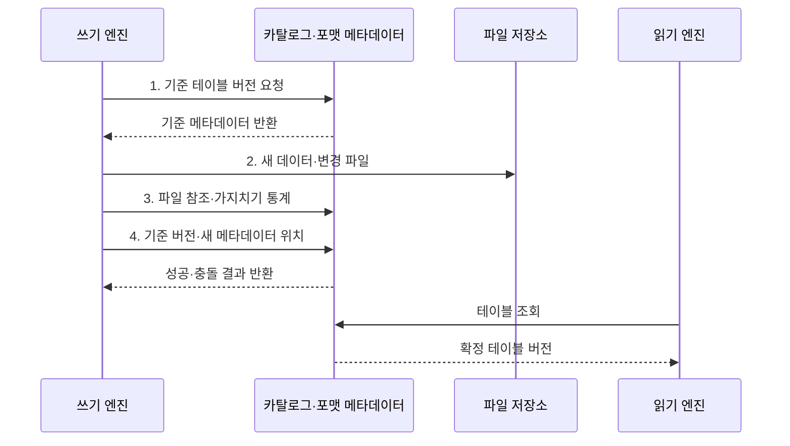

---
sidebar:
  order: 129
  label: "129. 오픈 테이블 포맷 비교 (Open Table Format)"
  badge:
    text: "기출 · 50%"
    variant: note
title: "오픈 테이블 포맷 비교 (Open Table Format)"
date: "2026-08-02T12:00:00+09:00"
tags:
  - "notes-software"
weight: 129
extra:
  question_no: "129"
  source_status: "기출"
  source_history: "137회"
  priority: 50
  priority_note: "137회 기출, 세 오픈 포맷 선택 기준"
---

## Ⅰ. 개요

핵심 용어

- **오픈 테이블 포맷(Open Table Format)**: 객체 스토리지 파일의 버전·스키마·파티션을 여러 엔진이 같은 규칙으로 관리하게 하는 공개 메타데이터 명세이다.

- 정의/개념: 객체 스토리지 파일을 테이블로 관리하는 **공개 메타데이터 명세**
- 배경/필요성: 디렉터리 기반 파일 표는 **부분 커밋·동시 쓰기·구조 진화** 관리 제약

#### 한줄 요약

- 같은 창고 파일을 여러 도구가 동일한 표로 보도록 공개된 장부 규칙을 둔다.

## Ⅱ. 특징

핵심 용어

- **다중 엔진 호환성**: 공개 명세에 따라 여러 처리 엔진이 같은 테이블 스냅숏을 해석하는 특성이다.
- **원자 커밋**: 완성된 파일 집합만 하나의 새 테이블 버전으로 공개하는 특성이다.
- **구조 진화**: 스키마·파티션 정보를 디렉터리 경로와 분리해 열과 배치 규칙을 안전하게 변경하는 특성이다.

- 완성된 파일 집합만 새 버전으로 공개하는 **원자 커밋**
- 공개 명세로 같은 스냅숏을 해석하는 **다중 엔진 호환성**
- 스키마·파티션 정보를 경로에서 분리한 **구조 진화**

#### 한줄 요약

- 세 포맷 모두 안전한 장부를 제공하지만 현재 파일과 바뀐 행을 찾고 정리하는 방법이 다르다.

## Ⅲ. 구조 및 구성요소

핵심 용어

- **포맷 메타데이터**: 스냅숏·스키마·파티션과 데이터 및 변경 파일 참조를 관리하는 구성요소이다.
- **읽기·쓰기 엔진**: 공개 명세를 해석해 테이블 조회·변경·커밋을 수행하는 실행 도구이다.
- **카탈로그**: 테이블 이름과 현재 메타데이터 위치를 관리하는 구성요소이다.
- **데이터 파일**: 실제 행을 불변 열 지향 형식으로 저장하는 파일이다.
- **삭제·로그 파일**: 데이터 파일 전체를 재작성하기 전에 행 수준 삭제·변경을 표현하는 파일이다.

| 구성요소 | 책임 |
|:---|:---|
| 읽기·쓰기 엔진 | 공개 명세에 따라 **조회·변경·커밋** 수행 |
| 카탈로그 | 테이블 이름과 현재 **메타데이터 위치** 제공 |
| 포맷 메타데이터 | **스냅숏·스키마·파티션·파일 참조** 관리 |
| 데이터 파일 | 실제 행을 **열 지향 파일** 로 저장 |
| 삭제·로그 파일 | 데이터 파일 재작성 전 **행 수준 변경** 저장 |

#### 한줄 요약

- 엔진과 파일 사이의 공개 장부가 현재 테이블 상태를 정한다.

## Ⅳ. 흐름도

핵심 용어

- **4. 기준 버전·새 메타데이터 위치**: 동시 변경을 검사해 카탈로그의 현재 참조를 원자적으로 전환하는 단계이다.
- **1. 기준 테이블 버전 요청**: 쓰기가 출발할 스냅숏과 스키마·파티션 정보를 요청하는 단계이다.
- **2. 새 데이터·변경 파일**: 기존 객체를 유지한 채 새 행과 삭제·변경 표현을 기록한 파일이다.
- **3. 파일 참조·가지치기 통계**: 새 버전이 사용할 파일과 검색 제외에 필요한 통계를 구성한 정보이다.

**동작 원리**

1. **기준 테이블 버전 요청**: 쓰기 기준 스냅숏과 스키마·파티션 정보 확보
2. **새 데이터·변경 파일**: 기존 객체를 보존한 채 새 행·삭제 표현 기록
3. **파일 참조·가지치기 통계**: 포맷 명세에 따라 유효 파일과 검색 통계 구성
4. **기준 버전·새 메타데이터 위치**: 동시 변경을 검사해 현재 참조를 원자적으로 전환

#### 한줄 요약

- 새 파일과 목록을 준비하고 현재 장부 위치를 한 번에 바꾼 뒤 독자는 확정된 파일만 읽는다.

## Ⅴ. 종류 및 비교

핵심 용어

- **Apache Hudi**: 타임라인·파일 그룹·인덱스로 레코드 변경과 증분 적재를 관리하는 테이블 포맷이다.
- **Delta Lake**: 순차 트랜잭션 로그와 체크포인트로 파일 집합의 버전을 관리하는 포맷이다.
- **Apache Iceberg**: 스냅숏·매니페스트·필드 식별자(Field Identifier, Field ID)로 대규모 계획과 구조 진화를 지원하는 포맷이다.

| 오픈 테이블 포맷 | Delta Lake | Apache Iceberg | Apache Hudi |
|:---|:---|:---|:---|
| 적용 기준 | **로그·스트림 연계** | **대규모 계획·구조 진화** | **레코드 변경·증분 적재** |
| 핵심 특징 | **순차 로그·체크포인트** | **스냅숏·매니페스트·필드 식별자(Field Identifier, Field ID)** | **타임라인·파일 그룹·인덱스** |
| 한계 | 로그·작은 파일·**스냅숏 만료** 관리 | **매니페스트·삭제 파일·스냅숏** 관리 | **인덱스·파일 병합·이전 파일 정리** 관리 |

#### 한줄 요약

- 델타는 거래 로그, 아이스버그는 단계별 파일 목록, 후디는 작업 시간선과 레코드 위치표가 중심이다.

## Ⅵ. 실무 고려사항 및 대책

핵심 용어

- **계획·읽기 비용**: 파일과 목록이 과도하게 늘어 쿼리 계획과 스캔 부담이 커지는 문제이다.
- **호환성·커밋 시험**: 엔진·카탈로그 조합이 필요한 읽기·쓰기·동시 커밋 기능을 실제 지원하는지 확인하는 시험이다.
- **키·파티션·변경률 기반 쓰기 방식**: 레코드 갱신 분포와 파일 재작성 비용에 맞춰 변경 파일이나 복사 후 쓰기를 선택하는 기준이다.
- **파일·메타데이터 병합**: 작은 데이터 파일과 목록 파일을 목표 크기로 합쳐 계획·스캔 비용을 줄이는 처리이다.
- **수명주기**: 복구 목표와 최대 작업 시간보다 길게 스냅숏과 참조 파일을 보존한 뒤 안전하게 제거하는 정책이다.

| 문제 | 대책 | 효과 |
|:---|:---|:---|
| 엔진·카탈로그 조합별 기능 차이로 **읽기·쓰기 오류** 발생 | 조합별 **호환성·커밋 시험** 수행 | 미지원 기능의 **운영 투입** 방지 |
| 변경률과 키 분포가 맞지 않으면 **파일 재작성·병합량** 증가 | 키·파티션·변경률 기반 **쓰기 방식** 선택 | 행 수준 변경의 **쓰기 증폭** 감소 |
| 작은 파일·메타데이터 누적으로 **계획·읽기 비용** 증가 | 목표 크기 기반 **파일·메타데이터 병합** | 쿼리의 **계획·스캔 비용** 감소 |
| 보존 기간이 작업 시간보다 짧으면 **과거 파일** 조기 삭제 | 복구 목표·작업 시간 기반 **수명주기** 설정 | 과거 조회와 **저장 비용** 균형 |

#### 한줄 요약

- 이름표만 비교하지 말고 실제 주문 변경을 넣어 쓰기·읽기·정리 비용까지 재 본다.

## Ⅶ. 결론

핵심 용어

- **Iceberg**: 대규모 파일 계획과 스키마·파티션 구조 진화에 적합한 오픈 테이블 포맷이다.
- **Delta Lake**: 트랜잭션 로그와 스트림 연계가 중요한 테이블에 적합한 포맷이다.
- **Apache Hudi**: 레코드 수준 갱신과 증분 적재가 중요한 테이블에 적합한 포맷이다.

- 로그 연계는 **Delta Lake** 선택, 구조 진화는 **Apache Iceberg** 선택, 레코드 갱신은 **Apache Hudi** 선택

#### 한줄 요약

- 같은 안전 장부라도 도구와 변경 방식에 따라 유지비가 달라 실제 작업으로 골라야 한다.
