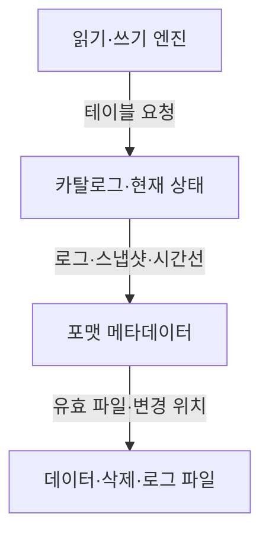
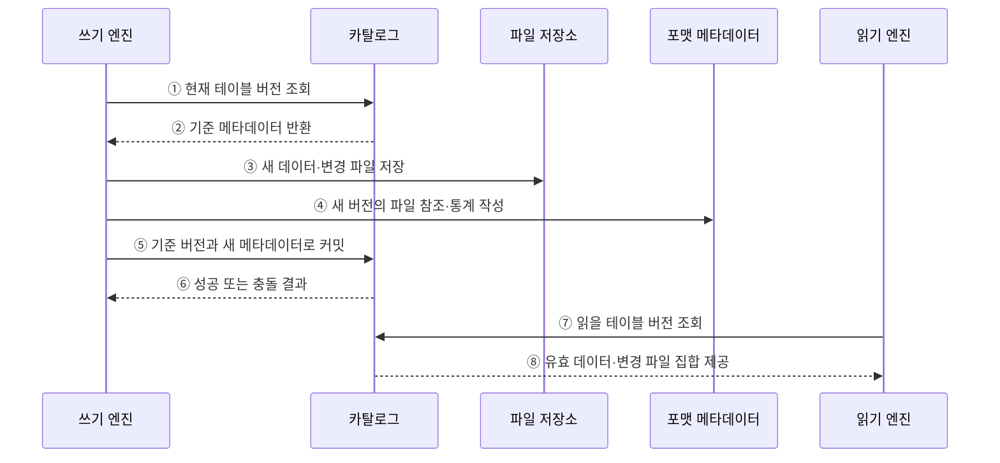

---
sidebar:
  order: 129
  label: "129. 오픈 테이블 포맷 비교 (Open Table Format)"
  badge:
    text: "기출 · 50%"
    variant: note
title: "오픈 테이블 포맷 비교 (Open Table Format)"
date: "2026-07-27T23:59:59+09:00"
tags:
  - "notes-software"
weight: 129
extra:
  question_no: "129"
  source_status: "기출"
  source_history: "137회"
  priority: 50
  priority_note: "137회 기출, 세 오픈 포맷 선택 기준"
---

## 미리 알고가기

- **오픈 테이블 포맷(Open Table Format)**: 객체 스토리지의 데이터 파일과 버전·스키마·파티션 메타데이터 관리 규칙을 공개 명세로 정의한 형식임
- **델타 레이크(Delta Lake)**: Add·Remove 동작을 순차 트랜잭션 로그에 기록해 버전별 유효 파일을 재구성하는 포맷임
- **아파치 아이스버그(Apache Iceberg)**: Snapshot·Manifest 계층이 데이터 파일과 별도 삭제 파일을 추적하는 포맷임
- **아파치 후디(Apache Hudi)**: Timeline이 완료된 작업을, File Group과 Index가 레코드 키의 저장 위치를 관리하는 포맷임
- **스냅숏(Snapshot)**: 특정 테이블 버전에서 유효한 데이터·삭제 파일과 스키마의 상태임
- **타임라인(Timeline)**: Hudi 테이블의 쓰기·정리·압축 등 작업과 요청·진행·완료 상태를 시간순으로 기록한 로그임
- **파일 그룹(File Group)**: Hudi에서 한 기본 파일과 이어지는 로그 파일들의 버전을 묶어 관리하는 논리 단위임
- **인덱스(Index)**: Hudi에서 레코드 키를 해당 파일 그룹 위치와 연결해 갱신 대상을 찾는 구조임
- **행 수준 변경(Row-level Change)**: 특정 행을 수정·삭제하려고 데이터 파일을 재작성하거나 별도 변경 파일을 추가하는 처리임
- **위치 삭제(Position Delete)**: Iceberg가 삭제할 데이터 파일 경로와 행 위치를 별도 파일에 기록하는 방식임
- **동등 삭제(Equality Delete)**: Iceberg가 지정 열의 값과 일치하는 행을 삭제 대상으로 기록하는 방식임
- **파일 병합(Compaction)**: 작은 파일이나 로그 파일을 더 큰 기본 데이터 파일로 합쳐 읽기 비용을 줄이는 작업임
- **스냅숏 만료(Snapshot Expiration)**: 보존 기준이 지난 테이블 버전과 참조 파일을 정리할 수 있게 하는 작업임
- **변경 데이터 피드(Change Data Feed, CDF)**: 영문 첫 글자를 딴 CDF를 '시디에프'로 읽으며 버전 사이의 삽입·수정·삭제 행을 증분 처리에 제공함

## Ⅰ. 개요

- 오픈 테이블 포맷은 객체 스토리지의 데이터 파일을 테이블로 읽고 쓰기 위한 트랜잭션·스냅숏·스키마·파티션 메타데이터 규칙을 공개한 명세이다.
- 파일을 직접 나열할 때의 부분 커밋·동시 쓰기 충돌·버전 복원·구조 진화 문제를 원자적인 메타데이터 커밋으로 해결한다.

### 쉽게 이해하기 (학습용)

- 같은 창고 파일을 여러 도구가 동일한 표로 보도록 공개된 장부 규칙을 둔다.

## Ⅱ. 특징

- **원자적 상태 전환**: 데이터 파일을 먼저 만든 뒤 현재 메타데이터 참조를 한 번에 바꿔 부분 버전 노출을 막는다.
- **다중 엔진 공유**: 명세를 구현한 엔진이 같은 스냅숏·스키마·파일 집합을 해석한다.
- **구조 진화**: 스키마와 파티션 정보를 경로에서 분리해 전체 파일 재작성과 질의 수정을 줄인다.
- **행 수준 변경**: 파일 재작성 또는 삭제·로그 파일 병합으로 수정·삭제를 표현한다.
- **유지관리 필수**: 작은 파일·메타데이터·과거 스냅숏·미참조 파일의 누적을 통제해야 한다.

### 쉽게 이해하기 (학습용)

- 세 포맷 모두 안전한 장부를 제공하지만 현재 파일과 바뀐 행을 찾고 정리하는 방법이 다르다.

## Ⅲ. 아키텍처 및 구성요소

**도표안 A — 구조도**

**도표안 B — sequenceDiagram**

| 설계 요소 | 설명 |
|:---|:---|
| 읽기·쓰기 엔진 | 포맷 명세에 따라 스냅숏 조회·변경·커밋 수행 |
| 카탈로그 | 테이블 이름과 현재 메타데이터 위치·버전 제공 |
| 포맷 메타데이터 | 스냅숏·스키마·파티션·파일 참조 관리 |
| 데이터 파일 | 실제 행을 열 형식 파일로 저장 |
| 삭제·로그 파일 | 기존 파일 재작성 전 행 삭제·변경 내역 저장 |

**동작 원리**

- ① 쓰기 엔진이 카탈로그에서 현재 테이블 버전을 조회한다.
- ② 카탈로그가 변경의 기준이 될 메타데이터 위치와 스냅숏을 반환한다.
- ③ 쓰기 엔진이 기존 파일을 직접 수정하지 않고 새 데이터·삭제·로그 파일을 저장한다.
- ④ 쓰기 엔진이 포맷별 로그·스냅숏·Timeline 규칙으로 새 파일 참조와 통계를 작성한다.
- ⑤ 쓰기 엔진이 기준 버전과 새 메타데이터 위치로 원자적 커밋을 요청한다.
- ⑥ 카탈로그가 기준 버전이 유지됐으면 확정하고, 바뀌었으면 충돌을 반환한다.
- ⑦ 읽기 엔진이 현재 또는 지정한 과거 테이블 버전을 조회한다.
- ⑧ 카탈로그와 포맷 메타데이터가 그 버전의 유효 데이터·변경 파일 집합을 제공한다.

### 쉽게 이해하기 (학습용)

- 새 파일과 목록을 준비하고 현재 장부 위치를 한 번에 바꾼 뒤 독자는 확정된 파일만 읽는다.

## Ⅳ. 종류 및 비교

| 비교 항목 | Delta Lake | Apache Iceberg | Apache Hudi |
|:---|:---|:---|:---|
| 중심 메타데이터 | 순차 로그·체크포인트 | 스냅숏·Manifest 계층 | Timeline·File Group·Index |
| 파일 상태 확인 | Add·Remove 동작 재생 | Manifest의 파일·통계 추적 | 완료 작업과 File Slice 추적 |
| 행 변경 접근 | MERGE와 파일 재작성 중심 | 데이터·위치/동등 삭제 파일 | Copy-on-Write 또는 Merge-on-Read |
| 대표 강점 | 로그 기반 변경·배치/스트림 연계 | 대규모 파일 계획·스키마/파티션 진화 | 레코드 키 기반 증분 적재·변경 소비 |
| 주요 운영비 | 로그·작은 파일·VACUUM | Manifest·삭제 파일·스냅숏 | 인덱스·Compaction·Cleaning |

> 기능과 엔진 지원은 계속 겹치므로 대표 성향만으로 결정하지 말고 실제 엔진·카탈로그·변경 패턴을 시험해야 한다.

### 쉽게 이해하기 (학습용)

- 델타는 거래 로그, 아이스버그는 단계별 파일 목록, 후디는 작업 시간선과 레코드 위치표가 중심이다.

## Ⅴ. 실무 고려사항 및 대책

| 고려사항 | 위험 | 대책 |
|:---|:---|:---|
| 엔진·카탈로그 | 필요한 쓰기·삭제·진화 기능 미지원 | 읽기/쓰기 조합별 호환성 행렬·통합 시험 |
| 변경 패턴 | 잦은 갱신이 과도한 파일 재작성·병합 유발 | 키·파티션·변경률로 포맷과 쓰기 방식 평가 |
| 파일 계획 | 작은 파일·메타데이터 누적 | 목표 크기·Compaction·메타데이터 병합 |
| 보존·삭제 | 과거 조회 손실 또는 저장비 증가 | 복구 목표·최대 작업 시간 기반 수명주기 |
| 잠금·커밋 | 카탈로그 특성에 따른 충돌·재시도 | 원자 커밋 보장 확인·부하 충돌 시험 |
| 전환성 | 포맷별 고유 기능이 이전을 제한 | 공개 명세 공통 기능 우선·이관 절차 검증 |

> **적용 사례**: 주문 변경률·키 조회·사용 엔진을 실제 데이터로 시험하고 커밋 충돌률, 읽기 지연, 파일 증가량, 유지관리 시간을 함께 비교한다.

### 쉽게 이해하기 (학습용)

- 이름표만 비교하지 말고 실제 주문 변경을 넣어 쓰기·읽기·정리 비용까지 재 본다.

## Ⅵ. 결론

- 오픈 테이블 포맷의 공통 핵심은 파일 집합을 원자적인 테이블 버전으로 공개하는 것이고 차이는 상태·행 변경·인덱스·유지관리 구조에 있다.
- 엔진과 카탈로그 호환성, 변경 빈도, 스키마·파티션 진화, 메타데이터와 파일 정리 비용을 실제 워크로드로 검증해 선택해야 한다.

### 쉽게 이해하기 (학습용)

- 같은 안전 장부라도 도구와 변경 방식에 따라 유지비가 달라 실제 작업으로 골라야 한다.
