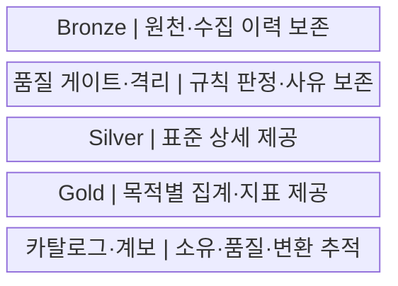
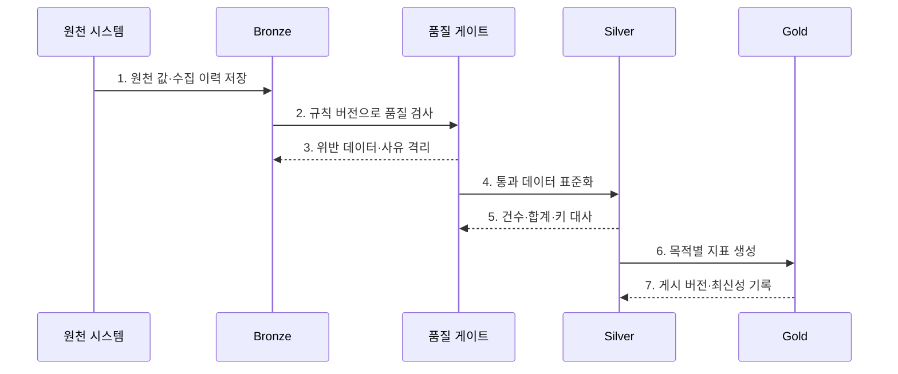

---
sidebar:
  order: 130
  label: "130. 메달리온 아키텍처 (Medallion Architecture)"
  badge:
    text: "미출제 · 50%"
    variant: note
title: "메달리온 아키텍처 (Medallion Architecture)"
date: "2026-07-25T11:30:00+09:00"
tags:
  - "notes-software"
weight: 130
extra:
  question_no: "130"
  source_status: "미출제"
  source_history: ""
  priority: 50
  priority_note: "브론즈·실버·골드 품질 계층 활용성 높음"
---

## 미리 알고가기

- **메달리온 아키텍처(Medallion Architecture)**: 데이터를 Bronze·Silver·Gold 계층으로 나눠 원천 보존부터 표준화·목적별 제공까지 품질을 높이는 설계임
- **브론즈 계층(Bronze Layer)**: 원천 데이터를 재처리할 수 있도록 수집 형태와 이력을 보존하는 계층임
- **실버 계층(Silver Layer)**: 형식·중복·키·품질 규칙을 적용해 표준화한 상세 데이터 계층임
- **골드 계층(Gold Layer)**: 특정 분석·응용 목적에 맞춘 집계·차원·서빙 데이터 계층임
- **품질 게이트(Quality Gate)**: 상위 계층으로 게시하기 전에 스키마·완전성·참조 규칙을 판정하는 검증 경계임
- **격리 영역(Quarantine)**: 품질 규칙을 통과하지 못한 레코드와 판정 사유를 보존함
- **재처리(Reprocessing)**: Bronze의 원천 이력에서 새 규칙으로 Silver·Gold를 다시 생성하는 작업임
- **표준화(Standardization)**: 원천마다 다른 코드·형식·단위·키를 공통 기준으로 변환하는 작업임
- **데이터 카탈로그(Data Catalog)**: 계층별 데이터의 위치·스키마·소유자·품질 정보를 검색 가능하게 관리하는 목록임
- **데이터 계보(Data Lineage)**: 원천이 어떤 변환을 거쳐 Silver와 Gold 결과가 되었는지 추적하는 정보임
- **데이터 대사(Data Reconciliation)**: 원천과 변환 결과의 건수·합계·키를 비교해 누락과 중복을 찾는 검증임
- **최신성(Data Freshness)**: 데이터가 원천의 최근 변경을 얼마나 빠르게 반영하는지를 나타내는 품질 속성임

## Ⅰ. 개요

- **정의/개념**: 데이터를 Bronze·Silver·Gold로 승격하는 **품질 계층 설계**이다.
- **배경/필요성**: 오류 전파를 막고 **원천부터 재처리**할 수 있게 한다.

### 쉽게 이해하기 (학습용)

- 원석을 보관하고 불순물을 거른 뒤 용도별 제품으로 만드는 정제 구조이다.

## Ⅱ. 특징

- **원천 보존**: Bronze가 재처리 기준 데이터를 저장한다.
- **표준 상세**: Silver가 형식·코드·키를 통일한다.
- **목적별 제공**: Gold가 업무별 집계·지표를 제공한다.

### 쉽게 이해하기 (학습용)

- 색깔별 폴더가 아니라 각 단계의 입학 기준과 탈락 사유, 다시 시작할 원본이 있어야 한다.

## Ⅲ. 구조 및 구성요소

| 구성요소 | 책임 |
|:---|:---|
| Bronze | 원천 값·출처·수집 이력·처리 기준점 보존 |
| 품질 게이트·격리 | 품질 규칙 판정과 위반 사유 보존 |
| Silver | 코드·형식·단위·키를 통일한 상세 제공 |
| Gold | 소비 목적별 차원·집계·지표 제공 |
| 카탈로그·계보 | 계층별 소유자·품질·변환 이력 연결 |

### 쉽게 이해하기 (학습용)

- 원본 보관함부터 목적별 진열대까지 품질 단계를 나눈다.

## Ⅳ. 흐름도

**동작 원리**

- **1. 원천 값·수집 이력 저장**: Bronze에 원본과 출처를 보존한다.
- **2. 규칙 버전으로 품질 검사**: 스키마·완전성·참조 규칙을 판정한다.
- **3. 위반 데이터·사유 격리**: 실패 레코드와 근거를 분리한다.
- **4. 통과 데이터 표준화**: 코드·형식·키를 Silver로 통일한다.
- **5. 건수·합계·키 대사**: 원천과 변환 결과를 비교한다.
- **6. 목적별 지표 생성**: 승인된 상세로 Gold를 만든다.
- **7. 게시 버전·최신성 기록**: 결과의 재현 근거를 남긴다.

### 쉽게 이해하기 (학습용)

- 원본 보관함, 검사대, 표준 창고, 목적별 진열대를 거치며 품질 증거를 남긴다.

## Ⅴ. 종류 및 비교

| 비교 항목 | Bronze | Silver | Gold |
|:---|:---|:---|:---|
| 적용 기준 | **원천 보존·재처리** | **표준화·품질 보장** | **분석·서비스 제공** |
| 핵심 특징 | 수집 형태의 이력 | 정제 상세·공통 키 | 집계·차원·지표 |
| 한계 | 민감정보·보존비 관리 | 규칙 충돌·오류 은폐 | 지표 중복·정의 불일치 |

### 쉽게 이해하기 (학습용)

- 브론즈는 원본, 실버는 믿을 수 있는 공통 재료, 골드는 용도별 완제품이다.

## Ⅵ. 실무 고려사항 및 대책

| 고려사항 | 대책 | 효과 |
|:---|:---|:---|
| 계층 계약 | 입력·출력·승격·소유 책임 명시 | 품질 단계 구분 |
| 재처리 | 기준점·멱등성·백필 절차 수립 | 재생성 범위 축소 |
| 품질 실패 | 격리·사유·재검증 기준 적용 | 오류 데이터 보존 |
| 대사 | 건수·합계·키·최신성 자동 비교 | 누락·중복 조기 발견 |
| 보안 | 분류·암호화·최소 권한 적용 | Bronze 민감정보 보호 |

### 쉽게 이해하기 (학습용)

- 불량 로그는 버리지 않고 이유와 함께 따로 두며 검사 결과가 맞아야 최종 지표를 바꾼다.

## Ⅶ. 결론

- **품질 계약·격리 사유·재처리 경로·대사 증거**로 메달리온 계층을 운영한다.

### 쉽게 이해하기 (학습용)

- 각 단계가 무엇을 통과시켰고 실패하면 어디서 다시 시작할지를 증명해야 한다.
