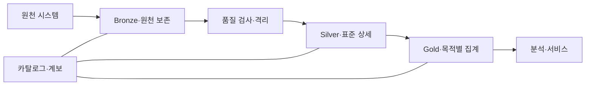
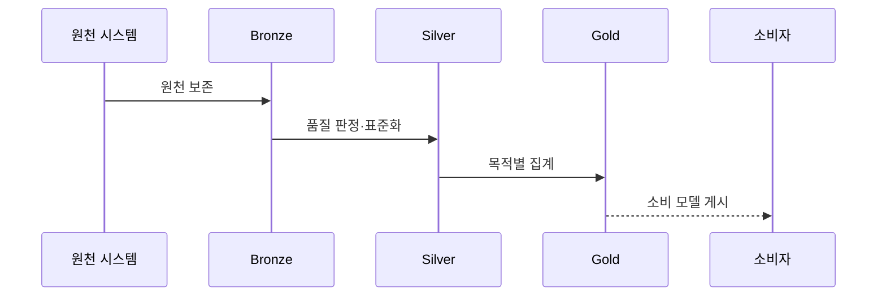

---
sidebar:
  order: 130
  label: "130. 메달리온 아키텍처 (Medallion Architecture)"
  badge:
    text: "미출제 · 50%"
    variant: note
title: "메달리온 아키텍처 (Medallion Architecture)"
date: "2026-07-25T11:30:00+09:00"
tags:
  - "notes-software"
weight: 130
extra:
  question_no: "130"
  source_status: "미출제"
  source_history: ""
  priority: 50
  priority_note: "브론즈·실버·골드 품질 계층 활용성 높음"
---

## 미리 알고가기

- **메달리온 아키텍처(Medallion Architecture)**: 데이터를 Bronze·Silver·Gold 계층으로 나눠 원천 보존부터 표준화·목적별 제공까지 품질을 높이는 설계임
- **브론즈 계층(Bronze Layer)**: 원천 데이터를 재처리할 수 있도록 수집 형태와 이력을 보존하는 계층임
- **실버 계층(Silver Layer)**: 형식·중복·키·품질 규칙을 적용해 표준화한 상세 데이터 계층임
- **골드 계층(Gold Layer)**: 특정 분석·응용 목적에 맞춘 집계·차원·서빙 데이터 계층임
- **품질 게이트(Quality Gate)**: 상위 계층으로 게시하기 전에 스키마·완전성·참조 규칙을 판정하는 검증 경계임
- **격리 영역(Quarantine)**: 품질 규칙을 통과하지 못한 레코드와 판정 사유를 보존함
- **재처리(Reprocessing)**: Bronze의 원천 이력에서 새 규칙으로 Silver·Gold를 다시 생성하는 작업임
- **표준화(Standardization)**: 원천마다 다른 코드·형식·단위·키를 공통 기준으로 변환하는 작업임
- **데이터 카탈로그(Data Catalog)**: 계층별 데이터의 위치·스키마·소유자·품질 정보를 검색 가능하게 관리하는 목록임
- **데이터 계보(Data Lineage)**: 원천이 어떤 변환을 거쳐 Silver와 Gold 결과가 되었는지 추적하는 정보임
- **데이터 대사(Data Reconciliation)**: 원천과 변환 결과의 건수·합계·키를 비교해 누락과 중복을 찾는 검증임
- **최신성(Data Freshness)**: 데이터가 원천의 최근 변경을 얼마나 빠르게 반영하는지를 나타내는 품질 속성임

## Ⅰ. 개요

- 정의/개념: 데이터를 세 계층으로 정제·검증하는 패턴이다
- **배경/필요성**: 원천 보존으로 품질 실패를 재처리한다

### 쉽게 이해하기 (학습용)
- 원석을 보존하고 불순물을 제거해 제품을 만드는 정제 구조임

## Ⅱ. 특징

- Bronze는 원천·수집 이력을 보존해 재처리를 보장한다
- Silver는 코드·키·형식을 맞춰 결과 불일치를 줄인다
- Gold는 검증 데이터로 지표 오염을 막는다
- 게이트·계보는 실패 격리와 재처리 근거를 남긴다

### 쉽게 이해하기 (학습용)
- 각 계층은 단순 폴더 이름이 아니라 들어올 수 있는 데이터의 품질 기준과 실패 시 돌아갈 재처리 출발점을 가져야 함

## Ⅲ. 아키텍처 및 구성요소

| 구성요소 | 설명 |
|:---|:---|
| Bronze·원천 보존 | 원천 데이터와 수집 이력을 보존 |
| 품질 검사·격리 | 위반 데이터와 판정 사유를 보존 |
| Silver·표준 상세 | 코드·형식·키를 공통 기준으로 변환 |
| Gold·목적별 집계 | 소비 목적별 차원·지표 생성 |
| 카탈로그·계보 | 계층별 스키마와 변환 이력을 연결함 |

> 요약: 카탈로그와 게이트가 원천과 표준 및 소비 데이터를 연결함

### 쉽게 이해하기 (학습용)
- 원천 보관함과 검사대 및 표준 창고와 진열대로 구성됨

## Ⅳ. 원리 및 절차 흐름도

| 절차 | 설명 |
|:---|:---|
| 원천 보존 | 입력과 수집 정보를 Bronze에 저장함 |
| 품질 판정·표준화 | 위반 건을 격리하고 Silver로 통합함 |
| 목적별 집계 | Silver에서 지표와 차원을 생성함 |
| 소비 모델 게시 | Gold를 분석과 서비스에 공개함 |

> 요약: 원천을 보존하고 품질을 통과한 데이터로 소비 모델을 생성함

### 쉽게 이해하기 (학습용)
- 원천을 보존하고 품질 위반을 격리한 뒤 상세와 지표를 만듦

## Ⅴ. 종류 및 비교

| 판단 기준 | Bronze | Silver | Gold |
|:---|:---|:---|:---|
| 핵심 특징 | 원천 형식·수집 이력 보존 | 형식 통일·중복 제거 | 집계·업무 지표 저장 |
| 적용 기준 | 원본 재처리 보존 | 정제·표준화 데이터 | 업무 집계·소비 모델 |
| 주요 위험 | 원본 품질·보존 비용 | 정제 규칙 충돌 | 지표 중복·정의 불일치 |

> 요약: 하위 계층에서 이력을 재생성하며 지표를 관리함

### 쉽게 이해하기 (학습용)
- 브론즈는 원천, 실버는 표준 상세, 골드는 소비 지표임

## Ⅵ. 실무 사례

1. 로그 원본과 정제 이벤트를 계층으로 분리한다

### 쉽게 이해하기 (학습용)
- 로그 분석은 형식 오류를 격리하고 Silver의 통과율·중복률을 측정해 표준 상세 데이터의 신뢰성을 확인함

## Ⅶ. 결론

- 원천 재생성과 품질 승격 기준으로 계층을 설계한다

### 쉽게 이해하기 (학습용)
- 메달리온 아키텍처의 핵심은 색상 이름이 아니라 계층별 승격 기준·격리 사유·원천부터의 재생성 경로를 명시하는 데 있음
