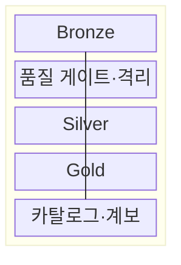
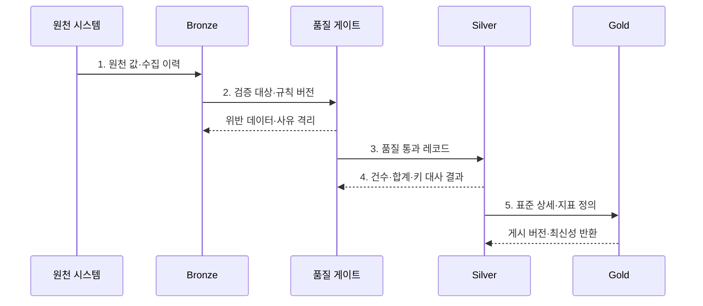

---
sidebar:
  order: 130
  label: "130. 메달리온 아키텍처 (Medallion Architecture)"
  badge:
    text: "미출 · 50%"
    variant: note
title: "메달리온 아키텍처 (Medallion Architecture)"
date: "2026-07-31T10:43:03+09:00"
tags:
  - "notes-software"
weight: 130
extra:
  question_no: "130"
  source_status: "미출"
  source_history: ""
  priority: 50
  priority_note: "브론즈·실버·골드 품질 계층 활용성 높음"
---

## 미리 알고가기

- **메달리온 아키텍처(Medallion Architecture)**: 데이터를 Bronze·Silver·Gold 계층으로 나눠 원천 보존부터 표준화·목적별 제공까지 품질을 높이는 설계이다.
- **브론즈 계층(Bronze Layer)**: 원천 데이터를 재처리할 수 있도록 수집 형태와 이력을 보존하는 계층이다.
- **실버 계층(Silver Layer)**: 형식·중복·키·품질 규칙을 적용해 표준화한 상세 데이터 계층이다.
- **골드 계층(Gold Layer)**: 특정 분석·응용 목적에 맞춘 집계·차원·서빙 데이터 계층이다.
- **품질 게이트(Quality Gate)**: 상위 계층으로 게시하기 전에 스키마·완전성·참조 규칙을 판정하는 검증 경계이다.
- **격리 영역(Quarantine)**: 품질 규칙을 통과하지 못한 레코드와 판정 사유를 보존한다.
- **재처리(Reprocessing)**: Bronze의 원천 이력에서 새 규칙으로 Silver·Gold를 다시 생성하는 작업이다.
- **표준화(Standardization)**: 원천마다 다른 코드·형식·단위·키를 공통 기준으로 변환하는 작업이다.
- **데이터 카탈로그(Data Catalog)**: 계층별 데이터의 위치·스키마·소유자·품질 정보를 검색 가능하게 관리하는 목록이다.
- **데이터 계보(Data Lineage)**: 원천이 어떤 변환을 거쳐 Silver와 Gold 결과가 되었는지 추적하는 정보이다.
- **데이터 대사(Data Reconciliation)**: 원천과 변환 결과의 건수·합계·키를 비교해 누락과 중복을 찾는 검증이다.
- **최신성(Data Freshness)**: 데이터가 원천의 최근 변경을 얼마나 빠르게 반영하는지를 나타내는 품질 속성이다.

> **키워드:** 메달리온 아키텍처 (Medallion Architecture)

## Ⅰ. 개요

- 정의/개념: 데이터를 Bronze·Silver·Gold로 승격하는 **품질 계층 구조**
- 배경/필요성: 단일 데이터 영역은 원천·검증 데이터 혼재로 **신뢰도·재처리 경계** 불명확

### 쉽게 이해하기 (학습용)

- 원석을 보관하고 불순물을 거른 뒤 용도별 제품으로 만드는 정제 구조이다.

## Ⅱ. 특징

- Bronze의 **원천 보존**으로 규칙 변경 시 재처리 기준 확보
- Silver의 **표준 상세 데이터**로 형식·코드·키 통일
- Gold의 **목적별 집계·지표**로 분석·서비스 제공

### 쉽게 이해하기 (학습용)

- 색깔별 폴더가 아니라 각 단계의 입학 기준과 탈락 사유, 다시 시작할 원본이 있어야 한다.

## Ⅲ. 구조 및 구성요소

| 구성요소 | 책임 |
|:---|:---|
| Bronze | 원천 값·출처·수집 이력의 **재처리 기준점** 보존 |
| 품질 게이트·격리 | **품질 규칙 판정·위반 사유** 보존 |
| Silver | 코드·형식·단위·키를 통일한 **표준 상세 데이터** 제공 |
| Gold | 소비 목적별 **차원·집계·지표** 제공 |
| 카탈로그·계보 | 계층별 **소유자·품질·변환 이력** 연결 |

### 쉽게 이해하기 (학습용)

- 원본 보관함부터 목적별 진열대까지 품질 단계를 나눈다.

## Ⅳ. 흐름도

**동작 원리**

1. **원천 값·수집 이력**: Bronze에 원본·출처·처리 기준점을 보존
2. **검증 대상·규칙 버전**: 스키마·완전성·참조 무결성 기준으로 품질 판정
3. **품질 통과 레코드**: 정상 데이터의 코드·형식·단위·키를 표준화
4. **건수·합계·키 대사 결과**: Bronze 원천과 Silver 결과의 누락·중복 검증
5. **표준 상세·지표 정의**: 승인된 Silver 상세로 Gold 집계와 최신 시점 공개

### 쉽게 이해하기 (학습용)

- 원본 보관함, 검사대, 표준 창고, 목적별 진열대를 거치며 품질 증거를 남긴다.

## Ⅴ. 종류 및 비교

| 데이터 계층 | Bronze | Silver | Gold |
|:---|:---|:---|:---|
| 적용 기준 | **원천 보존·재처리** | **표준화·품질 보장** | **분석·서비스 제공** |
| 핵심 특징 | 수집 형태의 **원천 이력** | **정제 상세·공통 키** | **집계·차원·업무 지표** |
| 한계 | **민감정보·장기 보존** 비용 | 품질 규칙 충돌·**오류 은폐** | 지표 중복·**정의 불일치** |

### 쉽게 이해하기 (학습용)

- 브론즈는 원본, 실버는 믿을 수 있는 공통 재료, 골드는 용도별 완제품이다.

## Ⅵ. 실무 고려사항 및 대책

| 고려사항 | 대책 | 효과 |
|:---|:---|:---|
| 계층별 입력·출력 기준이 다르면 **승격 의미** 불일치 | **계층 계약·소유 책임** 명시 | 데이터의 **품질 단계** 구분 |
| 처리 기준점이 없으면 규칙 변경 시 **전체 재생성** 발생 | **재처리 기준점·과거 구간 절차** 수립 | 변경 구간의 **재생성 범위** 축소 |
| 품질 실패 행을 버리면 **오류 원인·원천 값** 소실 | **격리 영역·위반 사유·재검증** 적용 | 오류 데이터의 **추적·복구** 가능 |
| 원천과 계층별 건수가 다르면 **누락·중복** 은폐 | **건수·합계·키·최신성 대사** 자동화 | 변환 오류의 **조기 발견** |
| Bronze에 민감정보가 남으면 **기밀성 침해** 위험 | **데이터 분류·암호화·최소 권한** 적용 | 원천 데이터의 **노출 범위** 제한 |

### 쉽게 이해하기 (학습용)

- 불량 로그는 버리지 않고 이유와 함께 따로 두며 검사 결과가 맞아야 최종 지표를 바꾼다.

## Ⅶ. 결론

- 원천 재처리는 **Bronze**, 공통 품질은 Silver, 서비스 지표는 **Gold**까지 승격

### 쉽게 이해하기 (학습용)

- 각 단계가 무엇을 통과시켰고 실패하면 어디서 다시 시작할지를 증명해야 한다.
