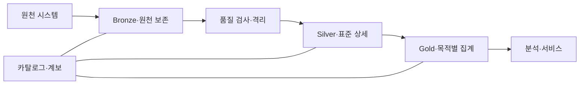
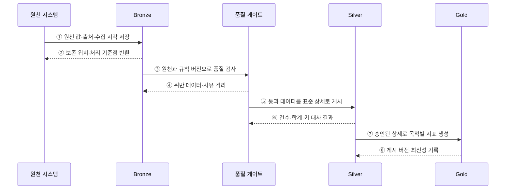

---
sidebar:
  order: 130
  label: "130. 메달리온 아키텍처 (Medallion Architecture)"
  badge:
    text: "미출제 · 50%"
    variant: note
title: "메달리온 아키텍처 (Medallion Architecture)"
date: "2026-07-25T11:30:00+09:00"
tags:
  - "notes-software"
weight: 130
extra:
  question_no: "130"
  source_status: "미출제"
  source_history: ""
  priority: 50
  priority_note: "브론즈·실버·골드 품질 계층 활용성 높음"
---

## 미리 알고가기

- **메달리온 아키텍처(Medallion Architecture)**: 데이터를 Bronze·Silver·Gold 계층으로 나눠 원천 보존부터 표준화·목적별 제공까지 품질을 높이는 설계임
- **브론즈 계층(Bronze Layer)**: 원천 데이터를 재처리할 수 있도록 수집 형태와 이력을 보존하는 계층임
- **실버 계층(Silver Layer)**: 형식·중복·키·품질 규칙을 적용해 표준화한 상세 데이터 계층임
- **골드 계층(Gold Layer)**: 특정 분석·응용 목적에 맞춘 집계·차원·서빙 데이터 계층임
- **품질 게이트(Quality Gate)**: 상위 계층으로 게시하기 전에 스키마·완전성·참조 규칙을 판정하는 검증 경계임
- **격리 영역(Quarantine)**: 품질 규칙을 통과하지 못한 레코드와 판정 사유를 보존함
- **재처리(Reprocessing)**: Bronze의 원천 이력에서 새 규칙으로 Silver·Gold를 다시 생성하는 작업임
- **표준화(Standardization)**: 원천마다 다른 코드·형식·단위·키를 공통 기준으로 변환하는 작업임
- **데이터 카탈로그(Data Catalog)**: 계층별 데이터의 위치·스키마·소유자·품질 정보를 검색 가능하게 관리하는 목록임
- **데이터 계보(Data Lineage)**: 원천이 어떤 변환을 거쳐 Silver와 Gold 결과가 되었는지 추적하는 정보임
- **데이터 대사(Data Reconciliation)**: 원천과 변환 결과의 건수·합계·키를 비교해 누락과 중복을 찾는 검증임
- **최신성(Data Freshness)**: 데이터가 원천의 최근 변경을 얼마나 빠르게 반영하는지를 나타내는 품질 속성임

## Ⅰ. 개요

- 메달리온 아키텍처는 데이터를 Bronze·Silver·Gold 계층으로 승격하며 원천 보존, 표준화, 목적별 제공의 품질 수준을 분리하는 설계 패턴이다.
- 오류가 최종 지표까지 퍼지는 것을 막고 규칙이 바뀌거나 실패했을 때 보존된 원천부터 재처리할 수 있게 한다.

### 쉽게 이해하기 (학습용)

- 원석을 보관하고 불순물을 거른 뒤 용도별 제품으로 만드는 정제 구조이다.

## Ⅱ. 특징

- **원천 재현성**: Bronze가 원천 값·수집 시각·출처·처리 위치를 보존해 재처리 기준을 제공한다.
- **표준 상세**: Silver가 형식·단위·코드·키를 통일하고 중복·오류를 처리한다.
- **목적별 제공**: Gold가 검증된 상세 데이터에서 업무별 차원·집계·지표를 만든다.
- **품질 게이트**: 계층마다 통과 기준과 실패 사유를 기록하고 위반 데이터를 격리한다.
- **계보와 재처리**: 원천·규칙 버전·산출물을 연결해 영향 분석과 선택적 재생성을 지원한다.

### 쉽게 이해하기 (학습용)

- 색깔별 폴더가 아니라 각 단계의 입학 기준과 탈락 사유, 다시 시작할 원본이 있어야 한다.

## Ⅲ. 아키텍처 및 구성요소

**도표안 A — 구조도**

**도표안 B — sequenceDiagram**

| 구성요소 | 설명 |
|:---|:---|
| Bronze | 원천 값·출처·수집 이력·처리 기준점 보존 |
| 품질 게이트·격리 | 스키마·완전성·참조 규칙 판정과 위반 사유 보존 |
| Silver | 코드·형식·단위·키를 통일한 검증 상세 제공 |
| Gold | 소비 목적별 차원·집계·지표 제공 |
| 카탈로그·계보 | 계층별 스키마·소유자·품질·변환 이력 연결 |

**동작 원리**

- ① 원천 시스템의 값을 출처·수집 시각과 함께 Bronze에 변경 없이 보존한다.
- ② Bronze가 저장 위치와 재시작할 처리 기준점을 원천 수집기에 반환한다.
- ③ Bronze 데이터에 명시한 규칙 버전을 적용해 스키마·완전성·참조 품질을 검사한다.
- ④ 품질 게이트가 위반 레코드와 규칙·판정 사유를 Bronze와 분리된 격리 영역에 보존한다.
- ⑤ 통과 레코드를 표준 코드·형식·키로 변환해 Silver에 게시한다.
- ⑥ Silver가 원천과의 건수·합계·키 대사 결과를 품질 게이트에 반환한다.
- ⑦ 승인된 Silver 상세에서 소비 목적별 차원·집계·지표를 생성해 Gold에 게시한다.
- ⑧ Gold 게시 버전과 데이터 최신성을 기록해 재현할 수 있게 한다.

### 쉽게 이해하기 (학습용)

- 원본 보관함, 검사대, 표준 창고, 목적별 진열대를 거치며 품질 증거를 남긴다.

## Ⅳ. 종류 및 비교

| 비교 항목 | Bronze | Silver | Gold |
|:---|:---|:---|:---|
| 목적 | 원천 보존·재처리 | 표준화·품질 보장·통합 | 분석·서비스별 제공 |
| 데이터 형태 | 수집 형태에 가까운 이력 | 정제된 상세·공통 키 | 집계·차원·특징·서빙 모델 |
| 허용 품질 | 원천 오류도 보존 | 명시한 표준·품질 규칙 통과 | 업무 정의·최신성·서비스 수준 충족 |
| 재생성 기준 | 원천·수집 기준점 | Bronze와 규칙 버전 | Silver와 지표 정의 버전 |
| 주요 위험 | 민감정보·보존비·중복 | 규칙 충돌·오류 은폐 | 지표 중복·정의 불일치 |

> 모든 조직이 세 계층을 물리적으로 따로 저장해야 하는 것은 아니며, 핵심은 품질 계약과 재처리 경계를 명확히 하는 것이다.

### 쉽게 이해하기 (학습용)

- 브론즈는 원본, 실버는 믿을 수 있는 공통 재료, 골드는 용도별 완제품이다.

## Ⅴ. 실무 고려사항 및 대책

| 고려사항 | 위험 | 대책 |
|:---|:---|:---|
| 계층 계약 | 이름만 다르고 품질 차이가 없음 | 입력·출력·승격·소유 책임 명시 |
| 재처리 | 전량 재생성으로 시간·비용 급증 | 기준점·멱등성·영향 범위·백필 절차 |
| 품질 실패 | 오류 삭제 또는 파이프라인 전체 중단 | 격리·사유·재검증·허용 임계치 |
| 대사 | 계층 사이 누락·중복이 조용히 누적 | 건수·합계·키·최신성 자동 비교 |
| 지표 정의 | Gold마다 같은 지표가 다름 | 의미 계층·정의 소유자·버전 관리 |
| 보안 | Bronze 원천 민감정보 노출 | 분류·암호화·최소 권한·보존·삭제 |

> **적용 사례**: 로그 원본은 Bronze에 보존하고 형식 오류는 사유와 함께 격리하며, Silver 통과율·중복률·대사 결과를 승인한 뒤 Gold 서비스 지표를 갱신한다.

### 쉽게 이해하기 (학습용)

- 불량 로그는 버리지 않고 이유와 함께 따로 두며 검사 결과가 맞아야 최종 지표를 바꾼다.

## Ⅵ. 결론

- 메달리온 아키텍처의 핵심은 색상이나 폴더 수가 아니라 계층별 품질 계약, 승격 증거, 격리 사유, 원천부터의 재생성 경로이다.
- 대사·계보·규칙 버전·최신성·소유권을 함께 운영해야 단계적 품질 향상이 실제 데이터 신뢰로 이어진다.

### 쉽게 이해하기 (학습용)

- 각 단계가 무엇을 통과시켰고 실패하면 어디서 다시 시작할지를 증명해야 한다.
