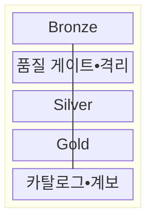
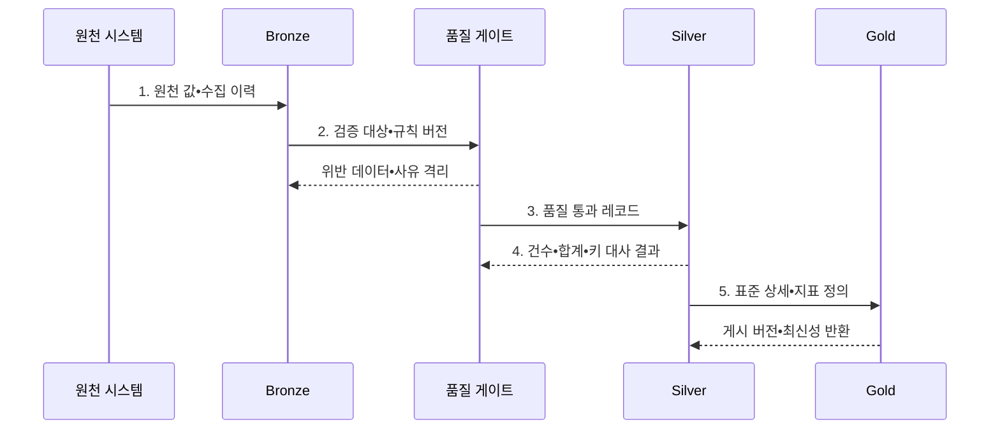

---
sidebar:
  order: 130
  label: "130. 메달리온 아키텍처 (Medallion Architecture)"
  badge:
    text: "미출 • 50%"
    variant: note
title: "메달리온 아키텍처 (Medallion Architecture)"
date: "2026-08-04T13:30:00+09:00"
tags:
  - "notes-software"
weight: 130
extra:
  question_no: "130"
  source_status: "미출"
  source_history: ""
  priority: 50
  priority_note: "브론즈•실버•골드 품질 계층 활용성 높음"
---

## Ⅰ. 개요

핵심 용어

- **메달리온 아키텍처(Medallion Architecture)**: 데이터를 Bronze•Silver•Gold로 승격하며 원천 보존부터 목적별 제공까지 품질을 높이는 계층 구조이다.

- 정의/개념: 데이터를 Bronze•Silver•Gold로 승격하는 **품질 계층 구조**
- 배경/필요성: 단일 데이터 영역은 원천•검증 데이터 혼재로 **신뢰도•재처리 경계** 불명확

#### 한줄 요약

- 원석을 보관하고 불순물을 거른 뒤 용도별 제품으로 만드는 정제 구조이다.

## Ⅱ. 특징

핵심 용어

- **표준 상세 데이터**: Silver에서 원천별 코드•형식•단위•키를 공통 기준으로 통일한 데이터이다.
- **원천 보존**: Bronze에서 원본 값과 출처 및 수집 이력을 재처리 기준으로 유지하는 원칙이다.
- **목적별 집계•지표**: Gold에서 승인된 Silver 상세를 분석•서비스 용도에 맞게 가공한 결과이다.

- Bronze의 **원천 보존** 으로 규칙 변경 시 재처리 기준 확보
- Silver의 **표준 상세 데이터** 로 형식•코드•키 통일
- Gold의 **목적별 집계•지표** 로 분석•서비스 제공

#### 한줄 요약

- 색깔별 폴더가 아니라 각 단계의 입학 기준과 탈락 사유, 다시 시작할 원본이 있어야 한다.

## Ⅲ. 구조 및 구성요소

핵심 용어

- **품질 게이트**: 상위 계층 게시 전에 품질 규칙을 판정하는 구성요소이다.
- **격리 영역**: 위반 데이터와 실패 사유를 보존하는 구성요소이다.
- **Bronze**: 원천 값•출처•수집 이력을 원형에 가깝게 보존하는 계층이다.
- **Silver**: 코드•형식•단위•키를 통일한 표준 상세 데이터를 제공하는 계층이다.
- **Gold**: 소비 목적별 차원•집계•업무 지표를 제공하는 계층이다.
- **카탈로그**: 계층별 데이터의 위치•스키마•소유자를 등록하는 구성요소이다.
- **계보**: 계층 사이의 변환과 품질 이력을 연결하는 정보이다.

| 구성요소 | 책임 |
|:---|:---|
| Bronze | 원천 값•출처•수집 이력의 **재처리 기준점** 보존 |
| 품질 게이트•격리 | **품질 규칙 판정•위반 사유** 보존 |
| Silver | 코드•형식•단위•키를 통일한 **표준 상세 데이터** 제공 |
| Gold | 소비 목적별 **차원•집계•지표** 제공 |
| 카탈로그•계보 | 계층별 **소유자•품질•변환 이력** 연결 |

#### 한줄 요약

- 원본 보관함부터 목적별 진열대까지 품질 단계를 나눈다.

## Ⅳ. 흐름도

핵심 용어

- **4. 건수•합계•키 대사 결과**: Bronze 원천과 Silver 변환 결과의 누락과 중복을 검증하는 정보이다.
- **1. 원천 값•수집 이력**: Bronze에 보존하는 원본•출처•처리 기준점이다.
- **2. 검증 대상•규칙 버전**: 품질 판정할 데이터 범위와 적용한 스키마•완전성•무결성 규칙 버전이다.
- **3. 품질 통과 레코드**: 품질 검사를 통과하고 코드•형식•단위•키를 표준화한 데이터이다.
- **5. 표준 상세•지표 정의**: Gold 집계를 만들 승인된 Silver 데이터와 업무 계산식이다.

**동작 원리**

1. **원천 값•수집 이력**: Bronze에 원본•출처•처리 기준점을 보존
2. **검증 대상•규칙 버전**: 스키마•완전성•참조 무결성 기준으로 품질 판정
3. **품질 통과 레코드**: 정상 데이터의 코드•형식•단위•키를 표준화
4. **건수•합계•키 대사 결과**: Bronze 원천과 Silver 결과의 누락•중복 검증
5. **표준 상세•지표 정의**: 승인된 Silver 상세로 Gold 집계와 최신 시점 공개

#### 한줄 요약

- 원본 보관함, 검사대, 표준 창고, 목적별 진열대를 거치며 품질 증거를 남긴다.

## Ⅴ. 종류 및 비교

핵심 용어

- **계층 완료 기준**: 다음 품질 계층으로 승격할 수 있는 검증 조건이다.

| 데이터 계층 | 보존하는 상태 | 계층 완료 기준 |
|:---|:---|:---|
| **Bronze** | 수집 형태의 **원천•처리 이력** | 출처•스키마•재처리 기준점 기록 |
| **Silver** | 정제한 상세와 **공통 키** | 품질 규칙 통과•원천 대사 완료 |
| **Gold** | 승인된 **집계•차원•업무 지표** | 소비 목적•지표 정의•최신성 확정 |

#### 한줄 요약

- 브론즈는 원본, 실버는 믿을 수 있는 공통 재료, 골드는 용도별 완제품이다.

## Ⅵ. 실무 고려사항 및 대책

핵심 용어

- **오류 원인**: 품질 규칙을 통과하지 못한 이유이다.
- **원천 값**: 검증 전 입력 데이터의 원래 값이다.
- **계층 계약**: 각 계층의 입력•출력 품질과 승격 조건이다.
- **소유 책임**: 계층의 품질과 승격을 승인할 책임이다.
- **재처리 기준점**: 규칙 변경 시 다시 시작할 원천 위치이다.
- **과거 구간 절차**: 영향을 받은 기간만 재생성하는 방식이다.
- **위반 사유**: 격리된 데이터가 실패한 규칙과 원인이다.
- **재검증**: 규칙 수정 뒤 격리 데이터를 다시 검사하는 통제이다.
- **건수 대사**: 계층 전환 전후의 레코드 수를 비교하는 검증이다.
- **합계 대사**: 계층 전환 전후의 측정값 합계를 비교하는 검증이다.
- **키 대사**: 원천과 결과의 식별자 집합을 비교하는 검증이다.
- **최신성 대사**: 계층별 최대 처리 시점을 비교하는 검증이다.
- **데이터 분류**: Bronze 민감정보의 보호 등급을 정하는 통제이다.
- **암호화**: 민감정보의 저장•전송 내용을 보호하는 통제이다.
- **최소 권한**: 필요한 주체에게만 접근을 허용하는 통제이다.

| 문제 | 대책 | 효과 |
|:---|:---|:---|
| 계층별 입력•출력 기준이 다르면 **승격 의미** 불일치 | **계층 계약•소유 책임** 명시 | 데이터의 **품질 단계** 구분 |
| 처리 기준점이 없으면 규칙 변경 시 **전체 재생성** 발생 | **재처리 기준점•과거 구간 절차** 수립 | 변경 구간의 **재생성 범위** 축소 |
| 품질 실패 행을 버리면 **오류 원인•원천 값** 소실 | **격리 영역•위반 사유•재검증** 적용 | 오류 데이터의 **추적•복구** 가능 |
| 원천과 계층별 건수가 다르면 **누락•중복** 은폐 | **건수•합계•키•최신성 대사** 자동화 | 변환 오류의 **조기 발견** |
| Bronze에 민감정보가 남으면 **기밀성 침해** 위험 | **데이터 분류•암호화•최소 권한** 적용 | 원천 데이터의 **노출 범위** 제한 |

#### 한줄 요약

- 불량 로그는 버리지 않고 이유와 함께 따로 두며 검사 결과가 맞아야 최종 지표를 바꾼다.

## Ⅶ. 결론

핵심 용어

- **승격 책임**: 원천 보존•공통 품질•서비스 지표를 계층별로 배치하는 원칙이다.

- 원천 재처리는 **Bronze** 담당, 공통 품질은 **Silver** 담당, 서비스 지표는 최종 **Gold** 계층까지 승격

#### 한줄 요약

- 각 단계가 무엇을 통과시켰고 실패하면 어디서 다시 시작할지를 증명해야 한다.
