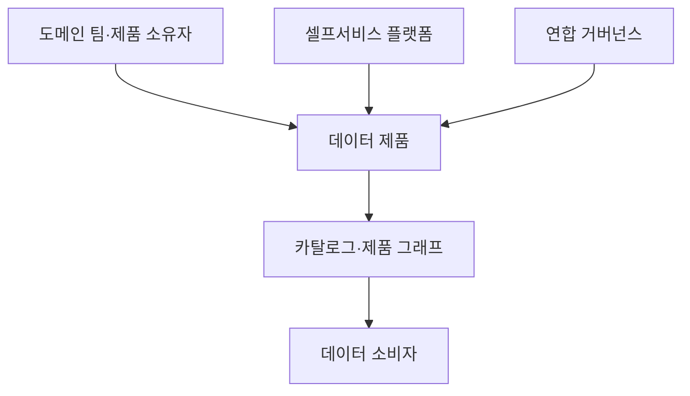
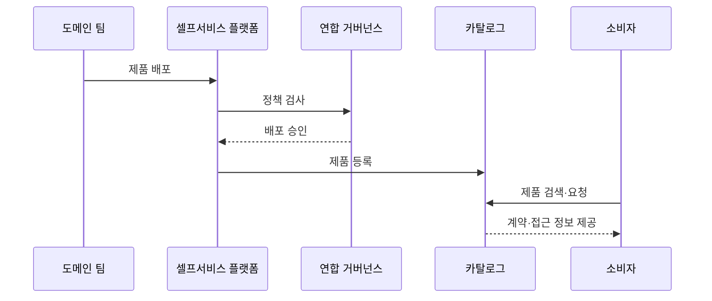

---
sidebar:
  order: 131
  label: "131. 데이터 메시 (Data Mesh)"
  badge:
    text: "기출 · 70%"
    variant: note
title: "데이터 메시 (Data Mesh)"
date: "2026-07-27T23:59:59+09:00"
tags:
  - "notes-software"
weight: 131
extra:
  question_no: "131"
  source_status: "기출"
  source_history: "123회, 135회"
  priority: 70
  priority_note: "123·135회 반복, 도메인 데이터 책임 핵심"
---

## 미리 알고가기

- **데이터 메시(Data Mesh)**: 데이터 소유권을 업무 도메인에 분산하고 제품·셀프서비스 플랫폼·연합 거버넌스로 연결하는 운영 아키텍처임
- **도메인 소유권(Domain Ownership)**: 데이터 생성 맥락을 아는 업무 팀이 분석 데이터의 품질과 수명주기를 책임지는 원칙임
- **데이터 제품(Data Product)**: 명확한 소유자·사용 목적·접근 인터페이스·품질 지표를 갖춘 독립 제공 단위임
- **셀프서비스 데이터 플랫폼(Self-service Data Platform)**: 도메인 팀에 저장·처리·배포·관찰 기능을 표준 인터페이스로 제공하는 플랫폼임
- **연합 거버넌스(Federated Computational Governance)**: 전사 공통 정책과 도메인 실행 책임을 분리하고 자동 검증으로 연결하는 체계임
- **상호운용성(Interoperability)**: 여러 데이터 제품이 공통 식별자·스키마·정책으로 조합될 수 있는 성질임
- **데이터 계약(Data Contract)**: 생산자와 소비자가 스키마·의미·품질·변경 호환성에 합의한 규약임
- **서비스 수준 목표(Service Level Objective, SLO)**: 영문 첫 글자를 딴 SLO를 '에스엘오'로 읽으며 데이터 제품의 최신성·완전성·가용성 목표를 뜻함
- **데이터 카탈로그(Data Catalog)**: 데이터 제품의 위치·소유자·계약·품질·계보를 검색 가능하게 관리하는 목록임
- **데이터 계보(Data Lineage)**: 데이터 제품이 어느 원천과 변환을 거쳐 만들어졌는지 추적하는 정보임
- **데이터 섬(Data Silo)**: 팀이나 시스템 안에 고립되어 다른 조직이 찾거나 조합하기 어려운 데이터 집합임
- **공통 식별자(Common Identifier, ID)**: ID를 '아이디'로 읽고 영문 첫 글자로 식별자를 줄여 쓰며 여러 도메인의 같은 서비스·고객을 연결하는 키임

## Ⅰ. 개요

- 정의/개념: 데이터 소유·품질·제공 책임을 **업무 도메인에 분산**하는 운영 구조
- 기존 한계: 중앙 데이터 팀은 **요청 병목·도메인 맥락 손실·품질 대응 지연** 발생

### 쉽게 이해하기 (학습용)
- 중앙이 자료를 만들지 않고 업무 팀이 제품으로 제공함

## Ⅱ. 특징

- 도메인 책임은 맥락 손실과 품질 대응 지연을 줄인다
- 셀프서비스 플랫폼은 반복 기술 비용을 줄인다
- 연합 거버넌스는 자율성의 표준 불일치를 막는다
- 계약·카탈로그·공통 ID는 데이터 섬을 막는다

### 쉽게 이해하기 (학습용)
- 소유권만 분산하고 플랫폼·계약·공통 식별자를 제공하지 않으면 중앙 병목 대신 도메인별 데이터 섬이 늘어남

## Ⅲ. 아키텍처 및 구성요소

| 구성요소 | 설명 |
|:---|:---|
| 도메인 팀·제품 소유자 | 제품 품질·호환성·수명주기 책임 |
| 데이터 제품 | 데이터·인터페이스·목표를 한 단위로 제공 |
| 셀프서비스 플랫폼 | 저장·처리·배포·관찰 도구 제공 |
| 연합 거버넌스 | 공통 정책과 도메인 실행 책임 분리 |
| 카탈로그·제품 그래프 | 제품 검색·계보·의존성 연결 |

> 요약: 제품은 플랫폼에서 운영되고 거버넌스가 정책을 적용함

### 쉽게 이해하기 (학습용)
- 제품 팀과 품질 책임자 및 공장과 전사 규칙 위원회임

## Ⅳ. 원리 및 절차 흐름도

| 절차 | 설명 |
|:---|:---|
| 제품 배포 | 도메인이 계약과 SLO를 포함해 배포함 |
| 정책 검사 | 보안·식별자·호환성을 자동 검사함 |
| 배포 승인 | 통과한 제품의 게시를 허용함 |
| 제품 등록 | 계약과 계보를 카탈로그에 게시함 |
| 제품 검색·요청 | 소비자가 목적에 맞는 제품을 찾음 |
| 계약·접근 정보 제공 | 사용 규약과 접근 방법을 전달함 |

> 요약: 도메인 제품을 계약·접근 정보로 제공

### 쉽게 이해하기 (학습용)
- 업무 팀부터 자료 상품을 만들고 검사 규칙을 적용함

## Ⅴ. 종류 및 비교

| 데이터 운영 구조 | 데이터 메시 | 중앙 데이터 플랫폼 |
|:---|:---|:---|
| 적용 기준 | 도메인 규모와 중앙 요청 병목이 큼 | 소규모 중앙 팀이 공통 지표를 관리할 수 있음 |
| 핵심 특징 | 도메인 팀의 **데이터 제품 제공** | 중앙 팀의 **공용 데이터 제공** |
| 한계 | 소유권 공백·**표준 불일치·제품 중복** | 중앙 병목·**도메인 맥락 손실** |

> 요약: 도메인에 소유권을 두고 플랫폼으로 제품 간 호환을 유지함

### 쉽게 이해하기 (학습용)
- 중앙 플랫폼은 한 팀이 제공하고 데이터 메시는 도메인별로 제공함

## Ⅵ. 실무 사례

1. 주문 도메인은 **계약·최신성 목표**를 제품에 공개

### 쉽게 이해하기 (학습용)
- 주문 도메인은 계약 위반률과 최신성을 공개해 소비자가 제품의 신뢰성과 사용 가능 시점을 판단하게 함

## Ⅶ. 결론

- **도메인 소유·셀프서비스·연합 정책 역량** 확보 후 도입

### 쉽게 이해하기 (학습용)
- 데이터 메시는 조직 이름을 바꾸는 방식이 아니라 소비 가능한 제품·측정 가능한 SLO·자동 정책·셀프서비스 플랫폼이 실제로 작동해야 성립함
