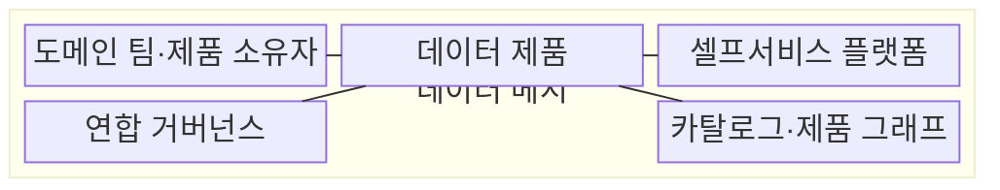
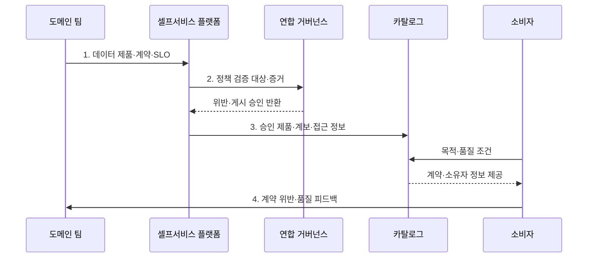

---
sidebar:
  order: 131
  label: "131. 데이터 메시 (Data Mesh)"
  badge:
    text: "기출 · 70%"
    variant: note
title: "데이터 메시 (Data Mesh)"
date: "2026-07-30T23:50:13+09:00"
tags:
  - "notes-software"
weight: 131
extra:
  question_no: "131"
  source_status: "기출"
  source_history: "123회, 135회"
  priority: 70
  priority_note: "123·135회 반복, 도메인 데이터 책임 핵심"
---

## 미리 알고가기

- **데이터 메시(Data Mesh)**: 데이터 소유권을 업무 도메인에 분산하고 제품·셀프서비스 플랫폼·연합 거버넌스로 연결하는 운영 아키텍처이다.
- **도메인 소유권(Domain Ownership)**: 데이터 생성 맥락을 아는 업무 팀이 분석 데이터의 품질과 수명주기를 책임지는 원칙이다.
- **데이터 제품(Data Product)**: 명확한 소유자·사용 목적·접근 인터페이스·품질 지표를 갖춘 독립 제공 단위이다.
- **셀프서비스 데이터 플랫폼(Self-service Data Platform)**: 도메인 팀에 저장·처리·배포·관찰 기능을 표준 인터페이스로 제공하는 플랫폼이다.
- **연합 거버넌스(Federated Computational Governance)**: 전사 공통 정책과 도메인 실행 책임을 분리하고 자동 검증으로 연결하는 체계이다.
- **상호운용성(Interoperability)**: 여러 데이터 제품이 공통 식별자·스키마·정책으로 조합될 수 있는 성질이다.
- **데이터 계약(Data Contract)**: 생산자와 소비자가 스키마·의미·품질·변경 호환성에 합의한 규약이다.
- **서비스 수준 목표(Service Level Objective, SLO)**: 데이터 제품이 달성해야 할 최신성·완전성·가용성의 측정 목표이다.
- **데이터 카탈로그(Data Catalog)**: 데이터 제품의 위치·소유자·계약·품질·계보를 검색 가능하게 관리하는 목록이다.
- **데이터 계보(Data Lineage)**: 데이터 제품이 어느 원천과 변환을 거쳐 만들어졌는지 추적하는 정보이다.
- **데이터 섬(Data Silo)**: 팀이나 시스템 안에 고립되어 다른 조직이 찾거나 조합하기 어려운 데이터 집합이다.
- **공통 식별자(Common Identifier, ID)**: 여러 도메인에서 같은 고객·상품·서비스를 연결하는 공유 키이다.

> **키워드:** 데이터 메시 (Data Mesh)

## Ⅰ. 개요

- 정의/개념: 데이터 책임을 업무 도메인에 분산하는 **제품 중심 아키텍처**
- 배경/필요성: 중앙 데이터팀 집중으로 **업무 맥락 전달 지연·품질 책임 공백** 발생

### 쉽게 이해하기 (학습용)

- 자료를 가장 잘 아는 업무 팀이 품질 보증이 붙은 데이터 상품으로 제공한다.

## Ⅱ. 특징

- 업무 팀이 데이터 수명주기를 책임지는 **도메인 소유권**
- 계약·SLO·문서를 한 제공 단위로 묶는 **데이터 제품**
- 셀프서비스 플랫폼과 **연합 거버넌스**를 결합한 공통 기반

### 쉽게 이해하기 (학습용)

- 책임만 팀별로 나누고 공용 공장과 제품 규격을 주지 않으면 중앙 병목이 여러 데이터 섬으로 바뀐다.

## Ⅲ. 구조 및 구성요소

| 구성요소 | 책임 |
|:---|:---|
| 도메인 팀·제품 소유자 | 제품의 **의미·품질·호환성·지원** 책임 |
| 데이터 제품 | **데이터·인터페이스·계약·SLO** 제공 |
| 셀프서비스 플랫폼 | 표준 **저장·처리·배포·관찰 도구** 제공 |
| 연합 거버넌스 | 공통 정책 합의와 **자동 검사** 연결 |
| 카탈로그·제품 그래프 | **검색·계보·소유자·접근 정보** 연결 |

### 쉽게 이해하기 (학습용)

- 업무 팀이 공용 설비와 규칙으로 데이터 상품을 만든다.

## Ⅳ. 흐름도

**동작 원리**

1. **데이터 제품·계약·SLO**: 도메인이 데이터 의미·품질·지원 책임을 제품 단위로 명시
2. **정책 검증 대상·증거**: 공통 보안·호환성·상호운용 규칙의 준수 여부 판정
3. **승인 제품·계보·접근 정보**: 계약·소유자·접근 절차를 카탈로그에 게시
4. **계약 위반·품질 피드백**: 소비 중 발견한 문제를 책임 도메인에 전달

### 쉽게 이해하기 (학습용)

- 업무 팀이 제품을 만들고 공용 공장이 규격을 검사하며 소비자는 카탈로그에서 품질표를 보고 고른다.

## Ⅴ. 종류 및 비교

| 데이터 운영 모델 | 데이터 메시 | 중앙 데이터 플랫폼 |
|:---|:---|:---|
| 적용 기준 | **다수 도메인·중앙 병목** | 소규모·공통 요구 중심 |
| 핵심 특징 | **도메인 제품 책임·연합 정책** | 중앙 적재·모델·제공 |
| 한계 | **책임 공백·표준 불일치·제품 중복** | **중앙 병목·업무 맥락 손실** |

### 쉽게 이해하기 (학습용)

- 중앙형은 한 주방이 모두 만들고 메시형은 공용 설비를 쓰는 분야별 주방이 각 메뉴를 책임진다.

## Ⅵ. 실무 고려사항 및 대책

| 고려사항 | 대책 | 효과 |
|:---|:---|:---|
| 제품 소유자가 없으면 **품질·지원 책임** 공백 | **제품 소유자·지원 범위·수명주기** 명시 | 데이터 제품의 **책임 경계** 확정 |
| 계약·SLO가 없으면 소비자가 **품질 수준** 판단 불가 | **데이터 계약·SLO·관찰성** 적용 | 소비자의 **품질 검증** 가능 |
| 도메인마다 기반을 만들면 **플랫폼 중복 개발** 증가 | **표준 경로·템플릿·자동 배포** 제공 | 도메인의 **제품 개발 비용** 감소 |
| 모든 정책을 중앙 승인하면 **거버넌스 병목** 재발 | **정책 코드·자동 검사·예외 만료** 적용 | 도메인 자율성과 **공통 정책** 양립 |
| 공통 ID·의미가 다르면 **제품 조합** 실패 | **공통 식별자·의미·호환성 규칙** 적용 | 데이터 제품의 **상호운용성** 확보 |

### 쉽게 이해하기 (학습용)

- 주문 팀이 상품 설명서와 품질 목표를 공개하고 문제가 생기면 직접 알리고 고친다.

## Ⅶ. 결론

- 도메인 수와 중앙 병목이 커지면 **제품 소유권·셀프서비스 플랫폼**을 갖춘 데이터 메시 전환

### 쉽게 이해하기 (학습용)

- 팀 이름만 바꾸는 것이 아니라 책임 있는 상품 팀, 공용 공장, 자동 규칙이 함께 작동해야 한다.
