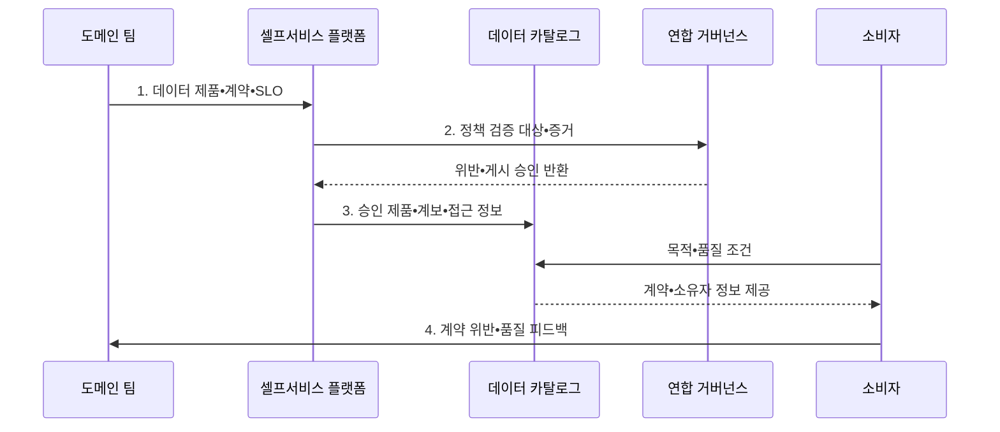

---
sidebar:
  order: 131
  label: "131. 데이터 메시 (Data Mesh)"
  badge:
    text: "기출 • 70%"
    variant: note
title: "데이터 메시 (Data Mesh)"
date: "2026-08-05T05:30:00+09:00"
tags:
  - "notes-software"
weight: 131
extra:
  question_no: "131"
  source_status: "기출"
  source_history: "123회, 135회"
  priority: 70
  priority_note: "123•135회 반복, 도메인 데이터 책임 핵심"
---

## Ⅰ. 개요

<details>
<summary>핵심 용어</summary>

- **데이터 메시(Data Mesh)**: 데이터 소유•품질•운영 책임을 업무 도메인 팀에 분산하고 데이터를 재사용 가능한 제품으로 제공하는 분산 아키텍처이다.

</details>

- 정의/개념: 도메인 책임으로 데이터를 제품화하는 **데이터 메시**
- 배경/필요성: 중앙 데이터팀 집중으로 **업무 맥락 전달 지연•품질 책임 공백** 발생

#### 한줄 요약

- 자료를 가장 잘 아는 업무 팀이 품질 보증이 붙은 데이터 상품으로 제공한다.

## Ⅱ. 특징

<details>
<summary>핵심 용어</summary>

- **도메인 소유권**: 데이터 생성 맥락을 아는 업무 팀이 품질과 수명주기를 책임지는 원칙이다.
- **데이터 제품**: 데이터•인터페이스•계약•서비스 수준 목표(Service Level Objective, SLO)•문서를 하나의 재사용 제공 단위로 묶은 제품이다.
- **연합 거버넌스(Federated Governance)**: 도메인 대표와 중앙 기준 조직이 공통 정책을 합의하고 자동 검사로 집행하는 방식이다.

</details>

- 업무 팀이 데이터 수명주기를 책임지는 **도메인 소유권**
- 계약•SLO•문서를 한 제공 단위로 묶는 **데이터 제품**
- 셀프서비스 플랫폼과 **연합 거버넌스** 를 결합한 공통 기반

#### 한줄 요약

- 책임만 팀별로 나누고 공용 공장과 제품 규격을 주지 않으면 중앙 병목이 여러 데이터 섬으로 바뀐다.

## Ⅲ. 구조 및 구성요소

<details>
<summary>핵심 용어</summary>

- **셀프서비스 플랫폼**: 도메인 팀에 저장•처리•배포•관찰 기능을 표준 방식으로 제공하는 구성요소이다.
- **도메인 팀**: 데이터가 생성되는 업무 맥락과 품질을 책임지는 조직이다.
- **제품 소유자**: 데이터 제품의 호환성•지원•수명주기를 책임지는 주체이다.
- **연합 거버넌스**: 공통 정책을 합의하고 게시 전에 자동 검사하는 구성요소이다.
- **카탈로그**: 제품의 검색•계보•소유자•접근 정보를 제공하는 구성요소이다.
- **제품 그래프**: 데이터 제품 사이의 의존성을 연결하는 구성요소이다.

</details>

```text
                  [도메인 팀•제품 소유자]
                              |
[연합 거버넌스] -- [데이터 제품] -- [셀프서비스 플랫폼]
                              |
                    [카탈로그•제품 그래프]
```

선의 의미: 도메인 팀•제품 소유자는 데이터 제품을 책임지고, 셀프서비스 플랫폼은 제품 구현 기반을 제공하며, 연합 거버넌스와 카탈로그•제품 그래프는 정책과 검색·의존 관계를 지원한다.

| 구성요소 | 책임 |
|:---|:---|
| 도메인 팀•제품 소유자 | 제품의 **의미•품질•호환성•지원** 책임 |
| 데이터 제품 | **데이터•인터페이스•계약•SLO** 제공 |
| 셀프서비스 플랫폼 | 표준 **저장•처리•배포•관찰 도구** 제공 |
| 연합 거버넌스 | 공통 정책 합의와 **자동 검사** 연결 |
| 카탈로그•제품 그래프 | **검색•계보•소유자•접근 정보** 연결 |

#### 한줄 요약

- 업무 팀이 공용 설비와 규칙으로 데이터 상품을 만든다.

## Ⅳ. 흐름도

<details>
<summary>핵심 용어</summary>

- **2. 정책 검증 대상•증거**: 공통 보안•호환성•상호운용 규칙의 준수 여부를 자동 판정하기 위한 입력이다.
- **1. 데이터 제품•계약•SLO**: 도메인이 데이터 의미와 품질 및 지원 책임을 명시한 게시 입력이다.
- **3. 승인 제품•계보•접근 정보**: 정책 검사를 통과해 카탈로그에 공개한 계약•소유자•접근 절차이다.
- **4. 계약 위반•품질 피드백**: 소비 중 발견한 문제를 책임 도메인에 전달하는 정보이다.

</details>



**동작 원리**

1. **데이터 제품•계약•SLO**: 도메인이 데이터 의미•품질•지원 책임을 제품 단위로 명시
2. **정책 검증 대상•증거**: 공통 보안•호환성•상호운용 규칙의 준수 여부 판정
3. **승인 제품•계보•접근 정보**: 계약•소유자•접근 절차를 카탈로그에 게시
4. **계약 위반•품질 피드백**: 소비 중 발견한 문제를 책임 도메인에 전달

#### 한줄 요약

- 업무 팀이 제품을 만들고 공용 공장이 규격을 검사하며 소비자는 카탈로그에서 품질표를 보고 고른다.

## Ⅴ. 종류 및 비교

<details>
<summary>핵심 용어</summary>

- **중앙 데이터 플랫폼**: 중앙 팀이 데이터 적재•모델•제공을 통합 수행하는 운영 모델이다.

</details>

| 데이터 운영 모델 | 데이터 메시 | 중앙 데이터 플랫폼 |
|:---|:---|:---|
| 적용 기준 | **다수 도메인•중앙 병목** | 소규모•공통 요구 중심 |
| 핵심 특징 | **도메인 제품 책임•연합 정책** | 중앙 적재•모델•제공 |
| 한계 | **책임 공백•표준 불일치•제품 중복** | **중앙 병목•업무 맥락 손실** |

#### 한줄 요약

- 중앙형은 한 주방이 모두 만들고 메시형은 공용 설비를 쓰는 분야별 주방이 각 메뉴를 책임진다.

## Ⅵ. 실무 고려사항 및 대책

<details>
<summary>핵심 용어</summary>

- **플랫폼 중복 개발**: 도메인마다 자체 기반을 만들어 같은 저장•처리•배포 기능을 반복 구현하는 문제이다.
- **지원 범위**: 데이터 제품 소비자에게 제공할 지원 수준이다.
- **수명주기**: 데이터 제품의 생성부터 폐기까지의 관리 단계이다.
- **데이터 계약**: 생산자와 소비자가 합의한 스키마•품질 약속이다.
- **관찰성**: SLO의 실제 준수 상태를 지표로 확인하는 능력이다.
- **표준 경로•템플릿•자동 배포**: 도메인이 공통 저장•처리•배포 기능을 직접 재구현하지 않게 하는 플랫폼 기능이다.
- **정책 코드•자동 검사•예외 만료**: 공통 정책을 실행 규칙으로 판정하고 일시 예외를 정해진 시점에 회수하는 통제이다.
- **공통 식별자(Common Identifier, Common ID)**: 여러 데이터 제품을 연결하는 공유 키이다.
- **의미 규칙**: 제품 사이에서 업무 용어의 뜻을 맞추는 규칙이다.
- **호환성 규칙**: 데이터 계약의 진화 범위를 정하는 규칙이다.

</details>

| 문제 | 대책 | 효과 |
|:---|:---|:---|
| 제품 소유자가 없으면 **품질•지원 책임** 공백 | **제품 소유자•지원 범위•수명주기** 명시 | 데이터 제품의 **책임 경계** 확정 |
| 계약•서비스 수준 목표가 없으면 소비자가 **품질 수준** 판단 불가 | **데이터 계약•SLO•관찰성** 적용 | 소비자의 **품질 검증** 가능 |
| 도메인마다 기반을 만들면 **플랫폼 중복 개발** 증가 | **표준 경로•템플릿•자동 배포** 제공 | 도메인의 **제품 개발 비용** 감소 |
| 모든 정책을 중앙 승인하면 **거버넌스 병목** 재발 | **정책 코드•자동 검사•예외 만료** 적용 | 도메인 자율성과 **공통 정책** 양립 |
| 공통 식별자•의미가 다르면 **제품 조합** 실패 | **Common ID•의미•호환성 규칙** 적용 | 데이터 제품의 **상호운용성** 확보 |

#### 한줄 요약

- 주문 팀이 상품 설명서와 품질 목표를 공개하고 문제가 생기면 직접 알리고 고친다.

## Ⅶ. 결론

<details>
<summary>핵심 용어</summary>

- **제품 소유권•셀프서비스 플랫폼**: 도메인 책임과 공통 기술 기반을 함께 갖춰 데이터 메시를 작동시키는 두 요소이다.

</details>

- 도메인 수와 중앙 병목이 커지면 **제품 소유권•셀프서비스 플랫폼** 을 갖춘 데이터 메시 전환

#### 한줄 요약

- 팀 이름만 바꾸는 것이 아니라 책임 있는 상품 팀, 공용 공장, 자동 규칙이 함께 작동해야 한다.
