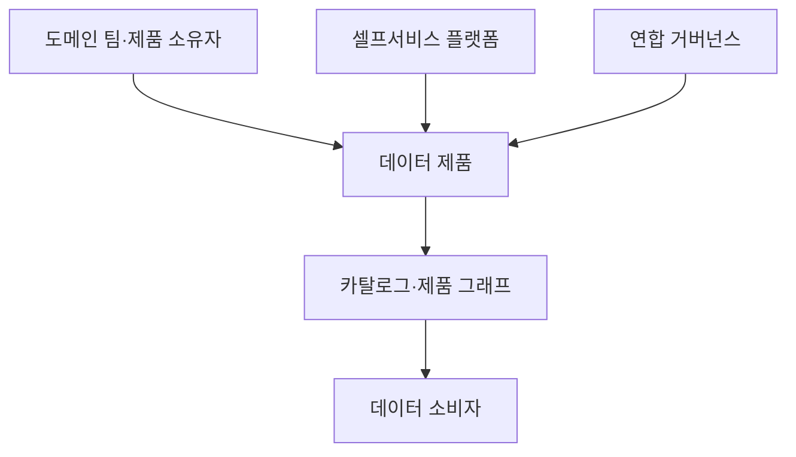
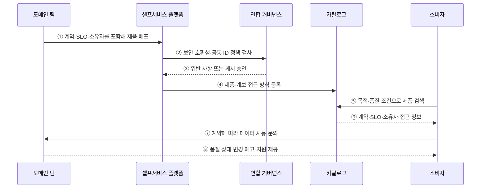

---
sidebar:
  order: 131
  label: "131. 데이터 메시 (Data Mesh)"
  badge:
    text: "기출 · 70%"
    variant: note
title: "데이터 메시 (Data Mesh)"
date: "2026-07-27T23:59:59+09:00"
tags:
  - "notes-software"
weight: 131
extra:
  question_no: "131"
  source_status: "기출"
  source_history: "123회, 135회"
  priority: 70
  priority_note: "123·135회 반복, 도메인 데이터 책임 핵심"
---

## 미리 알고가기

- **데이터 메시(Data Mesh)**: 데이터 소유권을 업무 도메인에 분산하고 제품·셀프서비스 플랫폼·연합 거버넌스로 연결하는 운영 아키텍처임
- **도메인 소유권(Domain Ownership)**: 데이터 생성 맥락을 아는 업무 팀이 분석 데이터의 품질과 수명주기를 책임지는 원칙임
- **데이터 제품(Data Product)**: 명확한 소유자·사용 목적·접근 인터페이스·품질 지표를 갖춘 독립 제공 단위임
- **셀프서비스 데이터 플랫폼(Self-service Data Platform)**: 도메인 팀에 저장·처리·배포·관찰 기능을 표준 인터페이스로 제공하는 플랫폼임
- **연합 거버넌스(Federated Computational Governance)**: 전사 공통 정책과 도메인 실행 책임을 분리하고 자동 검증으로 연결하는 체계임
- **상호운용성(Interoperability)**: 여러 데이터 제품이 공통 식별자·스키마·정책으로 조합될 수 있는 성질임
- **데이터 계약(Data Contract)**: 생산자와 소비자가 스키마·의미·품질·변경 호환성에 합의한 규약임
- **서비스 수준 목표(Service Level Objective, SLO)**: 영문 첫 글자를 딴 SLO를 '에스엘오'로 읽으며 데이터 제품의 최신성·완전성·가용성 목표를 뜻함
- **데이터 카탈로그(Data Catalog)**: 데이터 제품의 위치·소유자·계약·품질·계보를 검색 가능하게 관리하는 목록임
- **데이터 계보(Data Lineage)**: 데이터 제품이 어느 원천과 변환을 거쳐 만들어졌는지 추적하는 정보임
- **데이터 섬(Data Silo)**: 팀이나 시스템 안에 고립되어 다른 조직이 찾거나 조합하기 어려운 데이터 집합임
- **공통 식별자(Common Identifier, ID)**: ID를 '아이디'로 읽고 영문 첫 글자로 식별자를 줄여 쓰며 여러 도메인의 같은 서비스·고객을 연결하는 키임

## Ⅰ. 개요

- 데이터 메시는 분석 데이터의 소유·품질·제공 책임을 업무 도메인에 분산하고 데이터 제품·셀프서비스 플랫폼·연합 거버넌스로 연결하는 운영 아키텍처이다.
- 중앙 데이터 팀에 모든 요청이 몰릴 때 생기는 처리 병목·업무 맥락 손실·품질 대응 지연을 도메인 책임과 공통 기반으로 해결한다.

### 쉽게 이해하기 (학습용)

- 자료를 가장 잘 아는 업무 팀이 품질 보증이 붙은 데이터 상품으로 제공한다.

## Ⅱ. 특징

- **도메인 소유권**: 데이터를 만드는 업무 팀이 의미·품질·변경·수명주기를 끝까지 책임진다.
- **제품 관점**: 명확한 소비자·인터페이스·문서·SLO를 갖춘 재사용 가능한 데이터 제품으로 제공한다.
- **셀프서비스 플랫폼**: 저장·처리·배포·관찰·접근 기능을 표준 도구로 제공해 도메인의 기술 부담을 줄인다.
- **연합 거버넌스**: 전사 공통 규칙은 함께 정하고 도메인이 실행하며 가능한 정책은 코드로 자동 검사한다.
- **상호운용성**: 공통 식별자·계약·카탈로그·계보로 독립 제품을 검색하고 안전하게 조합한다.

### 쉽게 이해하기 (학습용)

- 책임만 팀별로 나누고 공용 공장과 제품 규격을 주지 않으면 중앙 병목이 여러 데이터 섬으로 바뀐다.

## Ⅲ. 아키텍처 및 구성요소

**도표안 A — 구조도**

**도표안 B — sequenceDiagram**

| 구성요소 | 설명 |
|:---|:---|
| 도메인 팀·제품 소유자 | 제품 의미·품질·호환성·지원·수명주기 책임 |
| 데이터 제품 | 데이터·인터페이스·계약·SLO·문서를 한 단위로 제공 |
| 셀프서비스 플랫폼 | 저장·처리·배포·관찰·보안 도구 제공 |
| 연합 거버넌스 | 공통 정책 합의와 도메인별 실행·자동 검사 연결 |
| 카탈로그·제품 그래프 | 제품 검색·계보·소유자·의존성·접근 정보 연결 |

**동작 원리**

- ① 도메인 팀이 데이터·계약·SLO·소유자·지원 정책을 묶어 셀프서비스 플랫폼으로 배포한다.
- ② 플랫폼이 보안·스키마 호환성·공통 식별자 등 연합 정책을 자동 검사한다.
- ③ 연합 거버넌스가 정책 위반 사항 또는 게시 승인 결과를 플랫폼에 반환한다.
- ④ 승인된 제품의 계약·계보·품질·접근 방식을 카탈로그에 등록한다.
- ⑤ 소비자가 사용 목적과 최신성·완전성 조건으로 카탈로그에서 제품을 검색한다.
- ⑥ 카탈로그가 계약·SLO·소유자·접근 신청 정보를 제공한다.
- ⑦ 소비자가 공개 계약에 따라 제품을 사용하고 문제를 소유 도메인에 전달한다.
- ⑧ 도메인 팀이 품질 상태·호환성 있는 변경 예고·지원 결과를 소비자에게 제공한다.

### 쉽게 이해하기 (학습용)

- 업무 팀이 제품을 만들고 공용 공장이 규격을 검사하며 소비자는 카탈로그에서 품질표를 보고 고른다.

## Ⅳ. 종류 및 비교

| 비교 항목 | 데이터 메시 | 중앙 데이터 플랫폼 |
|:---|:---|:---|
| 소유권 | 도메인 팀이 제품 수명주기 책임 | 중앙 팀이 적재·모델·제공 책임 |
| 기술 기반 | 공통 셀프서비스 플랫폼 | 중앙 팀이 플랫폼과 파이프라인 운영 |
| 거버넌스 | 전사 합의와 도메인 실행의 연합형 | 중앙 표준·승인 중심 |
| 적합 상황 | 도메인이 많고 중앙 요청 병목이 큼 | 규모가 작고 중앙에서 공통 요구를 감당 가능 |
| 주요 위험 | 책임 공백·표준 불일치·제품 중복 | 중앙 병목·도메인 맥락 손실·긴 대기 |

> 두 구조는 양자택일이 아니며 공통 플랫폼은 중앙에서 제공하고 제품 책임은 도메인에 둘 수 있다.

### 쉽게 이해하기 (학습용)

- 중앙형은 한 주방이 모두 만들고 메시형은 공용 설비를 쓰는 분야별 주방이 각 메뉴를 책임진다.

## Ⅴ. 실무 고려사항 및 대책

| 고려사항 | 위험 | 대책 |
|:---|:---|:---|
| 소유권 | 제품 이름만 있고 책임자·예산 없음 | 제품 소유자·지원 범위·수명주기 명시 |
| 제품 품질 | 단순 테이블을 제품으로 포장 | 소비자·계약·SLO·문서·관찰성 필수화 |
| 플랫폼 | 도메인마다 기반을 다시 구축 | 표준 경로·템플릿·자동 배포·관찰 제공 |
| 거버넌스 | 수동 중앙 승인으로 병목 재발 | 정책 코드·자동 검사·예외 만료 |
| 상호운용성 | 키·의미 불일치로 조합 불가 | 공통 ID·의미 표준·호환성 규칙 |
| 조직 역량 | 데이터 책임이 기존 업무에 묻힘 | 역할·교육·성과 지표·운영 지원 확보 |

> **적용 사례**: 주문 도메인이 스키마·의미·최신성·완전성·변경 예고를 제품 계약으로 공개하고 SLO 위반을 소유 팀 알림과 소비자 상태 페이지에 연결한다.

### 쉽게 이해하기 (학습용)

- 주문 팀이 상품 설명서와 품질 목표를 공개하고 문제가 생기면 직접 알리고 고친다.

## Ⅵ. 결론

- 데이터 메시의 핵심은 분산 저장 기술이 아니라 도메인이 소비 가능한 데이터 제품의 품질과 수명주기를 책임하는 운영 모델이다.
- 제품 계약·SLO·셀프서비스 플랫폼·자동화된 연합 정책·공통 식별자가 실제로 작동할 조직 역량이 있을 때 단계적으로 적용해야 한다.

### 쉽게 이해하기 (학습용)

- 팀 이름만 바꾸는 것이 아니라 책임 있는 상품 팀, 공용 공장, 자동 규칙이 함께 작동해야 한다.
