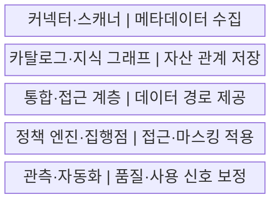
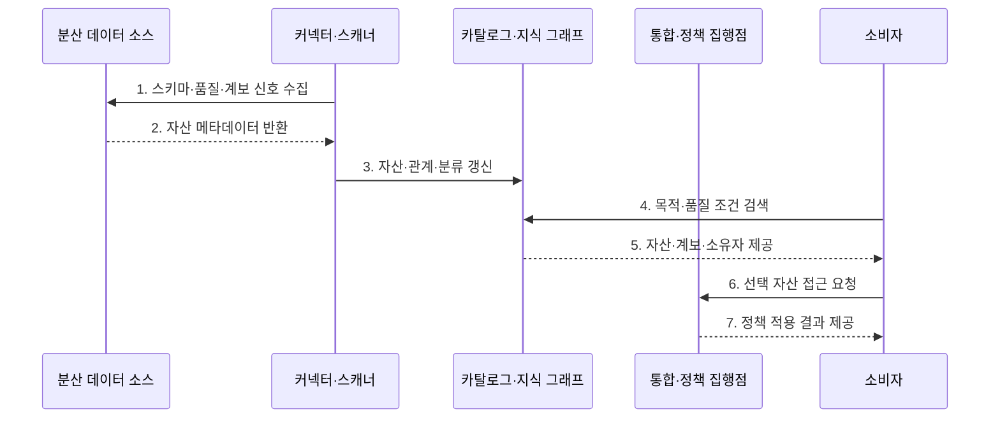

---
sidebar:
  order: 132
  label: "132. 데이터 패브릭 (Data Fabric)"
  badge:
    text: "기출 · 50%"
    variant: note
title: "데이터 패브릭 (Data Fabric)"
date: "2026-07-27T23:59:59+09:00"
tags:
  - "notes-software"
weight: 132
extra:
  question_no: "132"
  source_status: "기출"
  source_history: "135회"
  priority: 50
  priority_note: "135회 기출, 메타데이터 기반 통합 설계"
---

## 미리 알고가기

- **데이터 패브릭(Data Fabric)**: 분산 데이터의 메타데이터·통합·접근·정책을 공통 기술 계층으로 연결하는 데이터 관리 아키텍처이다.
- **활성 메타데이터(Active Metadata)**: 설계 정보뿐 아니라 실행·사용·품질·변경 신호를 자동화 판단에 사용하는 메타데이터이다.
- **지식 그래프(Knowledge Graph)**: 데이터 자산·업무 용어·소유자·계보·정책의 관계를 그래프로 표현한 구조이다.
- **데이터 가상화(Data Virtualization)**: 원본을 이동하지 않고 여러 저장소를 하나의 논리 질의 경로로 제공하는 방식이다.
- **정책 집행점(Policy Enforcement Point)**: 접근·분류·마스킹·보존 규칙을 실제 데이터 경로에 적용하는 구성요소이다.
- **메타데이터 스캐너(Metadata Scanner)**: 데이터 소스의 스키마·사용·품질·계보 정보를 자동 수집하는 구성요소이다.
- **데이터 카탈로그(Data Catalog)**: 데이터 자산의 위치·스키마·소유자·분류·계보를 검색 가능하게 관리하는 목록이다.
- **정책 엔진(Policy Engine)**: 자산 분류·사용 목적·사용자 속성으로 적용할 접근 규칙을 판정하는 구성요소이다.
- **데이터 마스킹(Data Masking)**: 민감한 값의 일부나 전체를 대체해 권한 없는 사용자가 원문을 보지 못하게 하는 처리이다.
- **관측 가능성(Observability)**: 품질·지연·사용·실패 신호로 데이터 경로의 내부 상태를 추론할 수 있는 성질이다.

## Ⅰ. 개요

- 정의/개념: 분산 데이터의 메타데이터·통합·정책을 잇는 **기술 아키텍처**
- 배경/필요성: 저장소별로 분리된 **검색·계보·접근 통제** 연결

### 쉽게 이해하기 (학습용)

- 흩어진 창고의 위치·관계·통행 규칙을 살아 있는 지도와 연결망으로 관리한다.

## Ⅱ. 특징

- **활성 메타데이터**: 실행·사용·품질 신호를 자동화에 활용
- **지식 그래프**: 자산·용어·소유자·계보 관계를 연결
- **통합 통제**: 접근 경로에 정책·마스킹·감사를 적용

### 쉽게 이해하기 (학습용)

- 자동 안내가 똑똑해도 지도 정보가 낡으면 잘못된 자료를 찾거나 잘못된 문을 열 수 있다.

## Ⅲ. 구조 및 구성요소

| 구성요소 | 책임 |
|:---|:---|
| 커넥터·스캐너 | 구조·사용·품질·변경 메타데이터 수집 |
| 카탈로그·지식 그래프 | 자산·용어·소유자·계보·정책 관계 관리 |
| 통합·접근 계층 | 가상화·복제·파이프라인·API 경로 제공 |
| 정책 엔진·집행점 | 접근·마스킹·감사 규칙 적용 |
| 관측·자동화 | 품질·지연·사용·실패 신호로 규칙 보정 |

### 쉽게 이해하기 (학습용)

- 흩어진 데이터 창고를 살아 있는 지도와 통행 규칙으로 잇는다.

## Ⅳ. 흐름도

**동작 원리**

- **1. 스키마·품질·계보 신호 수집**: 분산 소스의 운영 정보를 조회
- **2. 자산 메타데이터 반환**: 현재 구조와 변경 정보를 전달
- **3. 자산·관계·분류 갱신**: 카탈로그와 지식 그래프를 최신화
- **4. 목적·품질 조건 검색**: 소비자가 후보 데이터를 검색
- **5. 자산·계보·소유자 제공**: 의미와 품질 근거를 제시
- **6. 선택 자산 접근 요청**: 통합 경로로 사용을 신청
- **7. 정책 적용 결과 제공**: 허용·마스킹·감사 결과를 반환

### 쉽게 이해하기 (학습용)

- 지도를 계속 갱신하고 목적과 권한에 맞는 길만 열며 통행 결과로 지도를 다시 고친다.

## Ⅴ. 종류 및 비교

| 비교 항목 | 데이터 패브릭 | 데이터 메시 |
|:---|:---|:---|
| 적용 기준 | **분산 자산 연결·통제 자동화** | **도메인 품질 책임 분산** |
| 핵심 특징 | 활성 메타데이터·지식 그래프 | 데이터 제품·셀프서비스 플랫폼 |
| 한계 | 메타데이터 노후·자동화 오판 | 책임 공백·표준 불일치 |

### 쉽게 이해하기 (학습용)

- 패브릭은 도로와 교통 규칙, 메시는 각 상점의 상품 책임에 가깝다.

## Ⅵ. 실무 고려사항 및 대책

| 고려사항 | 대책 | 효과 |
|:---|:---|:---|
| 메타데이터 최신성 | 증분 스캔·변경 감지·신선도 SLO | 잘못된 자산 안내 방지 |
| 관계 정확도 | 자동 수집·소유자 검증·표본 감사 | 계보 오류 감소 |
| 정책 집행 | 모든 접근 경로에 집행점 적용 | 우회 접근 차단 |
| 가상화 성능 | 푸시다운·캐시·복제 기준 설정 | 원천 부하·지연 감소 |
| 자동화 오판 | 신뢰 점수·승인·되돌리기 제공 | 분류·마스킹 오류 복구 |

### 쉽게 이해하기 (학습용)

- 지도에 장소가 많다는 것보다 위치와 통행 제한이 실제와 맞는지 계속 확인해야 한다.

## Ⅶ. 결론

- **메타데이터 최신성·계보 정확도·정책 집행·통합 성능**으로 데이터 패브릭을 확장

### 쉽게 이해하기 (학습용)

- 연결망의 가치는 선의 개수가 아니라 지도가 정확하고 잘못 연 문을 바로 찾아 닫을 수 있는지에 달려 있다.
