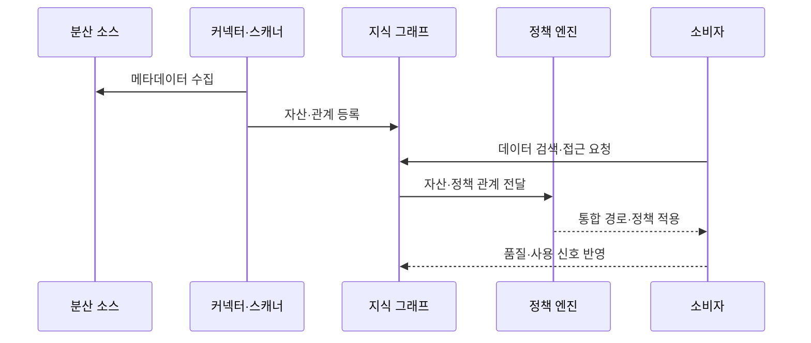

---
sidebar:
  order: 132
  label: "132. 데이터 패브릭 (Data Fabric)"
  badge:
    text: "기출 · 50%"
    variant: note
title: "데이터 패브릭 (Data Fabric)"
date: "2026-07-27T23:59:59+09:00"
tags:
  - "notes-software"
weight: 132
extra:
  question_no: "132"
  source_status: "기출"
  source_history: "135회"
  priority: 50
  priority_note: "135회 기출, 메타데이터 기반 통합 설계"
---

## 미리 알고가기

- **데이터 패브릭(Data Fabric)**: 분산 데이터의 메타데이터·통합·접근·정책을 공통 기술 계층으로 연결하는 데이터 관리 아키텍처임
- **활성 메타데이터(Active Metadata)**: 설계 정보뿐 아니라 실행·사용·품질·변경 신호를 자동화 판단에 사용하는 메타데이터임
- **지식 그래프(Knowledge Graph)**: 데이터 자산·업무 용어·소유자·계보·정책의 관계를 그래프로 표현한 구조임
- **데이터 가상화(Data Virtualization)**: 원본을 이동하지 않고 여러 저장소를 하나의 논리 질의 경로로 제공하는 방식임
- **정책 집행점(Policy Enforcement Point)**: 접근·분류·마스킹·보존 규칙을 실제 데이터 경로에 적용하는 구성요소임
- **메타데이터 스캐너(Metadata Scanner)**: 데이터 소스의 스키마·사용·품질·계보 정보를 자동 수집하는 구성요소임
- **데이터 카탈로그(Data Catalog)**: 데이터 자산의 위치·스키마·소유자·분류·계보를 검색 가능하게 관리하는 목록임
- **정책 엔진(Policy Engine)**: 자산 분류·사용 목적·사용자 속성으로 적용할 접근 규칙을 판정하는 구성요소임
- **데이터 마스킹(Data Masking)**: 민감한 값의 일부나 전체를 대체해 권한 없는 사용자가 원문을 보지 못하게 하는 처리임
- **관측 가능성(Observability)**: 품질·지연·사용·실패 신호로 데이터 경로의 내부 상태를 추론할 수 있는 성질임

## Ⅰ. 개요

- 정의/개념: 활성 메타데이터로 **분산 데이터 자산·계보·정책**을 연결하는 구조
- 기존 한계: 이기종 저장소는 **자산 검색·계보 추적·정책 집행**이 단절

### 쉽게 이해하기 (학습용)
- 흩어진 창고의 위치와 관계 및 정책을 지도와 자동 연결망으로 관리함

## Ⅱ. 특징

- 지속 스캔은 낡은 메타데이터의 검색 오판을 줄인다
- 지식 그래프는 자산 관계를 연결해 탐색 시간을 줄인다
- 가상화는 데이터 이동 없이 통합해 복제 비용을 줄인다
- 정책 자동 적용은 민감 데이터 노출을 막는다

### 쉽게 이해하기 (학습용)
- 자동화의 판단 근거가 메타데이터이므로 스키마·소유자·분류·계보가 오래되면 잘못된 검색 결과와 접근 통제가 발생함

## Ⅲ. 아키텍처 및 구성요소

| 구성요소 | 설명 |
|:---|:---|
| 커넥터·스캐너 | 구조·사용·실행 메타데이터 수집 |
| 카탈로그·지식 그래프 | 자산·용어·계보 관계 저장·검색 |
| 통합·접근 계층 | 가상화로 질의·검색 경로 제공 |
| 정책 엔진 | 분류·사용 목적별 접근·마스킹 판정 |
| 관측·자동화 | 품질·지연 신호로 관계·규칙 보정 |

> 요약: 그래프가 분산 소스 통합 경로와 정책점을 연결해 판단을 제공함

### 쉽게 이해하기 (학습용)
- 자산 스캐너와 관계 지도 및 연결 도구와 관측 장치로 구성됨

## Ⅳ. 원리 및 절차 흐름도

| 절차 | 설명 |
|:---|:---|
| 메타데이터 수집 | 분산 소스의 구조와 사용 정보를 수집함 |
| 자산·관계 등록 | 자산과 업무 정책을 그래프에 연결함 |
| 데이터 검색·접근 요청 | 소비자가 필요한 자산을 요청함 |
| 자산·정책 관계 전달 | 그래프가 정책 판단 정보를 전달함 |
| 통합 경로·정책 적용 | 연결 경로와 접근 규칙을 실행함 |
| 품질·사용 신호 반영 | 운영 결과로 관계와 규칙을 보정함 |

> 요약: 관계를 통합 및 정책 경로로 바꾸고 운영 신호로 보정함

### 쉽게 이해하기 (학습용)
- 지도를 만든 뒤 권한에 맞는 길을 열고 통행 결과로 지도를 고침

## Ⅴ. 종류 및 비교

| 분산 데이터 접근 | 데이터 패브릭 | 데이터 메시 |
|:---|:---|:---|
| 적용 기준 | 분산 이기종 환경의 통합·자동 통제가 우선됨 | 소유권 분산과 자율적 제품 제공이 우선됨 |
| 핵심 특징 | 활성 메타데이터·**기술 연결·정책 집행** | 도메인 소유권·**데이터 제품 책임** |
| 한계 | 메타데이터 오류·**자동화 오판** | 표준 불일치·**제품 중복** |

> 요약: 패브릭은 저장소를 연결하고 메시는 제품 책임을 분산함

### 쉽게 이해하기 (학습용)
- 패브릭은 자산 연결·통제, 메시는 도메인 소유 책임에 초점을 둠

## Ⅵ. 실무 사례

1. 분산 검색은 **스키마·소유자·계보**를 메타데이터로 연결

### 쉽게 이해하기 (학습용)
- 분산 검색은 자산 등록률뿐 아니라 소유자·스키마·계보 관계의 정확도를 표본 검사해 검색 결과를 신뢰할 수 있는지 확인함

## Ⅶ. 결론

- 분산 데이터의 발견·연결·정책 집행을 자동화하기 위해 **메타데이터 최신성·계보·자동화 정확도·오판 보정 체계**를 검토하고, 통합 메타데이터 기반의 데이터 패브릭을 적용한다

### 쉽게 이해하기 (학습용)
- 데이터 패브릭의 가치는 연결 수가 아니라 메타데이터가 최신이고 자동 정책의 오판을 관측·보정할 수 있는지에 달려 있음
