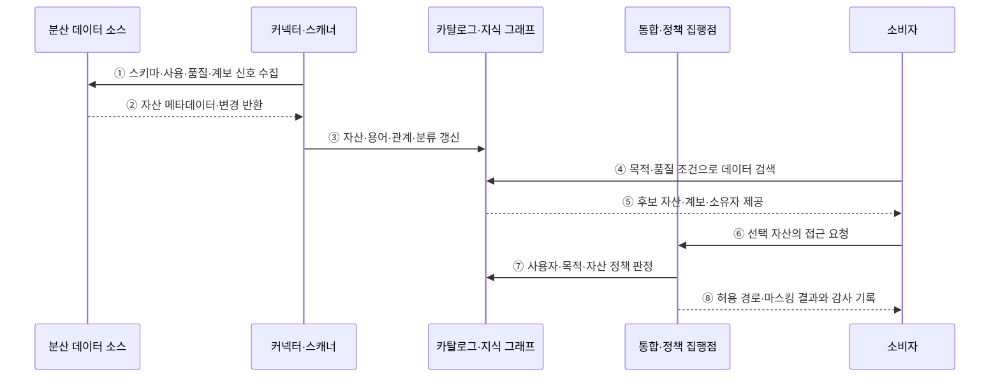

---
sidebar:
  order: 132
  label: "132. 데이터 패브릭 (Data Fabric)"
  badge:
    text: "기출 · 50%"
    variant: note
title: "데이터 패브릭 (Data Fabric)"
date: "2026-07-27T23:59:59+09:00"
tags:
  - "notes-software"
weight: 132
extra:
  question_no: "132"
  source_status: "기출"
  source_history: "135회"
  priority: 50
  priority_note: "135회 기출, 메타데이터 기반 통합 설계"
---

## 미리 알고가기

- **데이터 패브릭(Data Fabric)**: 분산 데이터의 메타데이터·통합·접근·정책을 공통 기술 계층으로 연결하는 데이터 관리 아키텍처임
- **활성 메타데이터(Active Metadata)**: 설계 정보뿐 아니라 실행·사용·품질·변경 신호를 자동화 판단에 사용하는 메타데이터임
- **지식 그래프(Knowledge Graph)**: 데이터 자산·업무 용어·소유자·계보·정책의 관계를 그래프로 표현한 구조임
- **데이터 가상화(Data Virtualization)**: 원본을 이동하지 않고 여러 저장소를 하나의 논리 질의 경로로 제공하는 방식임
- **정책 집행점(Policy Enforcement Point)**: 접근·분류·마스킹·보존 규칙을 실제 데이터 경로에 적용하는 구성요소임
- **메타데이터 스캐너(Metadata Scanner)**: 데이터 소스의 스키마·사용·품질·계보 정보를 자동 수집하는 구성요소임
- **데이터 카탈로그(Data Catalog)**: 데이터 자산의 위치·스키마·소유자·분류·계보를 검색 가능하게 관리하는 목록임
- **정책 엔진(Policy Engine)**: 자산 분류·사용 목적·사용자 속성으로 적용할 접근 규칙을 판정하는 구성요소임
- **데이터 마스킹(Data Masking)**: 민감한 값의 일부나 전체를 대체해 권한 없는 사용자가 원문을 보지 못하게 하는 처리임
- **관측 가능성(Observability)**: 품질·지연·사용·실패 신호로 데이터 경로의 내부 상태를 추론할 수 있는 성질임

## Ⅰ. 개요

- 데이터 패브릭은 분산된 데이터의 메타데이터·관계·통합 경로·접근 정책을 공통 기술 계층으로 연결하고 운영 신호로 자동화하는 데이터 관리 아키텍처이다.
- 저장소와 도구마다 끊긴 자산 검색·계보·접근·정책 집행을 활성 메타데이터와 공통 서비스로 연결한다.

### 쉽게 이해하기 (학습용)

- 흩어진 창고의 위치·관계·통행 규칙을 살아 있는 지도와 연결망으로 관리한다.

## Ⅱ. 특징

- **활성 메타데이터**: 설계 정보뿐 아니라 실행·사용·품질·변경 신호를 지속 수집해 자동화 판단에 쓴다.
- **지식 그래프**: 자산·업무 용어·소유자·계보·정책의 관계를 연결해 탐색과 영향 분석을 지원한다.
- **통합 접근**: 가상화·복제·파이프라인·API 중 목적에 맞는 경로로 분산 데이터를 제공한다.
- **정책 자동 집행**: 분류·사용 목적·사용자 속성에 따라 접근·마스킹·감사 규칙을 실제 경로에 적용한다.
- **폐쇄 루프 관측**: 품질·지연·사용·실패 신호로 메타데이터와 자동화 규칙을 보정한다.

### 쉽게 이해하기 (학습용)

- 자동 안내가 똑똑해도 지도 정보가 낡으면 잘못된 자료를 찾거나 잘못된 문을 열 수 있다.

## Ⅲ. 아키텍처 및 구성요소

**도표안 A — 구조도**

**도표안 B — sequenceDiagram**

| 구성요소 | 설명 |
|:---|:---|
| 커넥터·스캐너 | 구조·실행·사용·품질·변경 메타데이터 수집 |
| 카탈로그·지식 그래프 | 자산·용어·소유자·계보·정책 관계 저장·검색 |
| 통합·접근 계층 | 가상화·복제·파이프라인·API의 접근 경로 제공 |
| 정책 엔진·집행점 | 분류·목적·사용자별 접근·마스킹·감사 적용 |
| 관측·자동화 | 품질·지연·사용·실패 신호로 관계와 규칙 보정 |

**동작 원리**

- ① 커넥터와 스캐너가 분산 소스의 스키마·사용·품질·계보 신호를 수집한다.
- ② 각 소스가 현재 자산 메타데이터와 변경 정보를 반환한다.
- ③ 수집 정보를 카탈로그와 지식 그래프의 자산·용어·관계·분류에 반영한다.
- ④ 소비자가 사용 목적과 필요한 품질 조건으로 데이터 자산을 검색한다.
- ⑤ 카탈로그가 후보 자산의 의미·계보·품질·소유자를 제공한다.
- ⑥ 소비자가 선택한 자산을 통합·정책 집행점에 요청한다.
- ⑦ 집행점이 사용자·목적·자산 분류를 지식 그래프의 정책과 대조해 허용 범위를 판정한다.
- ⑧ 허용된 통합 경로와 마스킹 결과를 제공하고 사용·거부·품질 신호를 감사 기록에 남긴다.

### 쉽게 이해하기 (학습용)

- 지도를 계속 갱신하고 목적과 권한에 맞는 길만 열며 통행 결과로 지도를 다시 고친다.

## Ⅳ. 종류 및 비교

| 비교 항목 | 데이터 패브릭 | 데이터 메시 |
|:---|:---|:---|
| 중심 문제 | 분산 자산의 발견·연결·통제 자동화 | 데이터 소유·품질 책임의 조직적 분산 |
| 핵심 수단 | 활성 메타데이터·지식 그래프·통합 서비스 | 도메인 소유권·데이터 제품·셀프서비스 |
| 거버넌스 | 메타데이터 기반 정책 판정·집행 | 전사 합의와 도메인 실행의 연합형 |
| 대표 위험 | 낡은 메타데이터·자동화 오판·도구 종속 | 책임 공백·표준 불일치·제품 중복 |
| 결합 가능성 | 메시 제품을 찾고 통제하는 기술 기반 제공 | 패브릭 기술 위에 제품 책임 모델 적용 |

> 패브릭과 메시는 경쟁 제품명이 아니라 기술 통합과 조직 책임이라는 서로 다른 축이므로 함께 적용할 수 있다.

### 쉽게 이해하기 (학습용)

- 패브릭은 도로와 교통 규칙, 메시는 각 상점의 상품 책임에 가깝다.

## Ⅴ. 실무 고려사항 및 대책

| 고려사항 | 위험 | 대책 |
|:---|:---|:---|
| 메타데이터 최신성 | 삭제·변경된 자산을 잘못 안내 | 증분 스캔·변경 감지·신선도 SLO |
| 관계 정확도 | 잘못된 계보·소유자로 영향 분석 오류 | 자동 수집과 소유자 검증·표본 감사 |
| 정책 집행 | 판정만 있고 실제 경로에서 우회 | 모든 접근 경로에 집행점·우회 탐지 |
| 가상화 성능 | 원격 조인·원천 부하·지연 증가 | 푸시다운·캐시·복제 기준·부하 한도 |
| 자동화 오판 | 잘못된 분류·마스킹·추천 | 신뢰 점수·설명·승인·되돌리기 |
| 도구 종속 | 메타모델·연결 규격에 종속 | 공개 API·메타데이터 내보내기·이관 시험 |

> **적용 사례**: 분산 검색 결과의 스키마·소유자·계보를 표본 검증하고, 민감 자산 요청은 실제 질의 경로에서 마스킹한 뒤 허용·거부 결과를 다시 메타데이터에 반영한다.

### 쉽게 이해하기 (학습용)

- 지도에 장소가 많다는 것보다 위치와 통행 제한이 실제와 맞는지 계속 확인해야 한다.

## Ⅵ. 결론

- 데이터 패브릭의 핵심은 연결 수가 아니라 신뢰할 수 있는 활성 메타데이터가 검색·통합·정책 집행을 실제 운영 경로에서 움직이게 하는 데 있다.
- 메타데이터 최신성·계보 정확도·정책 우회 방지·가상화 성능·자동화 오판 보정 능력을 검증해 단계적으로 확장해야 한다.

### 쉽게 이해하기 (학습용)

- 연결망의 가치는 선의 개수가 아니라 지도가 정확하고 잘못 연 문을 바로 찾아 닫을 수 있는지에 달려 있다.
