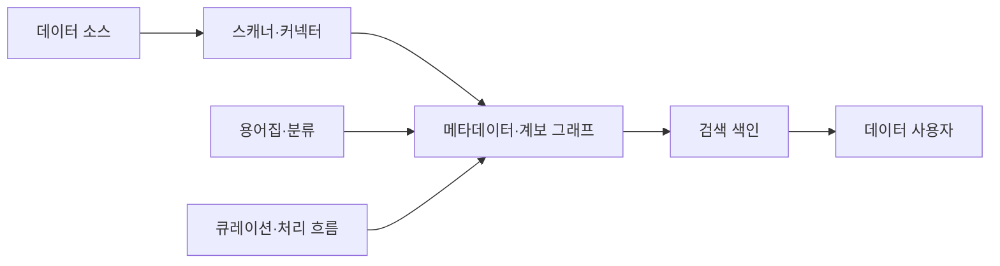
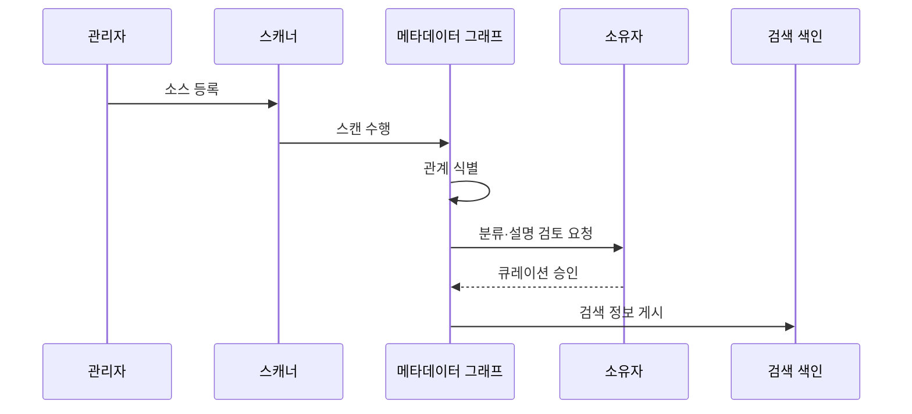

---
sidebar:
  order: 133
  label: "133. 데이터 카탈로그 (Data Catalog)"
  badge:
    text: "미출제 · 50%"
    variant: note
title: "데이터 카탈로그 (Data Catalog)"
date: "2026-07-25T11:36:00+09:00"
tags:
  - "notes-software"
weight: 133
extra:
  question_no: "133"
  source_status: "미출제"
  source_history: ""
  priority: 50
  priority_note: "카탈로그는 데이터 검색·책임·정책 기반"
---

## 미리 알고가기

- **데이터 카탈로그(Data Catalog)**: 여러 데이터 자산의 위치·스키마·소유자·분류·계보·사용 정보를 검색 가능하게 관리하는 시스템임
- **기술 메타데이터(Technical Metadata)**: 위치·스키마·열 타입·파티션·파일 형식 같은 시스템 정보를 설명함
- **업무 메타데이터(Business Metadata)**: 업무 용어·정의·소유자·사용 목적과 데이터 책임을 설명함
- **운영 메타데이터(Operational Metadata)**: 파이프라인 실행·조회 빈도·품질 결과·최신성 같은 사용 상태를 설명함
- **비즈니스 용어집(Business Glossary)**: 업무 용어의 정의·동의어·책임자와 데이터 자산의 연결을 관리함
- **분류(Classification)**: 데이터 내용·민감도·규제 범주를 태그로 표시함
- **데이터 계보(Data Lineage)**: 원천·변환 작업·산출물의 관계를 추적하는 정보임
- **데이터 사전(Data Dictionary)**: 한 시스템의 테이블·열·타입·제약조건을 정의한 구조 명세임
- **메타데이터 스캐너(Metadata Scanner)**: 데이터 소스에서 자산·스키마·사용·품질 정보를 자동 수집하는 구성요소임
- **검색 색인(Search Index)**: 키워드·용어·태그·사용 정보를 빠르게 찾도록 구성한 검색 구조임
- **큐레이션(Curation)**: 자동 수집된 설명·분류·소유자 정보를 사람이 검토·보완·승인하는 과정임
- **데이터 자산(Data Asset)**: 테이블·파일·보고서·지표처럼 조직이 찾고 관리하고 재사용하는 데이터 단위임

## Ⅰ. 개요

- 정의/개념: 분산 자산의 메타데이터·계보를 검색에 제공한다
- **배경/필요성**: 자산 탐색 시간과 출처 오판을 줄인다

### 쉽게 이해하기 (학습용)
- 여러 저장소의 자료 이름과 출처를 찾는 도서관 목록임

## Ⅱ. 특징

- 자동 스캔은 자산 등록 누락과 관리 비용을 줄인다
- 용어·소유자·계보 연결은 출처 오판을 막는다
- 검색 색인은 기술·업무 의미의 탐색 시간을 줄인다
- 큐레이션·사용 신호는 낡은 설명의 오용을 막는다

### 쉽게 이해하기 (학습용)
- 자동 수집만 하면 낡은 설명과 끊긴 계보도 함께 쌓이므로 소유자 검토와 최신성 지표가 필요함

## Ⅲ. 아키텍처 및 구성요소

| 구성요소 | 설명 |
|:---|:---|
| 스캐너·커넥터 | 자산·스키마·사용 정보를 수집 |
| 메타데이터·계보 그래프 | 자산·용어·계보 관계와 영향 범위 저장 |
| 용어집·분류 | 업무 정의·민감도·도메인 태그 연결 |
| 검색 색인 | 키워드·사용 정보로 자산 검색 |
| 큐레이션·처리 흐름 | 검토·승인·접근 요청을 관리함 |

> 요약: 수집한 자산을 용어와 소유자 및 계보와 연결해 검색에 제공함

### 쉽게 이해하기 (학습용)
- 자동 수집기, 관계망, 용어 분류, 검색과 검토 흐름으로 구성됨

## Ⅳ. 원리 및 절차 흐름도

| 절차 | 설명 |
|:---|:---|
| 소스 등록 | 연결 정보와 스캔 범위를 설정함 |
| 스캔 수행 | 자산과 스키마 정보를 추출함 |
| 관계 식별 | 자산 식별자와 계보를 연결함 |
| 분류·설명 검토 요청 | 소유자에게 후보 정보를 전달함 |
| 큐레이션 승인 | 소유자가 설명과 분류를 확정함 |
| 검색 정보 게시 | 승인된 메타데이터를 색인함 |

> 요약: 메타데이터를 자산으로 식별하고 소유자 정보와 함께 게시함

### 쉽게 이해하기 (학습용)
- 저장소를 훑어 자산을 만들고 출처와 소유자를 붙여 게시함

## Ⅴ. 종류 및 비교

| 판단 기준 | 데이터 카탈로그 | 데이터 사전 |
|:---|:---|:---|
| 핵심 특징 | 여러 저장소와 보고서 자산을 수집·연결함 | 한 시스템의 테이블 구조를 기록함 |
| 적용 기준 | 검색·계보·소유권·사용 판단 | 열·타입·제약조건 정의 |
| 주요 위험 | 수집 누락·잘못된 분류·메타데이터 불신 | 문서 노후화·시스템 간 연결 부족 |

> 요약: 여러 자산을 용어와 소유자 및 계보와 연결해 판단을 제공함

### 쉽게 이해하기 (학습용)
- 데이터 사전은 한 시스템 구조, 카탈로그는 자산 관계를 다룸

## Ⅵ. 실무 사례

1. 용어·소유자를 색인해 자산 탐색을 돕는다
2. 민감 분류가 누락된 열을 큐레이션한다

### 쉽게 이해하기 (학습용)
- 검색은 결과 클릭이 아니라 적합한 자산을 실제 사용한 비율과 소유자 응답률을 측정해 탐색 효과를 확인함
- 민감 데이터 관리는 분류 누락 열과 승인 대기 시간을 측정해 보호 범위와 사용 가능성을 함께 개선함

## Ⅶ. 결론

- 자산 검색·계보·소유권이 필요하면 카탈로그를 택한다

### 쉽게 이해하기 (학습용)
- 데이터 카탈로그는 등록 자산 수보다 사용자가 믿을 수 있는 자산을 찾고 소유자·품질·접근 방법까지 확인해 실제로 쓰게 하는 것이 중요함
