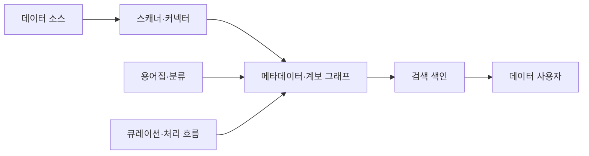
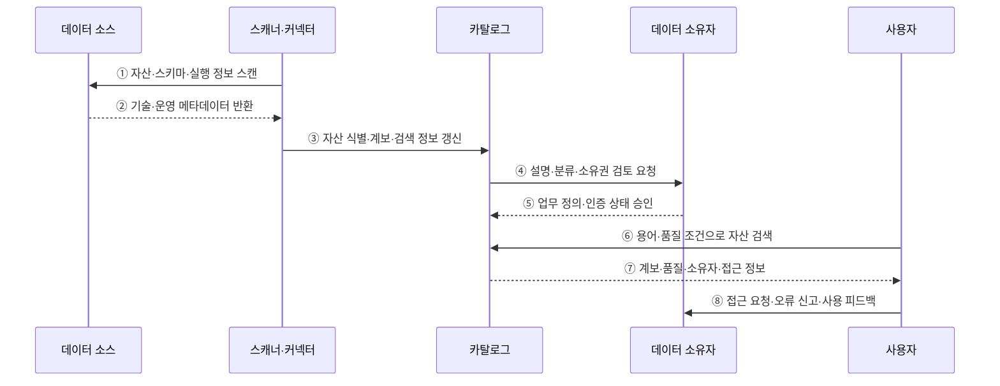

---
sidebar:
  order: 133
  label: "133. 데이터 카탈로그 (Data Catalog)"
  badge:
    text: "미출제 · 50%"
    variant: note
title: "데이터 카탈로그 (Data Catalog)"
date: "2026-07-25T11:36:00+09:00"
tags:
  - "notes-software"
weight: 133
extra:
  question_no: "133"
  source_status: "미출제"
  source_history: ""
  priority: 50
  priority_note: "카탈로그는 데이터 검색·책임·정책 기반"
---

## 미리 알고가기

- **데이터 카탈로그(Data Catalog)**: 여러 데이터 자산의 위치·스키마·소유자·분류·계보·사용 정보를 검색 가능하게 관리하는 시스템임
- **기술 메타데이터(Technical Metadata)**: 위치·스키마·열 타입·파티션·파일 형식 같은 시스템 정보를 설명함
- **업무 메타데이터(Business Metadata)**: 업무 용어·정의·소유자·사용 목적과 데이터 책임을 설명함
- **운영 메타데이터(Operational Metadata)**: 파이프라인 실행·조회 빈도·품질 결과·최신성 같은 사용 상태를 설명함
- **비즈니스 용어집(Business Glossary)**: 업무 용어의 정의·동의어·책임자와 데이터 자산의 연결을 관리함
- **분류(Classification)**: 데이터 내용·민감도·규제 범주를 태그로 표시함
- **데이터 계보(Data Lineage)**: 원천·변환 작업·산출물의 관계를 추적하는 정보임
- **데이터 사전(Data Dictionary)**: 한 시스템의 테이블·열·타입·제약조건을 정의한 구조 명세임
- **메타데이터 스캐너(Metadata Scanner)**: 데이터 소스에서 자산·스키마·사용·품질 정보를 자동 수집하는 구성요소임
- **검색 색인(Search Index)**: 키워드·용어·태그·사용 정보를 빠르게 찾도록 구성한 검색 구조임
- **큐레이션(Curation)**: 자동 수집된 설명·분류·소유자 정보를 사람이 검토·보완·승인하는 과정임
- **데이터 자산(Data Asset)**: 테이블·파일·보고서·지표처럼 조직이 찾고 관리하고 재사용하는 데이터 단위임

## Ⅰ. 개요

- 데이터 카탈로그는 분산된 테이블·파일·보고서·지표의 기술·업무·운영 메타데이터와 계보를 수집해 검색·이해·신뢰 판단에 제공하는 시스템이다.
- 사용자가 데이터의 존재·의미·출처·품질·소유자·접근 방법을 찾는 시간을 줄이고 비슷하지만 잘못된 자산을 선택하는 일을 막는다.

### 쉽게 이해하기 (학습용)

- 여러 창고의 자료가 어디에 있고 무엇이며 누가 책임지는지 알려 주는 도서관 목록이다.

## Ⅱ. 특징

- **자동 수집**: 스캐너와 파이프라인 연동으로 자산·스키마·계보·사용·품질 정보를 지속 갱신한다.
- **업무 의미 연결**: 기술 이름을 용어집·정의·소유자·도메인과 연결해 해석 가능한 자산으로 만든다.
- **검색과 추천**: 키워드·태그·관계·사용·품질 신호로 목적에 맞는 자산을 찾고 비교하게 한다.
- **신뢰 판단**: 출처·계보·최신성·품질·인증 상태·사용 이력을 함께 보여 준다.
- **큐레이션**: 자동 추론의 오류와 낡은 설명을 소유자가 검토하고 승인하며 책임을 명확히 한다.

### 쉽게 이해하기 (학습용)

- 책 목록을 자동으로 모아도 제목·저자·대출 가능 여부가 틀리면 쓸 수 없어 담당자의 검토가 필요하다.

## Ⅲ. 아키텍처 및 구성요소

**도표안 A — 구조도**

**도표안 B — sequenceDiagram**

| 구성요소 | 설명 |
|:---|:---|
| 스캐너·커넥터 | 자산·스키마·실행·사용·품질 정보를 자동 수집 |
| 메타데이터·계보 그래프 | 자산·변환·용어·소유자 관계와 영향 범위 저장 |
| 용어집·분류 | 업무 정의·동의어·민감도·도메인 태그 연결 |
| 검색 색인 | 키워드·관계·사용·품질 정보로 자산 탐색 |
| 큐레이션·처리 흐름 | 설명·분류·인증·접근 요청·오류 보정 관리 |

**동작 원리**

- ① 스캐너가 연결된 데이터 소스의 자산·스키마·파티션·실행 정보를 읽는다.
- ② 소스가 현재 기술 메타데이터와 조회·품질·최신성 같은 운영 신호를 반환한다.
- ③ 스캐너가 자산 식별자를 정합화하고 변환 계보와 검색 정보를 카탈로그에 갱신한다.
- ④ 카탈로그가 자동 추론한 설명·분류·소유권 후보를 데이터 소유자에게 검토 요청한다.
- ⑤ 소유자가 업무 정의·민감도·책임 범위·인증 상태를 보완하고 승인한다.
- ⑥ 사용자가 업무 용어와 필요한 최신성·품질 조건으로 자산을 검색한다.
- ⑦ 카탈로그가 후보 자산의 의미·계보·품질·소유자·접근 방법을 함께 제공한다.
- ⑧ 사용자가 소유자에게 접근을 요청하거나 설명 오류와 실제 사용 피드백을 전달한다.

### 쉽게 이해하기 (학습용)

- 저장소를 훑어 목록을 만들고 담당자가 뜻과 책임을 확인한 뒤 사용자가 품질표를 보고 고른다.

## Ⅳ. 종류 및 비교

| 비교 항목 | 데이터 카탈로그 | 데이터 사전 | 비즈니스 용어집 |
|:---|:---|:---|:---|
| 중심 대상 | 여러 시스템의 데이터 자산과 관계 | 한 시스템의 테이블·열 구조 | 조직의 업무 용어와 정의 |
| 핵심 정보 | 위치·검색·소유자·품질·계보·사용 | 열·타입·제약조건·설명 | 정의·동의어·책임자·정책 |
| 주요 목적 | 발견·이해·신뢰·접근 판단 | 개발·운영을 위한 구조 확인 | 부서 간 의미 통일 |
| 연결 관계 | 사전과 용어집을 자산에 통합 | 기술 명세를 카탈로그에 제공 | 업무 의미를 자산·열에 연결 |
| 주요 위험 | 수집 누락·오분류·불신 | 문서 노후화·범위 고립 | 합의 없는 정의·실제 자산과 단절 |

> 카탈로그는 사전과 용어집을 대체하기보다 기술 구조와 업무 의미를 실제 자산·계보·사용 정보에 연결한다.

### 쉽게 이해하기 (학습용)

- 사전은 책의 항목 설명, 용어집은 공통 단어 뜻, 카탈로그는 여러 책의 위치와 관계를 찾는 목록이다.

## Ⅴ. 실무 고려사항 및 대책

| 고려사항 | 위험 | 대책 |
|:---|:---|:---|
| 수집 범위 | 중요한 자산·계보 누락 | 우선순위 소스·커버리지 지표·연결 실패 알림 |
| 식별자 | 같은 자산 중복·이름 변경 시 관계 단절 | 영속 ID·정합 규칙·병합 이력 |
| 최신성 | 폐기 자산·낡은 스키마 안내 | 스캔 SLO·변경 감지·마지막 확인 시각 |
| 큐레이션 | 소유자 없는 설명·오분류 방치 | 책임자·검토 주기·인증 만료·이견 처리 |
| 검색 품질 | 인기만 높고 목적에 맞지 않는 결과 | 용어·품질·계보·사용 신호와 성공률 평가 |
| 활용 연결 | 찾은 뒤 접근·지원 방법을 모름 | 접근 절차·예제·문의·상태·계약 함께 제공 |

> **적용 사례**: 검색 클릭 수보다 적합한 자산을 실제 사용한 비율, 검색 소요 시간, 소유자 응답률, 설명 오류 신고와 수정 시간을 측정한다.

### 쉽게 이해하기 (학습용)

- 목록을 열어 본 횟수보다 맞는 자료를 찾아 실제로 썼는지를 재야 한다.

## Ⅵ. 결론

- 데이터 카탈로그의 가치는 등록 자산 수가 아니라 사용자가 목적에 맞고 믿을 수 있는 자산을 찾아 실제 사용하도록 돕는 데 있다.
- 자동 수집·영속 식별자·소유자 큐레이션·품질과 계보·접근 흐름·검색 성공 지표를 함께 운영해야 메타데이터 신뢰를 유지할 수 있다.

### 쉽게 이해하기 (학습용)

- 책이 몇 권 등록됐는지보다 필요한 책을 믿고 찾아 빌릴 수 있는지가 중요하다.
