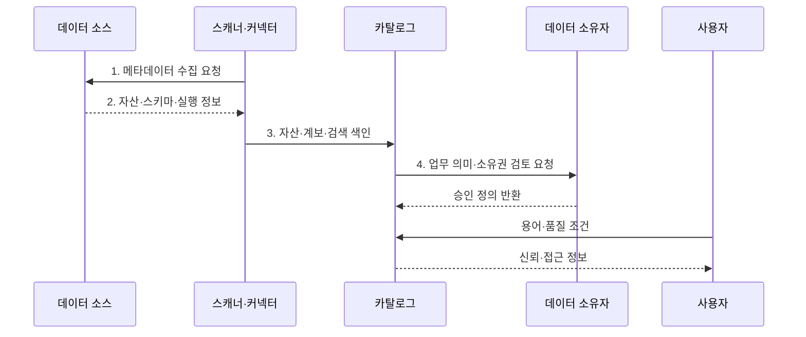

---
sidebar:
  order: 133
  label: "133. 데이터 카탈로그 (Data Catalog)"
  badge:
    text: "미출 · 50%"
    variant: note
title: "데이터 카탈로그 (Data Catalog)"
date: "2026-07-30T23:51:27+09:00"
tags:
  - "notes-software"
weight: 133
extra:
  question_no: "133"
  source_status: "미출"
  source_history: ""
  priority: 50
  priority_note: "카탈로그는 데이터 검색·책임·정책 기반"
---

## 미리 알고가기

- **데이터 카탈로그(Data Catalog)**: 여러 데이터 자산의 위치·스키마·소유자·분류·계보·사용 정보를 검색 가능하게 관리하는 시스템이다.
- **기술 메타데이터(Technical Metadata)**: 위치·스키마·열 타입·파티션·파일 형식 같은 시스템 정보를 설명한다.
- **업무 메타데이터(Business Metadata)**: 업무 용어·정의·소유자·사용 목적과 데이터 책임을 설명한다.
- **운영 메타데이터(Operational Metadata)**: 파이프라인 실행·조회 빈도·품질 결과·최신성 같은 사용 상태를 설명한다.
- **비즈니스 용어집(Business Glossary)**: 업무 용어의 정의·동의어·책임자와 데이터 자산의 연결을 관리한다.
- **분류(Classification)**: 데이터 내용·민감도·규제 범주를 태그로 표시한다.
- **데이터 계보(Data Lineage)**: 원천·변환 작업·산출물의 관계를 추적하는 정보이다.
- **데이터 사전(Data Dictionary)**: 한 시스템의 테이블·열·타입·제약조건을 정의한 구조 명세이다.
- **메타데이터 스캐너(Metadata Scanner)**: 데이터 소스에서 자산·스키마·사용·품질 정보를 자동 수집하는 구성요소이다.
- **검색 색인(Search Index)**: 키워드·용어·태그·사용 정보를 빠르게 찾도록 구성한 검색 구조이다.
- **큐레이션(Curation)**: 자동 수집된 설명·분류·소유자 정보를 사람이 검토·보완·승인하는 과정이다.
- **데이터 자산(Data Asset)**: 테이블·파일·보고서·지표처럼 조직이 찾고 관리하고 재사용하는 데이터 단위이다.

> **키워드:** 데이터 카탈로그 (Data Catalog)

## Ⅰ. 개요

- 정의/개념: 분산 데이터 자산의 메타데이터를 수집하는 **검색·관리 시스템**
- 배경/필요성: 저장소별 목록·문서 분산으로 **자산 검색·신뢰 판단** 제약

### 쉽게 이해하기 (학습용)

- 여러 창고의 자료가 어디에 있고 무엇이며 누가 책임지는지 알려 주는 도서관 목록이다.

## Ⅱ. 특징

- 자산·스키마·계보·품질 정보를 갱신하는 **자동 수집**
- 기술 이름을 업무 용어·소유자와 연결하는 **의미 매핑**
- 계보·최신성·인증 상태를 함께 제공하는 **신뢰 검색**

### 쉽게 이해하기 (학습용)

- 책 목록을 자동으로 모아도 제목·저자·대출 가능 여부가 틀리면 쓸 수 없어 담당자의 검토가 필요하다.

## Ⅲ. 구조 및 구성요소

| 구성요소 | 책임 |
|:---|:---|
| 스캐너·커넥터 | 자산·스키마·사용·품질 정보의 **자동 수집** |
| 메타데이터·계보 그래프 | **자산·변환·용어·소유자 관계** 저장 |
| 용어집·분류 | 업무 정의·동의어·**민감도 분류** 연결 |
| 검색 색인 | 키워드·관계·품질 기반 **자산 탐색** |
| 큐레이션·처리 흐름 | 설명·분류·인증의 **검토·오류 보정** 관리 |

### 쉽게 이해하기 (학습용)

- 여러 창고 자료의 위치·뜻·책임자를 찾는 도서관 목록이다.

## Ⅳ. 흐름도

**동작 원리**

1. **메타데이터 수집 요청**: 연결 소스의 구조·실행·품질·최신성 신호 수집 시작
2. **자산·스키마·실행 정보**: 데이터 위치와 구조·사용 상태를 스캐너에 반환
3. **자산·계보·검색 색인**: 시스템별 식별자를 정합화해 검색·변환 관계 반영
4. **업무 의미·소유권 검토 요청**: 소유자가 설명·민감도·책임과 인증 여부 확정

### 쉽게 이해하기 (학습용)

- 저장소를 훑어 목록을 만들고 담당자가 뜻과 책임을 확인한 뒤 사용자가 품질표를 보고 고른다.

## Ⅴ. 종류 및 비교

| 메타데이터 관리 도구 | 데이터 카탈로그 | 데이터 사전 | 비즈니스 용어집 |
|:---|:---|:---|:---|
| 적용 기준 | **여러 자산의 검색·신뢰 판단** | **한 시스템의 구조 확인** | **조직 업무 용어 통일** |
| 핵심 특징 | **위치·소유자·품질·계보** | **열·타입·제약조건** | **정의·동의어·책임자** |
| 한계 | **수집 누락·오분류** | 문서 노후·**시스템 범위 고립** | **실제 데이터 자산**과 단절 |

### 쉽게 이해하기 (학습용)

- 사전은 책의 항목 설명, 용어집은 공통 단어 뜻, 카탈로그는 여러 책의 위치와 관계를 찾는 목록이다.

## Ⅵ. 실무 고려사항 및 대책

| 고려사항 | 대책 | 효과 |
|:---|:---|:---|
| 스캔 범위가 좁으면 **중요 데이터 자산** 누락 | 우선 소스·**수집 범위·실패 알림** 관리 | 카탈로그의 **핵심 자산 포함률** 향상 |
| 시스템별 식별자가 바뀌면 **중복·계보 단절** 발생 | **영속 식별자·정합 규칙·병합 이력** 적용 | 자산 관계의 **연속성** 유지 |
| 스캔 주기가 길면 폐기 자산을 **현재 자산**으로 안내 | 변경 감지와 **최신성 목표·확인 시각** 표시 | 검색 결과의 **현재 상태** 반영 |
| 자동 분류를 검토하지 않으면 **오분류** 장기 방치 | **책임자·검토 주기·인증 만료** 운영 | 업무 의미의 **큐레이션 품질** 유지 |

### 쉽게 이해하기 (학습용)

- 목록을 열어 본 횟수보다 맞는 자료를 찾아 실제로 썼는지를 재야 한다.

## Ⅶ. 결론

- 분산 자산이 늘어 검색 실패가 커지면 **자동 수집·소유자 검증** 기반 카탈로그 운영

### 쉽게 이해하기 (학습용)

- 책이 몇 권 등록됐는지보다 필요한 책을 믿고 찾아 빌릴 수 있는지가 중요하다.
