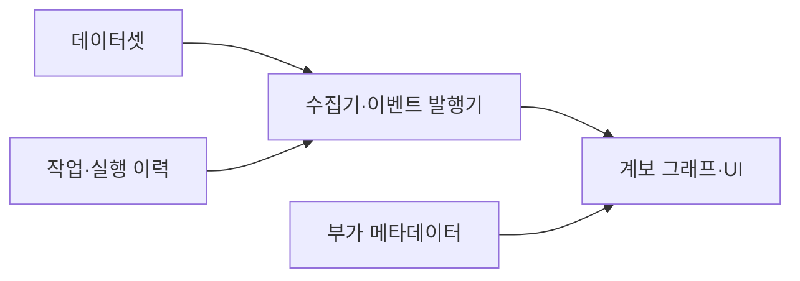
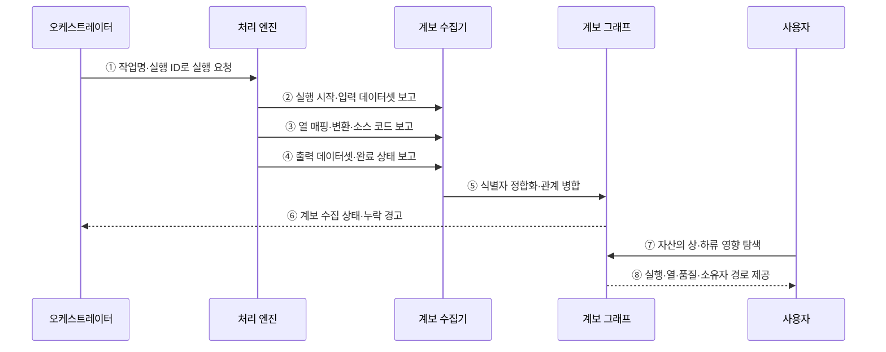

---
sidebar:
  order: 134
  label: "134. 데이터 계보 Data Lineage (Data Lineage)"
  badge:
    text: "미출제 · 50%"
    variant: note
title: "데이터 계보 Data Lineage (Data Lineage)"
date: "2026-07-25T11:38:00+09:00"
tags:
  - "notes-software"
weight: 134
extra:
  question_no: "134"
  source_status: "미출제"
  source_history: ""
  priority: 50
  priority_note: "계보는 영향 분석·감사·품질 추적 핵심"
---

## 미리 알고가기

- **데이터 계보(Data Lineage)**: 데이터가 원천에서 산출물까지 이동·변환된 관계와 실행 이력을 추적하는 정보임
- **데이터셋(Dataset)**: 테이블·파일·토픽처럼 작업이 읽거나 쓰는 데이터 단위임
- **작업(Job)**: 데이터셋을 입력받아 다른 데이터셋을 생성·변경하는 처리 단위임
- **실행 이력(Run)**: 특정 시점에 수행된 작업의 한 인스턴스이며 시작·완료·실패 상태를 가짐
- **열 수준 계보(Column-level Lineage)**: 산출 열이 어떤 원천 열과 변환식에서 생성됐는지 추적하는 관계임
- **영향 분석(Impact Analysis)**: 변경 대상의 하위 데이터셋·작업·보고서 범위를 찾는 분석임
- **원인 분석(Root Cause Analysis)**: 오류 결과에서 상위 원천과 변환 경로를 거슬러 원인을 찾는 분석임
- **네임스페이스(Namespace)**: 서로 다른 시스템의 같은 이름을 구분하도록 자산 식별자의 범위를 정하는 이름 공간임
- **실행 식별자(Run Identifier, Run ID)**: ID를 '아이디'로 읽고 영문 첫 글자로 식별자를 줄여 쓰며 작업의 한 실행을 다른 실행과 구분함
- **수집기(Collector)**: 처리 엔진과 오케스트레이터에서 계보 이벤트와 메타데이터를 가져오는 구성요소임
- **오케스트레이터(Orchestrator)**: 작업 의존성과 일정에 따라 데이터 작업의 실행 순서를 조정하는 시스템임
- **사용자 인터페이스(User Interface, UI)**: 영문 첫 글자를 딴 UI를 '유아이'로 읽으며 사용자가 계보 그래프를 검색·탐색하는 화면임
- **구조적 질의 언어(Structured Query Language, SQL)**: 영문 첫 글자를 딴 SQL을 '에스큐엘'로 읽으며 설계 계보가 분석할 선언형 변환을 표현함

## Ⅰ. 개요

- 데이터 계보는 데이터가 원천에서 산출물까지 어떤 작업과 변환을 거쳤는지 데이터셋·열·실행 단위의 관계와 이력으로 추적하는 정보이다.
- 변경 전 하위 영향 범위를 찾고 오류 결과에서 상위 원인을 거슬러 올라가며 감사 가능한 생성 근거를 제공한다.

### 쉽게 이해하기 (학습용)

- 보고서 숫자가 어느 원료와 공정을 거쳐 만들어졌는지 보여 주는 추적 지도이다.

## Ⅱ. 특징

- **방향 그래프**: 원천 데이터셋→작업→산출 데이터셋 관계를 상·하류로 탐색한다.
- **열 수준 추적**: 산출 열을 원천 열과 변환식에 연결해 값 오류와 열 변경 영향을 좁힌다.
- **설계·실행 결합**: 선언된 SQL·파이프라인과 실제 실행의 입력·출력·상태를 비교한다.
- **운영 정보 연결**: 품질·소유자·코드·배포·실행 상태를 경로에 붙여 원인과 책임자를 찾는다.
- **불완전성 관리**: 동적 질의·수동 파일 이동·미계측 도구가 만드는 누락과 잘못된 연결을 관찰한다.

### 쉽게 이해하기 (학습용)

- 설계 계보는 예정 노선, 실행 계보는 실제 이동 기록이며 둘 다 빠진 길이 없는지 확인해야 한다.

## Ⅲ. 아키텍처 및 구성요소

**도표안 A — 구조도**

**도표안 B — sequenceDiagram**

| 구성요소 | 설명 |
|:---|:---|
| 데이터셋 | 네임스페이스와 영속 ID로 입출력 테이블·파일·토픽 식별 |
| 작업·실행 이력 | 논리 작업과 개별 실행의 시작·완료·실패·범위 기록 |
| 부가 메타데이터 | 스키마·열 식·소스 코드·배포·품질·소유자 연결 |
| 수집기·이벤트 발행기 | 엔진·오케스트레이터의 계보 이벤트 수집·정합화 |
| 계보 그래프·UI | 데이터셋·작업·열 관계의 상·하류 경로 탐색 |

**동작 원리**

- ① 오케스트레이터가 논리 작업명과 고유 실행 ID로 처리 엔진에 실행을 요청한다.
- ② 처리 엔진이 실행 시작 상태와 실제 읽은 데이터셋·버전·범위를 수집기에 보고한다.
- ③ 처리 엔진이나 SQL 분석기가 원천 열·산출 열·변환식·소스 코드 정보를 보고한다.
- ④ 처리 엔진이 실제 쓴 데이터셋과 완료·실패 상태·품질 통계를 보고한다.
- ⑤ 수집기가 시스템별 식별자를 정합화하고 데이터셋→작업→데이터셋 관계를 계보 그래프에 병합한다.
- ⑥ 계보 그래프가 예상 입출력과 실제 이벤트를 비교해 수집 상태와 누락 경고를 오케스트레이터에 반환한다.
- ⑦ 사용자가 변경 대상 또는 오류 자산의 상류·하류 경로를 탐색한다.
- ⑧ 계보 그래프가 관련 실행·열 변환·품질·소유자·코드 경로를 제공한다.

### 쉽게 이해하기 (학습용)

- 작업이 실제로 읽고 쓴 자료와 열 계산식을 운행 기록처럼 모아 관계 지도에 합친다.

## Ⅳ. 종류 및 비교

| 비교 항목 | 설계 계보 | 실행 계보 |
|:---|:---|:---|
| 생성 근거 | 선언된 SQL·DAG·모델·배포 정의 분석 | 실행 중 실제 읽기·쓰기 이벤트 관찰 |
| 확인 범위 | 실행 전 가능한 전체 경로 | 수행된 시점·버전·분기·상태 |
| 주요 활용 | 배포 전 영향 분석·문서화 | 장애 원인·감사·품질 결과 추적 |
| 놓치는 경로 | 동적 SQL·런타임 생성·수동 이동 | 실행되지 않은 분기·미계측 도구 |
| 보완 관계 | 실행 계보와 비교해 설계 이탈 탐지 | 설계 계보와 비교해 수집 누락 탐지 |

> 열 계보는 데이터셋 계보보다 분석 가치가 높지만 동적 표현식·사용자 함수·도구별 문법 때문에 수집 비용과 오판 가능성도 커진다.

### 쉽게 이해하기 (학습용)

- 공사 전 영향은 설계도, 사고 후 원인은 실제 운행 기록이 더 잘 보여 준다.

## Ⅴ. 실무 고려사항 및 대책

| 고려사항 | 위험 | 대책 |
|:---|:---|:---|
| 자산 식별 | 같은 이름 충돌·이름 변경으로 관계 단절 | 네임스페이스·영속 ID·별칭 이력 |
| 수집 범위 | 수동 이동·미지원 도구가 그래프에서 누락 | 핵심 경로 우선 계측·누락 등록·대사 |
| 열 계보 | 동적 SQL·사용자 함수 해석 오류 | 신뢰도 표시·표본 검증·수동 보정 |
| 실행량 | 실행별 간선 폭증·탐색 지연 | 논리 계보와 실행 이력 분리·보존·집계 |
| 최신성 | 설계와 실제 경로 불일치 | 배포·실행 이벤트 비교·신선도 SLO |
| 활용성 | 복잡한 그래프만 있고 판단 불가 | 영향 범위·최근 성공·품질·소유자 중심 화면 |

> **적용 사례**: 고객 등급 열의 타입 변경 전에 하위 작업·보고서·API를 찾고 최근 실행과 열 변환식을 확인해 수정·시험·배포 순서를 정한다.

### 쉽게 이해하기 (학습용)

- 열 하나를 바꾸기 전에 그 열을 쓰는 보고서와 작업을 찾아 고칠 순서를 정한다.

## Ⅵ. 결론

- 데이터 계보의 가치는 그래프 모양이 아니라 변경 영향과 오류 원인을 더 빠르고 빠짐없이 찾게 하는 데 있다.
- 설계·실행·열 계보를 목적에 맞게 결합하고 식별자·누락률·최신성·신뢰도·소유자를 함께 관리해야 감사 가능한 추적 체계가 된다.

### 쉽게 이해하기 (학습용)

- 예쁜 지도가 아니라 빠진 길 없이 영향과 원인을 빨리 찾는 지도가 필요하다.
