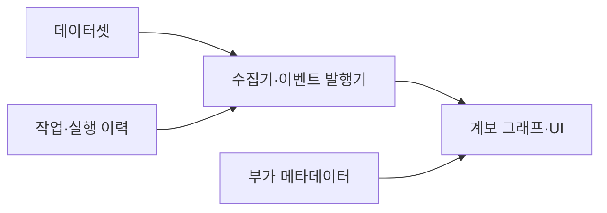
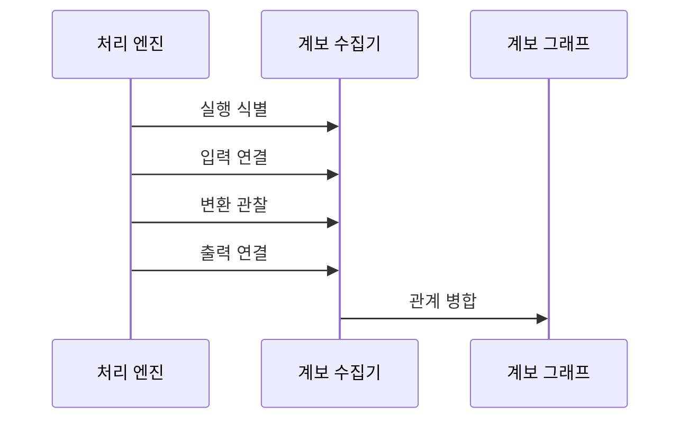

---
sidebar:
  order: 134
  label: "134. 데이터 계보 Data Lineage (Data Lineage)"
  badge:
    text: "미출제 · 50%"
    variant: note
title: "데이터 계보 Data Lineage (Data Lineage)"
date: "2026-07-25T11:38:00+09:00"
tags:
  - "notes-software"
weight: 134
extra:
  question_no: "134"
  source_status: "미출제"
  source_history: ""
  priority: 50
  priority_note: "계보는 영향 분석·감사·품질 추적 핵심"
---

## 미리 알고가기

- **데이터 계보(Data Lineage)**: 데이터가 원천에서 산출물까지 이동·변환된 관계와 실행 이력을 추적하는 정보임
- **데이터셋(Dataset)**: 테이블·파일·토픽처럼 작업이 읽거나 쓰는 데이터 단위임
- **작업(Job)**: 데이터셋을 입력받아 다른 데이터셋을 생성·변경하는 처리 단위임
- **실행 이력(Run)**: 특정 시점에 수행된 작업의 한 인스턴스이며 시작·완료·실패 상태를 가짐
- **열 수준 계보(Column-level Lineage)**: 산출 열이 어떤 원천 열과 변환식에서 생성됐는지 추적하는 관계임
- **영향 분석(Impact Analysis)**: 변경 대상의 하위 데이터셋·작업·보고서 범위를 찾는 분석임
- **원인 분석(Root Cause Analysis)**: 오류 결과에서 상위 원천과 변환 경로를 거슬러 원인을 찾는 분석임
- **네임스페이스(Namespace)**: 서로 다른 시스템의 같은 이름을 구분하도록 자산 식별자의 범위를 정하는 이름 공간임
- **실행 식별자(Run Identifier, Run ID)**: ID를 '아이디'로 읽고 영문 첫 글자로 식별자를 줄여 쓰며 작업의 한 실행을 다른 실행과 구분함
- **수집기(Collector)**: 처리 엔진과 오케스트레이터에서 계보 이벤트와 메타데이터를 가져오는 구성요소임
- **오케스트레이터(Orchestrator)**: 작업 의존성과 일정에 따라 데이터 작업의 실행 순서를 조정하는 시스템임
- **사용자 인터페이스(User Interface, UI)**: 영문 첫 글자를 딴 UI를 '유아이'로 읽으며 사용자가 계보 그래프를 검색·탐색하는 화면임
- **구조적 질의 언어(Structured Query Language, SQL)**: 영문 첫 글자를 딴 SQL을 '에스큐엘'로 읽으며 설계 계보가 분석할 선언형 변환을 표현함

## Ⅰ. 개요

- 정의/개념: 데이터 입출력과 변환 관계를 추적한다
- **배경/필요성**: 변경 영향과 오류 원인 탐색 시간을 줄인다

### 쉽게 이해하기 (학습용)
- 보고서 숫자가 만들어진 과정과 원천을 추적하는 지도임

## Ⅱ. 특징

- 데이터셋·작업 그래프는 영향 탐색 시간을 줄인다
- 열 수준 계보는 잘못된 값의 원천 열을 찾는다
- 설계·실행 계보 비교는 실제 경로 누락을 드러낸다
- 품질·실행 상태 결합은 오류 원인 탐색을 단축한다
- 동적 쿼리·수동 이동 누락은 영향 범위를 빠뜨린다
- 계보 연결만으로 실행 성공과 품질은 보장되지 않는다

### 쉽게 이해하기 (학습용)
- 설계 계보는 예정, 실행 계보는 실제 경로이며 누락이 있음

## Ⅲ. 아키텍처 및 구성요소

| 구성요소 | 설명 |
|:---|:---|
| 데이터셋 | 입출력 테이블·파일을 식별 |
| 작업·실행 이력 | 작업 단위·실행 상태·범위 기록 |
| 부가 메타데이터 | 스키마·소스 코드·품질·소유자 연결 |
| 수집기·이벤트 발행기 | 처리 엔진의 계보 이벤트 수집 |
| 계보 그래프·UI | 경로·열 수준 영향 탐색 |

> 요약: 데이터셋과 작업 및 메타데이터를 그래프로 연결해 추적함

### 쉽게 이해하기 (학습용)
- 자료와 변환 및 실행 기록과 스키마 정보를 연결함

## Ⅳ. 원리 및 절차 흐름도

| 절차 | 설명 |
|:---|:---|
| **실행 식별** | 작업 이름과 고유 실행 ID로 시작 이벤트를 생성함 |
| **입력 연결** | 읽은 데이터셋과 스키마 및 범위를 실행 이력에 연결함 |
| **변환 관찰** | 열 매핑에서 산출 관계와 소스 정보를 추출함 |
| **출력 연결** | 완료 상태와 확인된 출력 데이터셋 및 통계를 기록함 |
| **관계 병합** | 계보 저장소가 실행 이벤트를 작업 그래프에 누적함 |

> 요약: 입력과 출력을 데이터셋 및 작업 그래프에 병합해 구성함

### 쉽게 이해하기 (학습용)
- 작업 시작과 완료 시 입출력을 받아 관계 그래프에 병합함

## Ⅴ. 종류 및 비교

| 판단 기준 | 설계 계보 | 실행 계보 |
|:---|:---|:---|
| 핵심 특징 | 배포 시 선언된 입력과 SQL 정의로 생성함 | 작업 시 실제 읽고 쓴 데이터셋을 관찰함 |
| 주요 활용 | 배포 전 변경 영향 분석과 문서화에 씀 | 장애 원인과 감사 및 품질 결과 추적에 씀 |
| 누락 조건 | 동적 생성 경로를 정적으로 해석하지 못함 | 실행되지 않은 경로와 미계측 작업 누락 |
| 적용 기준 | 설계 영향 분석 | 실제 실행·감사 추적 |
| 주요 위험 | 설계와 실행 불일치 | 수집 누락·경로 폭증 |

> 요약: 전자는 선언을 분석하고 후자는 입출력을 기록함

### 쉽게 이해하기 (학습용)
- 변경 영향 분석은 설계 계보, 장애 추적은 실행 계보임

## Ⅵ. 실무 사례

1. 열 변경 전에 하위 계보로 영향 작업을 찾는다

### 쉽게 이해하기 (학습용)
- 열 변경 전 하위 계보를 탐색하면 영향을 받을 작업과 보고서를 찾아 배포 전에 수정 범위를 정할 수 있음

## Ⅶ. 결론

- 영향·원인 추적 범위로 계보 수집 경계를 정한다

### 쉽게 이해하기 (학습용)
- 데이터 계보의 가치는 그래프 모양이 아니라 누락된 수동·동적 경로를 줄이고 변경 영향과 오류 원인을 더 빨리 찾는 데 있음
