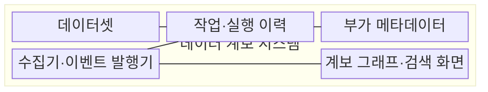
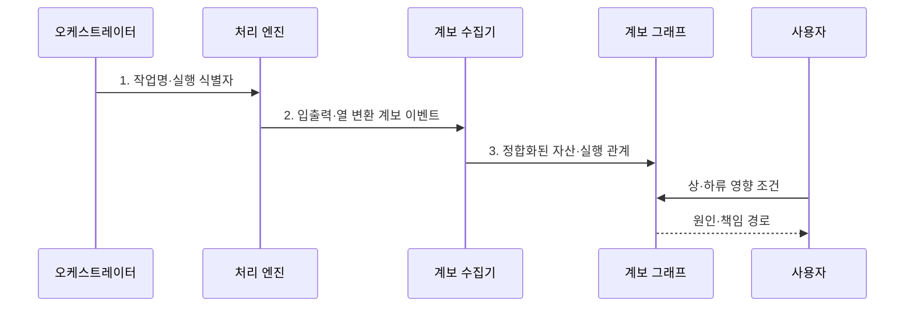

---
sidebar:
  order: 134
  label: "134. 데이터 계보 Data Lineage (Data Lineage)"
  badge:
    text: "미출 · 50%"
    variant: note
title: "데이터 계보 Data Lineage (Data Lineage)"
date: "2026-07-30T23:52:03+09:00"
tags:
  - "notes-software"
weight: 134
extra:
  question_no: "134"
  source_status: "미출"
  source_history: ""
  priority: 50
  priority_note: "계보는 영향 분석·감사·품질 추적 핵심"
---

## 미리 알고가기

- **데이터 계보(Data Lineage)**: 데이터가 원천에서 산출물까지 이동·변환된 관계와 실행 이력을 추적하는 정보이다.
- **데이터셋(Dataset)**: 테이블·파일·토픽처럼 작업이 읽거나 쓰는 데이터 단위이다.
- **작업(Job)**: 데이터셋을 입력받아 다른 데이터셋을 생성·변경하는 처리 단위이다.
- **실행 이력(Run)**: 특정 시점에 수행된 작업의 한 인스턴스이며 시작·완료·실패 상태를 가진다.
- **열 수준 계보(Column-level Lineage)**: 산출 열이 어떤 원천 열과 변환식에서 생성됐는지 추적하는 관계이다.
- **영향 분석(Impact Analysis)**: 변경 대상의 하위 데이터셋·작업·보고서 범위를 찾는 분석이다.
- **원인 분석(Root Cause Analysis)**: 오류 결과에서 상위 원천과 변환 경로를 거슬러 원인을 찾는 분석이다.
- **네임스페이스(Namespace)**: 서로 다른 시스템의 같은 이름을 구분하도록 자산 식별자의 범위를 정하는 이름 공간이다.
- **실행 식별자(Run Identifier, Run ID)**: 작업의 개별 실행을 다른 실행과 구분하는 고유 값이다.
- **수집기(Collector)**: 처리 엔진과 오케스트레이터에서 계보 이벤트와 메타데이터를 가져오는 구성요소이다.
- **오케스트레이터(Orchestrator)**: 작업 의존성과 일정에 따라 데이터 작업의 실행 순서를 조정하는 시스템이다.
- **구조적 질의 언어(Structured Query Language, SQL)**: 설계 계보가 분석할 테이블 조회·변환 관계를 선언하는 언어이다.

> **키워드:** 데이터 계보 Data Lineage (Data Lineage)

## Ⅰ. 개요

- 정의/개념: 원천부터 산출물까지의 **이동·변환 관계와 실행 이력**을 추적하는 메타데이터 체계
- 배경/필요성: 파이프라인별 문서 분산으로 **변경 영향·오류 원인** 추적 제약

### 쉽게 이해하기 (학습용)

- 보고서 숫자가 어느 원료와 공정을 거쳐 만들어졌는지 보여 주는 추적 지도이다.

## Ⅱ. 특징

- 데이터셋·작업 관계를 상·하류로 탐색하는 **방향 그래프**
- 산출 열을 원천 열·변환식과 연결하는 **열 수준 계보**
- 선언 경로와 실제 입출력을 비교하는 **설계·실행 계보 결합**

### 쉽게 이해하기 (학습용)

- 설계 계보는 예정 노선, 실행 계보는 실제 이동 기록이며 둘 다 빠진 길이 없는지 확인해야 한다.

## Ⅲ. 구조 및 구성요소

| 구성요소 | 책임 |
|:---|:---|
| 데이터셋 | **네임스페이스·영속 식별자**로 자산 구분 |
| 작업·실행 이력 | 논리 작업과 **개별 실행 상태·범위** 기록 |
| 부가 메타데이터 | **열 변환식·코드·품질·소유자** 연결 |
| 수집기·이벤트 발행기 | 계보 이벤트 수집과 **식별자 정합화** |
| 계보 그래프·검색 화면 | 데이터셋·작업·열의 **상·하류 탐색** |

### 쉽게 이해하기 (학습용)

- 보고서 숫자가 어떤 원료와 공정을 거쳤는지 보여 준다.

## Ⅳ. 흐름도

**동작 원리**

1. **작업명·실행 식별자**: 실행 요청과 이후 계보 이벤트를 같은 실행으로 연결
2. **입출력·열 변환 계보 이벤트**: 실제 읽은 범위와 열 매핑·산출 상태를 실행에 연결
3. **정합화된 자산·실행 관계**: 시스템별 자산과 작업 실행을 하나의 방향 그래프로 병합

### 쉽게 이해하기 (학습용)

- 작업이 실제로 읽고 쓴 자료와 열 계산식을 운행 기록처럼 모아 관계 지도에 합친다.

## Ⅴ. 종류 및 비교

| 계보 수집 근거 | 설계 계보 | 실행 계보 |
|:---|:---|:---|
| 적용 기준 | **배포 전 영향 분석** | **장애 원인·감사 추적** |
| 핵심 특징 | **SQL·작업 그래프·모델 정의** 분석 | 실제 **읽기·쓰기 이벤트** 관찰 |
| 한계 | 동적 SQL·**수동 데이터 이동** 누락 | 미실행 분기·**미계측 도구** 누락 |

### 쉽게 이해하기 (학습용)

- 공사 전 영향은 설계도, 사고 후 원인은 실제 운행 기록이 더 잘 보여 준다.

## Ⅵ. 실무 고려사항 및 대책

| 고려사항 | 대책 | 효과 |
|:---|:---|:---|
| 시스템별 이름이 겹치면 **자산 관계** 오연결 | **네임스페이스·영속 식별자·별칭 이력** 적용 | 이름 충돌과 **계보 단절** 방지 |
| 일부 처리 엔진이 계보를 보내지 않으면 **경로 공백** 발생 | 핵심 경로 **계측·누락 등록·대사** 적용 | 영향 분석의 **계보 포함률** 향상 |
| 열 변환식을 잘못 추론하면 **열 영향 범위** 오판 | **신뢰도 표시·표본 검증·수동 보정** 적용 | 열 수준 계보의 **정확도** 향상 |
| 개별 실행 이력이 누적되면 **그래프 탐색 지연** 증가 | 논리 계보와 **실행 이력 분리·집계** | 상·하류 경로의 **조회 지연** 감소 |

### 쉽게 이해하기 (학습용)

- 열 하나를 바꾸기 전에 그 열을 쓰는 보고서와 작업을 찾아 고칠 순서를 정한다.

## Ⅶ. 결론

- 변경 전 영향 분석은 **설계 계보**, 장애 후 원인 추적은 **실행 계보** 우선 적용

### 쉽게 이해하기 (학습용)

- 예쁜 지도가 아니라 빠진 길 없이 영향과 원인을 빨리 찾는 지도가 필요하다.
