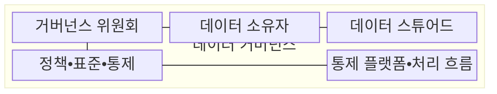
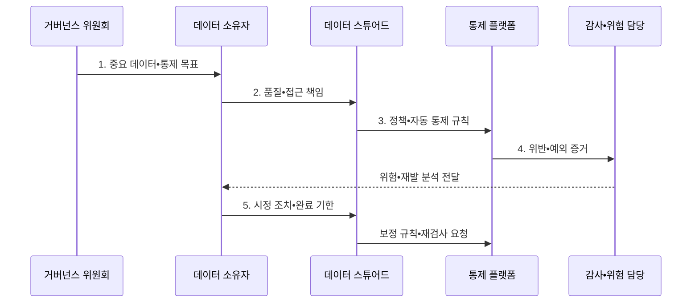

---
sidebar:
  order: 135
  label: "135. 데이터 거버넌스 (Data Governance)"
  badge:
    text: "미출 • 70%"
    variant: note
title: "데이터 거버넌스 (Data Governance)"
date: "2026-08-04T13:35:00+09:00"
tags:
  - "notes-software"
weight: 135
extra:
  question_no: "135"
  source_status: "미출"
  source_history: ""
  priority: 70
  priority_note: "조직•표준•책임을 묶는 상위 데이터 주제"
---

## Ⅰ. 개요

핵심 용어

- **데이터 거버넌스(Data Governance)**: 데이터의 정의•사용•보호•품질에 관한 의사결정권과 책임•정책•감독 절차를 정하는 조직 통제 체계이다.

- 정의/개념: 데이터의 정의•사용•보호•품질에 관한 의사결정권과 책임•정책•감독 절차를 정하는 **데이터 거버넌스(Data Governance)**
- 배경/필요성: 부서별 데이터 정의•정책 불일치로 **의사결정 충돌•책임 공백** 발생

#### 한줄 요약

- 어떤 데이터를 누가 어떤 규칙으로 쓰고 지키며 위반을 고칠지 정하는 책임 체계이다.

## Ⅱ. 특징

핵심 용어

- **역할 분리**: 데이터 소유자의 결정 책임과 스튜어드의 정의•품질 운영 책임을 나누는 원칙이다.
- **위험 기반 우선순위**: 데이터 가치•규제•오류 영향을 평가해 중요 데이터부터 강한 통제를 배치하는 원칙이다.
- **통제 효과 측정**: 정책•표준•시스템 검사와 실제 준수 증거 및 개선 지표를 연결하는 활동이다.

- 중요 데이터부터 통제 강도를 정하는 **위험 기반 우선순위**
- 소유자의 결정과 스튜어드의 운영을 나눈 **역할 분리**
- 정책•표준•통제와 준수 증거를 연결한 **통제 효과 측정**

#### 한줄 요약

- 규칙 문서만 만들지 않고 시스템 검사와 담당자 조치, 결과 지표까지 이어야 한다.

## Ⅲ. 구조 및 구성요소

핵심 용어

- **정책**: 데이터 사용과 보호의 상위 원칙이다.
- **표준**: 정책을 구현하기 위한 공통 기준이다.
- **통제**: 표준 준수 여부를 판정하고 위반을 차단하는 장치이다.
- **거버넌스 위원회**: 정책•통제 목표와 중대한 예외를 승인하는 의사결정 기구이다.
- **데이터 소유자**: 사용 목적•품질 기준•접근 우선순위를 결정하고 결과를 책임지는 역할이다.
- **데이터 스튜어드**: 업무 정의•표준•품질 규칙과 데이터 이슈를 운영하는 역할이다.
- **통제 플랫폼**: 분류•품질•접근 규칙과 실행 증거를 관리하는 구성요소이다.
- **처리 흐름**: 예외 승인과 시정 조치를 담당자에게 연결하는 절차이다.

| 구성요소 | 책임 |
|:---|:---|
| 거버넌스 위원회 | **정책•통제 목표•중대 예외** 승인 |
| 데이터 소유자 | **사용 목적•품질 기준•접근 우선순위** 결정 |
| 데이터 스튜어드 | **정의•표준•품질 규칙•이슈** 운영 |
| 정책•표준•통제 | 원칙을 **구현 기준•준수 검사** 로 변환 |
| 통제 플랫폼•처리 흐름 | **분류•품질•접근•예외•조치 증거** 관리 |

#### 한줄 요약

- 데이터의 주인•검사 규칙•위반 조치 책임을 정한다.

## Ⅳ. 흐름도

핵심 용어

- **4. 위반•예외 증거**: 통제 실행 결과와 승인•변경 이력을 감사 가능한 형태로 기록한 정보이다.
- **1. 중요 데이터•통제 목표**: 가치•규제•위험에 따라 확정한 통제 대상과 강도이다.
- **2. 품질•접근 책임**: 데이터 소유자가 운영 담당자와 승인 범위를 배정한 정보이다.
- **3. 정책•자동 통제 규칙**: 품질•접근•보존 기준을 실행 가능한 검사와 처리 경로로 변환한 규칙이다.
- **5. 시정 조치•완료 기한**: 위반 원인 제거의 담당자와 종료 조건 및 마감 시점이다.

**동작 원리**

1. **중요 데이터•통제 목표**: 가치•규제•위험에 따라 통제 대상과 강도 확정
2. **품질•접근 책임**: 데이터 소유자가 운영 담당자와 승인 범위 배정
3. **정책•자동 통제 규칙**: 품질•접근•보존 기준을 검사와 처리 경로에 집행
4. **위반•예외 증거**: 실행 결과•승인•변경 이력을 감사 가능한 형태로 기록
5. **시정 조치•완료 기한**: 위험•재발 원인에 따라 담당자와 종료 기준 지정

#### 한줄 요약

- 중요한 장부의 주인과 검사 규칙을 정하고 위반 증거를 담당자에게 돌려줘 고친다.

## Ⅴ. 종류 및 비교

핵심 용어

- **데이터 관리(Data Management)**: 거버넌스가 정한 규칙에 따라 모델•품질•보안•보존 등 수명주기 작업을 실행하는 영역이다.

| 데이터 관리 영역 | 데이터 거버넌스 | 데이터 관리 |
|:---|:---|:---|
| 적용 기준 | **의사결정권•정책•책임 설정** | **데이터 수명주기 작업 실행** |
| 핵심 특징 | **소유권•표준•예외•통제 목표** | **모델•품질•보안•보존 작업** |
| 한계 | **형식적 위원회•책임 공백** | **국소 최적화•정책 불일치** |

#### 한줄 요약

- 거버넌스는 규칙과 책임을 정하고 데이터 관리는 그 규칙대로 실제 일을 한다.

## Ⅵ. 실무 고려사항 및 대책

핵심 용어

- **정책 우회**: 만료일 없는 예외가 계속 유지돼 본래 통제를 영구적으로 적용하지 않는 문제이다.
- **중요 데이터 요소(Critical Data Element, CDE)**: 업무•규제 영향이 큰 핵심 데이터이다.
- **위험 등급**: 데이터 영향에 따라 통제 강도를 정한 분류이다.
- **책임•최종 승인•자문•통보(Responsible, Accountable, Consulted, Informed, RACI)**: 의사결정과 실행 역할을 구분하는 책임 체계이다.
- **승인 한도**: 역할별로 결정할 수 있는 권한 범위이다.
- **성과 책임**: 통제 결과와 개선 목표를 맡는 책임이다.
- **정책 추적성**: 상위 원칙과 하위 표준을 연결하는 관계이다.
- **통제 추적성**: 표준과 실행 규칙을 연결하는 관계이다.
- **증거 추적성**: 실행 규칙과 검사 결과를 연결하는 관계이다.
- **보완 통제**: 한시 예외의 위험을 낮추는 대체 수단이다.
- **예외 소유자**: 예외 위험과 종료를 책임지는 주체이다.
- **예외 만료**: 한시 예외를 자동 종료할 시점이다.

| 문제 | 대책 | 효과 |
|:---|:---|:---|
| 모든 데이터에 같은 통제를 적용하면 **통제 비용** 분산 | **CDE•위험 등급**별 차등 통제 | 고위험 데이터에 **통제 자원** 집중 |
| 승인 한도와 책임이 없으면 **결정권 공백** 발생 | **RACI•승인 한도•성과 책임** 명시 | 정책 결정의 **책임 주체** 확정 |
| 정책 문서와 시스템 검사가 다르면 **준수 증거** 단절 | **정책•표준•통제•증거 추적성** 확보 | 문서와 **실행 통제** 일치 |
| 예외 종료일이 없으면 **정책 우회** 가 영구화 | 사유•**보완 통제•소유자•만료** 관리 | 한시 예외의 **자동 종료** 보장 |

#### 한줄 요약

- 고객 연락처의 주인•검사 기준•가림 규칙•예외 종료일을 한 줄로 이어 관리한다.

## Ⅶ. 결론

핵심 용어

- **우선 통제**: 고위험 데이터에 소유자와 통제를 먼저 지정하는 원칙이다.

- 소유자•통제•예외 만료를 우선 지정할 **CDE**

#### 한줄 요약

- 중요한 장부부터 주인과 검사 장치를 정하고 예외가 영구 구멍이 되지 않게 관리한다.
