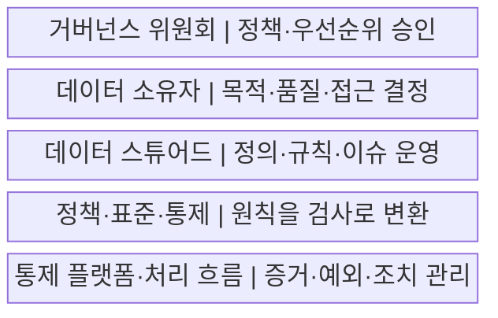
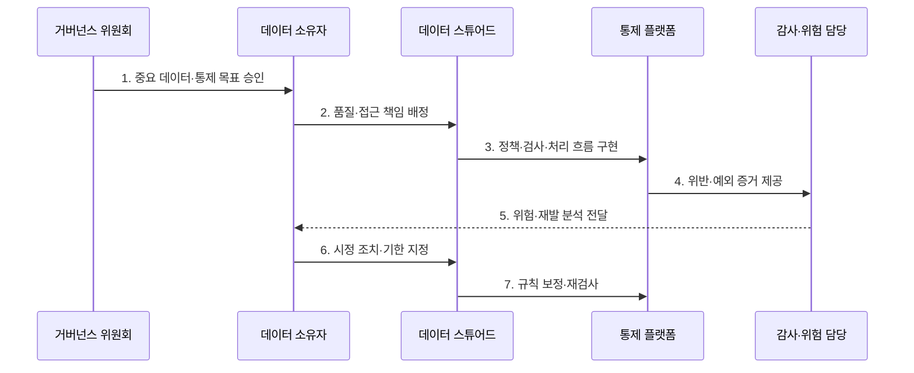

---
sidebar:
  order: 135
  label: "135. 데이터 거버넌스 (Data Governance)"
  badge:
    text: "미출제 · 70%"
    variant: note
title: "데이터 거버넌스 (Data Governance)"
date: "2026-07-25T19:10:00+09:00"
tags:
  - "notes-software"
weight: 135
extra:
  question_no: "135"
  source_status: "미출제"
  source_history: ""
  priority: 70
  priority_note: "조직·표준·책임을 묶는 상위 데이터 주제"
---

## 미리 알고가기

- **데이터 거버넌스(Data Governance)**: 데이터 사용·보호·품질의 의사결정권·책임·정책을 정하고 준수를 감독하는 체계이다.
- **데이터 소유자(Data Owner)**: 데이터의 사용 목적·품질 기준·접근 승인·우선순위를 결정하고 책임지는 역할이다.
- **데이터 스튜어드(Data Steward)**: 정의·표준·품질 규칙·메타데이터를 운영하고 위반 조치를 조정하는 역할이다.
- **중요 데이터 요소(Critical Data Element, CDE)**: 영문 첫 글자를 딴 CDE를 '시디이'로 읽으며 업무·규제 위험 때문에 우선 통제할 데이터 항목이다.
- **정책(Policy)**: 조직이 지켜야 할 데이터 사용·보호 원칙이다.
- **표준(Standard)**: 정책을 일관되게 구현하기 위한 공통 형식·절차·기술 기준이다.
- **통제(Control)**: 정책·표준의 준수 여부를 예방·탐지·교정하는 구체적 검사나 장치이다.
- **데이터 관리(Data Management)**: 거버넌스가 정한 정책을 수집·저장·품질·보안·보존 작업으로 실행하는 활동이다.
- **거버넌스 위원회(Governance Council)**: 여러 조직의 데이터 정책·우선순위·예외를 승인하는 의사결정 기구이다.
- **준수율(Compliance Rate)**: 적용 대상 중 정책과 통제를 만족한 대상의 비율이다.
- **예외 승인(Exception Approval)**: 정책을 즉시 지킬 수 없는 경우 기간·사유·보완 통제를 명시해 한시적으로 허용하는 결정이다.
- **보완 통제(Compensating Control)**: 원래 통제를 적용하지 못할 때 같은 위험을 줄이기 위해 사용하는 대체 통제이다.

## Ⅰ. 개요

- 정의/개념: 데이터의 사용·보호·품질에 관한 **의사결정권과 책임 체계**
- 배경/필요성: 부서별 기준 조정과 **정책의 측정 가능한 통제** 전환

### 쉽게 이해하기 (학습용)

- 어떤 데이터를 누가 어떤 규칙으로 쓰고 지키며 위반을 고칠지 정하는 책임 체계이다.

## Ⅱ. 특징

- **위험 우선순위**: 중요 데이터부터 통제 강도 결정
- **역할 분리**: 소유자는 결정하고 스튜어드는 운영
- **통제 측정**: 정책·표준·통제와 준수 증거를 연결

### 쉽게 이해하기 (학습용)

- 규칙 문서만 만들지 않고 시스템 검사와 담당자 조치, 결과 지표까지 이어야 한다.

## Ⅲ. 구조 및 구성요소

| 구성요소 | 책임 |
|:---|:---|
| 거버넌스 위원회 | 정책·통제 목표·중대 예외 승인 |
| 데이터 소유자 | 사용 목적·품질 기준·접근 우선순위 결정 |
| 데이터 스튜어드 | 정의·표준·품질 규칙·이슈 운영 |
| 정책·표준·통제 | 원칙을 구현 기준과 검사로 변환 |
| 통제 플랫폼·처리 흐름 | 분류·품질·접근·예외·조치 증거 관리 |

### 쉽게 이해하기 (학습용)

- 데이터의 주인·검사 규칙·위반 조치 책임을 정한다.

## Ⅳ. 흐름도

**동작 원리**

- **1. 중요 데이터·통제 목표 승인**: 가치·규제·위험으로 대상을 정
- **2. 품질·접근 책임 배정**: 결정 기준과 운영 역할을 지정
- **3. 정책·검사·처리 흐름 구현**: 표준과 자동 통제를 적용
- **4. 위반·예외 증거 제공**: 실행 결과와 변경 이력을 기록
- **5. 위험·재발 분석 전달**: 미조치와 반복 원인을 통지
- **6. 시정 조치·기한 지정**: 담당자와 완료 기준을 확정
- **7. 규칙 보정·재검사**: 조치 결과를 확인하고 예외를 종료

### 쉽게 이해하기 (학습용)

- 중요한 장부의 주인과 검사 규칙을 정하고 위반 증거를 담당자에게 돌려줘 고친다.

## Ⅴ. 종류 및 비교

| 비교 항목 | 데이터 거버넌스 | 데이터 관리 |
|:---|:---|:---|
| 적용 기준 | **의사결정권·정책·책임 설정** | **데이터 수명주기 작업 실행** |
| 핵심 특징 | 소유권·표준·예외·통제 목표 | 모델·품질·보안·보존 작업 |
| 한계 | 형식적 위원회·책임 공백 | 국소 최적화·정책 불일치 |

### 쉽게 이해하기 (학습용)

- 거버넌스는 규칙과 책임을 정하고 데이터 관리는 그 규칙대로 실제 일을 한다.

## Ⅵ. 실무 고려사항 및 대책

| 고려사항 | 대책 | 효과 |
|:---|:---|:---|
| 적용 범위 | 중요 데이터·위험 등급별 차등 통제 | 통제 비용 집중 |
| 역할 | RACI·승인 한도·성과 책임 명시 | 결정권 공백 방지 |
| 정책 구현 | 정책·표준·통제·증거 추적성 확보 | 문서·시스템 불일치 감소 |
| 지표 | 오류·재발·미조치·잔여 위험 측정 | 통제 효과 확인 |
| 예외 | 사유·보완 통제·소유자·만료 관리 | 영구 우회 방지 |

### 쉽게 이해하기 (학습용)

- 고객 연락처의 주인·검사 기준·가림 규칙·예외 종료일을 한 줄로 이어 관리한다.

## Ⅶ. 결론

- **데이터 중요도·역할 책임·통제 효과·예외 만료**로 데이터 거버넌스를 운영

### 쉽게 이해하기 (학습용)

- 중요한 장부부터 주인과 검사 장치를 정하고 예외가 영구 구멍이 되지 않게 관리한다.
