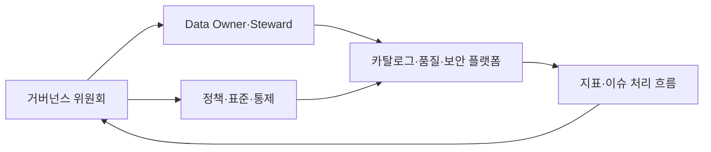
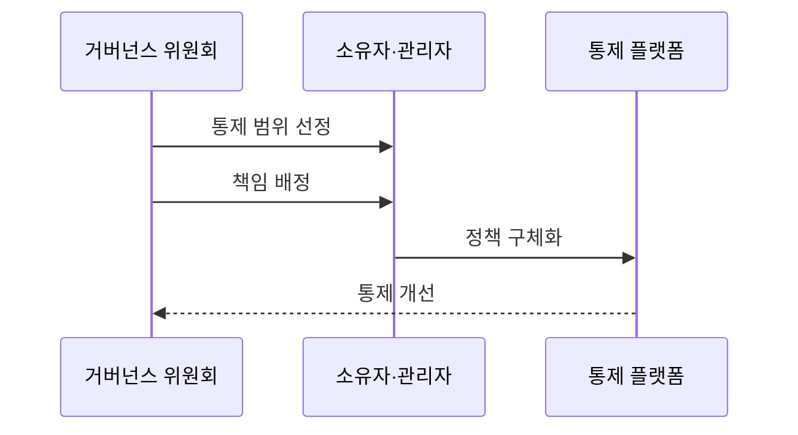

---
sidebar:
  order: 135
  label: "135. 데이터 거버넌스 (Data Governance)"
  badge:
    text: "미출제 · 70%"
    variant: note
title: "데이터 거버넌스 (Data Governance)"
date: "2026-07-25T19:10:00+09:00"
tags:
  - "notes-software"
weight: 135
extra:
  question_no: "135"
  source_status: "미출제"
  source_history: ""
  priority: 70
  priority_note: "조직·표준·책임을 묶는 상위 데이터 주제"
---

## 미리 알고가기

- **데이터 거버넌스(Data Governance)**: 데이터 사용·보호·품질의 의사결정권·책임·정책을 정하고 준수를 감독하는 체계임
- **데이터 소유자(Data Owner)**: 데이터의 사용 목적·품질 기준·접근 승인·우선순위를 결정하고 책임지는 역할임
- **데이터 스튜어드(Data Steward)**: 정의·표준·품질 규칙·메타데이터를 운영하고 위반 조치를 조정하는 역할임
- **중요 데이터 요소(Critical Data Element, CDE)**: 영문 첫 글자를 딴 CDE를 '시디이'로 읽으며 업무·규제 위험 때문에 우선 통제할 데이터 항목임
- **정책(Policy)**: 조직이 지켜야 할 데이터 사용·보호 원칙임
- **표준(Standard)**: 정책을 일관되게 구현하기 위한 공통 형식·절차·기술 기준임
- **통제(Control)**: 정책·표준의 준수 여부를 예방·탐지·교정하는 구체적 검사나 장치임
- **데이터 관리(Data Management)**: 거버넌스가 정한 정책을 수집·저장·품질·보안·보존 작업으로 실행하는 활동임
- **거버넌스 위원회(Governance Council)**: 여러 조직의 데이터 정책·우선순위·예외를 승인하는 의사결정 기구임
- **준수율(Compliance Rate)**: 적용 대상 중 정책과 통제를 만족한 대상의 비율임
- **예외 승인(Exception Approval)**: 정책을 즉시 지킬 수 없는 경우 기간·사유·보완 통제를 명시해 한시적으로 허용하는 결정임
- **보완 통제(Compensating Control)**: 원래 통제를 적용하지 못할 때 같은 위험을 줄이기 위해 사용하는 대체 통제임

## Ⅰ. 개요

- **정의/개념**: 가치·위험·규제에 따라 책임과 정책을 정함
- **배경/필요성**: 부서별 품질·접근 결정이 달라 전사 책임 체계 필요

### 쉽게 이해하기 (학습용)
- 데이터 사용 및 보호 결정을 누가 내리고 실행할지 정하는 책임 체계임

## Ⅱ. 특징

- 규제 위험으로 중요 데이터와 관리 우선순위를 정한다.
- 소유자는 사용·접근을, 스튜어드는 메타데이터를 맡는다.
- 정책·표준을 품질 규칙과 접근 통제로 연결한다.
- 도메인 책임과 전사 공통 용어·식별자를 함께 관리한다.
- 준수율·품질 통과율로 미조치 책임 공백을 찾는다.

### 쉽게 이해하기 (학습용)
- 문서만으로 끝나면 통제가 아니며 시스템 검사와 지표로 이어짐

## Ⅲ. 아키텍처 및 구성요소

| 구성요소 | 설명 |
|:---|:---|
| 거버넌스 위원회 | 정책·우선순위·예외 승인 |
| Data Owner·Steward | 결정권과 규칙 운영 책임 분리 |
| 정책·표준·통제 | 원칙을 구현 기준·자동 검사로 변환 |
| 카탈로그·품질·보안 플랫폼 | 소유권·품질·접근 통제 적용 |
| 지표·이슈 처리 흐름 | 위반 배정·조치 이력 관리 |

> 요약: 정책을 플랫폼 통제로 집행하고 이슈 결과를 책임자에 되돌림

### 쉽게 이해하기 (학습용)
- 위원회와 책임자 및 표준과 통제 및 위반 처리 흐름임

## Ⅳ. 원리 및 절차 흐름도

| 절차 | 설명 |
|:---|:---|
| **통제 범위 선정** | 위험·사업 가치로 중요 데이터 선정 |
| **책임 배정** | 결정권과 규칙 운영 책임 배정 |
| **정책 구체화** | 품질·접근·보존 규칙으로 변환 |
| **통제 개선** | 위반·조치 결과로 정책 보정 |

> 요약: 정책을 시스템 통제로 집행하고 위반 결과를 의사결정에 반영함

### 쉽게 이해하기 (학습용)
- 중요 장부의 주인과 검사 규칙을 정하고 위반 결과로 규칙을 고침

## Ⅴ. 종류 및 비교

| 판단 기준 | 데이터 거버넌스 | 데이터 관리 |
|:---|:---|:---|
| 핵심 특징 | 사용과 보호의 결정권과 책임을 설정함 | 정책에 따라 데이터 수명주기 작업을 수행함 |
| 주요 활동·산출물 | 정책과 표준 및 중요 데이터 요소를 산출함 | 수집과 정제 및 보호를 실행해 파이프라인을 구축함 |
| 측정 기준 | 정책 적용률과 책임 배정률로 측정함 | 품질 통과율과 접근 오류율로 측정함 |
| 적용 기준 | 정책·책임·의사결정 통제 | 데이터 운영 활동 수행 |
| 주요 위험 | 형식적 위원회·책임 공백 | 국소 최적화·정책 불일치 |

> 요약: 거버넌스는 책임을 정하고 관리는 이를 시스템으로 실행함

### 쉽게 이해하기 (학습용)
- 전자는 규칙과 책임을 결정하고 후자는 수집과 품질을 실행함

## Ⅵ. 실무 사례

1. 고객 데이터는 소유자·품질 통과율 공개
2. 민감 데이터는 접근 정책·예외 만료 적용

### 쉽게 이해하기 (학습용)
- 고객 데이터는 Owner와 Steward를 지정하고 품질 통과율·미조치 건수로 책임이 실제 운영되는지 확인함
- 민감 데이터는 접근 정책의 적용률·위반 건수·예외 만료일을 측정해 승인되지 않은 사용을 통제함

## Ⅶ. 결론

- 데이터 위험도로 통제·책임·예외 범위 결정

### 쉽게 이해하기 (학습용)
- 데이터 거버넌스는 모든 데이터를 같은 강도로 통제하는 일이 아니라 중요한 데이터부터 결정권자·실행 책임·자동 통제·예외 만료를 명확히 하는 체계임
