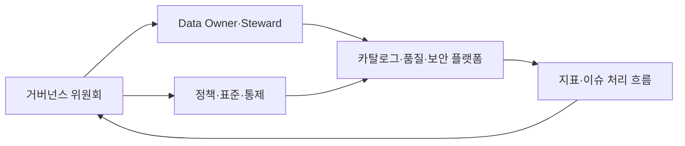
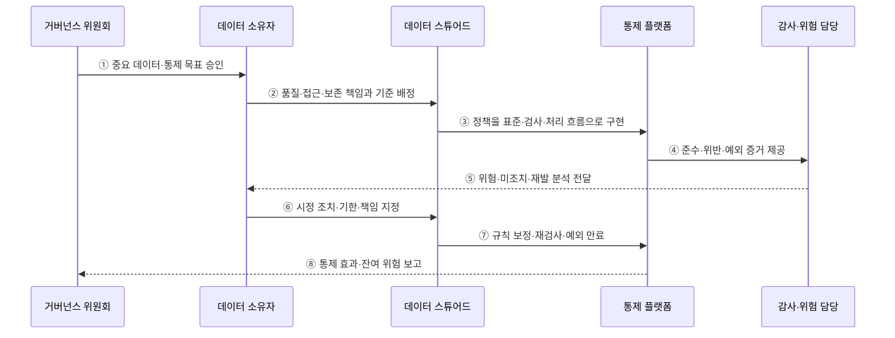

---
sidebar:
  order: 135
  label: "135. 데이터 거버넌스 (Data Governance)"
  badge:
    text: "미출제 · 70%"
    variant: note
title: "데이터 거버넌스 (Data Governance)"
date: "2026-07-25T19:10:00+09:00"
tags:
  - "notes-software"
weight: 135
extra:
  question_no: "135"
  source_status: "미출제"
  source_history: ""
  priority: 70
  priority_note: "조직·표준·책임을 묶는 상위 데이터 주제"
---

## 미리 알고가기

- **데이터 거버넌스(Data Governance)**: 데이터 사용·보호·품질의 의사결정권·책임·정책을 정하고 준수를 감독하는 체계임
- **데이터 소유자(Data Owner)**: 데이터의 사용 목적·품질 기준·접근 승인·우선순위를 결정하고 책임지는 역할임
- **데이터 스튜어드(Data Steward)**: 정의·표준·품질 규칙·메타데이터를 운영하고 위반 조치를 조정하는 역할임
- **중요 데이터 요소(Critical Data Element, CDE)**: 영문 첫 글자를 딴 CDE를 '시디이'로 읽으며 업무·규제 위험 때문에 우선 통제할 데이터 항목임
- **정책(Policy)**: 조직이 지켜야 할 데이터 사용·보호 원칙임
- **표준(Standard)**: 정책을 일관되게 구현하기 위한 공통 형식·절차·기술 기준임
- **통제(Control)**: 정책·표준의 준수 여부를 예방·탐지·교정하는 구체적 검사나 장치임
- **데이터 관리(Data Management)**: 거버넌스가 정한 정책을 수집·저장·품질·보안·보존 작업으로 실행하는 활동임
- **거버넌스 위원회(Governance Council)**: 여러 조직의 데이터 정책·우선순위·예외를 승인하는 의사결정 기구임
- **준수율(Compliance Rate)**: 적용 대상 중 정책과 통제를 만족한 대상의 비율임
- **예외 승인(Exception Approval)**: 정책을 즉시 지킬 수 없는 경우 기간·사유·보완 통제를 명시해 한시적으로 허용하는 결정임
- **보완 통제(Compensating Control)**: 원래 통제를 적용하지 못할 때 같은 위험을 줄이기 위해 사용하는 대체 통제임

## Ⅰ. 개요

- 데이터 거버넌스는 데이터의 가치·위험·규제에 따라 사용·보호·품질에 관한 의사결정권, 책임, 정책, 감독 방식을 정하는 체계이다.
- 부서마다 다른 정의·품질·접근 결정을 전사 원칙과 도메인 책임으로 조정하고 정책을 측정 가능한 통제로 연결한다.

### 쉽게 이해하기 (학습용)

- 어떤 데이터를 누가 어떤 규칙으로 쓰고 지키며 위반을 고칠지 정하는 책임 체계이다.

## Ⅱ. 특징

- **위험 기반 우선순위**: 업무·고객·규제 영향이 큰 중요 데이터 요소부터 통제 강도와 자원을 배정한다.
- **의사결정권 분리**: 소유자는 목적·품질·접근을 결정하고 스튜어드는 정의·규칙·이슈 조치를 운영한다.
- **정책 계층화**: 원칙인 정책을 공통 표준과 예방·탐지·교정 통제로 구체화한다.
- **연합 책임**: 전사 용어·식별자·보안 기준과 도메인별 데이터 책임을 함께 운영한다.
- **측정과 개선**: 준수율·품질·예외·미조치·재발 지표로 통제 효과와 책임 공백을 찾는다.

### 쉽게 이해하기 (학습용)

- 규칙 문서만 만들지 않고 시스템 검사와 담당자 조치, 결과 지표까지 이어야 한다.

## Ⅲ. 아키텍처 및 구성요소

**도표안 A — 구조도**

**도표안 B — sequenceDiagram**

| 구성요소 | 설명 |
|:---|:---|
| 거버넌스 위원회 | 정책·통제 목표·우선순위·중대 예외 승인 |
| 데이터 소유자 | 사용 목적·품질 기준·접근·투자 우선순위 결정 |
| 데이터 스튜어드 | 정의·표준·품질 규칙·메타데이터·이슈 운영 |
| 정책·표준·통제 | 원칙을 공통 구현 기준과 예방·탐지·교정 검사로 변환 |
| 카탈로그·품질·보안 플랫폼 | 소유권·분류·품질·접근·보존 통제와 증거 기록 |
| 지표·이슈 처리 흐름 | 위반·예외·조치 기한·재검사·잔여 위험 관리 |

**동작 원리**

- ① 거버넌스 위원회가 가치·규제·위험을 기준으로 중요 데이터와 통제 목표를 승인한다.
- ② 데이터 소유자가 품질·접근·보존의 결정 기준과 운영 책임을 스튜어드에게 배정한다.
- ③ 스튜어드가 정책을 표준 정의·자동 검사·승인·위반 처리 흐름으로 플랫폼에 구현한다.
- ④ 플랫폼이 통제 실행 결과와 위반·예외·변경 이력을 감사 가능한 증거로 제공한다.
- ⑤ 감사·위험 담당이 위험 수준·미조치 기간·재발 원인을 분석해 소유자에게 전달한다.
- ⑥ 소유자가 시정 조치의 우선순위·담당자·완료 기한·수용할 잔여 위험을 결정한다.
- ⑦ 스튜어드가 규칙을 보정하고 재검사하며 기한이 지난 예외를 종료하거나 재승인한다.
- ⑧ 플랫폼이 준수율뿐 아니라 통제 효과·예외 추세·잔여 위험을 위원회에 보고한다.

### 쉽게 이해하기 (학습용)

- 중요한 장부의 주인과 검사 규칙을 정하고 위반 증거를 담당자에게 돌려줘 고친다.

## Ⅳ. 종류 및 비교

| 비교 항목 | 데이터 거버넌스 | 데이터 관리 |
|:---|:---|:---|
| 중심 질문 | 누가 무엇을 어떤 원칙으로 결정하는가 | 정한 원칙을 어떻게 수명주기 작업으로 실행하는가 |
| 주요 산출물 | 정책·표준·소유권·중요 데이터·예외 결정 | 모델·파이프라인·품질 검사·보안·보존 작업 |
| 책임 역할 | 위원회·소유자·스튜어드·위험 담당 | 아키텍트·엔지니어·운영자·보안 담당 |
| 측정 | 책임 배정·통제 효과·예외·잔여 위험 | 품질·처리·가용성·접근·보존 성과 |
| 주요 위험 | 형식적 위원회·책임 공백·문서 정책 | 국소 최적화·정책 불일치·운영 누락 |

> 거버넌스와 관리는 분리된 조직이 아니라 의사결정과 실행의 관계이며, 둘 중 하나가 없으면 정책 또는 운영이 공회전한다.

### 쉽게 이해하기 (학습용)

- 거버넌스는 규칙과 책임을 정하고 데이터 관리는 그 규칙대로 실제 일을 한다.

## Ⅴ. 실무 고려사항 및 대책

| 고려사항 | 위험 | 대책 |
|:---|:---|:---|
| 적용 범위 | 모든 데이터에 같은 통제로 비용 폭증 | 중요 데이터·위험 등급별 차등 통제 |
| 역할 | 이름만 지정하고 결정권·시간 없음 | RACI·승인 한도·예산·성과 책임 명시 |
| 정책 구현 | 문서와 시스템 동작 불일치 | 정책-표준-통제-증거 추적성 |
| 지표 | 적용률만 높고 위험은 줄지 않음 | 오류·노출·재발·미조치·잔여 위험 측정 |
| 예외 | 영구 우회 경로로 고착 | 사유·보완 통제·소유자·만료·재승인 |
| 변화 관리 | 규칙 변경이 현장과 소비자에게 갑자기 영향 | 영향 분석·공지·유예·교육·되돌리기 |

> **적용 사례**: 고객 연락처를 중요 데이터 요소로 지정하고 Owner와 Steward, 허용 목적, 품질 기준, 마스킹 통제, 예외 만료일을 연결해 위반과 미조치를 추적한다.

### 쉽게 이해하기 (학습용)

- 고객 연락처의 주인·검사 기준·가림 규칙·예외 종료일을 한 줄로 이어 관리한다.

## Ⅵ. 결론

- 데이터 거버넌스의 핵심은 모든 데이터를 강하게 통제하는 것이 아니라 중요한 위험에 결정권과 실행 책임을 붙이고 통제 효과를 증명하는 데 있다.
- 중요 데이터·소유자와 스튜어드·자동 통제·예외 만료·시정 조치·잔여 위험을 연결해 지속 개선해야 한다.

### 쉽게 이해하기 (학습용)

- 중요한 장부부터 주인과 검사 장치를 정하고 예외가 영구 구멍이 되지 않게 관리한다.
