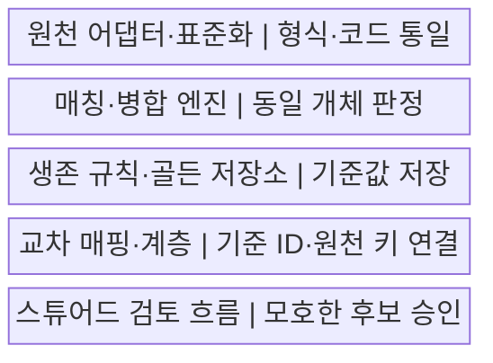
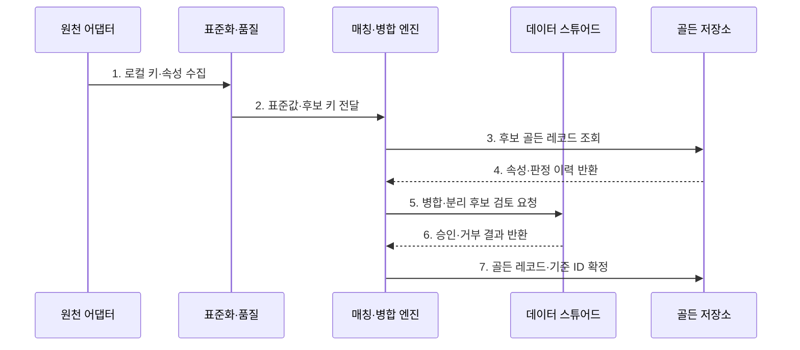

---
sidebar:
  order: 136
  label: "136. 마스터 데이터 관리 MDM (Master Data Management)"
  badge:
    text: "미출제 · 50%"
    variant: note
title: "마스터 데이터 관리 MDM (Master Data Management)"
date: "2026-07-25T19:11:00+09:00"
tags:
  - "notes-software"
weight: 136
extra:
  question_no: "136"
  source_status: "미출제"
  source_history: ""
  priority: 50
  priority_note: "기준정보 일관성·중복 통제 설계 가치"
---

## 미리 알고가기

- **마스터 데이터 관리(Master Data Management, MDM)**: 영문 첫 글자를 딴 MDM을 '엠디엠'으로 읽으며 여러 원천의 공통 개체를 식별·통합·배포하는 체계임
- **마스터 데이터(Master Data)**: 고객·상품·조직·공급자처럼 여러 업무가 공통 참조하는 기준 개체 데이터임
- **매칭(Match)**: 여러 원천 레코드가 같은 실제 개체인지 규칙·확률로 판정하는 과정임
- **병합(Merge)**: 같은 개체로 판정된 레코드를 하나의 기준 개체로 통합하는 과정임
- **생존 규칙(Survivorship)**: 원천 신뢰도·최신성·완전성으로 속성별 기준값을 결정하는 규칙임
- **골든 레코드(Golden Record)**: 중복 제거·병합·승인을 거쳐 개체별 기준으로 제공하는 레코드임
- **교차 매핑(Crosswalk)**: ID를 '아이디'로 읽고 식별자의 영문 첫 글자를 줄여 쓰며 기준 ID와 각 원천의 로컬 키를 연결함
- **레지스트리(Registry)**: 중앙 허브가 원천 키의 식별 링크를 관리하고 속성은 원천에 유지하는 방식임
- **통합(Consolidation)**: 여러 원천을 중앙 Golden Record로 단방향 통합해 주로 분석에 제공하는 방식임
- **공존(Coexistence)**: 중앙 기준과 원천 시스템이 변경을 양방향 동기화하는 방식임
- **트랜잭션 허브(Transaction Hub)**: 중앙 허브가 기준 레코드의 권위 있는 생성·변경 경로를 제공하는 방식임
- **소스 어댑터(Source Adapter)**: 원천별 형식과 연결 방식의 차이를 흡수해 레코드와 변경을 수집하는 구성요소임
- **데이터 스튜어드십(Data Stewardship)**: 모호한 매칭·품질 위반·기준값을 사람이 검토·승인하는 운영 활동임
- **오병합(False Merge)**: 서로 다른 실제 개체를 하나의 Golden Record로 잘못 합친 오류임
- **과소 병합(False Split)**: 같은 실제 개체를 서로 다른 Golden Record로 남긴 오류임

## Ⅰ. 개요

- **정의/개념**: 여러 원천의 공통 개체를 식별·통합·배포하는 **기준정보 관리 체계**이다.
- **배경/필요성**: 서로 다른 키·속성값으로 생기는 **중복·불일치**를 조정한다.

### 쉽게 이해하기 (학습용)

- 여러 장부의 같은 사람이나 상품을 찾아 하나의 기준 신분표로 연결한다.

## Ⅱ. 특징

- **표준화·매칭**: 형식을 통일하고 동일 개체를 판정한다.
- **생존 규칙**: 속성별 신뢰 원천과 기준값을 정한다.
- **교차 매핑**: 기준 ID와 원천별 로컬 키를 연결한다.

### 쉽게 이해하기 (학습용)

- 비슷하다고 무조건 합치지 않고 값의 우선순위와 애매한 경우의 사람 검토가 필요하다.

## Ⅲ. 구조 및 구성요소

| 구성요소 | 책임 |
|:---|:---|
| 원천 어댑터·표준화 | 로컬 키·속성 수집과 형식·코드 통일 |
| 매칭·병합 엔진 | 후보 축소·동일 개체·병합 판정 |
| 생존 규칙·골든 저장소 | 기준값·출처·판정 이력 저장 |
| 교차 매핑·계층 | 기준 ID와 원천 키·개체 관계 연결 |
| 스튜어드 검토 흐름 | 모호한 후보·품질 위반·분리 승인 |

### 쉽게 이해하기 (학습용)

- 여러 장부의 같은 사람을 하나의 기준 신분표에 연결한다.

## Ⅳ. 흐름도

**동작 원리**

- **1. 로컬 키·속성 수집**: 변경 시각과 출처를 함께 읽는다.
- **2. 표준값·후보 키 전달**: 형식·코드·주소를 통일한다.
- **3. 후보 골든 레코드 조회**: 검색 키로 비교 대상을 좁힌다.
- **4. 속성·판정 이력 반환**: 원천 매핑과 이전 근거를 제공한다.
- **5. 병합·분리 후보 검토 요청**: 모호한 판정을 스튜어드에게 보낸다.
- **6. 승인·거부 결과 반환**: 수동 판정과 규칙 보정을 전달한다.
- **7. 골든 레코드·기준 ID 확정**: 생존 규칙과 교차 매핑을 저장한다.

### 쉽게 이해하기 (학습용)

- 기록 형식을 맞추고 같은 사람 후보를 찾은 뒤 애매한 건을 확인해 기준 신분표와 원래 장부 번호를 연결한다.

## Ⅴ. 종류 및 비교

| 비교 항목 | Registry | Consolidation | Coexistence | Transaction Hub |
|:---|:---|:---|:---|:---|
| 적용 기준 | **원천 영향 최소화** | **분석용 기준 통합** | **기존 시스템 양방향 공유** | **중앙 생성·변경 통제** |
| 핵심 특징 | 식별 링크·Crosswalk | 단방향 골든 사본 | 양방향 동기화 | 권위 있는 골든 레코드 |
| 한계 | 원천 불일치 잔존 | 최신성 지연 | 충돌·동기화 복잡도 | 중앙 장애·강한 종속 |

### 쉽게 이해하기 (학습용)

- 중앙이 번호만 연결할지, 사본을 모을지, 서로 고칠지, 원본 자체가 될지에 따라 나뉜다.

## Ⅵ. 실무 고려사항 및 대책

| 고려사항 | 대책 | 효과 |
|:---|:---|:---|
| 후보 축소 | 다중 Blocking Key·재현율 평가 | 비교 비용·후보 누락 감소 |
| 임계값 | 자동 병합·검토·분리 구간 설정 | 오병합·과소 병합 조정 |
| 생존 규칙 | 속성별 권위 원천·유효성 명시 | 기준값 오판 방지 |
| 되돌리기 | 판정 이력·분리·재배포 절차 수립 | 오병합 전파 복구 |
| 소유권 | 속성별 변경 방향·충돌 정책 정의 | 경쟁 갱신 방지 |

### 쉽게 이해하기 (학습용)

- 잘못 합친 고객과 놓친 중복 고객, 사람이 확인한 시간까지 함께 재야 한다.

## Ⅶ. 결론

- **매칭 정확도·생존 규칙·되돌리기·속성 소유권**으로 MDM을 운영한다.

### 쉽게 이해하기 (학습용)

- 기준 신분표가 많다는 것보다 왜 합쳤고 어느 값이 어디서 왔으며 잘못되면 되돌릴 수 있는지가 중요하다.
