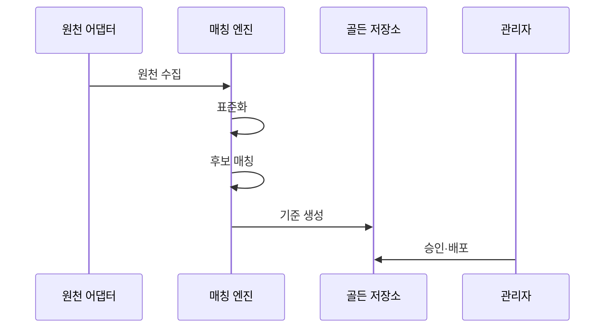

---
sidebar:
  order: 136
  label: "136. 마스터 데이터 관리 MDM (Master Data Management)"
  badge:
    text: "미출제 · 50%"
    variant: note
title: "마스터 데이터 관리 MDM (Master Data Management)"
date: "2026-07-25T19:11:00+09:00"
tags:
  - "notes-software"
weight: 136
extra:
  question_no: "136"
  source_status: "미출제"
  source_history: ""
  priority: 50
  priority_note: "기준정보 일관성·중복 통제 설계 가치"
---

## 미리 알고가기

- **마스터 데이터 관리(Master Data Management, MDM)**: 영문 첫 글자를 딴 MDM을 '엠디엠'으로 읽으며 여러 원천의 공통 개체를 식별·통합·배포하는 체계임
- **마스터 데이터(Master Data)**: 고객·상품·조직·공급자처럼 여러 업무가 공통 참조하는 기준 개체 데이터임
- **매칭(Match)**: 여러 원천 레코드가 같은 실제 개체인지 규칙·확률로 판정하는 과정임
- **병합(Merge)**: 같은 개체로 판정된 레코드를 하나의 기준 개체로 통합하는 과정임
- **생존 규칙(Survivorship)**: 원천 신뢰도·최신성·완전성으로 속성별 기준값을 결정하는 규칙임
- **골든 레코드(Golden Record)**: 중복 제거·병합·승인을 거쳐 개체별 기준으로 제공하는 레코드임
- **교차 매핑(Crosswalk)**: ID를 '아이디'로 읽고 식별자의 영문 첫 글자를 줄여 쓰며 기준 ID와 각 원천의 로컬 키를 연결함
- **레지스트리(Registry)**: 중앙 허브가 원천 키의 식별 링크를 관리하고 속성은 원천에 유지하는 방식임
- **통합(Consolidation)**: 여러 원천을 중앙 Golden Record로 단방향 통합해 주로 분석에 제공하는 방식임
- **공존(Coexistence)**: 중앙 기준과 원천 시스템이 변경을 양방향 동기화하는 방식임
- **트랜잭션 허브(Transaction Hub)**: 중앙 허브가 기준 레코드의 권위 있는 생성·변경 경로를 제공하는 방식임
- **소스 어댑터(Source Adapter)**: 원천별 형식과 연결 방식의 차이를 흡수해 레코드와 변경을 수집하는 구성요소임
- **데이터 스튜어드십(Data Stewardship)**: 모호한 매칭·품질 위반·기준값을 사람이 검토·승인하는 운영 활동임
- **오병합(False Merge)**: 서로 다른 실제 개체를 하나의 Golden Record로 잘못 합친 오류임
- **과소 병합(False Split)**: 같은 실제 개체를 서로 다른 Golden Record로 남긴 오류임

## Ⅰ. 개요

- 정의/개념: 여러 원천의 개체를 매칭해 기준 데이터를 제공함
- **배경/필요성**: 원천별 식별자가 달라 같은 개체의 기준 통합 필요

### 쉽게 이해하기 (학습용)
- 서로 다른 기록을 같은 개체로 찾아 기준 데이터로 통합함

## Ⅱ. 특징

- 표준화·유사도 규칙으로 동일 개체를 판정한다.
- 생존 규칙으로 속성 충돌을 풀어 기준값을 만든다.
- 기준 ID·로컬 키 매핑으로 기존 시스템과 연결한다.
- 스튜어드 검토로 오병합·과소 병합 피해를 줄인다.
- 배포 방식으로 원천과 기준 데이터의 충돌을 통제한다.

### 쉽게 이해하기 (학습용)
- 자동 매칭뿐 아니라 우선순위와 관리자 검토가 필요함

## Ⅲ. 아키텍처 및 구성요소

| 구성요소 | 설명 |
|:---|:---|
| 소스 어댑터·표준화 | 원천 수집·형식·유효성 통일 |
| 매칭·병합 엔진 | 동일 개체 점수와 병합·분리 판정 |
| 생존 규칙·골든 저장소 | 속성별 기준값·판정 이력 저장 |
| 교차 매핑·계층 | 기준 ID·원천 키·계층 연결 |
| 관리자 검토 흐름 | 모호한 후보 검토·승인 이력 관리 |

> 요약: 표준화와 매칭 및 관리자 검토가 원천을 기준 데이터로 통합함

### 쉽게 이해하기 (학습용)
- 원천 연결기, 정제 매칭기, 기준 저장소와 검토 흐름임

## Ⅳ. 원리 및 절차 흐름도

| 절차 | 설명 |
|:---|:---|
| **원천 수집** | 속성과 로컬 키 및 변경 시각을 수집해 적재함 |
| **표준화** | 형식을 통일하고 유효하지 않은 레코드를 분리함 |
| **후보 매칭** | 검색 키로 대상을 줄이고 규칙으로 동일 개체를 판정함 |
| **기준 생성** | 개체를 병합하고 규칙으로 속성별 기준값을 선택함 |
| **승인·배포** | 애매한 후보를 검토하고 기준 ID와 매핑을 제공함 |

> 요약: 원천을 표준화해 개체를 판정하고 승인으로 기준 데이터를 확정함

### 쉽게 이해하기 (학습용)
- 이름을 표준화하고 동일 고객을 찾아 우선순위로 기준값을 선택함

## Ⅴ. 종류 및 비교

| 판단 기준 | Registry | Consolidation | Coexistence | Transaction Hub |
|:---|:---|:---|:---|:---|
| 핵심 특징 | 허브는 원천 키와 식별 링크를 저장함 | 단방향 수집해 분석용 기준 데이터를 저장함 | 허브와 원천이 상호 갱신함 | 허브가 기준 레코드를 저장하고 업무가 갱신함 |
| 배포 방식 | 조회 시 원천 위치를 연결함 | 배치로 통합 결과를 제공함 | 변경 이벤트로 양방향 배포함 | 서비스로 트랜잭션을 제공함 |
| 주요 통제 | 중복 식별과 매핑을 통제함 | 매칭 병합과 일관성을 통제함 | 소유권과 충돌을 조정함 | 가용성과 트랜잭션을 통제함 |
| 적용 기준 | 원천 유지·식별 연결 | 중앙 정제 사본 | 양방향 동기화 | 중앙 허브 직접 갱신 |
| 주요 위험 | 원천 불일치 잔존 | 배치 지연·중복 | 충돌·동기화 복잡도 | 허브 장애·강한 종속 |

> 요약: 소유권과 갱신 범위에 따라 네 가지 구현 방식을 선택함

### 쉽게 이해하기 (학습용)
- 기준 데이터를 어디에 저장하고 어떻게 배포할지에 따라 나뉨

## Ⅵ. 실무 사례

1. 고객 기준은 매칭 규칙으로 중복 개체 병합
2. 상품 기준은 표준 코드·원천 키 매핑 배포

### 쉽게 이해하기 (학습용)
- 고객 기준은 중복률뿐 아니라 오병합·과소 병합·Steward 검토 시간을 측정해 식별 정확도와 운영 비용을 함께 판단함
- 상품 기준 코드를 배포한 뒤 미매핑 원천 키와 반영 지연을 확인해 각 업무가 같은 상품을 실제로 참조하는지 검증함

## Ⅶ. 결론

- 식별 오류·소유권으로 병합·배포 방식 결정

### 쉽게 이해하기 (학습용)
- MDM은 Golden Record 수보다 오병합을 되돌리고 각 속성의 출처·판정 규칙·배포 상태를 추적할 수 있어야 신뢰할 수 있음
