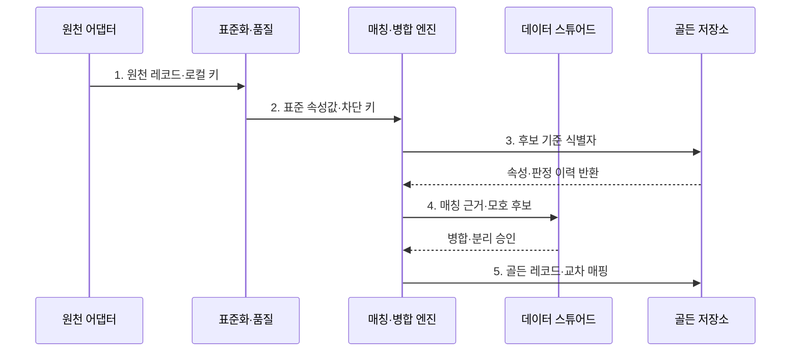

---
sidebar:
  order: 136
  label: "136. 마스터 데이터 관리 MDM (Master Data Management)"
  badge:
    text: "미출 · 50%"
    variant: note
title: "마스터 데이터 관리 MDM (Master Data Management)"
date: "2026-08-02T12:00:00+09:00"
tags:
  - "notes-software"
weight: 136
extra:
  question_no: "136"
  source_status: "미출"
  source_history: ""
  priority: 50
  priority_note: "기준정보 일관성·중복 통제 설계 가치"
---

## Ⅰ. 개요

핵심 용어

- **기준정보 체계**: 여러 원천의 고객·상품 같은 공통 개체를 식별·통합·배포하는 체계이다.

- 정의/개념: **MDM**은 여러 원천의 고객·상품 같은 공통 개체를 식별·정합·통합하여 신뢰할 기준정보로 배포하는 관리 체계
- 배경/필요성: 원천별 키·속성 차이로 **고객 중복 집계·상품 기준 불일치** 발생

### 쉽게 이해하기 (학습용)

- 여러 장부의 같은 사람이나 상품을 찾아 하나의 기준 신분표로 연결한다.

## Ⅱ. 특징

핵심 용어

- **생존 규칙**: 원천 신뢰도·최신성·완전성으로 속성별 기준값을 결정하는 규칙이다.

- **표준화·매칭**으로 원천 형식을 통일하고 동일 개체 판정
- **생존 규칙**으로 속성별 신뢰 원천과 기준값 결정
- **교차 매핑**으로 기준 식별자와 원천별 로컬 키 연결

### 쉽게 이해하기 (학습용)

- 비슷하다고 무조건 합치지 않고 값의 우선순위와 애매한 경우의 사람 검토가 필요하다.

## Ⅲ. 구조 및 구성요소

핵심 용어

- **매칭·병합 엔진**: 후보 레코드를 줄이고 동일 개체 여부와 통합 결과를 판정하는 구성요소이다.

| 구성요소 | 책임 |
|:---|:---|
| 원천 어댑터·표준화 | 로컬 키·속성 수집과 **형식·코드 통일** |
| 매칭·병합 엔진 | 후보 축소와 **동일 개체·병합 판정** |
| 생존 규칙·골든 저장소 | **기준값·출처·판정 이력** 저장 |
| 교차 매핑·계층 | **기준 식별자·원천 키·개체 관계** 연결 |
| 스튜어드 검토 흐름 | 모호한 후보의 **병합·분리 승인** |

### 쉽게 이해하기 (학습용)

- 여러 장부의 같은 사람을 하나의 기준 신분표에 연결한다.

## Ⅳ. 흐름도

핵심 용어

- **5. 골든 레코드·교차 매핑**: 선정한 기준 속성과 원천별 키를 하나의 기준 식별자에 저장하는 단계이다.

**동작 원리**

1. **원천 레코드·로컬 키**: 출처·변경 시각과 함께 원천 개체를 표준화 단계에 전달
2. **표준 속성값·차단 키**: 코드·주소·형식을 통일하고 비교 후보 집합 축소
3. **후보 기준 식별자**: 원천 매핑과 이전 판정 이력을 기준으로 비교 대상 조회
4. **매칭 근거·모호 후보**: 유사도·생존 규칙의 판정 근거를 스튜어드에게 제공
5. **골든 레코드·교차 매핑**: 생존 속성과 원천별 키를 단일 기준 식별자에 저장

### 쉽게 이해하기 (학습용)

- 기록 형식을 맞추고 같은 사람 후보를 찾은 뒤 애매한 건을 확인해 기준 신분표와 원래 장부 번호를 연결한다.

## Ⅴ. 종류 및 비교

핵심 용어

- **Registry**: 원천 속성은 유지하면서 중앙에서 기준 식별자와 로컬 키의 연결을 관리하는 MDM 방식이다.

| MDM 구축 방식 | Registry | Consolidation | Coexistence | Transaction Hub |
|:---|:---|:---|:---|:---|
| 적용 기준 | **원천 영향 최소화** | **분석용 기준 통합** | **기존 시스템 양방향 공유** | **중앙 생성·변경 통제** |
| 핵심 특징 | **식별 링크·교차 매핑** | 단방향 **골든 레코드 사본** | **양방향 동기화** | 권위 있는 **골든 레코드** |
| 한계 | **원천 불일치** 잔존 | 기준정보 **최신성 지연** | **충돌·동기화 복잡도** | **중앙 장애·강한 종속성** |

### 쉽게 이해하기 (학습용)

- 중앙이 번호만 연결할지, 사본을 모을지, 서로 고칠지, 원본 자체가 될지에 따라 나뉜다.

## Ⅵ. 실무 고려사항 및 대책

핵심 용어

- **오병합·과소 병합**: 서로 다른 개체를 합치거나 같은 개체를 나눠 두는 두 가지 매칭 오류이다.

| 문제 | 대책 | 효과 |
|:---|:---|:---|
| 차단 키가 좁으면 **후보 누락**, 넓으면 비교량 급증 | 다중 **차단 키·후보 재현율** 평가 | 매칭의 **비교 비용·후보 누락** 균형 |
| 매칭 임계값이 부정확하면 **오병합·과소 병합** 증가 | 자동 병합·검토·분리 **임계 구간** 설정 | 병합 오류의 **유형별 통제** |
| 속성별 신뢰 원천이 없으면 **골든 레코드 값** 오판 | 속성별 **권위 원천·유효성 규칙** 명시 | 기준값의 **출처·선정 근거** 확보 |
| 오병합 이력이 없으면 잘못된 기준정보의 **전파 복구** 불가 | **판정 이력·분리·재배포 절차** 수립 | 오병합의 **되돌리기·재동기화** 가능 |

### 쉽게 이해하기 (학습용)

- 잘못 합친 고객과 놓친 중복 고객, 사람이 확인한 시간까지 함께 재야 한다.

## Ⅶ. 결론

핵심 용어

- **Consolidation**: 여러 원천을 중앙 골든 레코드로 단방향 통합해 분석에 제공하는 MDM 방식이다.

- 원천 영향 최소화는 **Registry**, 분석 통합은 **Consolidation** 선택
- 양방향 공유는 **Coexistence**, 중앙 통제는 **Hub** 선택

### 쉽게 이해하기 (학습용)

- 기준 신분표가 많다는 것보다 왜 합쳤고 어느 값이 어디서 왔으며 잘못되면 되돌릴 수 있는지가 중요하다.
