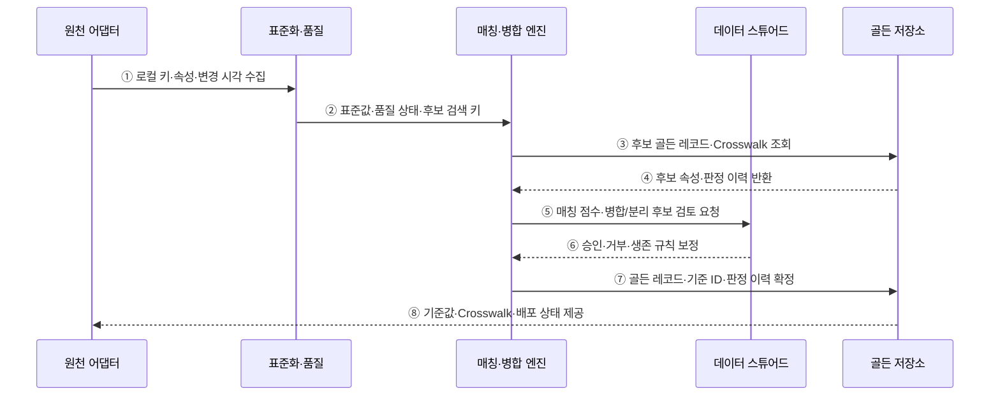

---
sidebar:
  order: 136
  label: "136. 마스터 데이터 관리 MDM (Master Data Management)"
  badge:
    text: "미출제 · 50%"
    variant: note
title: "마스터 데이터 관리 MDM (Master Data Management)"
date: "2026-07-25T19:11:00+09:00"
tags:
  - "notes-software"
weight: 136
extra:
  question_no: "136"
  source_status: "미출제"
  source_history: ""
  priority: 50
  priority_note: "기준정보 일관성·중복 통제 설계 가치"
---

## 미리 알고가기

- **마스터 데이터 관리(Master Data Management, MDM)**: 영문 첫 글자를 딴 MDM을 '엠디엠'으로 읽으며 여러 원천의 공통 개체를 식별·통합·배포하는 체계임
- **마스터 데이터(Master Data)**: 고객·상품·조직·공급자처럼 여러 업무가 공통 참조하는 기준 개체 데이터임
- **매칭(Match)**: 여러 원천 레코드가 같은 실제 개체인지 규칙·확률로 판정하는 과정임
- **병합(Merge)**: 같은 개체로 판정된 레코드를 하나의 기준 개체로 통합하는 과정임
- **생존 규칙(Survivorship)**: 원천 신뢰도·최신성·완전성으로 속성별 기준값을 결정하는 규칙임
- **골든 레코드(Golden Record)**: 중복 제거·병합·승인을 거쳐 개체별 기준으로 제공하는 레코드임
- **교차 매핑(Crosswalk)**: ID를 '아이디'로 읽고 식별자의 영문 첫 글자를 줄여 쓰며 기준 ID와 각 원천의 로컬 키를 연결함
- **레지스트리(Registry)**: 중앙 허브가 원천 키의 식별 링크를 관리하고 속성은 원천에 유지하는 방식임
- **통합(Consolidation)**: 여러 원천을 중앙 Golden Record로 단방향 통합해 주로 분석에 제공하는 방식임
- **공존(Coexistence)**: 중앙 기준과 원천 시스템이 변경을 양방향 동기화하는 방식임
- **트랜잭션 허브(Transaction Hub)**: 중앙 허브가 기준 레코드의 권위 있는 생성·변경 경로를 제공하는 방식임
- **소스 어댑터(Source Adapter)**: 원천별 형식과 연결 방식의 차이를 흡수해 레코드와 변경을 수집하는 구성요소임
- **데이터 스튜어드십(Data Stewardship)**: 모호한 매칭·품질 위반·기준값을 사람이 검토·승인하는 운영 활동임
- **오병합(False Merge)**: 서로 다른 실제 개체를 하나의 Golden Record로 잘못 합친 오류임
- **과소 병합(False Split)**: 같은 실제 개체를 서로 다른 Golden Record로 남긴 오류임

## Ⅰ. 개요

- 마스터 데이터 관리(MDM)는 여러 원천의 고객·상품·조직·공급자 레코드가 같은 실제 개체인지 식별하고 기준값·식별자·관계를 통합해 배포하는 체계이다.
- 시스템마다 다른 키·형식·속성값 때문에 같은 개체가 중복되거나 서로 다른 정보로 사용되는 문제를 추적 가능한 골든 레코드로 조정한다.

### 쉽게 이해하기 (학습용)

- 여러 장부의 같은 사람이나 상품을 찾아 하나의 기준 신분표로 연결한다.

## Ⅱ. 특징

- **표준화·매칭**: 이름·주소·코드 형식을 통일하고 결정 규칙과 유사도 점수로 동일 개체 후보를 판정한다.
- **생존 규칙**: 원천 신뢰도·최신성·완전성·업무 소유권에 따라 속성별 기준값을 선택한다.
- **교차 매핑**: 기준 ID와 원천별 로컬 키를 연결해 기존 거래와 골든 레코드를 추적한다.
- **스튜어드십**: 애매한 후보·품질 위반·오병합·분리 요청을 사람이 검토하고 판정 근거를 남긴다.
- **동기화 통제**: 허브와 원천 중 누가 어떤 속성을 변경할지 정하고 배포 지연·충돌·실패를 관리한다.

### 쉽게 이해하기 (학습용)

- 비슷하다고 무조건 합치지 않고 값의 우선순위와 애매한 경우의 사람 검토가 필요하다.

## Ⅲ. 아키텍처 및 구성요소

**도표안 A — 구조도**

**도표안 B — sequenceDiagram**

| 구성요소 | 설명 |
|:---|:---|
| 원천 어댑터·표준화 | 로컬 키·속성·변경 수집과 형식·코드·유효성 통일 |
| 매칭·병합 엔진 | 후보 축소·동일 개체 점수·병합·분리 판정 |
| 생존 규칙·골든 저장소 | 속성별 기준값·출처·신뢰도·판정 이력 저장 |
| 교차 매핑·계층 | 기준 ID와 원천 키·개체 관계·계층 연결 |
| 스튜어드 검토 흐름 | 모호한 후보·품질 위반·되돌리기 승인과 근거 관리 |

**동작 원리**

- ① 원천 어댑터가 레코드의 로컬 키·속성·변경 시각·출처를 수집한다.
- ② 표준화 계층이 형식·코드·주소를 통일하고 품질 상태와 후보 검색 키를 매칭 엔진에 전달한다.
- ③ 매칭 엔진이 검색 키로 후보를 좁혀 골든 레코드와 Crosswalk를 조회한다.
- ④ 골든 저장소가 후보의 기준 속성·원천 매핑·이전 판정 근거를 반환한다.
- ⑤ 엔진이 매칭 점수와 규칙으로 자동 판정하거나 애매한 병합·분리 후보를 스튜어드에게 보낸다.
- ⑥ 스튜어드가 승인·거부·수동 분리하고 필요한 생존 규칙 보정을 반환한다.
- ⑦ 엔진이 속성별 생존 규칙을 적용해 골든 레코드·기준 ID·Crosswalk·판정 이력을 확정한다.
- ⑧ 골든 저장소가 허용한 방향과 방식으로 기준값·원천 매핑·배포 상태를 제공한다.

### 쉽게 이해하기 (학습용)

- 기록 형식을 맞추고 같은 사람 후보를 찾은 뒤 애매한 건을 확인해 기준 신분표와 원래 장부 번호를 연결한다.

## Ⅳ. 종류 및 비교

| 비교 항목 | Registry | Consolidation | Coexistence | Transaction Hub |
|:---|:---|:---|:---|:---|
| 중앙 보유 | 식별 링크·Crosswalk | 분석용 골든 사본 | 골든 레코드와 동기화 상태 | 권위 있는 골든 레코드 |
| 변경 방향 | 원천 유지·조회 시 연결 | 원천→허브 단방향 | 원천↔허브 양방향 | 업무→허브 중심 |
| 적합 목적 | 원천 영향 최소화·통합 식별 | 분석·보고용 기준 통합 | 기존 시스템과 기준값 공유 | 업무 생성·변경의 중앙 통제 |
| 핵심 통제 | 매칭·식별 링크 | 적재 지연·병합 정확도 | 속성 소유권·충돌·루프 | 가용성·트랜잭션·서비스 결합 |
| 주요 위험 | 원천 값 불일치 잔존 | 최신성 지연·읽기 전용 | 동기화 복잡도·충돌 | 중앙 장애·강한 종속 |

> 실제 구현은 네 유형을 도메인·속성별로 혼합할 수 있으므로 기준값의 권위와 변경 방향을 먼저 정해야 한다.

### 쉽게 이해하기 (학습용)

- 중앙이 번호만 연결할지, 사본을 모을지, 서로 고칠지, 원본 자체가 될지에 따라 나뉜다.

## Ⅴ. 실무 고려사항 및 대책

| 고려사항 | 위험 | 대책 |
|:---|:---|:---|
| 후보 축소 | 전수 비교 비용 또는 후보 누락 | 다중 Blocking Key·재현율 표본 평가 |
| 임계값 | 오병합 또는 과소 병합 증가 | 자동 병합·검토·분리 구간과 비용 기반 조정 |
| 생존 규칙 | 최신 값이 항상 옳다고 오판 | 속성별 권위 원천·유효성·최신성·근거 |
| 되돌리기 | 오병합이 여러 시스템으로 전파 | 판정 이력·분리 절차·영향 추적·재배포 |
| 소유권 | 원천과 허브가 같은 속성을 경쟁 갱신 | 속성별 권위·변경 방향·충돌 정책 |
| 개인정보 | 결합으로 식별·노출 위험 증가 | 목적 제한·최소 수집·접근·감사·삭제 연계 |

> **적용 사례**: 고객 매칭은 정확도만 보지 않고 오병합·과소 병합률, 스튜어드 검토량, 되돌리기 시간, 원천별 배포 지연을 함께 측정한다.

### 쉽게 이해하기 (학습용)

- 잘못 합친 고객과 놓친 중복 고객, 사람이 확인한 시간까지 함께 재야 한다.

## Ⅵ. 결론

- MDM의 핵심은 골든 레코드 수가 아니라 같은 개체를 정확히 식별하고 속성별 기준값·출처·판정·배포 상태를 추적하는 데 있다.
- 매칭 비용·오병합 되돌리기·생존 규칙·속성 소유권·동기화 방향·개인정보 통제를 함께 설계해야 기준정보를 신뢰할 수 있다.

### 쉽게 이해하기 (학습용)

- 기준 신분표가 많다는 것보다 왜 합쳤고 어느 값이 어디서 왔으며 잘못되면 되돌릴 수 있는지가 중요하다.
