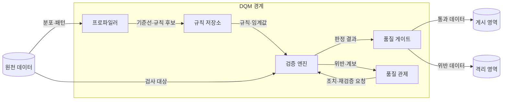
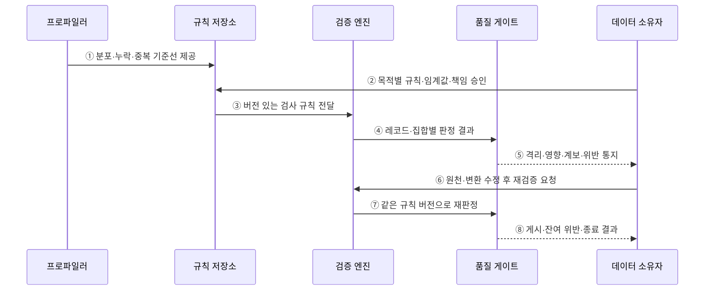

---
sidebar:
  order: 137
  label: "137. 데이터 품질 관리 — 완전성·정확성·일관성 (Data Quality Management)"
  badge:
    text: "미출제 · 70%"
    variant: note
title: "데이터 품질 관리 — 완전성·정확성·일관성 (Data Quality Management)"
date: "2026-07-25T19:12:00+09:00"
tags:
  - "notes-software"
weight: 137
extra:
  question_no: "137"
  source_status: "미출제"
  source_history: ""
  priority: 70
  priority_note: "완전성·정확성·일관성 품질 관리 핵심"
---

## 미리 알고가기

- **데이터 품질 관리(Data Quality Management, DQM)**: 사용 목적에 맞는 품질 규칙을 정하고 위반 데이터를 측정·격리·조치한 뒤 같은 규칙으로 다시 검증하는 관리 활동
- **완전성(Completeness)**: 업무에 필요한 레코드와 속성값이 빠짐없이 존재하는 정도
- **정확성(Accuracy)**: 데이터 값이 신뢰할 수 있는 기준이나 실제 업무 사실과 일치하는 정도
- **일관성(Consistency)**: 시스템·테이블·시점이 달라도 같은 개체의 값과 규칙이 모순되지 않는 정도
- **데이터 프로파일링(Data Profiling)**: 값의 분포·누락·중복·범위·패턴을 계산해 품질 규칙 후보와 이상을 찾는 분석
- **널(Null)**: 값이 없거나 아직 알려지지 않았음을 나타내며 숫자 0이나 빈 문자열과는 다른 특별한 상태
- **품질 규칙(Data Quality Rule)**: 검사할 데이터, 판정 조건, 허용 임계값, 책임자와 위반 처리 방식을 정한 규칙
- **기준선(Baseline)**: 현재 품질의 변화와 임계값을 판단하기 위해 비교 기준으로 정한 정상 분포나 과거 측정 수준
- **품질 게이트(Quality Gate)**: 품질 임계값을 통과한 데이터만 다음 처리나 게시 단계로 보내는 검증 경계
- **격리 영역(Quarantine)**: 규칙을 위반한 레코드와 위반 사유를 정상 처리 경로에서 분리해 보존하는 영역
- **데이터 대사(Data Reconciliation)**: 원천과 처리 결과의 건수·합계·키를 비교해 누락·중복·불일치를 찾는 검증
- **데이터 계보(Data Lineage)**: 품질 오류가 발생한 원천과 변환부터 영향을 받는 산출물까지 추적하는 연결 정보
- **품질 관제(Quality Monitoring)**: 규칙 위반의 원인·영향·책임자·조치와 재검증 상태를 한 흐름으로 추적하는 관리 기능

## Ⅰ. 개요

- 데이터 품질 관리는 사용 목적에 맞는 품질 차원·규칙·허용 수준을 정하고 위반을 측정·격리·조치·재검증하는 폐쇄 순환 관리 활동이다.
- 누락·사실 오류·시스템 간 모순이 보고서·의사결정·자동 처리로 전파되는 것을 품질 게이트와 책임 있는 조치로 막는다.

### 쉽게 이해하기 (학습용)

- 쓸 자료가 빠졌거나 틀렸거나 서로 모순되는지 검사하고 고친 뒤 같은 기준으로 다시 확인한다.

## Ⅱ. 특징

- **목적 적합성**: 같은 오류도 결제·규제·탐색 분석 등 사용 목적과 업무 영향에 따라 허용 수준을 다르게 정한다.
- **측정 가능성**: 규칙의 대상·조건·분모·임계값·책임자·버전을 명시해 반복 측정한다.
- **프로파일링**: 분포·누락·중복·범위·패턴으로 기준선과 규칙 후보를 찾되 업무 사실과 함께 검토한다.
- **품질 게이트**: 임계값을 벗어난 데이터가 정상 게시 경로로 퍼지지 않도록 격리·경고·중단을 선택한다.
- **폐쇄 순환**: 계보로 원인과 영향을 찾아 담당자가 고치고 같은 규칙으로 재검증해 종료한다.

### 쉽게 이해하기 (학습용)

- 참고 통계와 결제 금액은 같은 오류라도 피해가 달라 서로 다른 합격선을 써야 한다.

## Ⅲ. 아키텍처 및 구성요소

**도표안 A — 구조도**

**도표안 B — sequenceDiagram**

| 설계 요소 | 설명 |
|:---|:---|
| 프로파일러 | 분포·누락·중복·범위·패턴을 측정해 기준선 제시 |
| 규칙 저장소 | 대상·분모·조건·임계값·책임자·버전 관리 |
| 검증 엔진 | 규칙을 실행해 레코드·집합·대사 결과 판정 |
| 품질 게이트 | 영향과 허용 수준에 따라 게시·경고·격리·중단 |
| 품질 관제 | 원인·계보·영향·담당·조치·재검증·종료 추적 |

**동작 원리**

- ① 프로파일러가 현재 분포·누락·중복·범위를 측정해 비교 기준선과 규칙 후보를 제공한다.
- ② 데이터 소유자가 업무 목적·위험에 맞는 판정 조건·분모·임계값·책임자를 승인한다.
- ③ 규칙 저장소가 승인된 버전의 검사 규칙을 검증 엔진에 전달한다.
- ④ 검증 엔진이 레코드별 위반과 전체 비율·대사 결과를 품질 게이트에 전달한다.
- ⑤ 품질 게이트가 정책에 따라 위반 데이터를 격리하고 계보·영향·규칙 근거를 소유자에게 통지한다.
- ⑥ 소유자가 원천 값이나 변환 규칙을 수정하고 영향 범위의 재검증을 요청한다.
- ⑦ 검증 엔진이 비교 가능하도록 같은 규칙 버전으로 수정 결과를 다시 판정한다.
- ⑧ 품질 게이트가 통과 데이터 게시, 남은 위반, 이슈 종료 여부를 소유자에게 반환한다.

### 쉽게 이해하기 (학습용)

- 현재 상태로 합격선을 정하고 불합격 자료는 따로 두며 원인을 고친 뒤 같은 시험을 다시 본다.

## Ⅳ. 종류 및 비교

| 비교 항목 | 완전성 | 정확성 | 일관성 |
|:---|:---|:---|:---|
| 질문 | 필요한 값과 건이 모두 있는가 | 값이 기준이나 실제 사실과 맞는가 | 시스템·테이블·시점 사이에 모순이 없는가 |
| 대표 검사 | 필수값·예상 건수·키 집합 | 권위 원천 대조·유효 범위·현장 확인 | 키별 값 비교·건수/합계 대사·규칙 일치 |
| 예시 | 주문 번호 누락률 | 배송 우편번호가 실제 주소와 일치 | CRM과 청구 시스템의 고객 등급 일치 |
| 판정 난점 | 빈 문자열·기본값이 누락을 숨김 | 참값 기준 자체가 없거나 틀림 | 정상 동기화 지연을 오류로 오판 |
| 보완 | 의미 있는 값과 모집단 정의 | 권위 기준·표본 검증·출처 관리 | 비교 시점·허용 지연·소유권 명시 |

> 품질 점수 하나로 차원을 합치면 치명적인 규칙 위반이 평균에 가려질 수 있으므로 규칙과 업무 영향별로 판단한다.

### 쉽게 이해하기 (학습용)

- 완전성은 빠짐, 정확성은 틀림, 일관성은 서로 다름을 다룬다.

## Ⅴ. 실무 고려사항 및 대책

| 고려사항 | 위험 | 대책 |
|:---|:---|:---|
| 목적·분모 | 같은 비율도 의미가 달라 오판 | 사용 목적·대상 모집단·제외 조건 명시 |
| 임계값 | 너무 엄격해 상시 중단 또는 너무 느슨해 오염 | 기준선·업무 손실·추세 기반 단계별 조치 |
| 정확성 기준 | 비교 기준 자체가 잘못됨 | 권위 원천·확인 시각·표본 감사 |
| 격리 | 정상 데이터까지 막거나 오류를 버림 | 레코드/집합 수준 분리·사유·원본 보존 |
| 책임·조치 | 경보만 쌓이고 미조치 | 소유자·기한·우선순위·에스컬레이션 |
| 재검증 | 다른 규칙으로 고침을 오판 | 규칙·데이터·코드 버전과 결과 비교 |

> **적용 사례**: 주문 번호가 빠진 레코드는 매출 집계에서 격리하고 원천·영향 보고서를 계보로 찾은 뒤 수정한 데이터를 같은 규칙 버전으로 재검증한다.

### 쉽게 이해하기 (학습용)

- 주문 번호가 없는 주문은 매출에 넣지 않고 따로 보관해 원본을 고친 뒤 다시 검사한다.

## Ⅵ. 결론

- 데이터 품질의 핵심은 점수 자체가 아니라 사용 목적에 맞는 규칙으로 오류 전파를 막고 원인 조치와 재검증을 끝까지 닫는 데 있다.
- 완전성·정확성·일관성을 분리해 측정하고 업무 영향·계보·책임·규칙 버전을 연결해 개선 우선순위를 정해야 한다.

### 쉽게 이해하기 (학습용)

- 모든 결함을 평균내지 말고 피해가 큰 오류부터 막고 고쳐 같은 시험을 통과시킨다.
