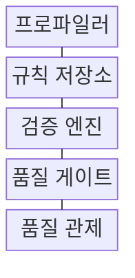
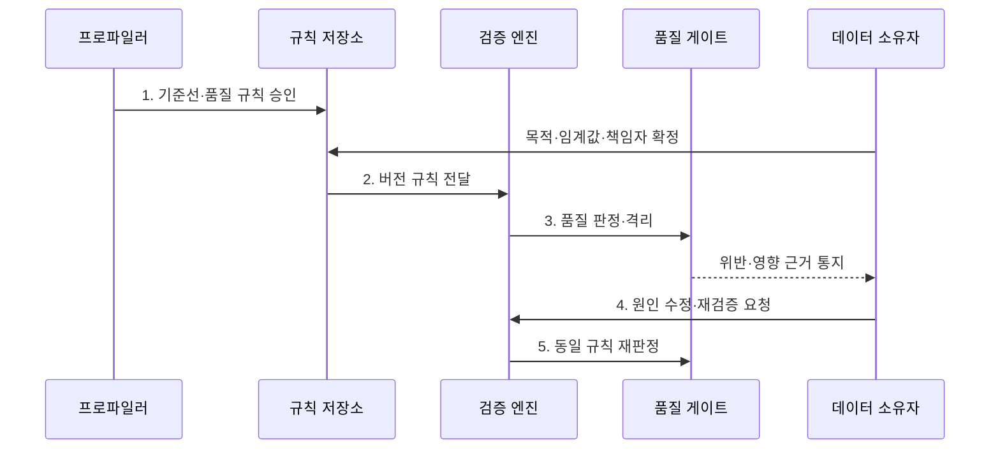

---
sidebar:
  order: 137
  label: "137. 데이터 품질 관리: 완전성·정확성·일관성 (Data Quality Management)"
  badge:
    text: "미출 · 70%"
    variant: note
title: "데이터 품질 관리: 완전성·정확성·일관성 (Data Quality Management)"
date: "2026-07-30T23:54:55+09:00"
tags:
  - "notes-software"
weight: 137
extra:
  question_no: "137"
  source_status: "미출"
  source_history: ""
  priority: 70
  priority_note: "완전성·정확성·일관성 품질 관리 핵심"
---

## 미리 알고가기

- **데이터 품질 관리(Data Quality Management, DQM)**: 사용 목적에 맞는 품질 규칙을 정하고 위반 데이터를 측정·격리·조치한 뒤 같은 규칙으로 다시 검증하는 관리 활동
- **완전성(Completeness)**: 업무에 필요한 레코드와 속성값이 빠짐없이 존재하는 정도
- **정확성(Accuracy)**: 데이터 값이 신뢰할 수 있는 기준이나 실제 업무 사실과 일치하는 정도
- **일관성(Consistency)**: 시스템·테이블·시점이 달라도 같은 개체의 값과 규칙이 모순되지 않는 정도
- **데이터 프로파일링(Data Profiling)**: 값의 분포·누락·중복·범위·패턴을 계산해 품질 규칙 후보와 이상을 찾는 분석
- **품질 규칙(Data Quality Rule)**: 검사할 데이터, 판정 조건, 허용 임계값, 책임자와 위반 처리 방식을 정한 규칙
- **기준선(Baseline)**: 현재 품질의 변화와 임계값을 판단하기 위해 비교 기준으로 정한 정상 분포나 과거 측정 수준
- **품질 게이트(Quality Gate)**: 품질 임계값을 통과한 데이터만 다음 처리나 게시 단계로 보내는 검증 경계
- **격리 영역(Quarantine)**: 규칙을 위반한 레코드와 위반 사유를 정상 처리 경로에서 분리해 보존하는 영역
- **데이터 대사(Data Reconciliation)**: 원천과 처리 결과의 건수·합계·키를 비교해 누락·중복·불일치를 찾는 검증
- **데이터 계보(Data Lineage)**: 품질 오류가 발생한 원천과 변환부터 영향을 받는 산출물까지 추적하는 연결 정보
- **품질 관제(Quality Monitoring)**: 규칙 위반의 원인·영향·책임자·조치와 재검증 상태를 한 흐름으로 추적하는 관리 기능

## Ⅰ. 개요

- 정의/개념: 품질 규칙으로 결함을 측정·조치·재검증하는 **데이터 품질 관리(DQM)**
- 배경/필요성: 사후 수작업 점검으로는 결함의 **자동 처리 전파 차단 불가**

### 쉽게 이해하기 (학습용)

- 쓸 자료가 빠졌거나 틀렸거나 서로 모순되는지 검사하고 고친 뒤 같은 기준으로 다시 확인한다.

## Ⅱ. 특징

- **목적 적합성**에 따라 업무별 품질 허용 수준 결정
- **측정 가능성**: 대상·분모·임계값·버전을 명시
- **폐쇄 순환**: 격리·원인 조치·재검증으로 종료

### 쉽게 이해하기 (학습용)

- 참고 통계와 결제 금액은 같은 오류라도 피해가 달라 서로 다른 합격선을 써야 한다.

## Ⅲ. 구조 및 구성요소

| 구성요소 | 책임 |
|:---|:---|
| 프로파일러 | 분포·누락·중복·범위 기준선 제시 |
| 규칙 저장소 | 대상·분모·조건·임계값·버전 관리 |
| 검증 엔진 | 레코드·집합·대사 규칙 실행 |
| 품질 게이트 | 게시·경고·격리·중단 판정 |
| 품질 관제 | 원인·영향·담당·조치·재검증 추적 |

### 쉽게 이해하기 (학습용)

- 불합격 자료를 격리하고 원인을 고친 뒤 같은 시험을 다시 본다.

## Ⅳ. 흐름도

**동작 원리**

- **1. 기준선·품질 규칙 승인**: 분포·누락·중복 현황에 목적·위험별 임계값과 책임자 연결
- **2. 버전 규칙 전달**: 승인된 조건과 적용 범위를 검증 엔진에 고정
- **3. 품질 판정·격리**: 레코드 위반과 비율을 계산하고 실패 데이터 확산 차단
- **4. 원인 수정·재검증 요청**: 원천 데이터 또는 변환 규칙의 책임 원인 교정
- **5. 동일 규칙 재판정**: 같은 버전 기준으로 수정 효과와 위반 종료 여부 확인

### 쉽게 이해하기 (학습용)

- 현재 상태로 합격선을 정하고 불합격 자료는 따로 두며 원인을 고친 뒤 같은 시험을 다시 본다.

## Ⅴ. 종류 및 비교

| 비교 항목 | 완전성 | 정확성 | 일관성 |
|:---|:---|:---|:---|
| 적용 기준 | **필수 값·건 누락 검사** | **사실·권위 기준 일치 검사** | **시스템·시점 간 모순 검사** |
| 핵심 특징 | 필수값·예상 건수·키 집합 | 원천 대조·유효 범위 | 키별 값 비교·대사 |
| 한계 | 기본값이 누락을 숨김 | 참값 기준 확보가 어려움 | 정상 동기화 지연을 오판 |

### 쉽게 이해하기 (학습용)

- 완전성은 빠짐, 정확성은 틀림, 일관성은 서로 다름을 다룬다.

## Ⅵ. 실무 고려사항 및 대책

| 고려사항 | 대책 | 효과 |
|:---|:---|:---|
| 목적·분모 불명확 | **모집단·제외 조건**을 명시 | 품질 비율 오판 방지 |
| 단일 임계값 | **기준선·업무 손실**에 따라 단계화 | 과잉 중단과 오염 완화 |
| 참값 기준 부재 | **권위 원천·확인 시각**을 기록 | 정확성 검증 신뢰 확보 |
| 결함 데이터 혼입 | **격리 영역**에 원본과 사유 보존 | 정상 데이터 영향 축소 |
| 수정 효과 불명 | 같은 **규칙 버전**으로 재검증 | 결함 종료 여부 확인 |

### 쉽게 이해하기 (학습용)

- 주문 번호가 없는 주문은 매출에 넣지 않고 따로 보관해 원본을 고친 뒤 다시 검사한다.

## Ⅶ. 결론

- 업무 영향이 크면 **품질 게이트**로 차단하고 **동일 규칙 재검증** 후 게시

### 쉽게 이해하기 (학습용)

- 모든 결함을 평균내지 말고 피해가 큰 오류부터 막고 고쳐 같은 시험을 통과시킨다.
