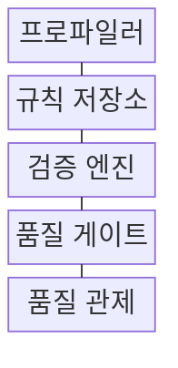
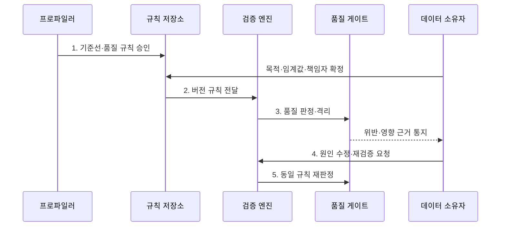

---
sidebar:
  order: 137
  label: "137. 데이터 품질 관리: 완전성·정확성·일관성 (Data Quality Management)"
  badge:
    text: "미출 · 70%"
    variant: note
title: "데이터 품질 관리: 완전성·정확성·일관성 (Data Quality Management)"
date: "2026-08-02T12:00:00+09:00"
tags:
  - "notes-software"
weight: 137
extra:
  question_no: "137"
  source_status: "미출"
  source_history: ""
  priority: 70
  priority_note: "완전성·정확성·일관성 품질 관리 핵심"
---

## Ⅰ. 개요

핵심 용어

- **데이터 품질 관리(DQM)**: 업무 목적에 맞는 품질 규칙으로 결함을 측정·조치하고 다시 검증하는 활동이다.

- 정의/개념: **DQM**은 정확성·완전성·일관성 같은 품질 규칙으로 데이터 결함을 측정하고 원인을 조치한 뒤 결과를 재검증하는 관리 활동
- 배경/필요성: 사후 수작업 점검으로는 결함의 **후속 처리 유입 차단 불가**

#### 한줄 요약

- 쓸 자료가 빠졌거나 틀렸거나 서로 모순되는지 검사하고 고친 뒤 같은 기준으로 다시 확인한다.

## Ⅱ. 특징

핵심 용어

- **폐쇄 순환**: 결함 데이터를 격리하고 원인을 수정한 뒤 같은 규칙으로 재검증해 종료하는 특성이다.

- **목적 적합성**에 따라 업무별 품질 허용 수준 결정
- **측정 가능성**: 대상·분모·임계값·버전을 명시
- **폐쇄 순환**: 격리·원인 조치·재검증으로 종료

#### 한줄 요약

- 참고 통계와 결제 금액은 같은 오류라도 피해가 달라 서로 다른 합격선을 써야 한다.

## Ⅲ. 구조 및 구성요소

핵심 용어

- **품질 게이트**: 검증 결과에 따라 데이터 게시·격리·처리 중단을 판정하는 구성요소이다.

| 구성요소 | 책임 |
|:---|:---|
| 프로파일러 | 분포·누락의 **품질 기준선** 제시 |
| 규칙 저장소 | 대상·분모와 **임계값·버전** 관리 |
| 검증 엔진 | 레코드·집합의 **대사 규칙** 실행 |
| 품질 게이트 | 게시 여부와 **격리·중단** 판정 |
| 품질 관제 | 원인·영향과 **재검증 상태** 추적 |

#### 한줄 요약

- 불합격 자료를 격리하고 원인을 고친 뒤 같은 시험을 다시 본다.

## Ⅳ. 흐름도

핵심 용어

- **5. 동일 규칙 재판정**: 같은 버전의 품질 기준으로 수정 효과와 결함 종료 여부를 확인하는 단계이다.

**동작 원리**

1. **기준선·품질 규칙 승인**: 분포·누락·중복 현황에 목적·위험별 임계값과 책임자 연결
2. **버전 규칙 전달**: 승인된 조건과 적용 범위를 검증 엔진에 고정
3. **품질 판정·격리**: 레코드 위반과 비율을 계산하고 실패 데이터 확산 차단
4. **원인 수정·재검증 요청**: 원천 데이터 또는 변환 규칙의 책임 원인 교정
5. **동일 규칙 재판정**: 같은 버전 기준으로 수정 효과와 위반 종료 여부 확인

#### 한줄 요약

- 현재 상태로 합격선을 정하고 불합격 자료는 따로 두며 원인을 고친 뒤 같은 시험을 다시 본다.

## Ⅴ. 종류 및 비교

핵심 용어

- **정확성**: 데이터 값이 신뢰할 수 있는 기준이나 실제 업무 사실과 일치하는 품질 차원이다.

| 비교 항목 | 완전성 | 정확성 | 일관성 |
|:---|:---|:---|:---|
| 적용 기준 | **필수 값·건 누락 검사** | **사실·권위 기준 일치 검사** | **시스템·시점 간 모순 검사** |
| 핵심 특징 | **필수값·예상 건수**와 키 집합 | **원천 대조·유효 범위** | **키별 값 비교·대사** |
| 한계 | 기본값의 **누락 은폐** | **참값 기준** 확보 곤란 | 정상 **동기화 지연 오판** |

#### 한줄 요약

- 완전성은 빠짐, 정확성은 틀림, 일관성은 서로 다름을 다룬다.

## Ⅵ. 실무 고려사항 및 대책

핵심 용어

- **격리 영역**: 품질 규칙을 위반한 원본 데이터와 사유를 정상 처리 경로에서 분리해 보존하는 영역이다.

| 문제 | 대책 | 효과 |
|:---|:---|:---|
| 불명확한 **목적·분모** | **모집단·제외 조건** 명시 | **품질 비율 오판** 방지 |
| 획일적인 **단일 임계값** | **기준선·업무 손실**에 따라 단계화 | **과잉 중단·오염** 완화 |
| **참값 기준** 부재 | **권위 원천·확인 시각** 기록 | **정확성 검증 신뢰** 확보 |
| **결함 데이터** 혼입 | **격리 영역**에 원본과 사유 보존 | 정상 데이터의 **오염 방지** |
| **수정 효과** 불명 | 같은 **규칙 버전**으로 재검증 | **결함 종료 여부** 확인 |

#### 한줄 요약

- 주문 번호가 없는 주문은 매출에 넣지 않고 따로 보관해 원본을 고친 뒤 다시 검사한다.

## Ⅶ. 결론

핵심 용어

- **동일 규칙 재검증**: 수정한 데이터가 기존 품질 기준을 충족하는지 다시 판정한 뒤 게시하는 절차이다.

- 업무 영향이 크면 **품질 게이트**로 차단하고 **동일 규칙 재검증** 후 게시

#### 한줄 요약

- 모든 결함을 평균내지 말고 피해가 큰 오류부터 막고 고쳐 같은 시험을 통과시킨다.
