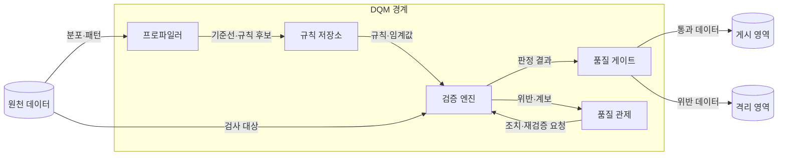
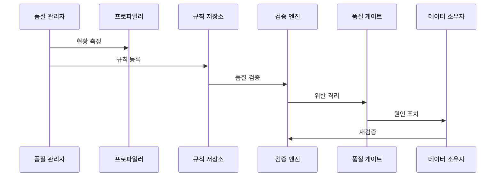

---
sidebar:
  order: 137
  label: "137. 데이터 품질 관리 — 완전성·정확성·일관성 (Data Quality Management)"
  badge:
    text: "미출제 · 70%"
    variant: note
title: "데이터 품질 관리 — 완전성·정확성·일관성 (Data Quality Management)"
date: "2026-07-25T19:12:00+09:00"
tags:
  - "notes-software"
weight: 137
extra:
  question_no: "137"
  source_status: "미출제"
  source_history: ""
  priority: 70
  priority_note: "완전성·정확성·일관성 품질 관리 핵심"
---

## 미리 알고가기

- **데이터 품질 관리(Data Quality Management, DQM)**: 사용 목적에 맞는 품질 규칙을 정하고 위반 데이터를 측정·격리·조치한 뒤 같은 규칙으로 다시 검증하는 관리 활동
- **완전성(Completeness)**: 업무에 필요한 레코드와 속성값이 빠짐없이 존재하는 정도
- **정확성(Accuracy)**: 데이터 값이 신뢰할 수 있는 기준이나 실제 업무 사실과 일치하는 정도
- **일관성(Consistency)**: 시스템·테이블·시점이 달라도 같은 개체의 값과 규칙이 모순되지 않는 정도
- **데이터 프로파일링(Data Profiling)**: 값의 분포·누락·중복·범위·패턴을 계산해 품질 규칙 후보와 이상을 찾는 분석
- **널(Null)**: 값이 없거나 아직 알려지지 않았음을 나타내며 숫자 0이나 빈 문자열과는 다른 특별한 상태
- **품질 규칙(Data Quality Rule)**: 검사할 데이터, 판정 조건, 허용 임계값, 책임자와 위반 처리 방식을 정한 규칙
- **기준선(Baseline)**: 현재 품질의 변화와 임계값을 판단하기 위해 비교 기준으로 정한 정상 분포나 과거 측정 수준
- **품질 게이트(Quality Gate)**: 품질 임계값을 통과한 데이터만 다음 처리나 게시 단계로 보내는 검증 경계
- **격리 영역(Quarantine)**: 규칙을 위반한 레코드와 위반 사유를 정상 처리 경로에서 분리해 보존하는 영역
- **데이터 대사(Data Reconciliation)**: 원천과 처리 결과의 건수·합계·키를 비교해 누락·중복·불일치를 찾는 검증
- **데이터 계보(Data Lineage)**: 품질 오류가 발생한 원천과 변환부터 영향을 받는 산출물까지 추적하는 연결 정보
- **품질 관제(Quality Monitoring)**: 규칙 위반의 원인·영향·책임자·조치와 재검증 상태를 한 흐름으로 추적하는 관리 기능

## Ⅰ. 개요

- **정의/개념**: 목적별 품질 규칙 위반을 측정·조치하는 관리 활동
- **배경/필요성**: 누락·오류·모순의 업무 전파 방지

### 쉽게 이해하기 (학습용)
- 업무에 쓸 데이터가 빠지거나 틀리거나 서로 모순되지 않는지 검사하고 고친 뒤 다시 확인함

## Ⅱ. 특징

- 업무 목적에 따라 품질 차원과 허용 수준을 정한다.
- 프로파일링 기준선으로 품질 변화를 판정한다.
- 품질 게이트가 위반 데이터를 격리해 전파를 막는다.
- 원인·책임·재검증을 추적해 폐쇄 순환으로 관리한다.

### 쉽게 이해하기 (학습용)
- 같은 데이터도 보고서·결제처럼 쓰임이 다르면 허용할 오류 수준이 달라지고, 발견한 결함은 담당자가 고친 뒤 다시 검사함

## Ⅲ. 아키텍처 및 구성요소

| 설계 요소 | 설명 |
|:---|:---|
| 프로파일러 | 분포·누락·중복을 측정해 기준선 제시 |
| 규칙 저장소 | 판정 조건·임계값·책임자·버전 관리 |
| 검증 엔진 | 규칙을 실행해 데이터별 위반 판정 |
| 품질 게이트 | 통과 데이터 게시·위반 데이터 격리 |
| 품질 관제 | 위반 원인·영향·조치·재검증 추적 |

> 요약: 규칙 판정으로 게시·격리 경로 분리

### 쉽게 이해하기 (학습용)
- 조사기가 데이터 상태를 살피고 규칙 보관함의 기준으로 검사한 뒤, 통과 데이터와 위반 데이터를 나누고 수정 여부를 추적함

## Ⅳ. 원리 및 절차 흐름도

| 절차 | 설명 |
|:---|:---|
| 현황 측정 | 분포·누락·중복으로 기준선 산출 |
| 규칙 등록 | 목적별 판정 조건·임계값·책임자 저장 |
| 품질 검증 | 저장된 규칙으로 레코드별 위반 판정 |
| 위반 격리 | 임계값 미달 데이터를 게시 경로에서 분리 |
| 원인 조치 | 계보로 원천·변환 원인을 찾아 수정 |
| 재검증 | 같은 규칙으로 수정 결과 재판정 |

> 요약: 위반 격리 후 원인을 고쳐 같은 규칙으로 재검증

### 쉽게 이해하기 (학습용)
- 데이터 상태로 검사 기준을 정하고, 기준을 어긴 자료는 따로 빼서 원인을 고친 뒤 같은 기준으로 다시 검사함

## Ⅴ. 종류 및 비교

| 판단 기준 | 완전성 | 정확성 | 일관성 |
|:---|:---|:---|:---|
| 핵심 특징 | 필수 값·레코드 누락 판정 | 기준값·실제 사실 일치 판정 | 시스템·시점 간 모순 판정 |
| 적용 기준 | 필수값 누락 통제 | 실세계 값 일치 | 시스템 간 값 일치 |
| 주요 위험 | 형식값으로 누락 은폐 | 기준 데이터 오류 | 동기화 시점 차이 |

> 요약: 누락·사실 오류·시스템 모순별 규칙 선택

### 쉽게 이해하기 (학습용)
- 완전성은 누락, 정확성은 오류, 일관성은 모순을 다룸

## Ⅵ. 실무 사례

1. 주문 적재는 필수 주문 키 누락 시 격리
2. 고객 동기화는 원천·대상 상태 불일치 대사

### 쉽게 이해하기 (학습용)
- 주문 번호가 빠진 주문은 매출 집계로 보내지 않고 별도 공간에 모아 원천 데이터를 고침
- 원천과 대상 시스템의 고객 상태가 다르면 갱신 시점 차이인지 변환 오류인지 찾아 다시 맞춤

## Ⅶ. 결론

- 업무 영향별 임계값으로 격리·조치 우선순위 결정

### 쉽게 이해하기 (학습용)
- 모든 오류를 한 점수로 뭉치지 않고 업무 영향이 큰 규칙 위반부터 격리하고 담당자에게 고치게 함
