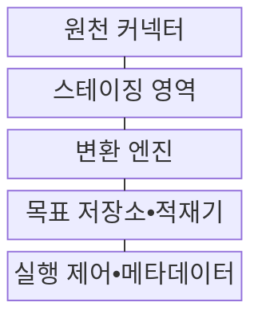
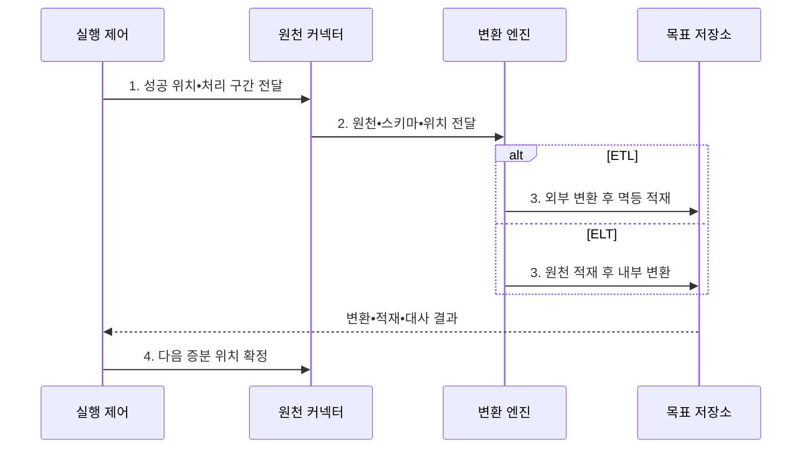

---
sidebar:
  order: 138
  label: "138. ETL•ELT 파이프라인 (ETL ELT Pipeline)"
  badge:
    text: "미출 • 50%"
    variant: note
title: "ETL•ELT 파이프라인 (ETL ELT Pipeline)"
date: "2026-08-03T08:48:47+09:00"
tags:
  - "notes-software"
weight: 138
extra:
  question_no: "138"
  source_status: "미출"
  source_history: ""
  priority: 50
  priority_note: "ETL•ELT 선택은 처리 위치•비용 절충"
---

## Ⅰ. 개요

핵심 용어

- **추출•변환•적재(Extract, Transform, Load, ETL)**: 원천 데이터를 추출해 외부에서 변환한 뒤 목표 저장소에 적재하는 처리 흐름이다.
- **추출•적재•변환(Extract, Load, Transform, ELT)**: 원천 데이터를 목표 저장소에 먼저 적재한 뒤 저장소 내부에서 변환하는 처리 흐름이다.
- **순서와 연산 위치**: 추출•변환•적재를 어떤 순서로 어느 처리 계층에서 수행할지 정하는 기준이다.

- 정의/개념: 원천 데이터를 추출한 뒤 변환과 적재의 순서 및 연산 위치를 달리하여 분석 저장소에 제공하는 **추출•변환•적재(Extract, Transform, Load, ETL)•추출•적재•변환(Extract, Load, Transform, ELT)** 처리 흐름
- 배경/필요성: 단일 적재 순서로는 원천 보존과 **선처리 통제 동시 충족 곤란**

#### 한줄 요약

- 자료를 밖에서 정리해 넣는 ETL과 먼저 넣고 안에서 정리하는 ELT이다.

## Ⅱ. 특징

핵심 용어

- **멱등•대사**: 재실행 시 중복을 막고 원천과 목표의 건수•합계•키를 비교하는 특성이다.
- **추출•변환•적재(Extract, Transform, Load, ETL)**: 외부 처리 계층에서 데이터를 변환한 후 목표 저장소에 적재하는 방식이다.
- **추출•적재•변환(Extract, Load, Transform, ELT)**: 목표 저장소에 원천 데이터를 적재한 후 내부 연산으로 변환하는 방식이다.
- **증분 처리**: 전체 데이터를 다시 읽지 않고 마지막 성공 위치 이후 새로 생기거나 바뀐 구간만 처리하는 방식이다.

- **처리 위치**: ETL은 외부, ELT는 목표 저장소에서 변환
- **증분 처리**: 마지막 성공 위치 이후 구간만 조회
- **멱등•대사**: 재실행 중복을 막고 원천•목표를 비교

#### 한줄 요약

- 어디까지 성공했는지 기억하고 같은 구간을 다시 넣어도 결과가 한 번만 남게 만든다.

## Ⅲ. 구조 및 구성요소

핵심 용어

- **스테이징 영역**: 입력 데이터와 출처•처리 위치를 실패 후 다시 처리할 수 있게 보존하는 구성요소이다.
- **원천 커넥터**: 원천 데이터•스키마와 마지막 성공 이후의 증분 위치를 수집하는 구성요소이다.
- **변환 엔진**: 형식•키•품질•업무 규칙과 민감값 마스킹을 데이터에 적용하는 구성요소이다.
- **목표 저장소•적재기**: 변환 결과를 중복 없이 반영하고 저장소 내부 연산을 제공하는 구성요소이다.
- **실행 제어•메타데이터**: 작업 의존성•코드 버전•대사 결과와 완료 위치를 관리하는 구성요소이다.

| 구성요소 | 책임 |
|:---|:---|
| 원천 커넥터 | 원천 데이터•스키마와 **증분 위치** 수집 |
| 스테이징 영역 | 입력•출처•위치를 **재처리 가능 상태** 로 보존 |
| 변환 엔진 | 형식•키•품질과 **업무 규칙•마스킹** 적용 |
| 목표 저장소•적재기 | 결과를 **멱등 반영**하고 내부 연산 제공 |
| 실행 제어•메타데이터 | 의존성•코드 버전과 **대사•완료 위치** 관리 |

#### 한줄 요약

- 밖에서 정리해 넣거나 먼저 넣고 안에서 정리한다.

## Ⅳ. 흐름도

핵심 용어

- **4. 다음 증분 위치 확정**: 변환•적재•대사가 성공한 뒤에만 다음 입력 시작점을 갱신하는 단계이다.
- **1. 성공 위치•처리 구간 전달**: 마지막 정상 완료 지점부터 이번 실행이 읽을 증분 범위를 정하는 단계이다.
- **2. 원천•스키마•위치 전달**: 실패 후 같은 입력을 재처리할 수 있도록 데이터 출처•구조•범위를 고정하는 단계이다.
- **3. 외부 변환 후 멱등 적재**: 추출•변환•적재(Extract, Transform, Load, ETL) 경로에서 외부 정제 결과를 목표 저장소에 중복 없이 반영하는 단계이다.
- **3. 원천 적재 후 내부 변환**: 추출•적재•변환(Extract, Load, Transform, ELT) 경로에서 원천 데이터를 먼저 보존하고 저장소 연산으로 모델을 만드는 단계이다.

**동작 원리**

- **1. 성공 위치•처리 구간 전달**: 이번 증분 입력 범위 결정
- **2. 원천•스키마•위치 전달**: 재처리할 수 있도록 입력 범위와 구조를 변환 엔진에 고정
- **3. 외부 변환 후 멱등 적재**: ETL 경로에서 정제 결과를 반영
- **3. 원천 적재 후 내부 변환**: ELT 경로에서 Raw 데이터로 모델을 생성
- **4. 다음 증분 위치 확정**: 대사 성공 뒤에만 완료 위치를 갱신

#### 한줄 요약

- 새 자료를 따로 보관하고 선택한 순서로 처리한 뒤 결과가 맞아야 완료 표시를 옮긴다.

## Ⅴ. 종류 및 비교

핵심 용어

- **추출•변환•적재(Extract, Transform, Load, ETL)**: 원천 데이터를 추출해 외부에서 정제•변환한 뒤 목표 저장소에 적재하는 방식이다.
- **추출•적재•변환(Extract, Load, Transform, ELT)**: 원천 데이터를 목표 저장소에 먼저 적재하고 내부 연산으로 반복 변환하는 방식이다.

| 비교 항목 | ETL | ELT |
|:---|:---|:---|
| 적용 기준 | **적재 전 선처리•고정 스키마** | **원본 보존•반복 변환** |
| 핵심 특징 | **추출→외부 변환→적재** | **추출→원천 적재→내부 변환** |
| 한계 | **외부 병목•이동 비용** | **원문 노출•저장소 종속** |

#### 한줄 요약

- 밖에서 가려야 할 값은 먼저 처리하고 반복 분석할 원본은 안에 보관해 다시 가공할 수 있다.

## Ⅵ. 실무 고려사항 및 대책

핵심 용어

- **증분 경계**: 마지막 성공 이후 읽을 구간의 중첩이나 공백으로 누락•중복이 생길 수 있는 경계이다.
- **로그 위치•워터마크**: 변경 로그의 처리 지점이나 시간•순번 기준으로 마지막 처리 범위를 나타내는 표식이다.
- **멱등 적재**: 같은 입력 구간을 여러 번 실행해도 목표 저장소의 최종 결과가 한 번 실행한 것과 같게 하는 적재 방식이다.
- **호환 규칙•버전 파서**: 원천 스키마 변경을 허용할 범위와 각 구조 판본을 해석할 방법을 정한 처리 규칙이다.
- **마스킹•접근 통제**: 민감값을 가리거나 대체하고 허가된 주체만 원문에 접근하게 하는 보호 수단이다.
- **연산 밀어넣기(Pushdown)**: 데이터 이동을 줄이기 위해 필터•집계•변환 연산을 원천이나 목표 저장소에서 실행하는 최적화 방식이다.

| 문제 | 대책 | 효과 |
|:---|:---|:---|
| **증분 경계** 의 중첩•공백 | **로그 위치•워터마크** 대사 | **누락•중복** 방지 |
| 동일 구간의 **재실행** | 업무 키 기반 **멱등 적재** 적용 | **재시도 중복** 억제 |
| 원천 **스키마 변경** | **호환 규칙•버전 파서** 적용 | **중단•오독** 방지 |
| **민감 원문** 적재 | **마스킹•접근 통제** 적용 | **원문 노출** 감소 |
| **데이터 이동량** 증가 | **Pushdown•증분 처리** 적용 | **이동•연산비** 통제 |

#### 한줄 요약

- 급여의 주민번호는 창고에 넣기 전에 가리고 분석에 필요한 나머지는 원본으로 보관한다.

## Ⅶ. 결론

핵심 용어

- **추출•변환•적재(Extract, Transform, Load, ETL)**: 민감값 차폐나 고정 스키마 적용처럼 적재 전에 변환해야 할 때 선택하는 흐름이다.
- **추출•적재•변환(Extract, Load, Transform, ELT)**: 원본을 먼저 보존하고 저장소 내부에서 반복 가공해야 할 때 선택하는 흐름이다.

- 적재 전 차폐는 **ETL**, 원본 반복 가공은 **ELT** 선택

#### 한줄 요약

- 먼저 가려야 하면 ETL, 먼저 보관해 여러 번 가공해야 하면 ELT가 기본 선택이다.
