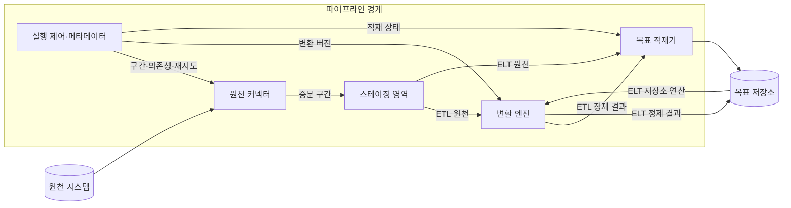
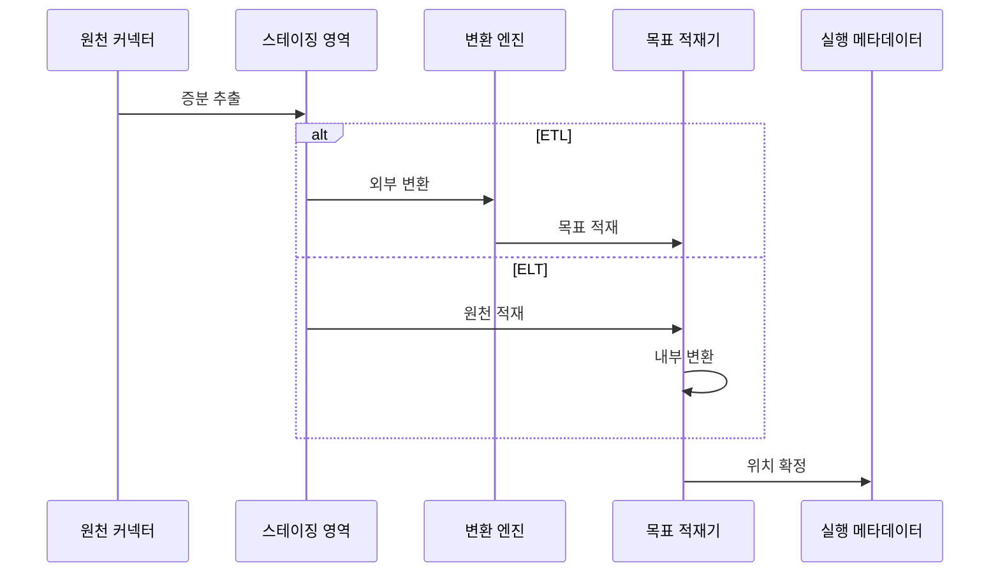

---
sidebar:
  order: 138
  label: "138. ETL·ELT 파이프라인 (ETL ELT Pipeline)"
  badge:
    text: "미출제 · 50%"
    variant: note
title: "ETL·ELT 파이프라인 (ETL ELT Pipeline)"
date: "2026-07-25T19:13:00+09:00"
tags:
  - "notes-software"
weight: 138
extra:
  question_no: "138"
  source_status: "미출제"
  source_history: ""
  priority: 50
  priority_note: "ETL·ELT 선택은 처리 위치·비용 절충"
---

## 미리 알고가기

- **추출·변환·적재 파이프라인(Extract, Transform, Load Pipeline, ETL Pipeline)**: 원천 데이터를 읽고 외부 처리 계층에서 정제한 뒤 목표 저장소에 넣는 반복 처리 흐름
- **추출·적재·변환 파이프라인(Extract, Load, Transform Pipeline, ELT Pipeline)**: 원천 데이터를 목표 저장소에 먼저 넣고 그 저장소의 연산으로 정제하는 반복 처리 흐름
- **추출(Extract)**: 데이터베이스·파일·응용 프로그램 연결 창구에서 원천 데이터와 마지막 처리 이후의 변경분을 읽는 단계
- **변환(Transform)**: 형식·코드·키·품질·업무 규칙을 적용해 원천 데이터를 목표 형태로 바꾸는 단계
- **적재(Load)**: 변환 전후 데이터를 목표 저장소의 테이블이나 파일에 반영하는 단계
- **연산 밀어넣기(Pushdown)**: 행 선별, 여러 표의 키 결합, 합계 계산을 데이터가 있는 저장소에서 실행해 이동량을 줄이는 방식
- **원천 커넥터(Source Connector)**: 원천 시스템의 데이터·변경 위치·데이터 구조를 읽어 파이프라인에 전달하는 연결 구성요소
- **증분 위치(Incremental Position)**: 마지막 성공 처리 이후 새로 읽어야 할 로그·시각·파일의 시작 위치
- **스테이징 영역(Staging Area)**: 변환·검증 전 데이터를 실패 시 다시 처리할 수 있는 구간으로 임시 보존하는 영역
- **데이터 마스킹(Data Masking)**: 민감한 값의 일부나 전체를 다른 값으로 바꿔 원문 노출을 제한하는 처리
- **멱등 적재(Idempotent Load)**: 같은 입력 구간을 여러 번 실행해도 목표 저장소의 최종 결과가 중복되지 않는 적재 방식
- **데이터 대사(Data Reconciliation)**: 원천과 목표의 건수·합계·키를 비교해 누락·중복·불일치를 찾는 검증

## Ⅰ. 개요

- 정의/개념: 추출·변환·적재 순서와 연산 위치를 정한 처리 흐름
- **배경/필요성**: 서로 다른 원천의 반복 수집·정제·통합

### 쉽게 이해하기 (학습용)
- 여러 곳의 자료를 모을 때 밖에서 정리한 뒤 저장하거나, 원본을 먼저 저장한 뒤 저장소 안에서 정리함

## Ⅱ. 특징

- ETL은 적재 전에, ELT는 적재 후에 변환한다.
- 증분 위치가 실패 후 재처리 범위를 제한한다.
- 입력 구간·변환 버전을 결합해 결과를 재현한다.
- 멱등 적재로 구간 재실행 때 중복을 방지한다.
- 연산 위치에 따라 원문 노출과 처리 비용이 달라진다.

### 쉽게 이해하기 (학습용)
- 마지막 성공 위치를 기억하면 실패 지점부터 다시 시작할 수 있고, 같은 구간을 반복해도 결과가 겹치지 않게 적재함

## Ⅲ. 아키텍처 및 구성요소

| 설계 요소 | 설명 |
|:---|:---|
| 원천 커넥터 | 원천 데이터·스키마·증분 위치 수집 |
| 스테이징 영역 | 입력을 재처리 가능한 구간으로 보존 |
| 변환 엔진 | 형식·키·품질·업무 규칙 적용 |
| 목표 적재기 | 입력 구간을 목표 저장소에 멱등 반영 |
| 실행 제어·메타데이터 | 의존성·버전·재시도·완료 위치 관리 |

> 요약: ETL은 외부 변환, ELT는 저장소 내부 변환

### 쉽게 이해하기 (학습용)
- 연결기가 새 자료를 임시 저장하고, 제어기가 ETL의 외부 변환이나 ELT의 저장소 내부 변환을 실행해 목표에 반영함

## Ⅳ. 원리 및 절차 흐름도

| 절차 | 설명 |
|:---|:---|
| 증분 추출 | 마지막 성공 위치 이후 변경 구간 보존 |
| 외부 변환 | 스테이징 데이터를 외부 엔진에서 정제 |
| 목표 적재 | ETL 정제 결과를 목표에 멱등 반영 |
| 원천 적재 | ELT 원천 데이터를 목표에 먼저 보존 |
| 내부 변환 | 목표 저장소 연산으로 원천 데이터 정제 |
| 위치 확정 | 성공한 원천 구간의 다음 시작점 저장 |

> 요약: 변환·적재 성공 후 다음 증분 위치 확정

### 쉽게 이해하기 (학습용)
- 새 자료 구간을 따로 보관하고 ETL이나 ELT 순서로 처리한 뒤, 성공한 곳을 표시해 다음 실행이 그 뒤에서 시작하게 함

## Ⅴ. 종류 및 비교

| 판단 기준 | ETL | ELT |
|:---|:---|:---|
| 핵심 특징 | 외부 엔진에서 변환 후 적재 | 원천 적재 후 저장소 내부 변환 |
| 적용 기준 | 적재 전 민감정보·형식 통제 | 대규모 원본 보존·유연 변환 |
| 주요 위험 | 외부 변환 병목·원본 재처리 한계 | 원천 노출·목표 저장소 연산 비용 |

> 요약: 선처리 통제는 ETL, 원본 재변환은 ELT

### 쉽게 이해하기 (학습용)
- 전자는 적재 전 변환, 후자는 적재 후 저장소 연산으로 변환함

## Ⅵ. 실무 사례

1. 급여 적재는 ETL로 민감 열 마스킹 후 저장

### 쉽게 이해하기 (학습용)
- 급여 데이터는 주민번호 같은 민감한 값을 밖에서 가린 뒤 저장해 목표 저장소에 원문이 남지 않게 함

## Ⅶ. 결론

- 민감정보 선처리·원본 재변환 요구로 ETL·ELT 선택

### 쉽게 이해하기 (학습용)
- 민감한 원문을 저장 전에 가려야 하면 ETL을, 원본을 보관해 여러 방식으로 다시 가공해야 하면 ELT를 선택함
