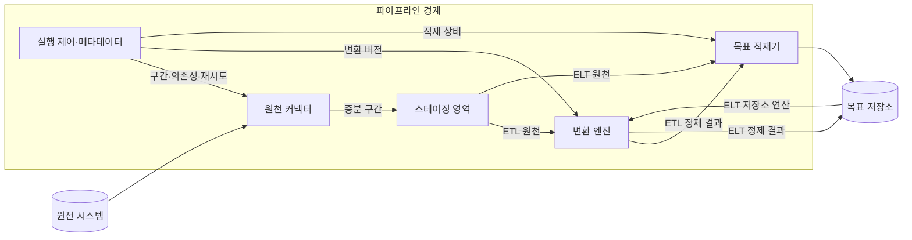
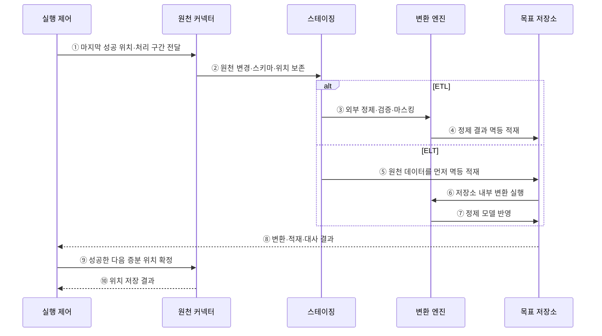

---
sidebar:
  order: 138
  label: "138. ETL·ELT 파이프라인 (ETL ELT Pipeline)"
  badge:
    text: "미출제 · 50%"
    variant: note
title: "ETL·ELT 파이프라인 (ETL ELT Pipeline)"
date: "2026-07-25T19:13:00+09:00"
tags:
  - "notes-software"
weight: 138
extra:
  question_no: "138"
  source_status: "미출제"
  source_history: ""
  priority: 50
  priority_note: "ETL·ELT 선택은 처리 위치·비용 절충"
---

## 미리 알고가기

- **추출·변환·적재 파이프라인(Extract, Transform, Load Pipeline, ETL Pipeline)**: 원천 데이터를 읽고 외부 처리 계층에서 정제한 뒤 목표 저장소에 넣는 반복 처리 흐름
- **추출·적재·변환 파이프라인(Extract, Load, Transform Pipeline, ELT Pipeline)**: 원천 데이터를 목표 저장소에 먼저 넣고 그 저장소의 연산으로 정제하는 반복 처리 흐름
- **추출(Extract)**: 데이터베이스·파일·응용 프로그램 연결 창구에서 원천 데이터와 마지막 처리 이후의 변경분을 읽는 단계
- **변환(Transform)**: 형식·코드·키·품질·업무 규칙을 적용해 원천 데이터를 목표 형태로 바꾸는 단계
- **적재(Load)**: 변환 전후 데이터를 목표 저장소의 테이블이나 파일에 반영하는 단계
- **연산 밀어넣기(Pushdown)**: 행 선별, 여러 표의 키 결합, 합계 계산을 데이터가 있는 저장소에서 실행해 이동량을 줄이는 방식
- **원천 커넥터(Source Connector)**: 원천 시스템의 데이터·변경 위치·데이터 구조를 읽어 파이프라인에 전달하는 연결 구성요소
- **증분 위치(Incremental Position)**: 마지막 성공 처리 이후 새로 읽어야 할 로그·시각·파일의 시작 위치
- **스테이징 영역(Staging Area)**: 변환·검증 전 데이터를 실패 시 다시 처리할 수 있는 구간으로 임시 보존하는 영역
- **데이터 마스킹(Data Masking)**: 민감한 값의 일부나 전체를 다른 값으로 바꿔 원문 노출을 제한하는 처리
- **멱등 적재(Idempotent Load)**: 같은 입력 구간을 여러 번 실행해도 목표 저장소의 최종 결과가 중복되지 않는 적재 방식
- **데이터 대사(Data Reconciliation)**: 원천과 목표의 건수·합계·키를 비교해 누락·중복·불일치를 찾는 검증

## Ⅰ. 개요

- ETL·ELT 파이프라인은 원천 데이터를 반복 수집해 목표 저장소에 통합하되 변환과 적재의 순서·연산 위치를 다르게 선택하는 처리 흐름이다.
- ETL은 외부에서 변환한 뒤 적재하고 ELT는 원천을 먼저 적재한 뒤 목표 저장소의 연산으로 변환한다.

### 쉽게 이해하기 (학습용)

- 자료를 밖에서 정리해 넣는 ETL과 먼저 넣고 안에서 정리하는 ELT이다.

## Ⅱ. 특징

- **순서·위치 차이**: ETL은 외부 변환 계층, ELT는 목표 저장소의 연산 능력을 중심으로 처리한다.
- **증분 처리**: 로그·시각·파일의 마지막 성공 위치 이후 구간만 읽어 처리량과 복구 범위를 줄인다.
- **재현성**: 원천 구간·스키마·변환 코드·설정·목표 버전을 함께 기록한다.
- **멱등성과 대사**: 같은 구간을 다시 실행해도 최종 결과가 중복되지 않게 하고 건수·합계·키를 비교한다.
- **보안·비용 절충**: 원문 노출 위치, 데이터 이동량, 외부 엔진과 저장소 연산 비용이 선택을 좌우한다.

### 쉽게 이해하기 (학습용)

- 어디까지 성공했는지 기억하고 같은 구간을 다시 넣어도 결과가 한 번만 남게 만든다.

## Ⅲ. 아키텍처 및 구성요소

**도표안 A — 구조도**

**도표안 B — sequenceDiagram**

| 설계 요소 | 설명 |
|:---|:---|
| 원천 커넥터 | 원천 데이터·스키마·증분 위치를 일관된 구간으로 수집 |
| 스테이징 영역 | 입력·출처·위치를 재처리 가능한 불변 구간으로 보존 |
| 변환 엔진 | 형식·키·품질·업무 규칙·마스킹 적용 |
| 목표 저장소·적재기 | 원천 또는 정제 결과를 멱등 반영하고 저장소 연산 제공 |
| 실행 제어·메타데이터 | 의존성·코드 버전·재시도·대사·완료 위치 관리 |

**동작 원리**

- ① 실행 제어기가 마지막 성공 위치와 이번에 처리할 원천 구간을 커넥터에 전달한다.
- ② 커넥터가 원천 변경·스키마·출처·위치를 스테이징 영역에 불변 입력으로 보존한다.
- ③ ETL은 스테이징 입력을 외부 엔진에서 정제·검증·마스킹한다.
- ④ ETL 변환 엔진이 정제 결과를 실행·업무 키 기준으로 목표 저장소에 멱등 적재한다.
- ⑤ ELT는 스테이징 원천을 목표 저장소의 Raw 영역에 먼저 멱등 적재한다.
- ⑥ ELT는 목표 저장소의 연산 능력을 사용해 Raw 데이터를 정제 모델로 변환한다.
- ⑦ ELT 변환 엔진이 정제 모델을 목표 저장소에 반영한다.
- ⑧ 선택한 경로의 변환·적재가 끝나면 원천과 목표의 건수·합계·키 대사 결과를 실행 제어기에 전달한다.
- ⑨ 전체 성공과 대사를 확인한 뒤에만 다음 실행이 시작할 증분 위치를 확정하도록 요청한다.
- ⑩ 커넥터가 원천 측 위치 저장 결과를 실행 제어기에 반환한다.

### 쉽게 이해하기 (학습용)

- 새 자료를 따로 보관하고 선택한 순서로 처리한 뒤 결과가 맞아야 완료 표시를 옮긴다.

## Ⅳ. 종류 및 비교

| 비교 항목 | ETL | ELT |
|:---|:---|:---|
| 처리 순서 | 추출→외부 변환→정제 결과 적재 | 추출→원천 적재→저장소 내부 변환 |
| 원천 보존 | 별도 스테이징을 설계해야 재처리 가능 | 목표 저장소 Raw 영역에 기본 보존 |
| 적재 전 통제 | 민감정보·형식·품질을 먼저 제한 | 원문 접근·분류·권한을 저장소에서 통제 |
| 연산 확장 | 외부 변환 엔진 용량에 의존 | 목표 저장소 연산·비용 모델에 의존 |
| 적합 상황 | 엄격한 선처리·고정 목표 스키마 | 대규모 원본·다목적 반복 변환 |
| 주요 위험 | 외부 병목·원본 손실·이동 비용 | 원문 노출·연산비·저장소 종속 |

> 현대 파이프라인은 민감 열을 ETL로 선처리하고 나머지를 ELT로 모델링하는 등 두 방식을 단계별로 혼합한다.

### 쉽게 이해하기 (학습용)

- 밖에서 가려야 할 값은 먼저 처리하고 반복 분석할 원본은 안에 보관해 다시 가공할 수 있다.

## Ⅴ. 실무 고려사항 및 대책

| 고려사항 | 위험 | 대책 |
|:---|:---|:---|
| 증분 경계 | 누락·중복·늦은 변경 | 원천 로그 위치·겹침 구간·워터마크·대사 |
| 멱등성 | 재시도 때 중복 반영 | 실행/업무 키·MERGE·교체 가능한 파티션 |
| 스키마 변화 | 열 추가·타입 변경으로 중단·오독 | 계약·호환 규칙·격리·버전별 파서 |
| 민감정보 | 스테이징·로그·Raw에 원문 노출 | 최소 수집·마스킹·암호화·접근·보존 |
| 재현성 | 코드·참조값 변경으로 과거 결과 불일치 | 입력·코드·설정·참조 데이터 버전 |
| 비용 | 이동·외부 연산·저장소 연산 폭증 | Pushdown·증분·파티션·비용 예산과 관찰 |

> **적용 사례**: 급여 원천의 주민번호는 신뢰 경계 밖 ETL 단계에서 토큰화하고, 비민감 원천은 Raw에 적재해 저장소 안에서 반복 변환한다.

### 쉽게 이해하기 (학습용)

- 급여의 주민번호는 창고에 넣기 전에 가리고 분석에 필요한 나머지는 원본으로 보관한다.

## Ⅵ. 결론

- ETL과 ELT의 핵심 차이는 이름보다 원문을 언제 어디에 저장하고 어떤 연산 자원과 통제 경계에서 변환하는가에 있다.
- 민감정보·재처리·증분 경계·멱등성·재현성·대사·이동과 연산 비용을 기준으로 단계별 처리 위치를 선택해야 한다.

### 쉽게 이해하기 (학습용)

- 먼저 가려야 하면 ETL, 먼저 보관해 여러 번 가공해야 하면 ELT가 기본 선택이다.
