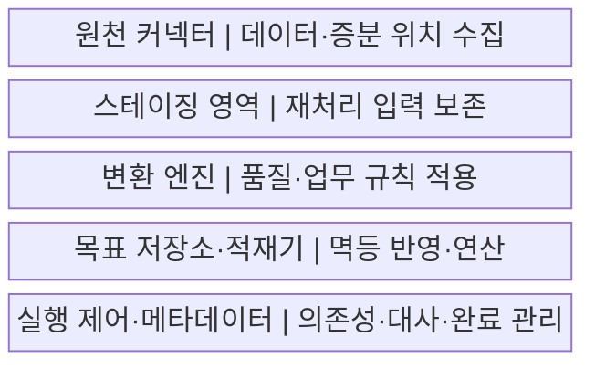
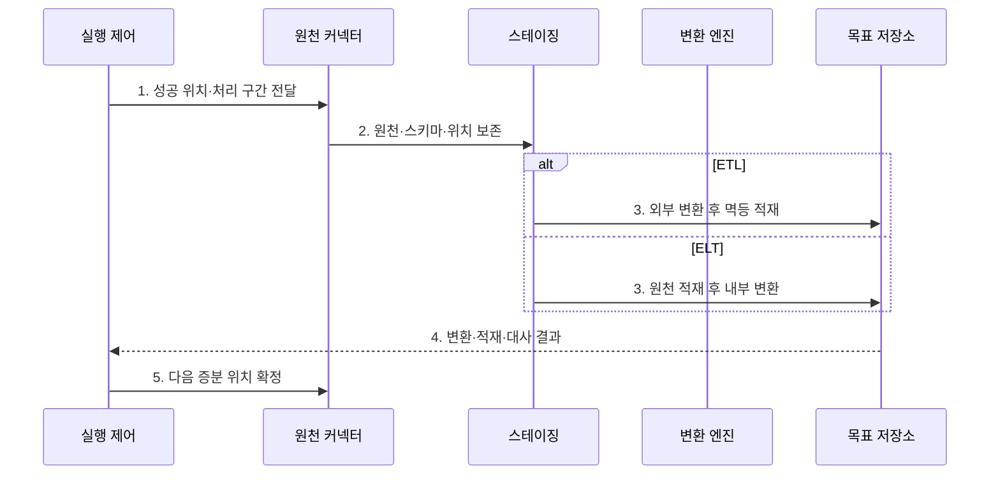

---
sidebar:
  order: 138
  label: "138. ETL·ELT 파이프라인 (ETL ELT Pipeline)"
  badge:
    text: "미출제 · 50%"
    variant: note
title: "ETL·ELT 파이프라인 (ETL ELT Pipeline)"
date: "2026-07-25T19:13:00+09:00"
tags:
  - "notes-software"
weight: 138
extra:
  question_no: "138"
  source_status: "미출제"
  source_history: ""
  priority: 50
  priority_note: "ETL·ELT 선택은 처리 위치·비용 절충"
---

## 미리 알고가기

- **추출·변환·적재 파이프라인(Extract, Transform, Load Pipeline, ETL Pipeline)**: 원천 데이터를 읽고 외부 처리 계층에서 정제한 뒤 목표 저장소에 넣는 반복 처리 흐름
- **추출·적재·변환 파이프라인(Extract, Load, Transform Pipeline, ELT Pipeline)**: 원천 데이터를 목표 저장소에 먼저 넣고 그 저장소의 연산으로 정제하는 반복 처리 흐름
- **추출(Extract)**: 데이터베이스·파일·응용 프로그램 연결 창구에서 원천 데이터와 마지막 처리 이후의 변경분을 읽는 단계
- **변환(Transform)**: 형식·코드·키·품질·업무 규칙을 적용해 원천 데이터를 목표 형태로 바꾸는 단계
- **적재(Load)**: 변환 전후 데이터를 목표 저장소의 테이블이나 파일에 반영하는 단계
- **연산 밀어넣기(Pushdown)**: 행 선별, 여러 표의 키 결합, 합계 계산을 데이터가 있는 저장소에서 실행해 이동량을 줄이는 방식
- **원천 커넥터(Source Connector)**: 원천 시스템의 데이터·변경 위치·데이터 구조를 읽어 파이프라인에 전달하는 연결 구성요소
- **증분 위치(Incremental Position)**: 마지막 성공 처리 이후 새로 읽어야 할 로그·시각·파일의 시작 위치
- **스테이징 영역(Staging Area)**: 변환·검증 전 데이터를 실패 시 다시 처리할 수 있는 구간으로 임시 보존하는 영역
- **데이터 마스킹(Data Masking)**: 민감한 값의 일부나 전체를 다른 값으로 바꿔 원문 노출을 제한하는 처리
- **멱등 적재(Idempotent Load)**: 같은 입력 구간을 여러 번 실행해도 목표 저장소의 최종 결과가 중복되지 않는 적재 방식
- **데이터 대사(Data Reconciliation)**: 원천과 목표의 건수·합계·키를 비교해 누락·중복·불일치를 찾는 검증

## Ⅰ. 개요

- **정의/개념**: 추출·변환·적재의 **순서와 연산 위치를 선택**하는 데이터 처리 흐름이다.
- **배경/필요성**: 원천 보존·선처리·저장소 연산의 **비용과 통제 경계**를 조정한다.

### 쉽게 이해하기 (학습용)

- 자료를 밖에서 정리해 넣는 ETL과 먼저 넣고 안에서 정리하는 ELT이다.

## Ⅱ. 특징

- **처리 위치**: ETL은 외부, ELT는 목표 저장소에서 변환한다.
- **증분 처리**: 마지막 성공 위치 이후 구간만 읽는다.
- **멱등·대사**: 재실행 중복을 막고 원천·목표를 비교한다.

### 쉽게 이해하기 (학습용)

- 어디까지 성공했는지 기억하고 같은 구간을 다시 넣어도 결과가 한 번만 남게 만든다.

## Ⅲ. 구조 및 구성요소

| 구성요소 | 책임 |
|:---|:---|
| 원천 커넥터 | 원천 데이터·스키마·증분 위치 수집 |
| 스테이징 영역 | 입력·출처·위치를 재처리 가능하게 보존 |
| 변환 엔진 | 형식·키·품질·업무 규칙·마스킹 적용 |
| 목표 저장소·적재기 | 원천·정제 결과를 멱등 반영하고 연산 제공 |
| 실행 제어·메타데이터 | 의존성·코드 버전·대사·완료 위치 관리 |

### 쉽게 이해하기 (학습용)

- 밖에서 정리해 넣거나 먼저 넣고 안에서 정리한다.

## Ⅳ. 흐름도

**동작 원리**

- **1. 성공 위치·처리 구간 전달**: 이번 증분 입력 범위를 정한다.
- **2. 원천·스키마·위치 보존**: 재처리 가능한 입력을 저장한다.
- **3. 외부 변환 후 멱등 적재**: ETL 경로에서 정제 결과를 반영한다.
- **3. 원천 적재 후 내부 변환**: ELT 경로에서 Raw 데이터로 모델을 만든다.
- **4. 변환·적재·대사 결과**: 원천과 목표의 건수·합계를 비교한다.
- **5. 다음 증분 위치 확정**: 전체 성공 뒤에만 완료 위치를 옮긴다.

### 쉽게 이해하기 (학습용)

- 새 자료를 따로 보관하고 선택한 순서로 처리한 뒤 결과가 맞아야 완료 표시를 옮긴다.

## Ⅴ. 종류 및 비교

| 비교 항목 | ETL | ELT |
|:---|:---|:---|
| 적용 기준 | **적재 전 선처리·고정 스키마** | **원본 보존·반복 변환** |
| 핵심 특징 | 추출→외부 변환→적재 | 추출→원천 적재→내부 변환 |
| 한계 | 외부 병목·이동 비용 | 원문 노출·연산비·저장소 종속 |

### 쉽게 이해하기 (학습용)

- 밖에서 가려야 할 값은 먼저 처리하고 반복 분석할 원본은 안에 보관해 다시 가공할 수 있다.

## Ⅵ. 실무 고려사항 및 대책

| 고려사항 | 대책 | 효과 |
|:---|:---|:---|
| 증분 경계 | 로그 위치·겹침 구간·워터마크·대사 | 누락·중복 방지 |
| 멱등성 | 실행·업무 키·MERGE 적용 | 재시도 중복 억제 |
| 스키마 변화 | 계약·호환 규칙·격리·버전 파서 | 중단·오독 방지 |
| 민감정보 | 최소 수집·마스킹·암호화·접근 통제 | 원문 노출 감소 |
| 비용 | Pushdown·증분·파티션·예산 관찰 | 이동·연산비 통제 |

### 쉽게 이해하기 (학습용)

- 급여의 주민번호는 창고에 넣기 전에 가리고 분석에 필요한 나머지는 원본으로 보관한다.

## Ⅶ. 결론

- **민감정보·원천 보존·연산 위치·재처리 비용**으로 ETL·ELT 경로를 선택한다.

### 쉽게 이해하기 (학습용)

- 먼저 가려야 하면 ETL, 먼저 보관해 여러 번 가공해야 하면 ELT가 기본 선택이다.
