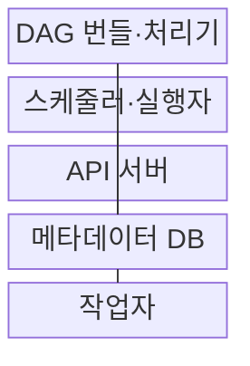
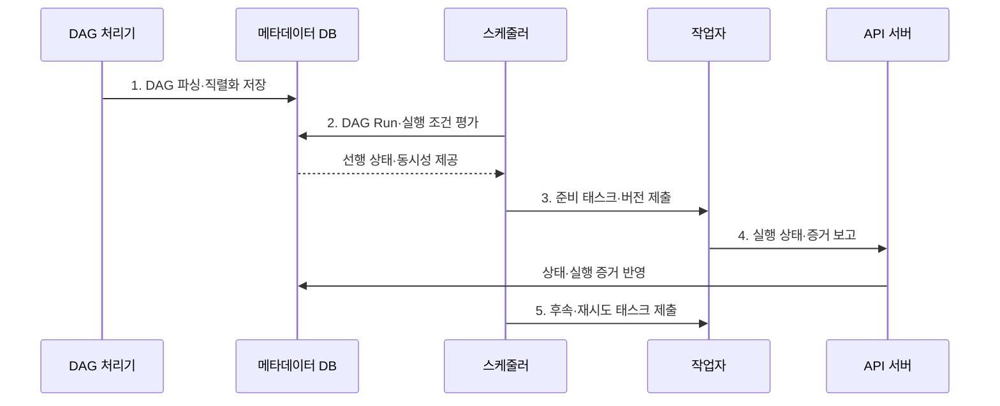

---
sidebar:
  order: 139
  label: "139. 데이터 파이프라인 오케스트레이션: Airflow (Data Pipeline Orchestration)"
  badge:
    text: "미출 · 50%"
    variant: note
title: "데이터 파이프라인 오케스트레이션: Airflow (Data Pipeline Orchestration)"
date: "2026-08-02T12:00:00+09:00"
tags:
  - "notes-software"
weight: 139
extra:
  question_no: "139"
  source_status: "미출"
  source_history: ""
  priority: 50
  priority_note: "Airflow 의존성·재시도·스케줄 운영 가치"
---

## Ⅰ. 개요

핵심 용어

- **파이프라인 오케스트레이션**: 데이터 작업의 일정·의존성·상태·재시도를 조정해 올바른 순서로 실행하는 활동이다.

- 정의/개념: **데이터 파이프라인 오케스트레이션**은 데이터 작업의 일정·의존성·실행 상태·재시도·복구를 워크플로로 조정하는 운영 체계
- 배경/필요성: Cron만으로는 복합 작업의 **의존 상태·실패 복구 관리 곤란**

### 쉽게 이해하기 (학습용)

- 지휘자는 작업 순서와 재실행을 정하고 실제 데이터 가공은 각 작업자가 수행한다.

## Ⅱ. 특징

핵심 용어

- **부하·복구 통제**: Pool·재시도·백필을 이용해 공유 자원과 재처리 실행량을 조절하는 특성이다.

- **워크플로 코드화**: DAG로 태스크·의존성·일정을 선언
- **트리거 규칙**: 선행 태스크 상태에 따라 후속 실행
- **부하·복구 통제**: Pool·재시도·백필로 실행량을 조정

### 쉽게 이해하기 (학습용)

- 순서표가 있어도 작업을 한꺼번에 너무 많이 보내면 공용 창구가 막히므로 동시 실행 수를 제한해야 한다.

## Ⅲ. 구조 및 구성요소

핵심 용어

- **스케줄러·실행자**: DAG Run을 만들고 실행 조건을 판정해 준비된 태스크를 작업자에게 제출하는 구성요소이다.

| 구성요소 | 책임 |
|:---|:---|
| DAG 번들·처리기 | DAG와 코드를 **파싱·직렬화**해 저장 |
| 스케줄러·실행자 | DAG Run 생성과 **조건 판정·태스크 제출** |
| API 서버 | **사용자 요청·작업자 상태** 통신 제공 |
| 메타데이터 DB | **DAG Run·Task Instance** 상태 저장 |
| 작업자 | 지정 **DAG 버전·태스크 코드** 실행 |

### 쉽게 이해하기 (학습용)

- 상태 장부를 보고 준비된 작업만 작업자에게 보낸다.

## Ⅳ. 흐름도

핵심 용어

- **5. 후속·재시도 태스크 제출**: 갱신된 선행 상태와 재시도 정책으로 다음 작업 실행을 결정하는 단계이다.

**동작 원리**

1. **DAG 파싱·직렬화 저장**: 일정·태스크·의존성을 등록
2. **DAG Run·실행 조건 평가**: 일정·백필 단위를 만들고 선행 상태·동시성으로 실행 가능성 판정
3. **준비 태스크·버전 제출**: 실행할 코드·데이터 구간·시도 번호를 작업자에게 고정
4. **실행 상태·증거 보고**: 시작·완료·실패와 로그·산출 위치를 인증된 상태 장부에 반영
5. **후속·재시도 태스크 제출**: 갱신된 의존 상태와 재시도 정책으로 다음 실행 결정

### 쉽게 이해하기 (학습용)

- 설계도와 상태 장부를 보고 준비된 작업만 보내고 결과가 적힐 때마다 다음 작업을 다시 고른다.

## Ⅴ. 종류 및 비교

핵심 용어

- **Airflow 오케스트레이션**: 복합 의존성의 태스크 상태·재시도·백필을 DAG Run 단위로 관리하는 방식이다.

| 비교 항목 | Airflow 오케스트레이션 | Cron 중심 실행 |
|:---|:---|:---|
| 적용 기준 | 복합 의존성의 **상태·백필** 관리 | **작고 독립적인 시간 실행** |
| 핵심 특징 | DAG Run 기반 **태스크 상태·Pool** | 지정 시각의 **독립 명령** |
| 한계 | **상태 DB 병목·백필 폭주** | **숨은 의존성·실패 추적** 한계 |

### 쉽게 이해하기 (학습용)

- Airflow는 앞 작업의 결과를 보고 다음 일을 정하고 Cron은 정해진 시각에 알람만 울린다.

## Ⅵ. 실무 고려사항 및 대책

핵심 용어

- **백필**: 과거 데이터 구간을 다시 처리하되 별도 동시성 한도로 현재 작업의 부하를 보호해야 하는 실행이다.

| 문제 | 대책 | 효과 |
|:---|:---|:---|
| 태스크 **재시도** | 데이터 구간·업무 키로 **멱등성** 확보 | **중복 적재** 방지 |
| **숨은 선행 조건** 존재 | **센서·데이터 계약**으로 명시 | **불필요한 대기** 제거 |
| 과거 구간 **백필** | 별도 **Pool·동시성** 적용 | 현재 작업의 **부하 보호** |
| 느린 **DAG 파싱** | 가벼운 최상위 코드와 **버전 번들** 사용 | **파싱 부하·버전 차이** 감소 |
| **상태 DB** 비대화 | **보존 기간·태스크 크기** 조정 | **상태 처리 병목** 억제 |

### 쉽게 이해하기 (학습용)

- 적재와 검사가 끝나야 게시하고 과거 재작업은 별도 줄에서 천천히 보낸다.

## Ⅶ. 결론

핵심 용어

- **Airflow**: 복합 의존성과 과거 구간 재처리를 관리할 때 적합한 오케스트레이션 플랫폼이다.

- 복합 의존·백필은 **Airflow**, 독립 시간 작업은 **Cron** 선택

### 쉽게 이해하기 (학습용)

- 지휘자는 순서와 재시도를 맡고 각 작업은 다시 실행해도 결과가 겹치지 않게 만들어야 한다.
