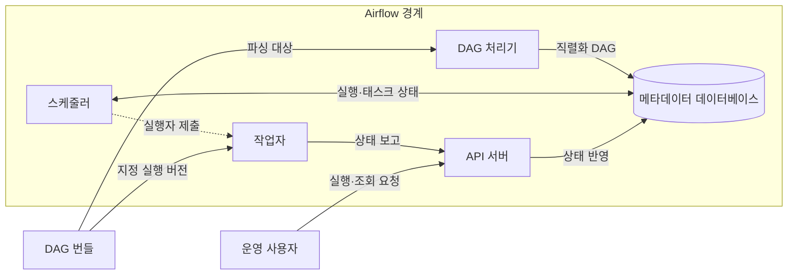
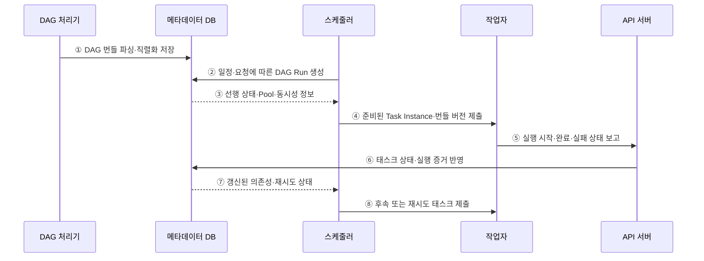

---
sidebar:
  order: 139
  label: "139. 데이터 파이프라인 오케스트레이션 — Airflow (Data Pipeline Orchestration)"
  badge:
    text: "미출제 · 50%"
    variant: note
title: "데이터 파이프라인 오케스트레이션 — Airflow (Data Pipeline Orchestration)"
date: "2026-07-25T19:14:00+09:00"
tags:
  - "notes-software"
weight: 139
extra:
  question_no: "139"
  source_status: "미출제"
  source_history: ""
  priority: 50
  priority_note: "Airflow 의존성·재시도·스케줄 운영 가치"
---

## 미리 알고가기

- **데이터 파이프라인 오케스트레이션(Data Pipeline Orchestration)**: 데이터 작업의 의존성·일정·상태·재시도·동시 실행을 조정해 올바른 순서로 실행하는 활동
- **아파치 에어플로(Apache Airflow)**: 배치 워크플로를 코드로 정의하고 일정·의존성·실행 상태를 조정·관찰하는 오픈소스 플랫폼
- **방향성 비순환 그래프(Directed Acyclic Graph, DAG)**: 태스크 의존성과 실행 조건을 순환 없이 표현하며 Airflow 워크플로의 실행 순서를 정하는 그래프
- **DAG 실행(DAG Run)**: 특정 데이터 구간이나 수동 요청에 대해 생성되어 개별 실행 상태를 갖는 DAG 인스턴스
- **태스크 인스턴스(Task Instance)**: DAG 실행 안에서 성공·실패·재시도 같은 상태를 갖는 개별 태스크 실행
- **DAG 번들(DAG Bundle)**: DAG 파일과 관련 코드를 함께 묶어 DAG 처리기와 작업자가 같은 실행 버전을 사용하게 하는 배포 단위
- **스케줄러(Scheduler)**: DAG 실행을 만들고 의존성·동시성 한도를 충족한 태스크를 실행자에 제출하는 구성요소
- **실행자(Executor)**: 스케줄러 프로세스 안에서 실행 가능한 태스크를 로컬 또는 분산 작업자에게 보내는 실행 방식 설정
- **작업자(Worker)**: 실행자가 보낸 태스크 코드를 실제로 실행하며 분산 구성에서는 별도 프로세스나 컨테이너로 동작하는 구성요소
- **DAG 처리기(DAG Processor)**: DAG 번들의 파일을 파싱하고 직렬화해 스케줄러가 읽을 수 있도록 메타데이터 데이터베이스에 저장하는 구성요소
- **DAG 직렬화(DAG Serialization)**: DAG 코드의 일정·태스크·의존성을 스케줄러가 읽고 저장할 수 있는 구조로 변환하는 처리
- **응용 프로그래밍 인터페이스 서버(Application Programming Interface Server, API Server)**: 사용자 요청을 받고 작업자의 상태 보고를 메타데이터 데이터베이스에 전달하는 서버
- **백필(Backfill)**: 과거 데이터 구간별 DAG 실행을 다시 만들어 누락되거나 변경된 데이터를 재처리하는 작업
- **크론(Cron)**: 지정한 시각에 명령을 실행하지만 작업 간 의존성과 실행 상태는 별도로 관리해야 하는 시간 기반 스케줄러
- **트리거 규칙(Trigger Rule)**: 상위 태스크의 성공·실패·건너뜀 상태로 하위 태스크의 실행 가능 여부를 정하는 규칙
- **풀(Pool)**: 공유 시스템에 동시에 접근할 수 있는 태스크 수를 슬롯으로 제한하는 동시성 제어 장치
- **메타데이터 데이터베이스(Metadata Database)**: 직렬화한 DAG, DAG 실행, 태스크 인스턴스, 일정과 상태를 저장하는 데이터베이스
- **멱등성(Idempotence)**: 같은 데이터 구간의 태스크를 여러 번 실행해도 최종 결과가 한 번 실행한 것과 같은 성질

## Ⅰ. 개요

- 데이터 파이프라인 오케스트레이션은 작업의 일정·데이터 구간·의존성·상태·재시도·동시성을 조정해 올바른 순서와 자원 범위에서 실행하는 활동이다.
- Airflow는 배치 워크플로를 DAG 코드로 정의하고 각 DAG Run과 Task Instance의 상태를 기록해 실패 복구·관찰·백필을 지원한다.

### 쉽게 이해하기 (학습용)

- 지휘자는 작업 순서와 재실행을 정하고 실제 데이터 가공은 각 작업자가 수행한다.

## Ⅱ. 특징

- **워크플로 코드화**: DAG가 태스크·의존성·일정·재시도·Trigger Rule을 선언해 검토와 버전 관리를 돕는다.
- **상태 기반 조정**: 스케줄러가 데이터 구간별 DAG Run을 만들고 선행 상태와 실행 조건을 만족한 Task Instance만 제출한다.
- **실행 분리**: 실행자는 스케줄러의 설정이며 준비된 태스크를 로컬 또는 분산 작업자에게 전달한다.
- **부하 통제**: Pool·동시성·우선순위로 외부 데이터베이스와 API의 동시 접근을 제한한다.
- **선택 복구**: 실패 태스크 재시도와 과거 구간 백필을 지원하지만 태스크 자체의 멱등성은 작성자가 보장해야 한다.

### 쉽게 이해하기 (학습용)

- 순서표가 있어도 작업을 한꺼번에 너무 많이 보내면 공용 창구가 막히므로 동시 실행 수를 제한해야 한다.

## Ⅲ. 아키텍처 및 구성요소

**도표안 A — 구조도**

**도표안 B — sequenceDiagram**

| 설계 요소 | 설명 |
|:---|:---|
| DAG 번들·처리기 | DAG와 관련 코드를 공급하고 파싱·직렬화해 저장 |
| 스케줄러·실행자 | DAG Run 생성·실행 조건 판정·태스크 제출 |
| API 서버 | 사용자 요청·UI와 Task SDK 상태 통신 제공 |
| 메타데이터 데이터베이스 | 직렬화 DAG·DAG Run·Task Instance·설정 상태 저장 |
| 작업자 | 지정된 DAG 번들 버전의 태스크 코드를 실제 실행 |

**동작 원리**

- ① DAG 처리기가 DAG 번들의 파일을 파싱해 일정·태스크·의존성을 메타데이터 데이터베이스에 직렬화한다.
- ② 스케줄러가 일정·수동 요청·백필 구간에 해당하는 DAG Run을 생성한다.
- ③ 데이터베이스가 Task Instance의 선행 상태·Trigger Rule·Pool·동시성 정보를 스케줄러에 제공한다.
- ④ 스케줄러 내부 실행자가 실행 가능한 Task Instance와 사용할 DAG 번들 버전을 작업자에게 제출한다.
- ⑤ 작업자가 태스크 코드를 실행하고 Task SDK를 통해 API 서버에 시작·완료·실패 상태를 보고한다.
- ⑥ API 서버가 인증된 상태 변경과 실행 증거를 메타데이터 데이터베이스에 반영한다.
- ⑦ 데이터베이스가 갱신된 의존성·재시도 시각·DAG Run 상태를 스케줄러에 제공한다.
- ⑧ 스케줄러가 상태를 다시 판정해 후속 태스크 또는 정책상 허용된 재시도를 제출한다.

### 쉽게 이해하기 (학습용)

- 설계도와 상태 장부를 보고 준비된 작업만 보내고 결과가 적힐 때마다 다음 작업을 다시 고른다.

## Ⅳ. 종류 및 비교

| 비교 항목 | Airflow 오케스트레이션 | Cron 중심 실행 |
|:---|:---|:---|
| 실행 기준 | DAG 의존성·상태·데이터 구간 | 지정한 시각의 독립 명령 |
| 상태 관리 | DAG Run·Task Instance·재시도 이력 | 명령 밖에서 별도 구현 |
| 복구 | 실패 태스크 선택 재실행·백필 | 전체 스크립트 또는 수동 구간 재실행 |
| 자원 통제 | Pool·동시성·우선순위 | 운영체제·스크립트 수준 별도 제한 |
| 적합 상황 | 복합 의존성·관찰·과거 구간 처리 | 작고 독립적이며 실패 영향이 낮은 작업 |
| 주요 위험 | 상태 DB·스케줄러 병목·백필 폭주 | 중복 실행·숨은 의존성·실패 추적 한계 |

> Airflow는 데이터 처리 엔진이 아니라 외부 작업을 조정하는 제어 계층이므로 대용량 데이터를 태스크 사이 메타데이터 통신에 직접 싣지 않는다.

### 쉽게 이해하기 (학습용)

- Airflow는 앞 작업의 결과를 보고 다음 일을 정하고 Cron은 정해진 시각에 알람만 울린다.

## Ⅴ. 실무 고려사항 및 대책

| 고려사항 | 위험 | 대책 |
|:---|:---|:---|
| 태스크 멱등성 | 재시도·백필로 중복 반영 | 데이터 구간·업무 키 기반 교체·MERGE |
| 의존성 | 파일·시각 대기 같은 숨은 관계 | 명시적 센서·데이터 조건·계약 |
| 백필 | 현재 작업과 자원 경쟁·외부 부하 | 별도 Pool·동시성·우선순위·단계 실행 |
| DAG 코드 | 파싱 부하·실행 중 버전 불일치 | 가벼운 최상위 코드·버전 DAG 번들 |
| 상태 DB | 많은 태스크·짧은 주기로 병목 | 적정 태스크 크기·DB 튜닝·보존·관찰 |
| 비밀·권한 | DAG 코드·로그에 자격 증명 노출 | Connection·비밀 저장소·최소 권한·마스킹 |

> **적용 사례**: 일별 주문 적재가 끝난 뒤 품질 검증이 성공해야 게시하며, 과거 구간 백필은 별도 Pool로 제한해 당일 적재와 원천 데이터베이스를 보호한다.

### 쉽게 이해하기 (학습용)

- 적재와 검사가 끝나야 게시하고 과거 재작업은 별도 줄에서 천천히 보낸다.

## Ⅵ. 결론

- 오케스트레이션의 핵심은 작업을 대신 처리하는 것이 아니라 실행 조건과 상태 전이를 기록해 순서·복구·자원 사용을 결정하는 데 있다.
- 명시적 의존성·멱등 태스크·데이터 구간·Pool·백필 격리·DAG 버전·상태 데이터베이스를 함께 설계해야 안정적으로 운영할 수 있다.

### 쉽게 이해하기 (학습용)

- 지휘자는 순서와 재시도를 맡고 각 작업은 다시 실행해도 결과가 겹치지 않게 만들어야 한다.
