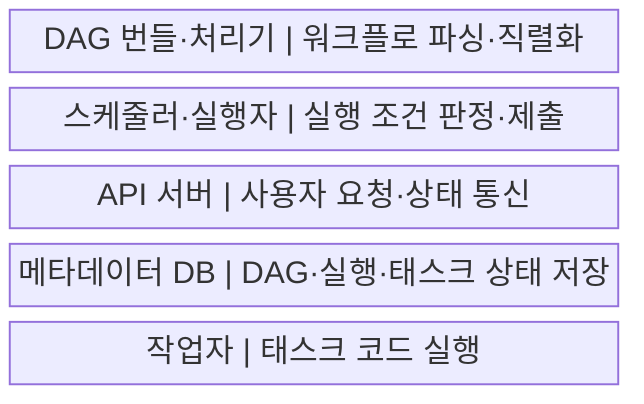
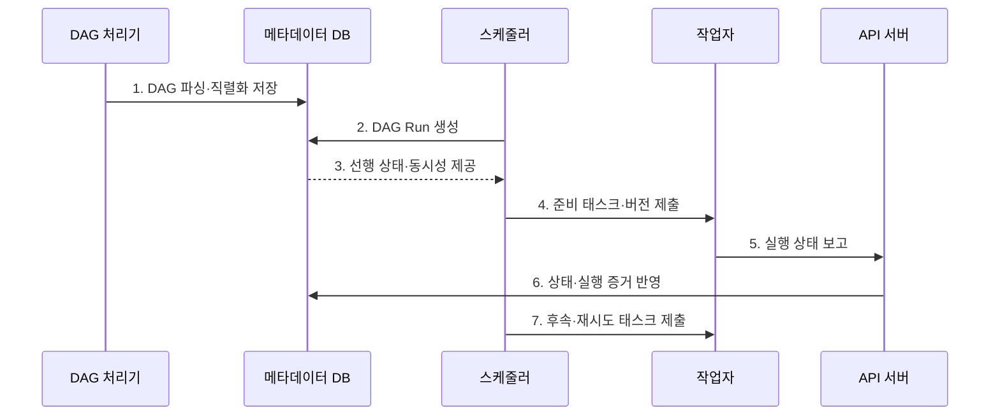

---
sidebar:
  order: 139
  label: "139. 데이터 파이프라인 오케스트레이션: Airflow (Data Pipeline Orchestration)"
  badge:
    text: "미출제 · 50%"
    variant: note
title: "데이터 파이프라인 오케스트레이션: Airflow (Data Pipeline Orchestration)"
date: "2026-07-25T19:14:00+09:00"
tags:
  - "notes-software"
weight: 139
extra:
  question_no: "139"
  source_status: "미출제"
  source_history: ""
  priority: 50
  priority_note: "Airflow 의존성·재시도·스케줄 운영 가치"
---

## 미리 알고가기

- **데이터 파이프라인 오케스트레이션(Data Pipeline Orchestration)**: 데이터 작업의 의존성·일정·상태·재시도·동시 실행을 조정해 올바른 순서로 실행하는 활동
- **아파치 에어플로(Apache Airflow)**: 배치 워크플로를 코드로 정의하고 일정·의존성·실행 상태를 조정·관찰하는 오픈소스 플랫폼
- **방향성 비순환 그래프(Directed Acyclic Graph, DAG)**: 태스크 의존성과 실행 조건을 순환 없이 표현하며 Airflow 워크플로의 실행 순서를 정하는 그래프
- **DAG 실행(DAG Run)**: 특정 데이터 구간이나 수동 요청에 대해 생성되어 개별 실행 상태를 갖는 DAG 인스턴스
- **태스크 인스턴스(Task Instance)**: DAG 실행 안에서 성공·실패·재시도 같은 상태를 갖는 개별 태스크 실행
- **DAG 번들(DAG Bundle)**: DAG 파일과 관련 코드를 함께 묶어 DAG 처리기와 작업자가 같은 실행 버전을 사용하게 하는 배포 단위
- **스케줄러(Scheduler)**: DAG 실행을 만들고 의존성·동시성 한도를 충족한 태스크를 실행자에 제출하는 구성요소
- **실행자(Executor)**: 스케줄러 프로세스 안에서 실행 가능한 태스크를 로컬 또는 분산 작업자에게 보내는 실행 방식 설정
- **작업자(Worker)**: 실행자가 보낸 태스크 코드를 실제로 실행하며 분산 구성에서는 별도 프로세스나 컨테이너로 동작하는 구성요소
- **DAG 처리기(DAG Processor)**: DAG 번들의 파일을 파싱하고 직렬화해 스케줄러가 읽을 수 있도록 메타데이터 데이터베이스에 저장하는 구성요소
- **DAG 직렬화(DAG Serialization)**: DAG 코드의 일정·태스크·의존성을 스케줄러가 읽고 저장할 수 있는 구조로 변환하는 처리
- **응용 프로그래밍 인터페이스 서버(Application Programming Interface Server, API Server)**: 사용자 요청을 받고 작업자의 상태 보고를 메타데이터 데이터베이스에 전달하는 서버
- **백필(Backfill)**: 과거 데이터 구간별 DAG 실행을 다시 만들어 누락되거나 변경된 데이터를 재처리하는 작업
- **크론(Cron)**: 지정한 시각에 명령을 실행하지만 작업 간 의존성과 실행 상태는 별도로 관리해야 하는 시간 기반 스케줄러
- **트리거 규칙(Trigger Rule)**: 상위 태스크의 성공·실패·건너뜀 상태로 하위 태스크의 실행 가능 여부를 정하는 규칙
- **풀(Pool)**: 공유 시스템에 동시에 접근할 수 있는 태스크 수를 슬롯으로 제한하는 동시성 제어 장치
- **메타데이터 데이터베이스(Metadata Database)**: 직렬화한 DAG, DAG 실행, 태스크 인스턴스, 일정과 상태를 저장하는 데이터베이스
- **멱등성(Idempotence)**: 같은 데이터 구간의 태스크를 여러 번 실행해도 최종 결과가 한 번 실행한 것과 같은 성질

## Ⅰ. 개요

- **정의/개념**: 데이터 작업의 일정·의존성·상태·재시도를 조정하는 **실행 제어 활동**이다.
- **배경/필요성**: 복합 작업의 **순서·실패 복구·동시 실행**을 일관되게 관리한다.

### 쉽게 이해하기 (학습용)

- 지휘자는 작업 순서와 재실행을 정하고 실제 데이터 가공은 각 작업자가 수행한다.

## Ⅱ. 특징

- **워크플로 코드화**: DAG로 태스크·의존성·일정을 선언한다.
- **상태 기반 실행**: 선행 조건을 만족한 태스크만 제출한다.
- **부하·복구 통제**: Pool·재시도·백필로 실행량을 조정한다.

### 쉽게 이해하기 (학습용)

- 순서표가 있어도 작업을 한꺼번에 너무 많이 보내면 공용 창구가 막히므로 동시 실행 수를 제한해야 한다.

## Ⅲ. 구조 및 구성요소

| 구성요소 | 책임 |
|:---|:---|
| DAG 번들·처리기 | DAG와 코드를 파싱·직렬화해 저장 |
| 스케줄러·실행자 | DAG Run 생성·조건 판정·태스크 제출 |
| API 서버 | 사용자 요청과 작업자 상태 통신 제공 |
| 메타데이터 DB | DAG Run·Task Instance·설정 상태 저장 |
| 작업자 | 지정 DAG 버전의 태스크 코드 실행 |

### 쉽게 이해하기 (학습용)

- 상태 장부를 보고 준비된 작업만 작업자에게 보낸다.

## Ⅳ. 흐름도

**동작 원리**

- **1. DAG 파싱·직렬화 저장**: 일정·태스크·의존성을 등록한다.
- **2. DAG Run 생성**: 일정·수동 요청·백필 구간을 실행 단위로 만든다.
- **3. 선행 상태·동시성 제공**: 실행 가능 조건을 전달한다.
- **4. 준비 태스크·버전 제출**: 작업자에게 실행 대상을 보낸다.
- **5. 실행 상태 보고**: 시작·완료·실패를 API 서버에 알린다.
- **6. 상태·실행 증거 반영**: 인증된 결과를 장부에 저장한다.
- **7. 후속·재시도 태스크 제출**: 갱신 상태로 다음 실행을 정한다.

### 쉽게 이해하기 (학습용)

- 설계도와 상태 장부를 보고 준비된 작업만 보내고 결과가 적힐 때마다 다음 작업을 다시 고른다.

## Ⅴ. 종류 및 비교

| 비교 항목 | Airflow 오케스트레이션 | Cron 중심 실행 |
|:---|:---|:---|
| 적용 기준 | **복합 의존성·상태·백필** | **작고 독립적인 시간 실행** |
| 핵심 특징 | DAG Run·태스크 상태·Pool | 지정 시각의 독립 명령 |
| 한계 | 상태 DB 병목·백필 폭주 | 숨은 의존성·실패 추적 한계 |

### 쉽게 이해하기 (학습용)

- Airflow는 앞 작업의 결과를 보고 다음 일을 정하고 Cron은 정해진 시각에 알람만 울린다.

## Ⅵ. 실무 고려사항 및 대책

| 고려사항 | 대책 | 효과 |
|:---|:---|:---|
| 태스크 멱등성 | 데이터 구간·업무 키·MERGE 적용 | 재시도 중복 방지 |
| 의존성 | 센서·데이터 조건·계약으로 명시 | 숨은 대기 제거 |
| 백필 | 별도 Pool·동시성·우선순위 적용 | 현재 작업 부하 보호 |
| DAG 코드 | 가벼운 최상위 코드·버전 번들 사용 | 파싱 부하·버전 차이 감소 |
| 상태 DB | 태스크 크기·DB 보존·관찰 조정 | 상태 처리 병목 억제 |

### 쉽게 이해하기 (학습용)

- 적재와 검사가 끝나야 게시하고 과거 재작업은 별도 줄에서 천천히 보낸다.

## Ⅶ. 결론

- **의존성·태스크 멱등성·Pool·백필 격리**로 데이터 파이프라인을 조정한다.

### 쉽게 이해하기 (학습용)

- 지휘자는 순서와 재시도를 맡고 각 작업은 다시 실행해도 결과가 겹치지 않게 만들어야 한다.
