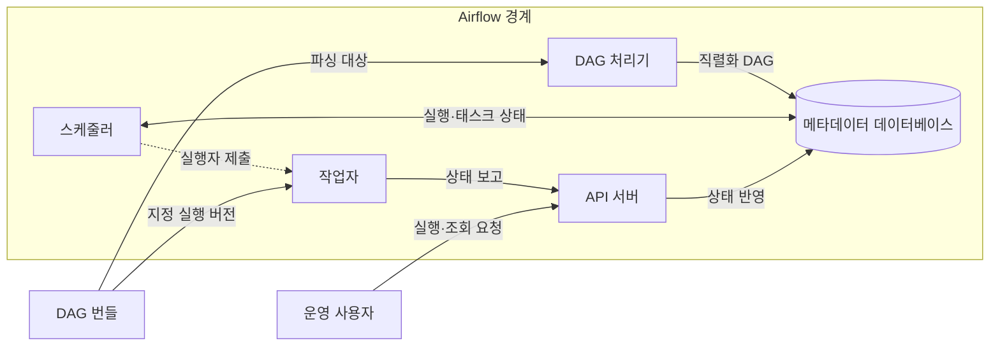
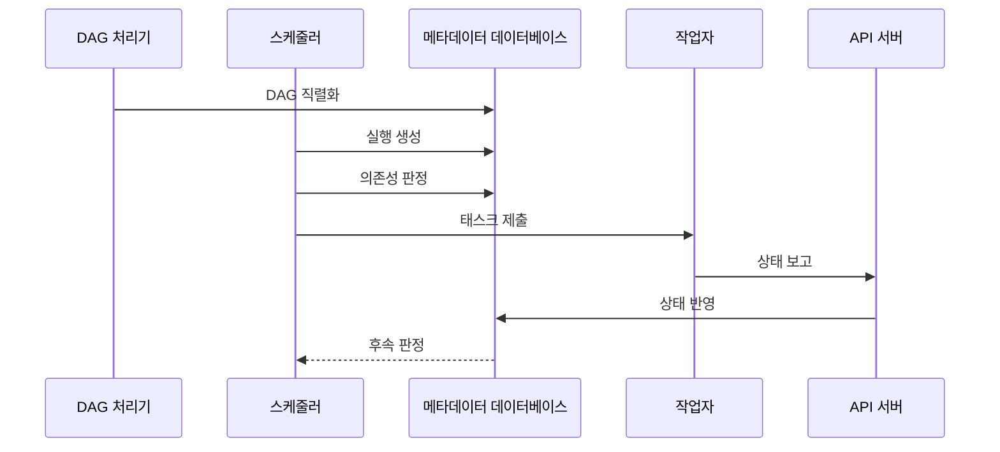

---
sidebar:
  order: 139
  label: "139. 데이터 파이프라인 오케스트레이션 — Airflow (Data Pipeline Orchestration)"
  badge:
    text: "미출제 · 50%"
    variant: note
title: "데이터 파이프라인 오케스트레이션 — Airflow (Data Pipeline Orchestration)"
date: "2026-07-25T19:14:00+09:00"
tags:
  - "notes-software"
weight: 139
extra:
  question_no: "139"
  source_status: "미출제"
  source_history: ""
  priority: 50
  priority_note: "Airflow 의존성·재시도·스케줄 운영 가치"
---

## 미리 알고가기

- **데이터 파이프라인 오케스트레이션(Data Pipeline Orchestration)**: 데이터 작업의 의존성·일정·상태·재시도·동시 실행을 조정해 올바른 순서로 실행하는 활동
- **아파치 에어플로(Apache Airflow)**: 배치 워크플로를 코드로 정의하고 일정·의존성·실행 상태를 조정·관찰하는 오픈소스 플랫폼
- **방향성 비순환 그래프(Directed Acyclic Graph, DAG)**: 태스크 의존성과 실행 조건을 순환 없이 표현하며 Airflow 워크플로의 실행 순서를 정하는 그래프
- **DAG 실행(DAG Run)**: 특정 데이터 구간이나 수동 요청에 대해 생성되어 개별 실행 상태를 갖는 DAG 인스턴스
- **태스크 인스턴스(Task Instance)**: DAG 실행 안에서 성공·실패·재시도 같은 상태를 갖는 개별 태스크 실행
- **DAG 번들(DAG Bundle)**: DAG 파일과 관련 코드를 함께 묶어 DAG 처리기와 작업자가 같은 실행 버전을 사용하게 하는 배포 단위
- **스케줄러(Scheduler)**: DAG 실행을 만들고 의존성·동시성 한도를 충족한 태스크를 실행자에 제출하는 구성요소
- **실행자(Executor)**: 스케줄러 프로세스 안에서 실행 가능한 태스크를 로컬 또는 분산 작업자에게 보내는 실행 방식 설정
- **작업자(Worker)**: 실행자가 보낸 태스크 코드를 실제로 실행하며 분산 구성에서는 별도 프로세스나 컨테이너로 동작하는 구성요소
- **DAG 처리기(DAG Processor)**: DAG 번들의 파일을 파싱하고 직렬화해 스케줄러가 읽을 수 있도록 메타데이터 데이터베이스에 저장하는 구성요소
- **DAG 직렬화(DAG Serialization)**: DAG 코드의 일정·태스크·의존성을 스케줄러가 읽고 저장할 수 있는 구조로 변환하는 처리
- **응용 프로그래밍 인터페이스 서버(Application Programming Interface Server, API Server)**: 사용자 요청을 받고 작업자의 상태 보고를 메타데이터 데이터베이스에 전달하는 서버
- **백필(Backfill)**: 과거 데이터 구간별 DAG 실행을 다시 만들어 누락되거나 변경된 데이터를 재처리하는 작업
- **크론(Cron)**: 지정한 시각에 명령을 실행하지만 작업 간 의존성과 실행 상태는 별도로 관리해야 하는 시간 기반 스케줄러
- **트리거 규칙(Trigger Rule)**: 상위 태스크의 성공·실패·건너뜀 상태로 하위 태스크의 실행 가능 여부를 정하는 규칙
- **풀(Pool)**: 공유 시스템에 동시에 접근할 수 있는 태스크 수를 슬롯으로 제한하는 동시성 제어 장치
- **메타데이터 데이터베이스(Metadata Database)**: 직렬화한 DAG, DAG 실행, 태스크 인스턴스, 일정과 상태를 저장하는 데이터베이스
- **멱등성(Idempotence)**: 같은 데이터 구간의 태스크를 여러 번 실행해도 최종 결과가 한 번 실행한 것과 같은 성질

## Ⅰ. 개요

- 정의/개념: 의존성·상태·자원으로 데이터 작업 실행을 조정하는 활동
- **배경/필요성**: 복합 선후 관계·재시도·과거 구간 재처리

### 쉽게 이해하기 (학습용)
- 여러 데이터 작업의 시작 조건과 순서를 정하고 실패한 작업을 다시 실행하지만 데이터 변환 자체는 각 작업이 수행함

## Ⅱ. 특징

- DAG 코드로 일정·의존성·재시도 정책을 버전 관리한다.
- 태스크 상태를 기록해 실패 지점부터 선택 재실행한다.
- 풀·동시성 한도로 공유 시스템 과부하를 막는다.
- 백필은 과거 구간을 복구하지만 자원 경쟁을 높인다.

### 쉽게 이해하기 (학습용)
- 작업 순서와 실패 복구를 코드로 남길 수 있지만 동시에 너무 많이 실행하면 공용 데이터베이스가 밀리므로 실행 수를 제한해야 함

## Ⅲ. 아키텍처 및 구성요소

| 설계 요소 | 설명 |
|:---|:---|
| DAG 처리기 | DAG 번들을 파싱·직렬화해 저장 |
| 스케줄러 | 실행 생성·의존성 판정·태스크 제출 |
| API 서버 | 사용자 요청·작업자 상태 보고 중계 |
| 메타데이터 데이터베이스 | DAG·실행·태스크·설정 상태 저장 |
| 작업자 | 지정된 DAG 버전의 태스크 코드 실행 |

> 요약: 직렬화 DAG와 실행 상태로 태스크 제출

### 쉽게 이해하기 (학습용)
- 처리기가 작업 설계도를 장부에 옮기면 스케줄러가 준비된 작업을 작업자에게 보내고, 작업 결과는 API 서버를 거쳐 장부에 기록됨

## Ⅳ. 원리 및 절차 흐름도

| 절차 | 설명 |
|:---|:---|
| DAG 직렬화 | 일정·태스크·의존성을 실행 구조로 저장 |
| 실행 생성 | 데이터 구간별 DAG 실행 생성 |
| 의존성 판정 | 선행 상태·풀·동시성 한도 확인 |
| 태스크 제출 | 준비된 태스크를 실행자로 전달 |
| 상태 보고 | 작업자가 성공·실패 상태 전송 |
| 상태 반영 | API 서버가 태스크 상태 저장 |
| 후속 판정 | 갱신 상태로 다음 태스크 실행 결정 |

> 요약: 상태 갱신마다 후속 태스크 실행 여부 재판정

### 쉽게 이해하기 (학습용)
- 설계도를 읽어 선행 작업이 끝난 항목만 실행하고, 결과를 장부에 적은 뒤 새로 실행할 수 있는 다음 작업을 다시 찾음

## Ⅴ. 종류 및 비교

| 판단 기준 | Airflow 오케스트레이션 | Cron 중심 실행 |
|:---|:---|:---|
| 핵심 특징 | DAG 의존성·실행 상태 기반 조정 | 시간별 독립 명령 실행 |
| 적용 기준 | 복합 의존성·재시도·백필·관찰 | 단순하고 독립적인 주기 작업 |
| 주요 위험 | 스케줄러·상태 저장소 병목·백필 폭주 | 중복 실행·의존성 은폐·실패 추적 한계 |

> 요약: 복합 상태 흐름은 Airflow, 독립 작업은 Cron

### 쉽게 이해하기 (학습용)
- Airflow는 작업 관계와 성공·실패를 보고 다음 작업을 정하지만 Cron은 정해진 시각마다 독립 명령을 실행함

## Ⅵ. 실무 사례

1. 일별 적재는 DAG 의존성으로 검증 후 게시
2. 과거 구간 재처리는 풀로 백필 동시성 제한

### 쉽게 이해하기 (학습용)
- 일별 자료 적재가 끝나고 검증 작업이 성공해야 게시 작업을 시작하도록 순서를 연결함
- 밀린 과거 자료를 다시 처리할 때 동시에 실행할 작업 수를 제한해 원천 데이터베이스가 몰리지 않게 함

## Ⅶ. 결론

- 복합 의존·백필은 Airflow와 멱등 태스크로 제어

### 쉽게 이해하기 (학습용)
- 작업 관계가 복잡하거나 과거 구간을 다시 처리해야 하면 Airflow를 쓰고, 재실행해도 결과가 겹치지 않는 태스크로 설계함
