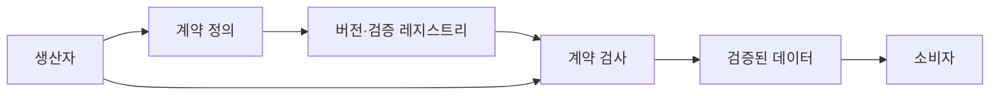
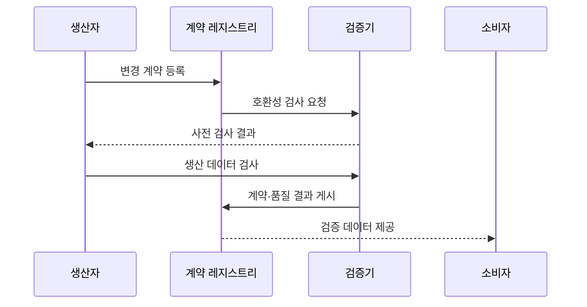

---
sidebar:
  order: 140
  label: "140. 데이터 계약 (Data Contract)"
  badge:
    text: "미출제 · 50%"
    variant: note
title: "데이터 계약 (Data Contract)"
date: "2026-07-25T19:15:00+09:00"
tags:
  - "notes-software"
weight: 140
extra:
  question_no: "140"
  source_status: "미출제"
  source_history: ""
  priority: 50
  priority_note: "생산자·소비자 간 스키마·품질 계약 현안"
---

## 미리 알고가기

- **데이터 계약(Data Contract)**: 생산자와 소비자가 데이터 구조·의미·품질·제공 조건·변경 규칙에 합의한 규약이다
- **데이터 생산자(Data Producer)**: 원천 시스템이나 파이프라인에서 계약 대상 데이터를 생성·변경·게시하는 주체이다
- **데이터 소비자(Data Consumer)**: 계약에 따라 데이터를 읽어 분석·서비스·모델에 사용하는 주체이다
- **구문 스키마(Syntactic Schema)**: 열 이름·자료형·필수 여부·형식·키를 정의한 구조 명세이다
- **의미 정의(Semantic Definition)**: 업무 용어·단위·코드·집계 기준과 열의 해석을 설명한 명세이다
- **호환성 규칙(Compatibility Rule)**: 열 추가·삭제·자료형 변경이 기존 소비자에 미치는 허용 범위를 정한 규칙이다
- **서비스 수준 목표(Service Level Objective, SLO)**: ‘에스엘오’로 읽고 Service Level Objective의 머리글자를 딴 표기이며 완전성·최신성·가용성의 목표와 측정 기준이다
- **계약 레지스트리(Contract Registry)**: 데이터 계약의 버전·소유자·호환성 규칙·검사 결과를 저장하는 시스템이다
- **계약 검사(Contract Validation)**: 생산자 CI·파이프라인·소비 시점에서 스키마와 품질 위반을 찾는 검사이다
- **지속적 통합(Continuous Integration, CI)**: ‘시아이’로 읽고 Continuous Integration의 머리글자를 딴 표기이며 변경 코드를 자주 병합해 자동 검증하는 방식이다
- **응용 프로그래밍 인터페이스(Application Programming Interface, API)**: ‘에이피아이’로 읽고 Application Programming Interface의 머리글자를 딴 표기이며 다른 서비스의 기능·데이터 요청 규약이다

## Ⅰ. 개요

- 정의/개념: 스키마와 품질을 검증 가능한 형식으로 합의한 규약이다
- **배경/필요성**: 생산자 변경이 소비자를 깨뜨려 자동 판정 기준 필요

### 쉽게 이해하기 (학습용)
- 구조와 품질 및 변경 약속을 검사 가능한 문서로 합의한다

## Ⅱ. 특징

- 구조·키 규칙이 파싱과 적재 오류를 예방한다.
- 의미·단위 정의가 같은 열의 해석 차이를 줄인다.
- 품질 SLO가 최신성·완전성 허용치를 수치화한다.
- 호환성 검사와 버전 전환으로 소비자 파손을 줄인다.

### 쉽게 이해하기 (학습용)
- 계약 문서만 두면 생산자 우회를 찾지 못하므로 코드 변경·파이프라인 실행·소비 시점에 같은 규칙을 자동 검사해야 한다

## Ⅲ. 아키텍처 및 구성요소

| 구성요소 | 설명 |
|:---|:---|
| 스키마·키 | 열과 타입 및 기본 키와 파티션 형식을 정의함 |
| 의미 정의 | 용어와 단위 및 사용 목적을 설명함 |
| 품질·SLO | 완전성과 최신성 규칙 및 품질 목표를 명시함 |
| 소유권·지원 | 생산자와 소비자 및 대응 책임을 배정함 |
| 버전·검증 레지스트리 | 계약 버전과 호환성을 저장하고 위반 여부를 판정함 |

> 요약: 검증기가 생산자 변경을 스키마와 품질 기준으로 판정한다

### 쉽게 이해하기 (학습용)
- 스키마 뜻 품질 약속과 버전 규칙 및 검사 도구이다

## Ⅳ. 원리 및 절차 흐름도

| 절차 | 설명 |
|:---|:---|
| 변경 계약 등록 | 새 구조·의미·SLO를 버전으로 등록함 |
| 호환성 검사 요청 | 기존 소비자와 변경 규칙을 비교함 |
| 사전 검사 결과 | 호환 여부와 전환 필요성을 전달함 |
| 생산 데이터 검사 | 실제 데이터의 계약 준수를 확인함 |
| 계약·품질 결과 게시 | 계약 버전과 검사 결과를 저장함 |
| 검증 데이터 제공 | 통과한 데이터와 계약을 제공함 |

> 요약: 변경은 호환성과 품질 검사를 통과한 뒤 게시된다

### 쉽게 이해하기 (학습용)
- 변경안을 비교해 호환 검사를 통과한 버전만 게시한다

## Ⅴ. 종류 및 비교

| 판단 기준 | 데이터 계약 | API 계약 |
|:---|:---|:---|
| 핵심 특징 | 구조·의미·품질·제공 조건을 정의함 | 요청·응답·호출 방식을 정의함 |
| 적용 기준 | 분석·이벤트 데이터의 품질과 변경 호환성 | 서비스 요청·응답 호환성 |
| 주요 위험 | 생산자 우회·품질 규칙 미준수 | 버전 단절·클라이언트 파손 |

> 요약: 구조와 의미를 포함해 품질 및 호환성 기준을 명시한다

### 쉽게 이해하기 (학습용)
- 데이터 계약은 자료 구조·품질을, API 계약은 호출 규약을 다룸

## Ⅵ. 실무 사례

1. 주문 이벤트는 스키마 계약을 검사하고 실패를 확인한다

### 쉽게 이해하기 (학습용)
- 주문 이벤트는 열 삭제·자료형 변경을 CI에서 검사하고 호환성 실패 건수로 소비자 파손 위험을 확인한다

## Ⅶ. 결론

- 생산자 변경으로 인한 소비자 장애를 방지하기 위해 **스키마·의미·품질·호환성·변경 절차**를 합의하고, 배포 경로에서 데이터 계약 준수 여부를 자동 검증한다

### 쉽게 이해하기 (학습용)
- 데이터 계약은 문서가 아니라 생산자 변경과 실제 데이터가 구조·의미·품질·호환성 약속을 지키는지 자동 판정하는 운영 장치이다
