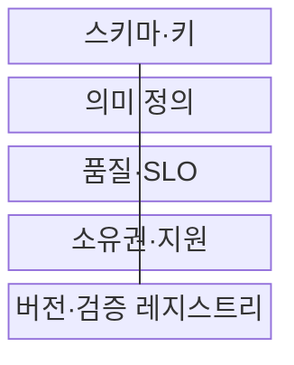
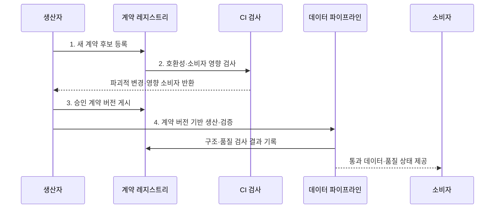

---
sidebar:
  order: 140
  label: "140. 데이터 계약 (Data Contract)"
  badge:
    text: "미출 · 50%"
    variant: note
title: "데이터 계약 (Data Contract)"
date: "2026-08-02T12:00:00+09:00"
tags:
  - "notes-software"
weight: 140
extra:
  question_no: "140"
  source_status: "미출"
  source_history: ""
  priority: 50
  priority_note: "생산자·소비자 간 스키마·품질 계약 현안"
---

## Ⅰ. 개요

핵심 용어

- **기계 검증 규약**: 생산자와 소비자가 데이터 구조·의미·품질·변경 규칙에 합의하고 자동 검사하는 규약이다.

- 정의/개념: 생산자와 소비자가 구조·품질·변경에 합의한 **기계 검증 규약**
- 배경/필요성: 생산자의 일방적 변경은 소비자의 **하류 처리 실패** 유발

### 쉽게 이해하기 (학습용)

- 자료의 모양·뜻·품질·변경 예고를 자동 검사할 수 있는 납품 약속이다.

## Ⅱ. 특징

핵심 용어

- **변경 호환성**: 스키마 변경의 허용 범위와 공지·유예·버전 전환 절차를 정하는 특성이다.

- **구문·의미 보장**: 구조와 업무 해석을 함께 명시
- **품질 SLO**: 측정식·목표·관찰 구간을 정의
- **변경 호환성**: 공지·유예·버전 전환 절차 결정

### 쉽게 이해하기 (학습용)

- 약속 문서만 두지 않고 설계 변경과 실제 납품 자료를 같은 규칙으로 검사해야 한다.

## Ⅲ. 구조 및 구성요소

핵심 용어

- **버전·검증 레지스트리**: 계약 버전·호환성 규칙과 실제 구조·품질 검사 결과를 관리하는 구성요소이다.

| 구성요소 | 책임 |
|:---|:---|
| 스키마·키 | 열·타입·필수 여부와 **키·형식** 정의 |
| 의미 정의 | 업무 용어·단위와 **코드·집계 기준** 설명 |
| 품질·SLO | 측정식·분모와 **목표·위반 조치** 명시 |
| 소유권·지원 | 생산자·소비자와 **승인·대응 책임** 배정 |
| 버전·검증 레지스트리 | 계약 버전과 **호환 규칙·검사 결과** 관리 |

### 쉽게 이해하기 (학습용)

- 데이터의 모양·뜻·품질·변경 예고를 납품 약속으로 정한다.

## Ⅳ. 흐름도

핵심 용어

- **2. 호환성·소비자 영향 검사**: 기존 계약과 의존성을 기준으로 파괴적 변경과 전환 대상을 식별하는 단계이다.

**동작 원리**

1. **새 계약 후보 등록**: 구조·의미·SLO·적용 시점을 제출
2. **호환성·소비자 영향 검사**: 기존 버전과 의존성을 기준으로 파괴적 변경·전환 대상 식별
3. **승인 계약 버전 게시**: 소유자 승인과 공지·유예를 거친 구조·의미·SLO 확정
4. **계약 버전 기반 생산·검증**: 실제 데이터에 계약 버전을 연결하고 게시 경계에서 위반 차단

### 쉽게 이해하기 (학습용)

- 납품 규격을 바꾸기 전에 기존 사용처가 깨지는지 검사하고 실제 자료도 같은 규격으로 검사한다.

## Ⅴ. 종류 및 비교

핵심 용어

- **데이터 계약**: 데이터셋의 구조와 의미·품질·최신성 및 소유권을 생산자와 소비자가 합의한 규약이다.

| 비교 항목 | 데이터 계약 | API 계약 |
|:---|:---|:---|
| 적용 기준 | 데이터셋 의미와 **품질·최신성** | **서비스 요청·응답 동작** |
| 핵심 특징 | 구조·의미와 **SLO·소유권** | 경로·메서드와 **오류·버전** |
| 한계 | **우회 데이터·SLO 미측정** | **명세·구현 불일치** |

### 쉽게 이해하기 (학습용)

- 데이터 계약은 납품 내용과 품질, API 계약은 주문하고 받는 통신 규칙에 더 가깝다.

## Ⅵ. 실무 고려사항 및 대책

핵심 용어

- **파괴적 변경**: 기존 소비자의 처리를 깨뜨릴 수 있어 새 버전과 유예·폐기일 관리가 필요한 변경이다.

| 문제 | 대책 | 효과 |
|:---|:---|:---|
| **의미 해석** 차이 | 용어·단위와 **집계 기준** 명시 | **해석 변경** 방지 |
| **호환성 판단** 곤란 | **소비 의존성·계약 시험** 적용 | **하류 처리 실패** 예방 |
| **품질 측정값** 불일치 | **계산식·관찰 구간** 정의 | **SLO 측정 결과** 일치 |
| 미계약 데이터의 **검사 경로 우회** | 모든 **게시 경계 검증** 적용 | **검사 우회** 차단 |
| **파괴적 변경** 필요 | 공지 후 **유예·폐기일** 관리 | **즉시 전환 위험** 감소 |

### 쉽게 이해하기 (학습용)

- 주문서 양식을 바꿀 때 기존 사용처가 깨지는지 먼저 보고 실제 주문도 약속한 품질인지 다시 검사한다.

## Ⅶ. 결론

핵심 용어

- **게시 차단**: 계약의 품질 SLO를 위반한 데이터가 소비자에게 전달되지 않도록 막는 조치이다.

- 파괴적 변경은 **새 버전·유예 전환**, SLO 위반은 **게시 차단**

### 쉽게 이해하기 (학습용)

- 좋은 계약은 약속을 적는 데서 끝나지 않고 바뀐 설계와 실제 납품을 모두 검사한다.
