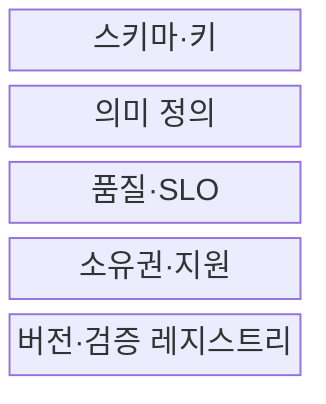
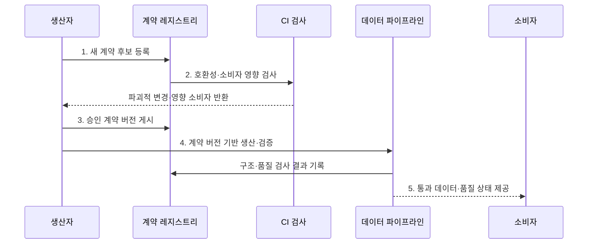

---
sidebar:
  order: 140
  label: "140. 데이터 계약 (Data Contract)"
  badge:
    text: "미출제 · 50%"
    variant: note
title: "데이터 계약 (Data Contract)"
date: "2026-07-30T20:00:00+09:00"
tags:
  - "notes-software"
weight: 140
extra:
  question_no: "140"
  source_status: "미출제"
  source_history: ""
  priority: 50
  priority_note: "생산자·소비자 간 스키마·품질 계약 현안"
---

## 미리 알고가기

- **데이터 계약(Data Contract)**: 생산자와 소비자가 데이터 구조·의미·품질·제공 조건·변경 규칙에 합의한 규약이다
- **데이터 생산자(Data Producer)**: 원천 시스템이나 파이프라인에서 계약 대상 데이터를 생성·변경·게시하는 주체이다
- **데이터 소비자(Data Consumer)**: 계약에 따라 데이터를 읽어 분석·서비스·모델에 사용하는 주체이다
- **구문 스키마(Syntactic Schema)**: 열 이름·자료형·필수 여부·형식·키를 정의한 구조 명세이다
- **의미 정의(Semantic Definition)**: 업무 용어·단위·코드·집계 기준과 열의 해석을 설명한 명세이다
- **호환성 규칙(Compatibility Rule)**: 열 추가·삭제·자료형 변경이 기존 소비자에 미치는 허용 범위를 정한 규칙이다
- **서비스 수준 목표(Service Level Objective, SLO)**: ‘에스엘오’로 읽고 Service Level Objective의 머리글자를 딴 표기이며 완전성·최신성·가용성의 목표와 측정 기준이다
- **계약 레지스트리(Contract Registry)**: 데이터 계약의 버전·소유자·호환성 규칙·검사 결과를 저장하는 시스템이다
- **계약 검사(Contract Validation)**: 생산자 CI·파이프라인·소비 시점에서 스키마와 품질 위반을 찾는 검사이다
- **지속적 통합(Continuous Integration, CI)**: ‘시아이’로 읽고 Continuous Integration의 머리글자를 딴 표기이며 변경 코드를 자주 병합해 자동 검증하는 방식이다
- **응용 프로그래밍 인터페이스(Application Programming Interface, API)**: ‘에이피아이’로 읽고 Application Programming Interface의 머리글자를 딴 표기이며 다른 서비스의 기능·데이터 요청 규약이다

## Ⅰ. 개요

- 정의/개념: 생산자와 소비자가 구조·품질·변경에 합의한 **기계 검증 규약**
- 배경/필요성: 일방적 변경에 따른 **하류 파손·비가시적 오류** 방지

### 쉽게 이해하기 (학습용)

- 자료의 모양·뜻·품질·변경 예고를 자동 검사할 수 있는 납품 약속이다.

## Ⅱ. 특징

- **구문·의미 보장**: 구조와 업무 해석을 함께 명시
- **품질 SLO**: 측정식·목표·관찰 구간을 정의
- **변경 호환성**: 공지·유예·버전 전환 절차 결정

### 쉽게 이해하기 (학습용)

- 약속 문서만 두지 않고 설계 변경과 실제 납품 자료를 같은 규칙으로 검사해야 한다.

## Ⅲ. 구조 및 구성요소

| 구성요소 | 책임 |
|:---|:---|
| 스키마·키 | 열·타입·필수 여부·키·형식 정의 |
| 의미 정의 | 업무 용어·단위·코드·집계 기준 설명 |
| 품질·SLO | 측정식·분모·목표·위반 조치 명시 |
| 소유권·지원 | 생산자·소비자·승인자·대응 책임 배정 |
| 버전·검증 레지스트리 | 계약 버전·호환 규칙·검사 결과 관리 |

### 쉽게 이해하기 (학습용)

- 데이터의 모양·뜻·품질·변경 예고를 납품 약속으로 정한다.

## Ⅳ. 흐름도

**동작 원리**

- **1. 새 계약 후보 등록**: 구조·의미·SLO·적용 시점을 제출
- **2. 호환성·소비자 영향 검사**: 기존 버전과 의존성을 기준으로 파괴적 변경·전환 대상 식별
- **3. 승인 계약 버전 게시**: 소유자 승인과 공지·유예를 거친 구조·의미·SLO 확정
- **4. 계약 버전 기반 생산·검증**: 실제 데이터에 계약 버전을 연결하고 게시 경계에서 위반 차단
- **5. 통과 데이터·품질 상태 제공**: 소비자에게 계약 준수 데이터와 최신 품질 근거 전달

### 쉽게 이해하기 (학습용)

- 납품 규격을 바꾸기 전에 기존 사용처가 깨지는지 검사하고 실제 자료도 같은 규격으로 검사한다.

## Ⅴ. 종류 및 비교

| 비교 항목 | 데이터 계약 | API 계약 |
|:---|:---|:---|
| 적용 기준 | **데이터셋의 의미·품질·최신성** | **서비스 요청·응답 동작** |
| 핵심 특징 | 구조·의미·SLO·소유권 | 경로·메서드·오류·버전 |
| 한계 | 우회 데이터·SLO 미측정 | 명세·구현 불일치 |

### 쉽게 이해하기 (학습용)

- 데이터 계약은 납품 내용과 품질, API 계약은 주문하고 받는 통신 규칙에 더 가깝다.

## Ⅵ. 실무 고려사항 및 대책

| 고려사항 | 대책 | 효과 |
|:---|:---|:---|
| 의미 | 용어·단위·예시·집계 기준 명시 | 해석 변경 방지 |
| 호환성 | 소비 의존성·샘플 재생·계약 시험 | 하류 파손 예방 |
| 품질 SLO | 계산식·관찰 구간·제외 조건 정의 | 측정 결과 일치 |
| 집행 경로 | 모든 게시 경계 검증·미계약 격리 | 검사 우회 차단 |
| 변경 절차 | 소유자·공지·유예·폐기일 관리 | 즉시 전환 위험 감소 |

### 쉽게 이해하기 (학습용)

- 주문서 양식을 바꿀 때 기존 사용처가 깨지는지 먼저 보고 실제 주문도 약속한 품질인지 다시 검사한다.

## Ⅶ. 결론

- **소비자 영향·의미 변경·SLO 측정·게시 경계**로 데이터 계약을 집행

### 쉽게 이해하기 (학습용)

- 좋은 계약은 약속을 적는 데서 끝나지 않고 바뀐 설계와 실제 납품을 모두 검사한다.
