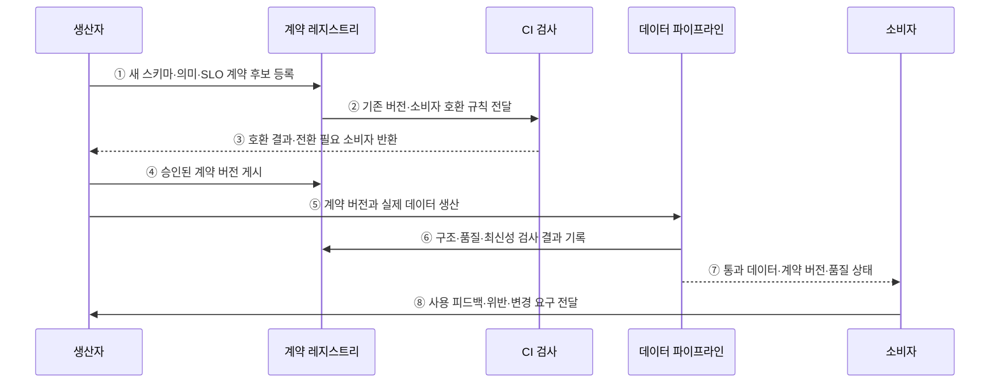

---
sidebar:
  order: 140
  label: "140. 데이터 계약 (Data Contract)"
  badge:
    text: "미출제 · 50%"
    variant: note
title: "데이터 계약 (Data Contract)"
date: "2026-07-25T19:15:00+09:00"
tags:
  - "notes-software"
weight: 140
extra:
  question_no: "140"
  source_status: "미출제"
  source_history: ""
  priority: 50
  priority_note: "생산자·소비자 간 스키마·품질 계약 현안"
---

## 미리 알고가기

- **데이터 계약(Data Contract)**: 생산자와 소비자가 데이터 구조·의미·품질·제공 조건·변경 규칙에 합의한 규약이다
- **데이터 생산자(Data Producer)**: 원천 시스템이나 파이프라인에서 계약 대상 데이터를 생성·변경·게시하는 주체이다
- **데이터 소비자(Data Consumer)**: 계약에 따라 데이터를 읽어 분석·서비스·모델에 사용하는 주체이다
- **구문 스키마(Syntactic Schema)**: 열 이름·자료형·필수 여부·형식·키를 정의한 구조 명세이다
- **의미 정의(Semantic Definition)**: 업무 용어·단위·코드·집계 기준과 열의 해석을 설명한 명세이다
- **호환성 규칙(Compatibility Rule)**: 열 추가·삭제·자료형 변경이 기존 소비자에 미치는 허용 범위를 정한 규칙이다
- **서비스 수준 목표(Service Level Objective, SLO)**: ‘에스엘오’로 읽고 Service Level Objective의 머리글자를 딴 표기이며 완전성·최신성·가용성의 목표와 측정 기준이다
- **계약 레지스트리(Contract Registry)**: 데이터 계약의 버전·소유자·호환성 규칙·검사 결과를 저장하는 시스템이다
- **계약 검사(Contract Validation)**: 생산자 CI·파이프라인·소비 시점에서 스키마와 품질 위반을 찾는 검사이다
- **지속적 통합(Continuous Integration, CI)**: ‘시아이’로 읽고 Continuous Integration의 머리글자를 딴 표기이며 변경 코드를 자주 병합해 자동 검증하는 방식이다
- **응용 프로그래밍 인터페이스(Application Programming Interface, API)**: ‘에이피아이’로 읽고 Application Programming Interface의 머리글자를 딴 표기이며 다른 서비스의 기능·데이터 요청 규약이다

## Ⅰ. 개요

- 데이터 계약은 생산자와 소비자가 데이터의 구조·의미·품질·제공 조건·변경 호환성·책임을 기계 검증 가능한 형식으로 합의한 규약이다.
- 생산자가 열·단위·코드·지연을 일방적으로 바꿔 소비자의 파이프라인·보고서·서비스가 조용히 잘못되는 문제를 배포 전후 검사로 막는다.

### 쉽게 이해하기 (학습용)

- 자료의 모양·뜻·품질·변경 예고를 자동 검사할 수 있는 납품 약속이다.

## Ⅱ. 특징

- **구문 보장**: 열·타입·필수 여부·키·형식으로 파싱·적재 실패를 예방한다.
- **의미 보장**: 업무 정의·단위·코드·집계 기준으로 같은 열을 다르게 해석하는 일을 줄인다.
- **품질·제공 보장**: 완전성·정확성·최신성·가용성의 측정식·목표·관찰 창을 명시한다.
- **변경 호환성**: 추가·삭제·타입 변경의 허용 범위와 공지·유예·버전 전환·폐기 절차를 정한다.
- **책임과 자동 집행**: 생산자·소비자·소유자·지원 경로를 연결하고 CI·파이프라인·소비 경계에서 검사한다.

### 쉽게 이해하기 (학습용)

- 약속 문서만 두지 않고 설계 변경과 실제 납품 자료를 같은 규칙으로 검사해야 한다.

## Ⅲ. 아키텍처 및 구성요소

**도표안 A — 구조도**

**도표안 B — sequenceDiagram**

| 구성요소 | 설명 |
|:---|:---|
| 스키마·키 | 열·타입·필수 여부·키·형식·파티션 정의 |
| 의미 정의 | 업무 용어·단위·코드·집계·허용 사용 목적 설명 |
| 품질·SLO | 측정식·분모·목표·관찰 창·위반 조치 명시 |
| 소유권·지원 | 생산자·소비자·승인자·지원·위반 대응 책임 배정 |
| 버전·검증 레지스트리 | 계약 버전·호환 규칙·소비 관계·검사 결과 관리 |

**동작 원리**

- ① 생산자가 변경할 스키마·의미·품질 SLO·적용 시점을 계약 후보로 등록한다.
- ② 레지스트리가 현재 계약·호환 규칙·등록 소비자 의존성을 CI 검사에 전달한다.
- ③ CI가 파괴적 변경과 전환이 필요한 소비자를 찾아 생산자에게 반환한다.
- ④ 승인·공지·유예 절차를 통과한 계약을 새 버전으로 게시한다.
- ⑤ 생산자가 계약 버전을 식별할 수 있게 실제 데이터를 생성해 파이프라인에 전달한다.
- ⑥ 파이프라인이 구조·의미 코드·품질·최신성을 검사하고 결과와 위반 증거를 레지스트리에 기록한다.
- ⑦ 통과 데이터에는 계약 버전과 현재 품질 상태를 붙여 소비자에게 제공한다.
- ⑧ 소비자가 실제 사용 중 발견한 위반·해석 문제·변경 요구를 생산자에게 전달해 다음 계약에 반영한다.

### 쉽게 이해하기 (학습용)

- 납품 규격을 바꾸기 전에 기존 사용처가 깨지는지 검사하고 실제 자료도 같은 규격으로 검사한다.

## Ⅳ. 종류 및 비교

| 비교 항목 | 데이터 계약 | API 계약 |
|:---|:---|:---|
| 중심 대상 | 배치·스트림 데이터 제품과 데이터셋 | 서비스의 요청·응답·호출 동작 |
| 보장 범위 | 구조·의미·품질·최신성·소유권·변경 | 경로·메서드·요청/응답 구조·오류·버전 |
| 검증 시점 | 생산자 CI·파이프라인·소비 경계·운영 관측 | 서버/클라이언트 CI·통합·런타임 |
| 대표 소비 | 분석·보고서·ML·하류 파이프라인 | 응용 서비스·클라이언트 |
| 공통점 | 기계 판독 명세·호환성·버전·책임 | 기계 판독 명세·호환성·버전·책임 |
| 주요 위험 | 실제 데이터 우회·의미 미합의·SLO 미측정 | 명세와 구현 불일치·클라이언트 파손 |

> 데이터가 API로 제공되면 두 계약이 겹칠 수 있지만 데이터 계약은 데이터의 의미·품질·시간적 제공 조건까지 강조한다.

### 쉽게 이해하기 (학습용)

- 데이터 계약은 납품 내용과 품질, API 계약은 주문하고 받는 통신 규칙에 더 가깝다.

## Ⅴ. 실무 고려사항 및 대책

| 고려사항 | 위험 | 대책 |
|:---|:---|:---|
| 의미 | 타입은 같지만 단위·코드 뜻이 변경 | 용어·단위·예시·금지값·집계 기준 |
| 호환성 | 형식상 허용된 변경이 실제 소비자를 파손 | 소비 의존성·샘플 재생·소비자 계약 시험 |
| 품질 SLO | 목표만 있고 측정식·분모가 다름 | 계산식·관찰 창·제외 조건·증거 명시 |
| 집행 경로 | 우회 적재·수동 파일이 검사 회피 | 모든 게시 경계 검증·미계약 데이터 격리 |
| 변경 절차 | 공지 없는 즉시 전환·영구 구버전 | 소유자·공지·유예·병행·폐기일 |
| 책임 | 위반 알림이 누구에게도 귀속되지 않음 | 생산자 호출·소비자 영향·에스컬레이션 |

> **적용 사례**: 주문 이벤트의 열 삭제·타입·통화 단위 변경을 CI에서 검사하고 실제 이벤트의 완전성·최신성을 게시 경계에서 재검증한다.

### 쉽게 이해하기 (학습용)

- 주문서 양식을 바꿀 때 기존 사용처가 깨지는지 먼저 보고 실제 주문도 약속한 품질인지 다시 검사한다.

## Ⅵ. 결론

- 데이터 계약의 핵심은 문서가 아니라 생산자 변경과 실제 데이터가 구조·의미·품질·호환성 약속을 지키는지 자동 판정하는 운영 장치이다.
- 계약 버전·소비 의존성·SLO 측정·게시 경계·공지와 유예·위반 책임을 연결해야 생산자 자율성과 소비자 안정성을 함께 확보할 수 있다.

### 쉽게 이해하기 (학습용)

- 좋은 계약은 약속을 적는 데서 끝나지 않고 바뀐 설계와 실제 납품을 모두 검사한다.
