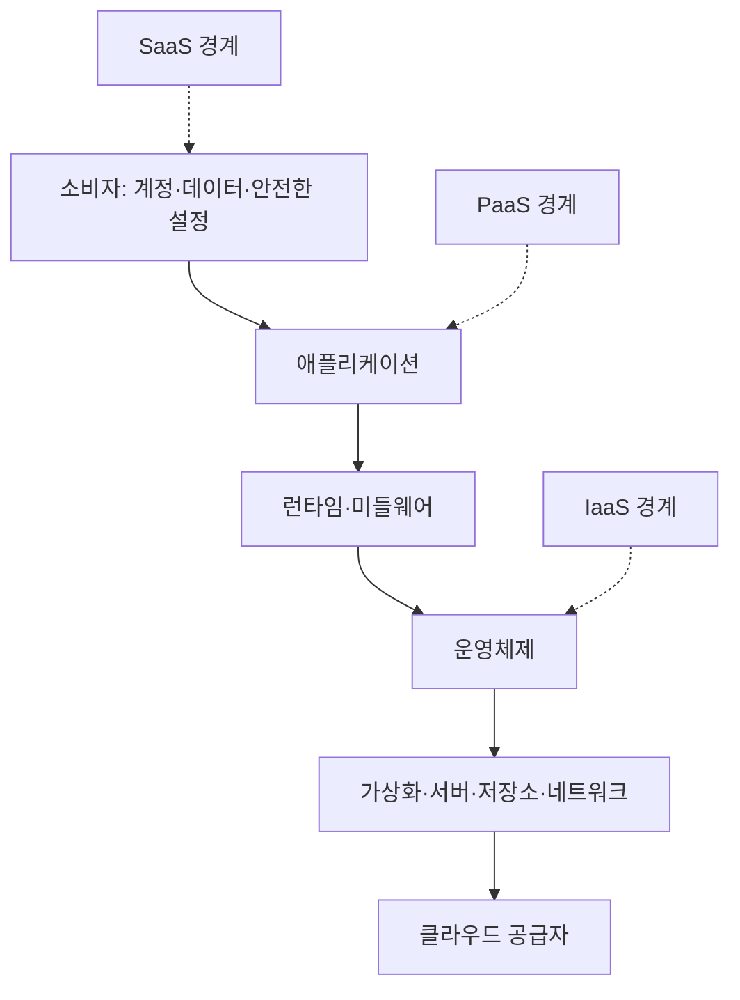
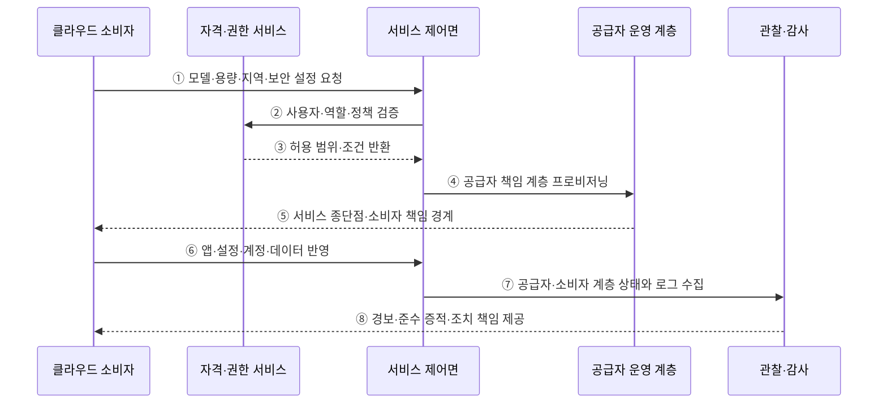

---
sidebar:
  order: 141
  label: "141. 클라우드 서비스 모델 — IaaS·PaaS·SaaS (Cloud Service Models)"
  badge:
    text: "기출 · 70%"
    variant: note
title: "클라우드 서비스 모델 — IaaS·PaaS·SaaS (Cloud Service Models)"
date: "2026-07-27T23:59:59+09:00"
tags:
  - "notes-software"
weight: 141
extra:
  question_no: "141"
  source_status: "기출"
  source_history: "120회, 125회, 131회, 132회"
  priority: 70
  priority_note: "서비스별 운영 책임 경계가 반복 출제됨"
---

## 미리 알고가기

- **서비스형 인프라 IaaS(아이에이에스, Infrastructure as a Service)**: 영어 낱말의 첫 글자를 쓴 표기로 서버·저장소·네트워크를 제공하고 소비자가 운영체제부터 관리하는 서비스이다
- **서비스형 플랫폼 PaaS(파스, Platform as a Service)**: 영어 낱말의 첫 글자를 쓴 표기로 운영체제·실행 환경·중간 소프트웨어를 제공하고 소비자가 애플리케이션을 배포하는 서비스이다
- **서비스형 소프트웨어 SaaS(사스, Software as a Service)**: 영어 낱말의 첫 글자를 쓴 표기로 공급자가 운영하는 애플리케이션을 소비자가 설정해 사용하는 서비스이다
- **책임 경계**: 공급자와 소비자가 각각 운영·보호해야 할 계층을 나누는 기준이다
- **제어 범위**: 넓을수록 구성 자유도와 소비자 운영 책임이 함께 늘어난다
- **운영체제 OS(오에스, Operating System)**: 영어 두 낱말의 첫 글자를 쓴 표기로 하드웨어 자원을 관리하고 프로그램 실행 기반을 제공하는 소프트웨어이다
- **런타임·미들웨어**: 프로그램 실행 환경과 애플리케이션 사이의 공통 기능을 제공하는 소프트웨어이다
- **하이퍼바이저·게스트 OS**: 가상 머신을 만들고 제어하는 계층과 그 안에서 실행되는 운영체제이다
- **응용 프로그래밍 인터페이스 API(에이피아이, Application Programming Interface)·데이터베이스 DB(디비, Database)**: 영어 핵심어의 첫 글자를 쓴 약어로 프로그램 간 기능 호출 규약과 구조화된 데이터를 저장·조회하는 저장소를 각각 나타냄
- **책임 매트릭스**: 계층별 운영·보안·증적 담당자를 표로 명시한 문서이다
- **규정 준수 증적**: 보안 통제가 요구대로 수행됐음을 입증하는 기록이다
- **공급자 종속**: 특정 공급자의 기능·형식에 의존해 이전이 어려워지는 상태이다

## Ⅰ. 개요

- 클라우드 서비스 모델은 컴퓨팅 계층 중 공급자가 서비스로 운영하는 범위와 소비자가 직접 구성·보호하는 범위에 따라 IaaS·PaaS·SaaS로 분류한다.
- 서비스 선택의 핵심은 기능 이름보다 필요한 제어 범위·운영 역량·보안과 규제 책임을 공유 책임 경계에 맞추는 데 있다.

### 쉽게 이해하기 (학습용)

- 건물만 빌릴지, 조리 시설까지 빌릴지, 완성된 식사를 받을지 정하는 선택이다.

## Ⅱ. 특징

- **계층별 책임 이전**: IaaS→PaaS→SaaS로 갈수록 공급자가 운영하는 OS·런타임·애플리케이션 범위가 넓어진다.
- **제어와 책임의 동행**: 소비자 제어 범위가 넓을수록 패치·가용성·구성·관찰 책임도 커진다.
- **공통 소비자 책임**: 모든 모델에서 계정·권한·데이터 분류·적법한 사용·안전한 설정은 소비자 책임이 남는다.
- **계약 기반 경계**: 같은 모델명도 제품마다 백업·암호화·로그·복구 범위가 달라 계약과 실제 기능을 확인해야 한다.
- **관리 편의와 종속성**: 관리형 기능을 많이 쓸수록 운영 부담은 줄지만 맞춤화·이식성·공급자 종속 위험이 커질 수 있다.

### 쉽게 이해하기 (학습용)

- 맡기는 층이 많을수록 손은 덜 가지만 직접 바꿀 수 있는 범위도 줄어든다.

## Ⅲ. 아키텍처 및 구성요소

**도표안 A — 구조도**

**도표안 B — sequenceDiagram**

| 구성요소 | 역할 |
|:---|:---|
| 물리·가상화 계층 | 서버·저장소·네트워크·하이퍼바이저를 공급자가 운영 |
| OS·런타임 계층 | IaaS에서는 주로 소비자, PaaS·SaaS에서는 공급자가 운영 |
| 애플리케이션 계층 | IaaS·PaaS에서는 소비자가 배포하고 SaaS에서는 공급자가 운영 |
| 데이터·계정·설정 | 서비스 모델과 무관하게 소비자가 분류·권한·입력·사용 책임 보유 |
| 서비스 제어면 | 인증된 요청에 따라 자원을 생성·변경·삭제하고 상태 제공 |
| 책임 매트릭스·증적 | 계층·통제·장애 유형별 운영자·승인자·감사 증거 명시 |

**동작 원리**

- ① 소비자가 서비스 모델·용량·지역과 암호화·네트워크 같은 보안 설정을 제어면에 요청한다.
- ② 제어면이 자격·권한 서비스에 사용자·역할·정책 조건을 검증한다.
- ③ 자격·권한 서비스가 허용할 작업 범위와 추가 조건을 반환한다.
- ④ 제어면이 선택한 모델에서 공급자가 책임질 인프라·OS·런타임·애플리케이션 계층을 프로비저닝한다.
- ⑤ 공급자 운영 계층이 서비스 종단점과 소비자가 설정·보호할 책임 범위를 제공한다.
- ⑥ 소비자가 모델에 따라 애플리케이션·구성·계정·업무 데이터를 반영한다.
- ⑦ 공급자가 관리하는 계층과 소비자가 설정한 계층의 상태·변경·접근 로그를 관찰 체계에 수집한다.
- ⑧ 관찰 체계가 경보·준수 증적과 장애·위반별 조치 책임을 소비자에게 제공한다.

### 쉽게 이해하기 (학습용)

- 공급자가 운영할 층을 만든 뒤 소비자가 맡은 설정과 데이터를 넣고 양쪽의 상태를 함께 감시한다.

## Ⅳ. 종류 및 비교

| 비교 항목 | IaaS | PaaS | SaaS |
|:---|:---|:---|:---|
| 공급자 제공 | 가상 컴퓨팅·저장소·네트워크 | 인프라·OS·런타임·미들웨어 | 완성 애플리케이션과 하부 전체 |
| 소비자 주 관리 | 게스트 OS부터 앱·데이터·계정 | 앱 코드·설정·데이터·계정 | 사용자·설정·데이터·사용 정책 |
| 제어 수준 | 높음 | 중간 | 낮음 |
| 적합 상황 | 자체 OS·네트워크·이전 요구 | 빠른 앱 개발·플랫폼 운영 절감 | 표준 업무 기능의 신속 사용 |
| 주요 부담 | 패치·가용성·구성·보안 운영 | 런타임 제약·비용·플랫폼 종속 | 맞춤화·통합·데이터 이동·계약 종속 |

> 데이터·계정·접근 설정은 SaaS에서도 소비자 책임이므로 “관리형 서비스가 보안을 모두 대신한다”는 해석은 틀리다.

### 쉽게 이해하기 (학습용)

- IaaS는 운영체제부터, PaaS는 앱부터 관리하고 SaaS는 완성된 앱의 사용자와 데이터를 관리한다.

## Ⅴ. 실무 고려사항 및 대책

| 고려사항 | 위험 | 대책 |
|:---|:---|:---|
| 책임 경계 | 공급자가 모두 보호한다고 오해 | 계층·통제·장애별 RACI와 계약 대조 |
| 보안 설정 | 기본 공개·과도한 권한·키 노출 | 안전한 기준 구성·최소 권한·비밀 관리 |
| 가용성·복구 | 서비스 가용성과 업무 복구를 혼동 | 백업·복원·다중 영역·RTO/RPO 시험 |
| 규제·증적 | 공급자 인증만으로 소비자 준수 충족 오판 | 통제 상속과 소비자 구현·증거 분리 |
| 종속성 | 고유 API·데이터 형식으로 이전 곤란 | 이식성 요구·내보내기·복구·종료 시험 |
| 비용 | 관리형 단가·전송·유휴 자원 증가 | 총소유비용·예산·태그·자동 조정·종료 |

> **적용 사례**: 웹 서버를 IaaS로 이전할 때 공급자의 하이퍼바이저 패치와 소비자의 게스트 OS 패치 책임을 구분하고 각 준수 증적을 따로 확인한다.

### 쉽게 이해하기 (학습용)

- 가상 서버를 빌려도 그 안의 운영체제 업데이트는 대개 사용자가 해야 한다.

## Ⅵ. 결론

- IaaS·PaaS·SaaS 선택의 핵심은 공급자에게 맡길 계층과 소비자가 유지할 제어·보안·증적 책임의 경계를 정하는 데 있다.
- 필요한 맞춤화·팀 역량·규제·복구·종속성·총비용을 제품별 책임 매트릭스와 실제 통제로 검증해야 한다.

### 쉽게 이해하기 (학습용)

- 직접 고칠 범위와 직접 책임질 일을 함께 감당할 수 있는 모델을 골라야 한다.
