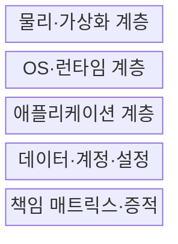
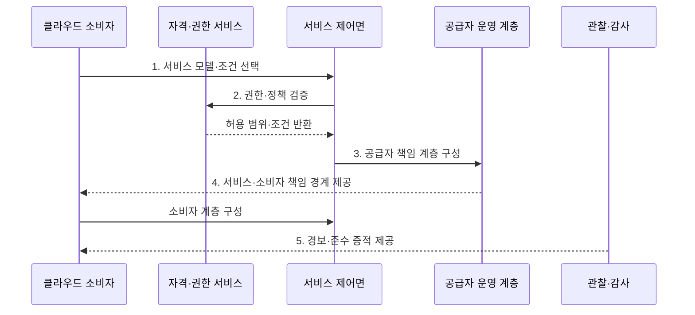

---
sidebar:
  order: 141
  label: "141. 클라우드 서비스 모델: IaaS·PaaS·SaaS (Cloud Service Models)"
  badge:
    text: "기출 · 70%"
    variant: note
title: "클라우드 서비스 모델: IaaS·PaaS·SaaS (Cloud Service Models)"
date: "2026-07-30T20:00:00+09:00"
tags:
  - "notes-software"
weight: 141
extra:
  question_no: "141"
  source_status: "기출"
  source_history: "120회, 125회, 131회, 132회"
  priority: 70
  priority_note: "서비스별 운영 책임 경계가 반복 출제됨"
---

## 미리 알고가기

- **서비스형 인프라 IaaS(아이에이에스, Infrastructure as a Service)**: 영어 낱말의 첫 글자를 쓴 표기로 서버·저장소·네트워크를 제공하고 소비자가 운영체제부터 관리하는 서비스이다
- **서비스형 플랫폼 PaaS(파스, Platform as a Service)**: 영어 낱말의 첫 글자를 쓴 표기로 운영체제·실행 환경·중간 소프트웨어를 제공하고 소비자가 애플리케이션을 배포하는 서비스이다
- **서비스형 소프트웨어 SaaS(사스, Software as a Service)**: 영어 낱말의 첫 글자를 쓴 표기로 공급자가 운영하는 애플리케이션을 소비자가 설정해 사용하는 서비스이다
- **책임 경계**: 공급자와 소비자가 각각 운영·보호해야 할 계층을 나누는 기준이다
- **제어 범위**: 넓을수록 구성 자유도와 소비자 운영 책임이 함께 늘어난다
- **운영체제 OS(오에스, Operating System)**: 영어 두 낱말의 첫 글자를 쓴 표기로 하드웨어 자원을 관리하고 프로그램 실행 기반을 제공하는 소프트웨어이다
- **런타임·미들웨어**: 프로그램 실행 환경과 애플리케이션 사이의 공통 기능을 제공하는 소프트웨어이다
- **하이퍼바이저·게스트 OS**: 가상 머신을 만들고 제어하는 계층과 그 안에서 실행되는 운영체제이다
- **응용 프로그래밍 인터페이스 API(에이피아이, Application Programming Interface)·데이터베이스 DB(디비, Database)**: 영어 핵심어의 첫 글자를 쓴 약어로 프로그램 간 기능 호출 규약과 구조화된 데이터를 저장·조회하는 저장소를 각각 나타냄
- **책임 매트릭스**: 계층별 운영·보안·증적 담당자를 표로 명시한 문서이다
- **규정 준수 증적**: 보안 통제가 요구대로 수행됐음을 입증하는 기록이다
- **공급자 종속**: 특정 공급자의 기능·형식에 의존해 이전이 어려워지는 상태이다

## Ⅰ. 개요

- 정의/개념: **운영 책임 범위**에 따른 IaaS·PaaS·SaaS 분류
- 배경/필요성: 필요한 제어 수준과 **운영·보안 책임 경계** 정합

### 쉽게 이해하기 (학습용)

- 건물만 빌릴지, 조리 시설까지 빌릴지, 완성된 식사를 받을지 정하는 선택이다.

## Ⅱ. 특징

- **책임 이전**: IaaS→PaaS→SaaS로 공급자 운영 범위가 확대
- **제어·책임 연동**: 소비자 제어가 클수록 운영 책임도 증가
- **공통 책임**: 계정·권한·데이터·안전한 설정은 소비자가 담당

### 쉽게 이해하기 (학습용)

- 맡기는 층이 많을수록 손은 덜 가지만 직접 바꿀 수 있는 범위도 줄어든다.

## Ⅲ. 구조 및 구성요소

| 구성요소 | 책임 |
|:---|:---|
| 물리·가상화 계층 | 서버·저장소·네트워크를 공급자가 운영 |
| OS·런타임 계층 | IaaS는 소비자, PaaS·SaaS는 공급자가 주로 운영 |
| 애플리케이션 계층 | IaaS·PaaS는 소비자, SaaS는 공급자가 운영 |
| 데이터·계정·설정 | 소비자가 분류·권한·입력·사용을 관리 |
| 책임 매트릭스·증적 | 계층·통제별 운영자와 감사 근거 명시 |

### 쉽게 이해하기 (학습용)

- 건물만 빌릴지 조리 시설이나 완성된 식사까지 받을지 정한다.

## Ⅳ. 흐름도

**동작 원리**

- **1. 서비스 모델·조건 선택**: 통제 수준·운영 역량·출시 속도에 맞춰 IaaS·PaaS·SaaS 결정
- **2. 권한·정책 검증**: 요청자 역할과 조직 정책이 허용하는 서비스·설정 범위 판정
- **3. 공급자 책임 계층 구성**: 선택 모델에 따라 시설·가상화·런타임·응용 관리 범위 제공
- **4. 서비스·소비자 책임 경계 제공**: 소비자가 맡을 계정·설정·애플리케이션·데이터 통제 명시
- **5. 경보·준수 증적 제공**: 운영 상태와 사고·준수 조치의 실제 책임 주체 연결

### 쉽게 이해하기 (학습용)

- 공급자가 운영할 층을 만든 뒤 소비자가 맡은 설정과 데이터를 넣고 양쪽의 상태를 함께 감시한다.

## Ⅴ. 종류 및 비교

| 비교 항목 | IaaS | PaaS | SaaS |
|:---|:---|:---|:---|
| 적용 기준 | **자체 OS·네트워크 제어** | **빠른 앱 개발·플랫폼 위임** | **표준 업무 기능 사용** |
| 핵심 특징 | 인프라 제공·소비자 OS 관리 | 런타임 제공·소비자 앱 관리 | 완성 앱 제공·소비자 설정 관리 |
| 한계 | 패치·가용성·보안 운영 | 런타임 제약·플랫폼 종속 | 맞춤화·데이터 이동·계약 종속 |

### 쉽게 이해하기 (학습용)

- IaaS는 운영체제부터, PaaS는 앱부터 관리하고 SaaS는 완성된 앱의 사용자와 데이터를 관리한다.

## Ⅵ. 실무 고려사항 및 대책

| 고려사항 | 대책 | 효과 |
|:---|:---|:---|
| 책임 경계 | 계층·통제·장애별 RACI와 계약 대조 | 책임 오해 방지 |
| 보안 설정 | 기준 구성·최소 권한·비밀 관리 | 공개·권한 과다 예방 |
| 가용성·복구 | 백업·복원·다중 영역·RTO/RPO 시험 | 업무 복구 검증 |
| 규제·증적 | 통제 상속과 소비자 증거 분리 | 준수 범위 명확화 |
| 종속성 | 내보내기·복구·종료 시험 | 이전 가능성 확보 |

### 쉽게 이해하기 (학습용)

- 가상 서버를 빌려도 그 안의 운영체제 업데이트는 대개 사용자가 해야 한다.

## Ⅶ. 결론

- **제어 수준·운영 역량·보안 책임·공급자 종속**으로 클라우드 서비스 모델을 선택

### 쉽게 이해하기 (학습용)

- 직접 고칠 범위와 직접 책임질 일을 함께 감당할 수 있는 모델을 골라야 한다.
